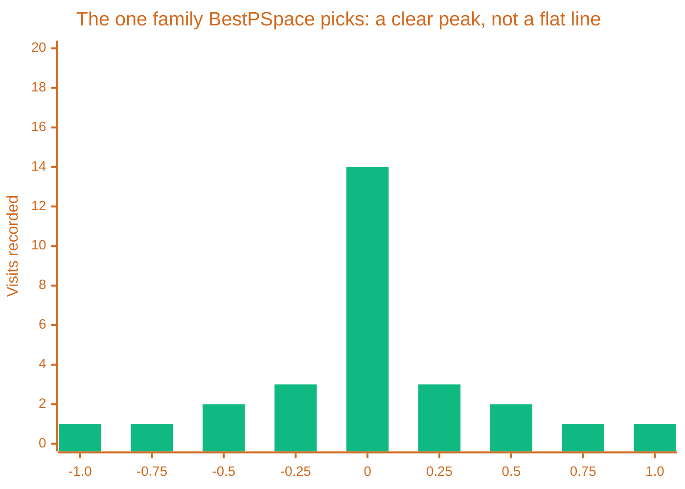

# Multiple Choice & BestPSpace

> [!TIP] Origins
> **BestPSpace** was invented and first implemented by **Albert Perez** around 2003 in his bot LauLectrik, to work
> around the exact weakness a single segmentation scheme runs into. **Multiple Choice** was documented by the
> RoboWiki community as the general technique for picking one angle out of several disagreeing candidates.

[GuessFactor Targeting](/targeting/statistical-targeting/guessfactor-targeting) and
[Segmentation & Visit Count Stats](/targeting/statistical-targeting/segmentation-visit-count-stats) build one
probability distribution from one set of variables. Most of the time that is enough. Sometimes the enemy's actual
movement just does not match the variables that distribution was built from, and the bin counts come back nearly
flat, no peak, no confident guess, only noise.

## When one gun goes flat

A flat distribution is not a bug in the segmentation, it is a mismatch between the variables chosen and the
behavior actually happening. Albert's own reasoning for building BestPSpace was blunt: it is very difficult to
make every possible segmentation flat at once, so if a gun keeps enough different segmentations in play, one of
them should find something to say even when the rest have nothing.

## Many probability spaces, one shot

BestPSpace keeps N separate probability spaces, called families, each built from its own group of variables:
distance, target direction, target velocity, target acceleration, time spent moving in the same direction,
relative movement direction, and more. LauLectrik ran around 20 families, generating roughly 1,300 probability
function instances between them. At firing time, the gun does not favor a fixed family, it checks every family's
current confidence and fires from whichever one is showing the clearest peak right now.

The other 19 families in that same encounter stay closer to flat, three or four visits in every bin, nothing
worth firing on. BestPSpace does not average all 20 together, it checks each one's peak and fires from whichever
family looks like this one.

## Choosing among the winners

Running many families solves finding a signal, not picking a final angle when two or three families disagree.
Multiple Choice is the general answer to that second problem: instead of trusting whichever candidate angle
scored marginally higher in isolation, it runs a kernel density check across all the candidates, choosing the
angle with the most neighbors within a small angular threshold. An angle several families agree on, even
approximately, beats an angle only one noisy family insists on, even when that lone family's own internal score
looked the most confident of the bunch.

The same logic applies past BestPSpace specifically. Any gun that produces more than one plausible firing angle,
several [Dynamic Clustering](/targeting/statistical-targeting/dynamic-clustering) neighborhoods, or a
[Pattern Matching](/targeting/predictive-targeting/pattern-matching) match against more than one historical run,
can hand its candidates to the same density check instead of picking whichever one happened to score first.

## Name the cost

Twenty families and thirteen hundred probability functions is a lot of bookkeeping for one shot, memory and CPU
time a single [GuessFactor Targeting](/targeting/statistical-targeting/guessfactor-targeting) gun never has to
spend. RoboWiki's own documentation of both techniques is thin, closer to a research note than a tutorial, which
fits their place in the field: proven enough to appear in top-tier bots, but a refinement for a gun that already
works, not a starting point for one that does not yet.

## Further Reading

- [BestPSpace](https://robowiki.net/wiki/BestPSpace) - RoboWiki (classic Robocode)
- [Multiple Choice](https://robowiki.net/wiki/Multiple_Choice) - RoboWiki (classic Robocode)
