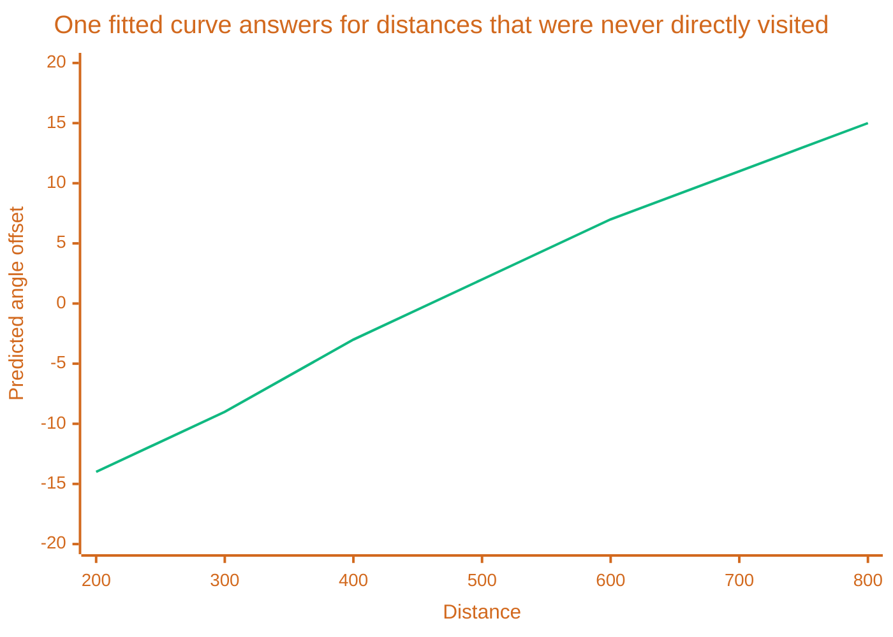

# Targeting Matrix

> [!TIP] Origins
> **Targeting Matrix** was developed and documented by the RoboWiki community as a curve-fitting alternative to
> the bucket-and-count approach [GuessFactor Targeting](/targeting/statistical-targeting/guessfactor-targeting)
> and [BestPSpace](/advanced/multiple-choice-bestpspace) both build on.

A GuessFactor bin only means something once enough shots have landed in it. Early in a battle, or with a rare
combination of segment values, plenty of bins sit at zero or one visits, too thin to trust. A Targeting Matrix
sidesteps the bucket entirely: instead of counting visits per bin, it fits one smooth mathematical curve through
every recorded shot at once, and that curve can answer for a distance or velocity it has never exactly visited.

## Fit a curve instead of filling bins

Treat "predict the firing angle from distance" as ordinary curve fitting. Pick a polynomial degree, record one
row per shot with that distance raised to each power, and record the angle that shot actually needed next to it.
That is exactly the linear algebra problem $Ax = b$: $A$ holds the recorded distance features, $b$ holds the
correct angles, and $x$ holds the polynomial coefficients still to be solved for.

## Solve it with one matrix equation

$A$ is not square, more shots than unknowns, so there is no exact solution, only a best fit. The least-squares
answer comes from the normal equations:

$x = (A^\top A)^{-1} A^\top b$

Once $x$ is solved, predicting a new angle is just evaluating the polynomial at the new distance:
$f(x) = x_1 \cdot \text{distance}^2 + x_2 \cdot \text{distance} + x_3$. A three-point example makes the setup
concrete: three recorded distances $a$, $b$, $c$ and their known-correct angles fill
$A = \begin{bmatrix} a^2 & a & 1 \\ b^2 & b & 1 \\ c^2 & c & 1 \end{bmatrix}$ against the three angles in $b$, and
solving for $x$ gives the coefficients that fit a curve through all three points at once, not a lookup table for
exactly those three.

## Add more variables without adding more buckets

Segmentation grows by multiplication: adding a new variable to a GuessFactor gun means splitting every existing
bin into more, smaller bins, each needing its own visits to fill. A Targeting Matrix grows by addition instead.
Adding target velocity as a second factor just appends another column to $A$, distance stays a column, velocity
becomes a column, the angle in $b$ does not change, and the same normal-equation solve handles both at once.

## Name the cost

A polynomial degree is a commitment made in advance. Too low, and the curve cannot bend enough to track real
behavior. Too high, and it chases noise between data points instead of the underlying pattern, a risk that grows
with every variable added. The matrix solve itself is real computation, cheap for one recompute but not free to
run every tick the way incrementing a bin counter is. Most importantly, a smooth curve assumes the relationship
actually is smooth. [GuessFactor Targeting](/targeting/statistical-targeting/guessfactor-targeting) or
[Multiple Choice & BestPSpace](/advanced/multiple-choice-bestpspace) can represent a movement pattern with two
separate peaks in the same bin range, a single polynomial curve fits through the middle of both and describes
neither.

## Further Reading

- [Targeting Matrix](https://robowiki.net/wiki/Targeting_Matrix) - RoboWiki (classic Robocode)
