# Robot Properties File (Classic Robocode)

For Robocode Tank Royale, you can skip this section which is specific to classic Robocode. Tank Royale is using a JSON
file instead, which is not Java-specific.

In classic Robocode, every bot needs a properties file to define its metadata and configuration. This file tells
Robocode important details about your bot, such as its name, author, description, and more. The properties file is a
simple text file with key-value pairs.

## What is a robot properties file?

A robot properties file is a plain text file (with the `.properties` extension) that describes your bot for the Robocode
engine. It includes information like the bot's name, author, description, and technical details. Robocode uses this file
to display information in the bot selection menu and to load your bot correctly.

```mermaid
flowchart LR
    Bot["🤖 MyFirstRobot<br/>(bot)"]
    Props["🔧 MyFirstRobot.properties<br><br>robot.name: MyFirstRobot<br>robot.classname:&nbsp;sample.MyFirstRobot<br>robot.author.name: Mathew Nelson"]
    Engine["⚙️ Robocode<br/>(engine)"]
    Rule["⚠️ Filename must match<br>class name<br>(case-sensitive)"]
    Bot -->|metadata| Props
    Props -->|loaded by Robocode| Engine
    Props -.->|must match| Rule
    classDef warning fill: #f99, color: black, stroke: red, stroke-width: 1px;
    class Rule warning;
```



## Example: My First Robot properties file

Here is an example properties file for the classic "MyFirstRobot":

```
#Robot Properties
robot.description=A sample bot\nMoves in a seesaw motion, and spins the gun around at each end\nTurns perpendicular to the direction of a bullet that hits it
robot.webpage=https://robowiki.net/w/index.php?title=Robocode/My_First_Robot
robocode.version=1.0
robot.java.source.included=true
robot.author.name=Mathew Nelson
robot.classname=sample.MyFirstRobot
robot.name=MyFirstRobot
```


## Naming convention: Match the class name

The filename of your properties file (excluding the `.properties` extension) **must match the class name of your bot**.
For example, if your bot class is `MyFirstRobot`, the properties file should be named `MyFirstRobot.properties`. This is
required for Robocode to recognize and load your bot correctly.

```mermaid
flowchart LR
    subgraph Good["Correct&nbsp;—&nbsp;filename&nbsp;matches&nbsp;class&nbsp;name"]
        direction TB
        A[/"Class name:<br/>MyFirstRobot"/]
        B[/"File name:<br/>MyFirstRobot.properties"/]
        C(["✅ Match"])
        A --> B
        B --> C
    end

    subgraph Bad["Incorrect&nbsp;—&nbsp;filename&nbsp;does&nbsp;not&nbsp;match&nbsp;class&nbsp;name"]
        direction TB
        D[/"Class name:<br/>MyFirstRobot"/]
        E[/"File name:<br/>myfirstrobot.properties"/]
        F(["❌ Mismatch"])
        D --> E
        E --> F
    end

    W(["⚠️ Must match exactly, including capital letters"])
    C -.-> W
    F -.-> W
    classDef correct color: black, fill: #e6ffea, stroke: #2ecc71, stroke-width: 1px;
    classDef incorrect color: black, fill: #ffecec, stroke: #e74c3c, stroke-width: 1px;
    classDef warning color: black, fill: #fff7c0, stroke: #f2b400, stroke-width: 1px;
    class A, B correct
    class D, E incorrect
    class W warning
```

## What does a properties-file contain?

Typical fields include:

- `robot.name`: The name of your bot (must match the class name)
- `robot.classname`: The full Java class name (including package)
- `robot.author.name`: Your name as the bot author
- `robot.description`: A short description of what your bot does
- `robot.webpage`: (Optional) A link to your bot's webpage
- `robocode.version`: The Robocode version your bot was built for
- `robot.java.source.included`: Whether the Java source code is included

Other fields may be present for advanced bots, but these are the most common for beginners.

Note that the `robot.description` can be multi-line by using `\n` to indicate line breaks, and contain up to 3 lines.

## Where to find examples

You can find many example properties files in the `robots` folder of classic Robocode. Each sample bot comes with its
own properties file, which you can use as a reference when creating your own.

---

**Tip:** Always double-check that your properties filename matches your bot's class name exactly (including
capitalization). This avoids loading errors in Robocode.
