# Your First Battle

You’ve met the basic ideas, maybe even built a tiny bot. Now it’s time for the fun part: watching bots fight.

This page walks you through starting your very first battle in:

- Classic Robocode
- Robocode Tank Royale

You don’t need a fancy bot yet. Any simple or sample bot is enough. The only hard rule: you must have **at least two
bots** in a battle, otherwise the game ends immediately because there’s only one bot “left”.

---

## Prerequisites: What You Need

Before you start a battle, make sure you have:

- **A working installation** of:
    - Classic Robocode, or
    - Robocode Tank Royale (GUI + example bots)
- **At least two bots available**:
    - Your own simple bot (for example, from the [Your First Bot](your-first-bot.md) chapter), and
    - At least one opponent bot (often a sample bot).

> [!NOTE] Note
> With Robocode Tank Royale, the server and booter come built-in with the GUI. You do not need to install the server
> (for running battles) or booter (for booting bots locally) separately, unless you wish to use them as stand-alone
> applications. Stand-alone versions are provided in releases for running the server and/or booter without the GUI.

### Sample bots and opponent ideas

- **Classic Robocode**
    - Comes with many **sample** bots, grouped in `sample.*` packages (e.g., `sample.SittingDuck`, `sample.SpinBot`).
    - These are perfect opponents for your first battle.
- **Robocode Tank Royale**
    - Provides **sample bots** as part of the distribution or example repositories.
    - You can use those, plus any bot you’ve created yourself.

> [!TIP] Tip
> Don’t overthink your first opponent. A simple “dummy” bot is fine; the goal is to see a battle run from start to
> finish.

---

## Your First Battle in Classic Robocode

Classic Robocode runs everything inside a single GUI: bot selection, battlefield, and scores.

### Launching Robocode and Selecting Bots

1. **Start Robocode**  
   Launch the Robocode application as you normally would on your system.

2. **Create a new battle**
    - In the menu, choose **Battle → New…** (or similar, depending on the version).
    - A **bot selection dialog** appears.

3. **Pick your bots**
    - On the **left**, you’ll see a list of available bots (including the `sample.*` bots).
    - On the **right**, you’ll see the bots that will take part in the battle.
    - Select:
        - Your own bot (if you have one), and
        - At least one sample bot as the opponent.
    - Use the **Add >>** button or double-click to move bots to the selected list.

 
*Bot selection dialog*

Make sure the **selected bots list contains at least two bots**. If there is only one, the battle either will not start
or will end immediately.

### Configuring Basic Battle Settings

For your very first battle, you can keep things simple:

1. **Battlefield size**
    - The default size is good enough for a test.
    - You can experiment with larger or smaller fields later.

2. **Number of rounds**
    - Fewer rounds (e.g., 3–5) make your first tests quicker.
    - More rounds give more stable results when comparing bots.

Unless you have a reason to change them, the **default settings are fine**.

### Running the Battle and Watching What Happens

1. Click **OK** (or **Start Battle**) to begin.
2. The **battlefield window** opens and rounds begin.

Pay attention to:

- Which bot is **yours** (name and color).
- How your bot **moves**, **turns**, and **fires**.
- When it gets **hit by bullets** or **runs into walls**.
- The **status panel** showing energy, round number, and scores.

Robocode runs multiple **rounds** in a single battle. At the end, you’ll see:

- A **score table** listing each bot.
- An **overall winner**, based on score over all rounds.

Try re-running the battle with:

- Different sample opponents.
- More than two bots at once, to get a taste of melee battles.

---

## Your First Battle in Robocode Tank Royale

Robocode Tank Royale has a different architecture: a **game server (arena)** plus **separate bot processes** that
connect to it.

### Starting the Server / Arena

1. **Launch the Tank Royale server/GUI**
    - Start the Tank Royale application or server as described in its documentation.
    - You should see a window or console showing the arena and a list of connected bots (initially empty).

2. Keep the server/GUI running while you start bots.

> [!NOTE] Note
> The server and booter are included with the GUI installation. Stand-alone server and booter applications
> are also available in releases for users who want to run them independently of the GUI.

### Starting and Joining Bots

In Tank Royale, bots are separate programs that **connect to the server**.

1. **Start your bots**
    - Run your own bot (from the [Your First Bot](your-first-bot.md) tutorial, if you have one).
    - Run at least one **sample bot** or another simple opponent.
    - Each bot typically starts in its own process (terminal window, IDE run, etc.), using configuration that tells it
      how to reach the server.

2. **Wait for bots to register**
    - In the server/GUI, you should see a **list of connected bots**.
    - Check that:
        - Your bot appears in the list.
        - At least one opponent bot also appears.

Again, ensure there are **at least two bots connected**. A battle with only one participant doesn’t make sense and will
end immediately.

### Creating and Starting a Match

Once your bots are connected:

1. **Create or start a new game**
    - Use the server/GUI controls, for example:
        - Click **New Game**, **Create Battle**, or **Start** (names may vary slightly by version).

2. **Select participating bots**
    - In the game setup or lobby screen, select the bots that should take part.
    - Choose:
        - Your own bot, and
        - At least one opponent.
    - Confirm the list includes **two or more** bots.

 
*Bot selection dialog*

> [!NOTE] Note
> In Tank Royale, the **Start Battle** button will be inactive (grayed out) if too few or too many bots are selected for
> the chosen game type. If the button seems inactive for no clear reason, check which game type is selected—each game
> type has specific rules for the minimum and maximum number of bots allowed in a battle. Adjust your selection or game
> type to meet these requirements.

3. **Use default settings**
    - Keep the default arena size and number of rounds for your first battle.
    - Advanced options (like custom battlefield sizes or more participants) can come later.

4. **Start the match**
    - Hit **Start** and watch the arena:
        - Bots moving and turning.
        - Bullets flying and explosions.
        - Energy bars dropping as bots take hits.

The GUI usually shows a **scoreboard** and/or **per‑round results** so you can see which bot is winning over time.

---

## Bullet basics: what your shots really do

When a bot fires, it is not free. Each shot spends some of the bot’s energy and creates a bullet that follows simple
physics on the battlefield.

- **Bullets cost energy** to fire. The more powerful the shot, the more energy it costs.
- **You cannot fire every turn.** After each shot, the gun heats up and must cool down before firing again.
- **Bullets travel in straight lines.** They follow the gun’s heading at the moment of firing and do not curve or home
  in on targets.
- **Bullets do not inherit your movement.** Only the gun direction and bullet power matter for the bullet path and
  speed.
- **Power vs speed tradeoff:** low‑power shots are cheaper and fly faster; high‑power shots are stronger but slower.
- **Friendly fire exists** in team battles: a bullet will hit the first bot in its path, ally or enemy.

For a full explanation of bullet power, speed, damage, and cooldown (including formulas and charts), see
[Bullet Travel & Bullet Physics](../physics/bullet-physics.md) in the **Battlefield Physics** section.

---

## Classic vs Tank Royale: How Battles Differ

The high‑level goal is the same—bots fight until only one is left—but the way you run a battle differs:

- **Classic Robocode**
    - Everything runs **inside one GUI**.
    - Bots are loaded from the **local bots directory** and selected from a list.
    - Starting a battle is mostly about **choosing bots and clicking Start**.

- **Robocode Tank Royale**
    - Uses a **server/arena** plus **external bot processes**.
    - Bots connect over a **network protocol** (they can even run on different machines).
    - Starting a battle involves:
        - Running the server/GUI,
        - Starting each bot so it connects,
        - Selecting from the **connected bots list**, then launching a match.

 
*Classic Robocode (left) vs Robocode Tank Royale (right)*

Pair this split screenshot with the emoji diagram below to keep the contrasts handy:

```mermaid
flowchart LR
    hub((⚔️ Classic vs Tank Royale))
    subgraph classic[�?️ Classic Robocode]
        c1[🖥️ All-in-one GUI arena]
        c2[📂 Bots loaded from local directory]
        c3[▶️ Pick bots and press Start]
    end
    subgraph royale[🌐 Tank Royale]
        r1[🏢 Server + external bot processes]
        r2[🔌 Bots connect over a network protocol]
        r3[📋 Launch server, start bots, select connected roster]
    end
    hub --> classic
    hub --> royale
```

Despite these differences, many **game concepts** are shared:

- 1‑on‑1 vs melee battles with many bots.
- Movement, targeting, and energy management.
- Running many quick battles to test improvements.

---

## Next Steps

After your first battle:

- Try **different sample opponents** and see how your bot performs.
- Add **more bots** to the same battle to get a feel for melee chaos.
- Experiment with:
    - More rounds,
    - Different battlefield sizes,
    - Different starting positions (if supported).

Then, move on to deeper topics in the book:

- How the **battlefield** works (geometry, coordinates, walls).
- **Radar and scanning** to find enemies more reliably.
- **Targeting and movement** strategies to win more battles.
- **Energy and scoring** to understand why some bots "win" even without many kills.

For more detailed, up‑to‑date instructions and screenshots, you can always refer to:

- Classic Robocode basics and first bot tutorials on the RoboWiki.
- Robocode Tank Royale getting‑started guides and examples on robocode.dev and GitHub.

Your first battle is just the beginning. The real fun comes from iterating: tweak your bot, run a few battles, observe,
and improve.
