# Your First Bot (Guided Tutorial)

New to Robocode or Robocode Tank Royale? This overview gives you the mental model for getting a simple, working bot into
the arena. It’s platform- and language-neutral. For concrete, step-by-step instructions and code, use the official
tutorials below.

## Start here: the original tutorials

- Classic Robocode: https://robowiki.net/wiki/Robocode/My_First_Robot
- Robocode Tank Royale: https://robocode.dev/tutorial/my-first-bot.html

Those guides show exact setup steps, APIs, and project/configuration details. This page complements them by explaining
the shared lifecycle every bot follows.

## The bot lifecycle at a glance

```mermaid
flowchart TB
    init(["⚙️ Initialize"])
scan(["📡 Scan"])
move(["➡️ Move"])
aim(["🎯 Aim"])
fire(["💥 Fire"])

init --> scan
scan --> move --> aim --> fire -->|"🔁 Repeat"| scan
```

Think of your bot as a real-time agent. Each turn it senses the world, decides what to do, and acts. The exact API calls
differ between Classic and Tank Royale, but the rhythm—sense → plan → act → repeat—stays the same.

## Initialization: one-time setup

Initialization runs once before the main loop. Keep it lightweight and focused on stable settings:

- Visual identity: Set body, gun, radar, and bullet colors so you can spot your bot during a match.
- Defaults and parameters: Choose initial movement speed/turn rates, radar sweep strategy, and default firepower.
- Event hooks (if applicable): Register listeners for events such as enemy scanned, hit by bullet, or collision.

Avoid heavy computation in initialization. If you need data processing, compute lazily or spread it across early turns.

## Entering the run loop

After initialization, your bot enters its main `run()` loop. Conceptually, each turn:

1. Scans for enemies
2. Updates targeting
3. Chooses movement
4. Fires if the gun is cool and conditions are right

Events that occur during the turn (e.g., you were scanned or hit) can adjust your next decisions or trigger immediate
responses.

> **Energy and bullets in one sentence**
> Firing always spends some of your bot’s energy to create a bullet; too many big shots can leave your bot weak or even
> disabled, so smart bots balance when and how hard they fire.

## Per-turn actions (the heartbeat)

- Scan for enemies
    - Keep the radar moving to maintain situational awareness. A stationary radar loses track quickly.
    - Choose between continuous sweeping (good for discovery) and locking onto a single target (good for 1v1 tracking).

- Calculate movement
    - For your first bot, a simple movement is enough—move forward, turn occasionally, and avoid getting stuck.
    - Later, add wall avoidance, distancing, or evasive patterns.

- Aim the gun
    - Point the gun at the detected enemy. Initially, aim directly at the current bearing.
    - Advanced bots predict future positions (leading shots).

- Fire if ready
    - Fire only when the gun is ready (both platforms expose gun heat/cooldown).
    - Start with modest, consistent firepower; tune it as you learn.

- Repeat
    - Issue movement, radar, and gun commands, then proceed to the next turn.

 

## Event-driven reactions

Most APIs surface events like:

- Enemy scanned: Often triggers aiming and firing.
- Hit by a bullet: Consider altering movement to be less predictable.
- Collisions (walls or other bots): Correct heading, move back, or adjust speed.

Keep reactions small and focused. They should either trigger an immediate response (e.g., dodge) or update the state for
the next turn (e.g., last known enemy position).

## Minimal platform notes

- Classic Robocode typically uses a properties (`.properties`) file to define the bot. The filename usually must match
  your bot’s class name. See the classic tutorial for exact fields and
  placement: [Robot properties](robot-properties-files.md)
- Robocode Tank Royale uses a JSON configuration file for bot metadata/settings. See the Tank Royale tutorial for the
  current schema and placement: https://robocode.dev/tutorial/my-first-bot.html

If you’re unsure whether something belongs in config or code, rely on the tutorial for your platform—the formats and
best practices can evolve.

### Bot configuration: Classic (.properties) vs. Tank Royale JSON

```mermaid
flowchart LR
  %% Two-panel comparison: Classic .properties (left) vs Tank Royale JSON (right)
  subgraph Classic["Classic Robocode"]
    direction TB
    c_file(["📄 MyFirstRobot.properties"])
    c_snip["robot.name: MyFirstRobot<br>robot.author.name: You<br>robot.description: A simple bot"]
    c_file --> c_snip
  end

  subgraph Tank["Tank Royale"]
    direction TB
    t_file(["📄 MyFirstBot.json"])
    t_snip["{''name'': ''My First Bot'',<br>''author'': ''you'',<br>''description'':&nbsp;''A&nbsp;simple&nbsp;bot''}"]
    t_file --> t_snip
  end

  Classic <--->|"same bot metadata"| Tank

  classDef fileStyle color:black,fill:#f6f9ff,stroke:#2b6cb0,stroke-width:1px;
  classDef jsonStyle color:black,fill:#fff7f7,stroke:#e74c3c,stroke-width:1px;
  class c_file,c_snip fileStyle
  class t_file,t_snip jsonStyle
```

## What success looks like for your first bot

Your initial milestone is simple and achievable:

- Colors are set so the bot is recognizable on the field.
- Radar is continuously scanning to keep awareness up.
- Movement follows a basic pattern (not stationary!).
- The gun turns toward detected enemies and fires when ready.

*Sequence: scan, move (motion stripes), aim, fire — then repeat.*

## Next steps

- Learn battlefield geometry and angles to improve navigation and aiming.
- Explore radar strategies (sweeping vs. locking) for better tracking.
- Study energy and scoring to make smarter firepower decisions.

When you're ready for platform-specific details and code, return to:

- Classic Robocode: https://robowiki.net/wiki/Robocode/My_First_Robot
- Robocode Tank Royale: https://robocode.dev/tutorial/my-first-bot.html
