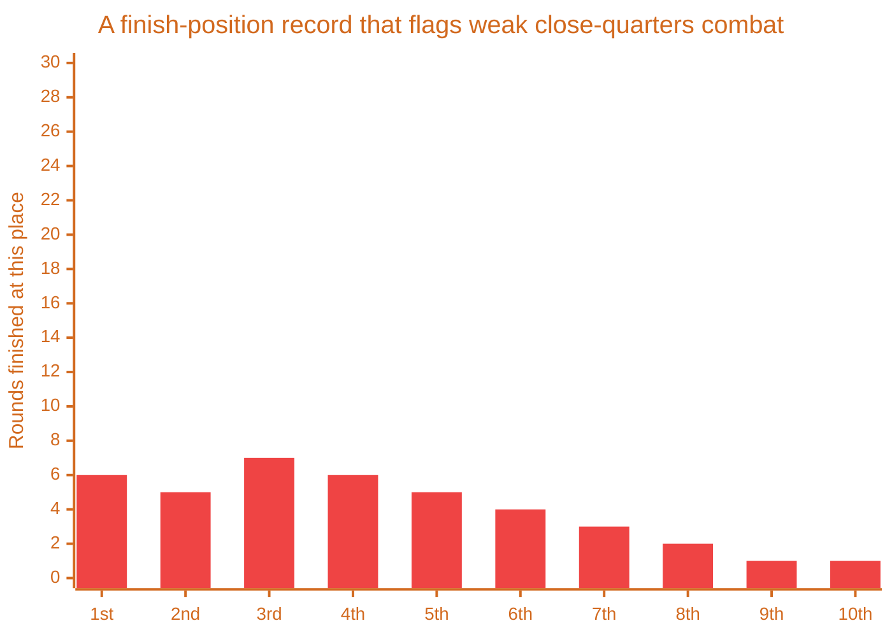

# Staying Alive in Chaos

> [!TIP] Origins
> **Melee survival diagnostics** were developed and documented by the RoboWiki community, distilled from years of
> watching where in the standings [melee](/appendices/glossary#melee) bots tend to finish.

[Melee Strategy](/melee-combat/melee-strategy), [Melee-Specific Targeting](
/melee-combat/melee-specific-targeting), and [Melee Movement Tactics](/melee-combat/melee-movement-tactics) each
hand a bot a skill. A bot that still dies too early after all three are implemented does not need a fourth skill
bolted on, it needs to know which of the first three is actually the weak one, and the finish-position record
already has that answer.

## Let the standings diagnose the bug

Run enough battles and track where a bot finishes each round, first through last. The pattern in that record
points at a specific failure:

- **Frequent last-place finishes** mean weak close-quarters combat, or no way to recover from a bad starting
  position before the fight is already lost.
- **Deaths clustered in the middle of the pack** mean the evasion is not unpredictable enough. A gun somewhere in
  the field has read the pattern and is landing hits it should be missing.
- **A lopsided ratio between mid-table and upper-table finishes** points at a slow escape from the open center
  early on, the exposure [Melee Movement Tactics](/melee-combat/melee-movement-tactics) covers directly.
- **An excess of third-place finishes** means trouble closing out the last nearby threat before the field narrows
  to a final duel.
- **Frequent second-place finishes** put the weakness in the duel itself, either the targeting or the energy
  conservation [Energy Management in 1v1 and Melee](/energy-and-scoring/energy-management-1v1-melee) covers.

No formula replaces watching the bot fight. A distribution can point at close-quarters combat, but only a
replay shows whether the real problem is the gun, the movement, or a bot that simply freezes when three enemies
close in at once. The RoboWiki guide states the habit plainly: watch the bot, and build a feel for how it
actually behaves under pressure, not just for what the aggregate numbers claim.

## Know which fights to skip

Every skill so far assumes a fight worth finishing. Early in a melee, a prolonged one-on-one exchange is a trap
even when it is winnable. Two bots trading damage long enough to both drop in energy are an invitation for a
third, fresher bot to finish whichever one survives and take the kill neither of the original two earned. The
fix is not a better gun, it is disengaging once a fight runs long, peeling away before the exchange finishes
rather than after, and accepting a missed kill now over a near-certain death a few turns later.

<!-- TODO: Illustration
**Filename:** melee-third-party-finish.svg
**Caption:** "A prolonged exchange leaves both fighters weak enough for a third bot to finish either one."
**Viewport:** 8000x6000
**Battlefield:** true
**Bots:**
  - type: friendly, position: (2600, 3400), body: 70, turret: 70, radar: 70
  - type: enemy, position: (4200, 3300), body: 250, turret: 250, radar: 250, scale: 0.7
  - type: enemy, position: (6600, 900), body: 220, turret: 220, radar: 220, scale: 0.6
**Lines:**
  - from: (3219, 3676), to: (4181, 3603), color: "#F59E0B", arrow: true, dashed: false,
    label: "a long exchange wears both down"
  - from: (6644, 1295), to: (4254, 3192), color: "#EF4444", arrow: true, dashed: true,
    label: "closing in on whoever survives"
**Texts:**
  - text: "a long exchange wears both down", position: (2900, 4150), color: "#F59E0B", anchor: middle
  - text: "closing in on whoever survives", position: (5600, 2000), color: "#EF4444"
-->

 
*A prolonged exchange leaves both fighters weak enough for a third bot to finish either one.*

## The last two are a different game

Everything above stops applying the moment the field narrows to two. [Melee Strategy](
/melee-combat/melee-strategy#four-battles-in-one) already covers why: the final duel has quietly become a
[1v1](/appendices/glossary#_1v1-one-on-one-duel),
and the bot that keeps playing the crowd-survival game instead of the accuracy-and-energy game one enemy actually
rewards is the one that finishes second.

## Further Reading

- [Melee Strategy](https://robowiki.net/wiki/Melee_Strategy) - RoboWiki (classic Robocode)
- [Melee](https://robowiki.net/wiki/Melee) - RoboWiki (classic Robocode)
