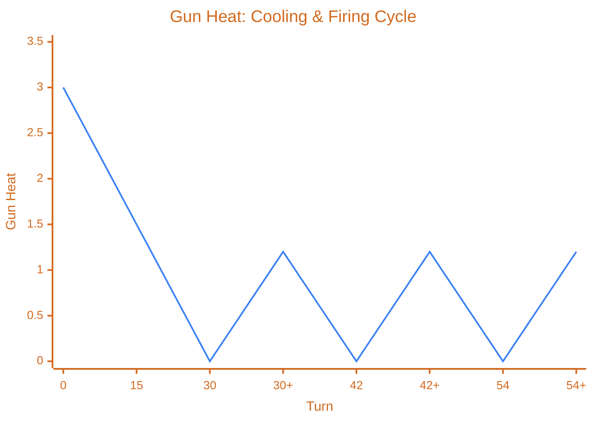
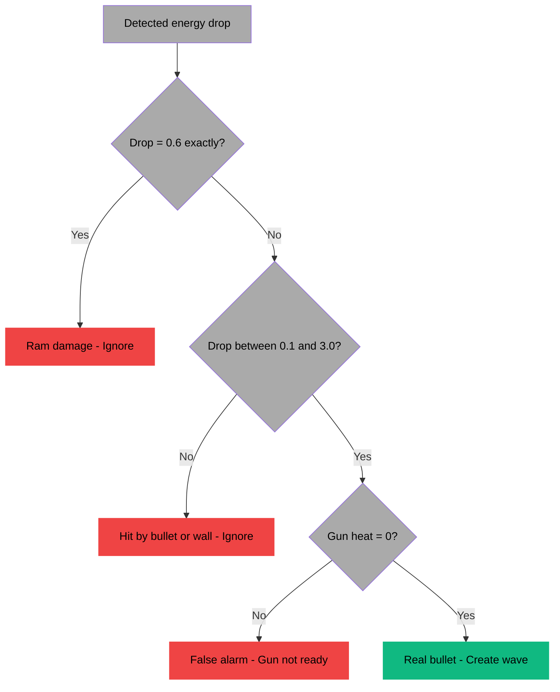
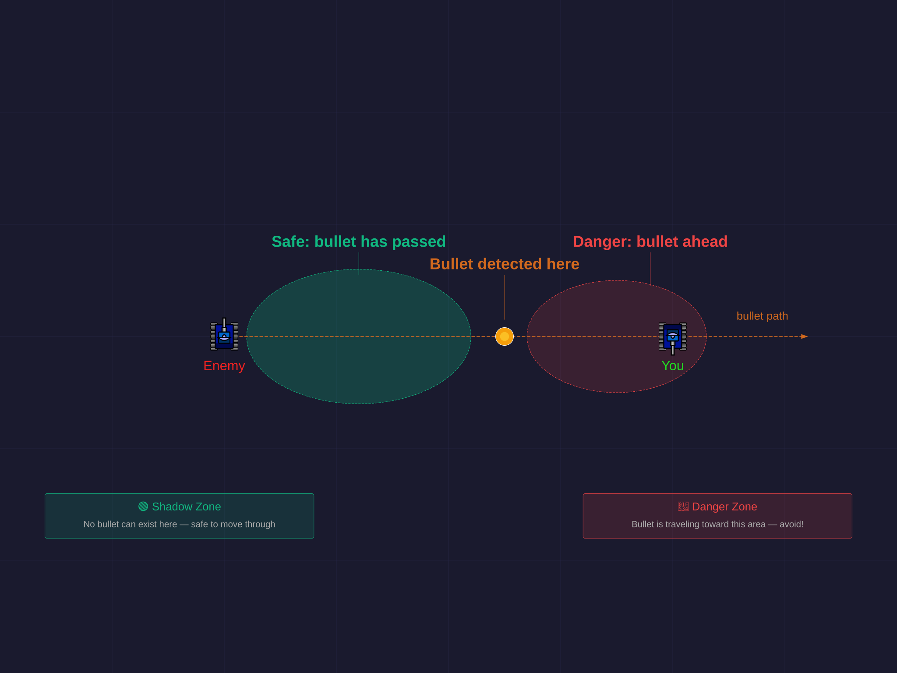

# Gun Heat Waves & Bullet Shadows

> [!TIP] Origins
> **Gun Heat Waves** and **Bullet Shadows** were developed by the RoboWiki community to improve wave-based movement 
> systems. These techniques help bots distinguish between actual enemy bullets and false alarms caused by energy 
> drops from other sources.

Gun Heat Waves and Bullet Shadows are complementary techniques used in advanced movement systems, particularly Wave 
Surfing. They solve two related problems:

1. **When can the enemy fire again?** (Gun Heat Waves)
2. **Where are bullets definitely *not* located?** (Bullet Shadows)

Together, they improve wave detection accuracy and enable more precise bullet dodging.

## Gun Heat Waves

### The Problem

You detect enemy fire by monitoring energy drops. But sometimes the enemy's energy drops due to:

- Ramming damage
- Bullet hits from other bots (melee)
- Death
- Wall collisions (in some game modes)

This creates **false wave detections**. Your movement system dodges bullets that don't exist, wasting positioning and 
potentially moving into *real* danger.

### The Solution

Track the enemy's **gun heat**. A bot can only fire when gun heat reaches zero. By modeling when the enemy's gun 
cools down, you can confirm whether an energy drop corresponds to an actual shot.

### Detecting Energy Drops

The first step is observing the enemy's energy level each turn and detecting changes:

Keep the previous energy value for each enemy. On a new scan, calculate `energyDrop = previousEnergy - currentEnergy`,
classify the drop, and then store the current energy for the next scan.

### Classifying Energy Drops

Not every energy drop is a bullet! Here's how to tell them apart:


```mermaid
%%{init: {'theme': 'base', 'themeVariables': { 'xyChart': { 'backgroundColor': 'transparent', 'plotColorPalette': '#10b981, #10b981, #ef4444, #f59e0b, #10b981', 'xAxisLabelColor': '#d2691e', 'yAxisLabelColor': '#d2691e', 'xAxisTitleColor': '#d2691e', 'yAxisTitleColor': '#d2691e', 'xAxisTickColor': '#d2691e', 'yAxisTickColor': '#d2691e', 'xAxisLineColor': '#d2691e', 'yAxisLineColor': '#d2691e', 'titleColor': '#d2691e' } }}}%%
xychart-beta
  title "Energy Drops by Cause (observed on enemy)"
  x-axis "Turn" ["30 🔫", "42 🔫", "46 💥", "50 🎯", "54 🔫"]
  y-axis "Energy Drop" 0.2 --> 3.5
  bar [1.0, 0.001, 0.001, 0.001, 0.001]
  bar [0.001, 1.0, 0.001, 0.001, 0.001]
  bar [0.001, 0.001, 0.6, 0.001, 0.001]
  bar [0.001, 0.001, 0.001, 2.8, 0.001]
  bar [0.001, 0.001, 0.001, 0.001, 1.0]
```

*Color coding: green = real bullet, red = ram damage, orange = hit by bullet.*

| Turn | Energy Drop | Cause | How to identify |
|------|-------------|-------|-----------------|
| 30 | 1.0 | 🔫 **Fired bullet** | Drop in [0.1, 3.0] + gun heat check |
| 42 | 1.0 | 🔫 **Fired bullet** | Drop in [0.1, 3.0] + gun heat check |
| 46 | 0.6 | 💥 **Possible ram damage** | Confirm with a collision event |
| 50 | 2.8 | 🎯 **Hit by bullet** | Drop > 3.0 |
| 54 | 1.0 | 🔫 **Fired bullet** | Drop in [0.1, 3.0] + gun heat check |

> [!NOTE] Your bot tracks Gun heat
> You cannot read the enemy's gun heat directly, you must model it based on when they fire. 
> See [Validating with Gun Heat](#validating-with-gun-heat) below for the implementation.

### Energy Drop Signatures

Use these patterns to classify energy drops:

| Cause | Energy Drop Range | Notes |
|-------|-------------------|-------|
| 🔫 **Fired bullet** | 0.1 – 3.0 | Must also check gun heat = 0 |
| 💥 **Ram collision** | often 0.6 | Confirm with a collision event; a power-0.6 shot is also possible |
| 🎯 **Hit by bullet** | 0.4 – 16.0 | Damage = 4p + 2(p-1) if p>1 |
| 🧱 **Wall collision** | 0 – ~3.5 | = max(0, abs(velocity) × 0.5 - 1) |
| ☠️ **Inactivity penalty** | 0.1/turn | Rare; only if bot is idle |

### Validating with Gun Heat

The energy-drop range `[0.1, 3.0]` overlaps with other damage sources. The tracker below cools a separate heat estimate
for each enemy, accepts a possible shot only when that estimate is near zero, and starts a new heat spike after a valid
shot. A collision event should be used to identify ramming; an exact `0.6` drop can also be a legitimate power-`0.6`
bullet.

This eliminates most false waves, particularly in melee where multiple bots are shooting and ramming.

### Visualizing Gun Heat

The gun heat pattern is a **sawtooth wave**: linear cooling interrupted by instant spikes when firing.


```mermaid
%%{init: {'theme': 'base', 'themeVariables': { 'xyChart': { 'backgroundColor': 'transparent', 'plotColorPalette': '#3b82f6', 'xAxisLabelColor': '#d2691e', 'yAxisLabelColor': '#d2691e', 'xAxisTitleColor': '#d2691e', 'yAxisTitleColor': '#d2691e', 'xAxisTickColor': '#d2691e', 'yAxisTickColor': '#d2691e', 'xAxisLineColor': '#d2691e', 'yAxisLineColor': '#d2691e', 'titleColor': '#d2691e' } }}}%%
xychart-beta
  title "Gun Heat: Cooling & Firing Cycle"
  x-axis "Turn" ["0", "15", "30", "30+", "42", "42+", "54", "54+"]
  y-axis "Gun Heat" 0 --> 3.5
  line [3.0, 1.5, 0.0, 1.2, 0.0, 1.2, 0.0, 1.2]
```

| Phase | Turns | What happens |
|-------|-------|--------------|
| ❄️ Initial cooldown | 0 → 30 | Heat cools from 3.0 to 0.0 (30 turns × 0.1) |
| 🔫 First shot | 30 | Heat = 0 ✅ → Fire power 1.0 → Heat instantly becomes 1.2 |
| ❄️ Cooldown | 30 → 42 | Heat cools from 1.2 to 0.0 (12 turns × 0.1) |
| 🔫 Second shot | 42 | Heat = 0 ✅ → Fire power 1.0 → Heat instantly becomes 1.2 |
| ❄️ Cooldown | 42 → 54 | Heat cools from 1.2 to 0.0 |
| 🔫 Third shot | 54 | Heat = 0 ✅ → Fire again |

> [!NOTE] Reading "30+"
> The notation "30+" means "immediately after the action on turn 30". The gun heat is 0 at the start of turn 30, 
> then instantly jumps to 1.2 when the bot fires.

### Decision Flowchart


```mermaid
flowchart TD
    A[Detected energy drop] --> B{Drop = 0.6 exactly?}
    B -->|Yes| C[Ram damage - Ignore]
    B -->|No| D{Drop between 0.1 and 3.0?}
    D -->|No| E[Hit by bullet or wall - Ignore]
    D -->|Yes| F{Gun heat = 0?}
    F -->|No| G[False alarm - Gun not ready]
    F -->|Yes| H[Real bullet - Create wave]

    style A fill:#aaa,color:#000
    style B fill:#aaa,color:#000
    style C fill:#ef4444,stroke:#ef4444,color:#000
    style D fill:#aaa,color:#000
    style E fill:#ef4444,stroke:#ef4444,color:#000
    style F fill:#aaa,color:#000
    style G fill:#ef4444,stroke:#ef4444,color:#000
    style H fill:#10b981,stroke:#10b981,color:#000
```

### Complete Example Timeline

Here's a full battle sequence showing how the detection → classification → validation flow works:

| Turn | Enemy Energy | Drop | Classification | Gun Heat | Action |
|------|--------------|------|----------------|----------|--------|
| 0 | 100.0 | none |. | 3.0 | Round start |
| 30 | 99.0 | 1.0 | In [0.1, 3.0] → check heat | 0.0 ✅ | ✅ Create wave (power 1.0) |
| 31 | 99.0 | 0 | No drop | 1.2 | none |
| 42 | 98.0 | 1.0 | In [0.1, 3.0] → check heat | 0.0 ✅ | ✅ Create wave (power 1.0) |
| 46 | 97.4 | 0.6 | = 0.6 → ram damage | 0.8 | ❌ Ignore |
| 50 | 94.6 | 2.8 | > 3.0 → hit by bullet | 0.4 | ❌ Ignore |
| 54 | 93.6 | 1.0 | In [0.1, 3.0] → check heat | 0.0 ✅ | ✅ Create wave (power 1.0) |

## Bullet Shadows

### The Problem

When you dodge a bullet, you move perpendicular to the enemy. But what if you move *toward* the enemy? Could you walk 
into a bullet you're trying to dodge?

Bullet Shadows answer: **"Where can bullets *not* be?"**

### The Core Insight

Once you detect a bullet's position (either by being hit or by seeing it pass), you know:

1. The bullet's current location
2. The bullet's trajectory (straight line from enemy to initial bearing)
3. All points *behind* the bullet (closer to the enemy) are **safe zones**, no bullet can exist there

This creates a "shadow" region where you're guaranteed not to encounter that specific bullet.

<!-- TODO: Illustration
**Filename:** bullet-shadow-safe-zone.svg
**Caption:** "Once a bullet is detected, the region behind it forms a safe shadow"
**Viewport:** 8000x6000
**Battlefield:** true
**Bots:**
  - type: enemy, position: (2000, 3000), body: 0, turret: 30, radar: 30
  - type: friendly, position: (6000, 3000), body: 180, turret: 210, radar: 210
**Bullets:**
  - position: (4500, 3000), radius: 80, color: #F59E0B
**Lines:**
  - from: (2000, 3000), to: (7500, 3000), color: chocolate, dashed: true, arrow: true, label: "bullet path"
**Circles:**
  - center: (3500, 3000), radius: 400, color: #10B981, fill: rgba(16, 185, 129, 0.2), label: "safe shadow zone"
**Texts:**
  - text: "Bullet detected here", position: (4500, 2400), color: chocolate
  - text: "Safe: bullet has passed", position: (3000, 2200), color: #10B981
  - text: "Danger: bullet ahead", position: (6000, 2200), color: #EF4444
-->



### Implementation

When a bullet is detected, store its origin and current position. A candidate position is in its shadow when it lies
along the same path, closer to the origin than the detected bullet, and within the bullet's approximate width.

The following API-neutral tracker implements both gun-heat validation and this shadow test. The surrounding bot supplies
scan, collision, and bullet-detection events.

::: code-group

```java [Classic · Java]
import java.util.ArrayList;
import java.util.HashMap;
import java.util.List;
import java.util.Map;

public final class GunHeatWaveTracker {
    private static final double COOLING_RATE = 0.1;
    private static final double MIN_POWER = 0.1;
    private static final double MAX_POWER = 3.0;
    private static final double EPSILON = 0.001;
    private static final double SHADOW_HALF_WIDTH = 18.0;
    private final Map<String, EnemyState> enemies = new HashMap<>();
    private final List<Shadow> shadows = new ArrayList<>();

    public Wave observeEnemy(
            String enemyId, double energy, double x, double y,
            long turn, boolean collisionThisTurn) {
        EnemyState state = enemies.computeIfAbsent(enemyId, ignored -> new EnemyState());
        if (state.lastTurn < 0) {
            state.energy = energy;
            state.lastTurn = turn;
            return null;
        }

        long elapsed = Math.max(0, turn - state.lastTurn);
        state.gunHeat = Math.max(0, state.gunHeat - elapsed * COOLING_RATE);
        double energyDrop = state.energy - energy;
        state.energy = energy;
        state.lastTurn = turn;
        if (collisionThisTurn || energyDrop < MIN_POWER || energyDrop > MAX_POWER
                || state.gunHeat > EPSILON) {
            return null;
        }

        state.gunHeat = 1 + energyDrop / 5;
        Wave wave = new Wave(x, y, 20 - 3 * energyDrop, turn);
        state.waves.add(wave);
        return wave;
    }

    public void addBulletShadow(double originX, double originY, double bulletX, double bulletY) {
        shadows.add(new Shadow(originX, originY, bulletX, bulletY));
    }

    public boolean isInShadow(double x, double y) {
        for (Shadow shadow : shadows) {
            double pathX = shadow.bulletX - shadow.originX;
            double pathY = shadow.bulletY - shadow.originY;
            double pathLength = Math.hypot(pathX, pathY);
            if (pathLength == 0) {
                continue;
            }
            double pointX = x - shadow.originX;
            double pointY = y - shadow.originY;
            double along = (pointX * pathX + pointY * pathY) / (pathLength * pathLength);
            double perpendicular = Math.abs(pointX * pathY - pointY * pathX) / pathLength;
            if (along >= 0 && along <= 1 && perpendicular <= SHADOW_HALF_WIDTH) {
                return true;
            }
        }
        return false;
    }

    private static final class EnemyState {
        double energy = 100;
        double gunHeat = 3;
        long lastTurn = -1;
        final List<Wave> waves = new ArrayList<>();
    }

    public static final class Wave {
        public final double originX;
        public final double originY;
        public final double bulletSpeed;
        public final long fireTurn;

        Wave(double originX, double originY, double bulletSpeed, long fireTurn) {
            this.originX = originX;
            this.originY = originY;
            this.bulletSpeed = bulletSpeed;
            this.fireTurn = fireTurn;
        }
    }

    private static final class Shadow {
        final double originX;
        final double originY;
        final double bulletX;
        final double bulletY;

        Shadow(double originX, double originY, double bulletX, double bulletY) {
            this.originX = originX;
            this.originY = originY;
            this.bulletX = bulletX;
            this.bulletY = bulletY;
        }
    }
}
```

```python [Tank Royale · Python]
from dataclasses import dataclass, field
from math import hypot


COOLING_RATE = 0.1
SHADOW_HALF_WIDTH = 18.0


@dataclass
class Wave:
    origin_x: float
    origin_y: float
    bullet_speed: float
    fire_turn: int


@dataclass
class Shadow:
    origin_x: float
    origin_y: float
    bullet_x: float
    bullet_y: float


@dataclass
class EnemyState:
    energy: float = 100.0
    gun_heat: float = 3.0
    last_turn: int = -1
    waves: list[Wave] = field(default_factory=list)


class GunHeatWaveTracker:
    def __init__(self) -> None:
        self.enemies: dict[str, EnemyState] = {}
        self.shadows: list[Shadow] = []

    def observe_enemy(
        self,
        enemy_id: str,
        energy: float,
        x: float,
        y: float,
        turn: int,
        collision_this_turn: bool = False,
    ) -> Wave | None:
        state = self.enemies.setdefault(enemy_id, EnemyState())
        if state.last_turn < 0:
            state.energy = energy
            state.last_turn = turn
            return None

        elapsed = max(0, turn - state.last_turn)
        state.gun_heat = max(0.0, state.gun_heat - elapsed * COOLING_RATE)
        energy_drop = state.energy - energy
        state.energy = energy
        state.last_turn = turn
        if collision_this_turn or not 0.1 <= energy_drop <= 3.0 or state.gun_heat > 0.001:
            return None

        state.gun_heat = 1 + energy_drop / 5
        wave = Wave(x, y, 20 - 3 * energy_drop, turn)
        state.waves.append(wave)
        return wave

    def add_bullet_shadow(self, origin_x: float, origin_y: float, bullet_x: float, bullet_y: float) -> None:
        self.shadows.append(Shadow(origin_x, origin_y, bullet_x, bullet_y))

    def is_in_shadow(self, x: float, y: float) -> bool:
        for shadow in self.shadows:
            path_x = shadow.bullet_x - shadow.origin_x
            path_y = shadow.bullet_y - shadow.origin_y
            path_length = hypot(path_x, path_y)
            if path_length == 0:
                continue
            point_x = x - shadow.origin_x
            point_y = y - shadow.origin_y
            along = (point_x * path_x + point_y * path_y) / path_length**2
            perpendicular = abs(point_x * path_y - point_y * path_x) / path_length
            if 0 <= along <= 1 and perpendicular <= SHADOW_HALF_WIDTH:
                return True
        return False
```

```java [Tank Royale · Java]
import java.util.ArrayList;
import java.util.HashMap;
import java.util.List;
import java.util.Map;

public final class GunHeatWaveTracker {
    private static final double COOLING_RATE = 0.1;
    private static final double MIN_POWER = 0.1;
    private static final double MAX_POWER = 3.0;
    private static final double EPSILON = 0.001;
    private static final double SHADOW_HALF_WIDTH = 18.0;
    private final Map<String, EnemyState> enemies = new HashMap<>();
    private final List<Shadow> shadows = new ArrayList<>();

    public Wave observeEnemy(
            String enemyId, double energy, double x, double y,
            long turn, boolean collisionThisTurn) {
        EnemyState state = enemies.computeIfAbsent(enemyId, ignored -> new EnemyState());
        if (state.lastTurn < 0) {
            state.energy = energy;
            state.lastTurn = turn;
            return null;
        }

        long elapsed = Math.max(0, turn - state.lastTurn);
        state.gunHeat = Math.max(0, state.gunHeat - elapsed * COOLING_RATE);
        double energyDrop = state.energy - energy;
        state.energy = energy;
        state.lastTurn = turn;
        if (collisionThisTurn || energyDrop < MIN_POWER || energyDrop > MAX_POWER
                || state.gunHeat > EPSILON) {
            return null;
        }

        state.gunHeat = 1 + energyDrop / 5;
        Wave wave = new Wave(x, y, 20 - 3 * energyDrop, turn);
        state.waves.add(wave);
        return wave;
    }

    public void addBulletShadow(double originX, double originY, double bulletX, double bulletY) {
        shadows.add(new Shadow(originX, originY, bulletX, bulletY));
    }

    public boolean isInShadow(double x, double y) {
        for (Shadow shadow : shadows) {
            double pathX = shadow.bulletX - shadow.originX;
            double pathY = shadow.bulletY - shadow.originY;
            double pathLength = Math.hypot(pathX, pathY);
            if (pathLength == 0) {
                continue;
            }
            double pointX = x - shadow.originX;
            double pointY = y - shadow.originY;
            double along = (pointX * pathX + pointY * pathY) / (pathLength * pathLength);
            double perpendicular = Math.abs(pointX * pathY - pointY * pathX) / pathLength;
            if (along >= 0 && along <= 1 && perpendicular <= SHADOW_HALF_WIDTH) {
                return true;
            }
        }
        return false;
    }

    private static final class EnemyState {
        double energy = 100;
        double gunHeat = 3;
        long lastTurn = -1;
        final List<Wave> waves = new ArrayList<>();
    }

    public static final class Wave {
        public final double originX;
        public final double originY;
        public final double bulletSpeed;
        public final long fireTurn;

        Wave(double originX, double originY, double bulletSpeed, long fireTurn) {
            this.originX = originX;
            this.originY = originY;
            this.bulletSpeed = bulletSpeed;
            this.fireTurn = fireTurn;
        }
    }

    private static final class Shadow {
        final double originX;
        final double originY;
        final double bulletX;
        final double bulletY;

        Shadow(double originX, double originY, double bulletX, double bulletY) {
            this.originX = originX;
            this.originY = originY;
            this.bulletX = bulletX;
            this.bulletY = bulletY;
        }
    }
}
```

```csharp [Tank Royale · C#]
using System;
using System.Collections.Generic;

public sealed class GunHeatWaveTracker
{
    private const double CoolingRate = 0.1;
    private const double ShadowHalfWidth = 18.0;
    private readonly Dictionary<string, EnemyState> enemies = new();
    private readonly List<Shadow> shadows = new();

    public Wave? ObserveEnemy(
        string enemyId, double energy, double x, double y,
        long turn, bool collisionThisTurn = false)
    {
        EnemyState state = GetEnemy(enemyId);
        if (state.LastTurn < 0)
        {
            state.Energy = energy;
            state.LastTurn = turn;
            return null;
        }

        long elapsed = Math.Max(0, turn - state.LastTurn);
        state.GunHeat = Math.Max(0, state.GunHeat - elapsed * CoolingRate);
        double energyDrop = state.Energy - energy;
        state.Energy = energy;
        state.LastTurn = turn;
        if (collisionThisTurn || energyDrop < 0.1 || energyDrop > 3.0 || state.GunHeat > 0.001)
        {
            return null;
        }

        state.GunHeat = 1 + energyDrop / 5;
        Wave wave = new(x, y, 20 - 3 * energyDrop, turn);
        state.Waves.Add(wave);
        return wave;
    }

    public void AddBulletShadow(double originX, double originY, double bulletX, double bulletY)
    {
        shadows.Add(new Shadow(originX, originY, bulletX, bulletY));
    }

    public bool IsInShadow(double x, double y)
    {
        foreach (Shadow shadow in shadows)
        {
            double pathX = shadow.BulletX - shadow.OriginX;
            double pathY = shadow.BulletY - shadow.OriginY;
            double pathLength = Math.Sqrt(pathX * pathX + pathY * pathY);
            if (pathLength == 0) continue;
            double pointX = x - shadow.OriginX;
            double pointY = y - shadow.OriginY;
            double along = (pointX * pathX + pointY * pathY) / (pathLength * pathLength);
            double perpendicular = Math.Abs(pointX * pathY - pointY * pathX) / pathLength;
            if (along >= 0 && along <= 1 && perpendicular <= ShadowHalfWidth) return true;
        }
        return false;
    }

    private EnemyState GetEnemy(string enemyId)
    {
        if (!enemies.TryGetValue(enemyId, out EnemyState? state))
        {
            state = new EnemyState();
            enemies[enemyId] = state;
        }
        return state;
    }

    private sealed class EnemyState
    {
        public double Energy { get; set; } = 100;
        public double GunHeat { get; set; } = 3;
        public long LastTurn { get; set; } = -1;
        public List<Wave> Waves { get; } = new();
    }

    public sealed record Wave(double OriginX, double OriginY, double BulletSpeed, long FireTurn);

    private sealed record Shadow(double OriginX, double OriginY, double BulletX, double BulletY);
}
```

```typescript [Tank Royale · TypeScript]
type Wave = {
    originX: number;
    originY: number;
    bulletSpeed: number;
    fireTurn: number;
};

type Shadow = {
    originX: number;
    originY: number;
    bulletX: number;
    bulletY: number;
};

type EnemyState = {
    energy: number;
    gunHeat: number;
    lastTurn: number;
    waves: Wave[];
};

class GunHeatWaveTracker {
    private static readonly shadowHalfWidth = 18;
    private readonly enemies = new Map<string, EnemyState>();
    private readonly shadows: Shadow[] = [];

    observeEnemy(
        enemyId: string,
        energy: number,
        x: number,
        y: number,
        turn: number,
        collisionThisTurn = false,
    ): Wave | null {
        const state = this.getEnemy(enemyId);
        if (state.lastTurn < 0) {
            state.energy = energy;
            state.lastTurn = turn;
            return null;
        }

        const elapsed = Math.max(0, turn - state.lastTurn);
        state.gunHeat = Math.max(0, state.gunHeat - elapsed * 0.1);
        const energyDrop = state.energy - energy;
        state.energy = energy;
        state.lastTurn = turn;
        if (collisionThisTurn || energyDrop < 0.1 || energyDrop > 3 || state.gunHeat > 0.001) {
            return null;
        }

        state.gunHeat = 1 + energyDrop / 5;
        const wave = { originX: x, originY: y, bulletSpeed: 20 - 3 * energyDrop, fireTurn: turn };
        state.waves.push(wave);
        return wave;
    }

    addBulletShadow(originX: number, originY: number, bulletX: number, bulletY: number) {
        this.shadows.push({ originX, originY, bulletX, bulletY });
    }

    isInShadow(x: number, y: number) {
        for (const shadow of this.shadows) {
            const pathX = shadow.bulletX - shadow.originX;
            const pathY = shadow.bulletY - shadow.originY;
            const pathLength = Math.hypot(pathX, pathY);
            if (pathLength === 0) continue;
            const pointX = x - shadow.originX;
            const pointY = y - shadow.originY;
            const along = (pointX * pathX + pointY * pathY) / (pathLength * pathLength);
            const perpendicular = Math.abs(pointX * pathY - pointY * pathX) / pathLength;
            if (along >= 0 && along <= 1 && perpendicular <= GunHeatWaveTracker.shadowHalfWidth) return true;
        }
        return false;
    }

    private getEnemy(enemyId: string) {
        let state = this.enemies.get(enemyId);
        if (!state) {
            state = { energy: 100, gunHeat: 3, lastTurn: -1, waves: [] };
            this.enemies.set(enemyId, state);
        }
        return state;
    }
}
```

:::

### Use Cases

**1. Aggressive Movement**

Move toward the enemy immediately after their bullet passes:

If the most dangerous wave has passed or a candidate destination is in a shadow, the movement controller can choose a
more aggressive route. Otherwise it should continue its normal evasive plan.

**2. Wave Surfing Refinement**

Exclude shadow regions from danger calculations:

When evaluating reachable GuessFactors, assign zero additional danger to candidate positions for which
`isInShadow(position)` is true, and calculate normal danger for the others.

**3. Melee Survival**

In melee, bullets come from all directions. Bullet Shadows help identify temporary safe zones:

In melee, filter generated destinations with `isInShadow` and choose the best safe candidate when one exists. A shadow
is temporary and local to one bullet, so it should supplement rather than replace general danger evaluation.

## Combining Gun Heat Waves and Bullet Shadows

Advanced bots use both techniques together:

### Wave Detection

Pass each enemy scan to `observeEnemy(...)`. When it returns a `Wave`, append it to the movement system's tracked waves.

### Wave Validation

When a tracked wave reaches the bot, confirm it against a bullet-hit event. If the bullet passed without a hit and its
position was observed, call `addBulletShadow(...)` and remove the expired wave from the active list.

### Movement Decision

Choose the least dangerous reachable GuessFactor, convert it to a destination, and use `isInShadow` to decide whether an
aggressive route is safe enough. Keep wall checks and wave danger in that decision as well.

## Practical Tips

**Gun heat tracking:**
- Initialize gun heat to 3.0 when you first scan an enemy (both platforms start bots with 3.0 gun heat).
- With default cooling rate (0.1/turn), bots can first fire on turn 30.
- In melee, track gun heat separately for each enemy.

**Bullet shadows:**
- Clear shadows after bullets exit the battlefield or after a timeout (50-100 turns).
- Use shadows primarily for confirming wave misses, not for proactive movement (too narrow to rely on).
- Shadows work best in one-on-one; in melee, overlapping bullets complicate shadow geometry.

**Performance:**
- Gun heat tracking adds minimal overhead (one floating-point variable per enemy).
- Bullet shadow calculations can be expensive, limit to 5-10 active shadows maximum.

## Common Mistakes

- **Forgetting gun heat decay:** Not subtracting cooling rate every turn leads to false positives.
- **Rounding errors:** Gun heat checks should use `<= 0.001`, not `== 0`, to handle floating-point precision.
- **Shadow geometry bugs:** Off-by-one errors in angle calculations create false safe zones.
- **Over-reliance on shadows:** Shadows confirm *past* bullets, but don't predict *future* danger.

## When These Techniques Matter Most

**Gun Heat Waves:**
- Essential in melee (many false energy drops)
- Useful in one-on-one against ramming bots
- Critical for Wave Surfing accuracy

**Bullet Shadows:**
- Most impactful in aggressive/close-range strategies
- Helpful for post-dodge positioning
- Less useful against slow-firing or pattern-matching enemies

## Next Steps

- **[Wave Surfing Introduction](./wave-surfing-introduction.md)**: Use Gun Heat Waves to improve wave detection
- **[Dodging Bullets](./dodging-bullets.md)**: Reactive bullet avoidance using Bullet Shadows
- **[Melee Movement Tactics](../../melee-combat/melee-movement.md)**: Apply these techniques to multi-opponent battles
-->

## Further Reading

- [Bullet Shadow](https://robowiki.net/wiki/Bullet_Shadow) - RoboWiki (classic Robocode)
- [Wave Surfing](https://robowiki.net/wiki/Wave_Surfing) - RoboWiki (classic Robocode)
- [Waves](https://robowiki.net/wiki/Waves) - RoboWiki (classic Robocode)

