# Gun Heat Waves & Bullet Shadows

> [!TIP] Origins
> **Gun Heat Waves** and **Bullet Shadows** were developed by the RoboWiki community to improve wave-based movement 
> systems. These techniques help bots distinguish between actual enemy bullets and false alarms caused by energy 
> drops from other sources.

Gun Heat Waves and Bullet Shadows are complementary techniques used in advanced movement systems, particularly Wave 
Surfing. They solve two related problems:

1. **When can the enemy fire again?** (Gun Heat Waves)
2. **Where are bullets definitely *not* located?** (Bullet Shadows)

Together, they improve wave detection accuracy and enable more precise bullet dodging.

## Gun Heat Waves

### The Problem

You detect enemy fire by monitoring energy drops. But sometimes the enemy's energy drops due to:

- Ramming damage
- Bullet hits from other bots (melee)
- Death
- Wall collisions (in some game modes)

This creates **false wave detections**. Your movement system dodges bullets that don't exist, wasting positioning and 
potentially moving into *real* danger.

### The Solution

Track the enemy's **gun heat**. A bot can only fire when gun heat reaches zero. By modeling when the enemy's gun 
cools down, you can confirm whether an energy drop corresponds to an actual shot.

### Detecting Energy Drops

The first step is observing the enemy's energy level each turn and detecting changes:

```pseudocode
previousEnergy = 100.0  // Track enemy energy

on enemy scan:
  energyDrop = previousEnergy - currentEnergy
  
  if energyDrop > 0:
    classifyEnergyDrop(energyDrop)
  
  previousEnergy = currentEnergy
```

### Classifying Energy Drops

Not every energy drop is a bullet! Here's how to tell them apart:

```mermaid
%%{init: {'theme': 'base', 'themeVariables': { 'xyChart': { 'backgroundColor': 'transparent', 'plotColorPalette': '#10b981, #10b981, #ef4444, #f59e0b, #10b981', 'xAxisLabelColor': '#d2691e', 'yAxisLabelColor': '#d2691e', 'xAxisTitleColor': '#d2691e', 'yAxisTitleColor': '#d2691e', 'xAxisTickColor': '#d2691e', 'yAxisTickColor': '#d2691e', 'xAxisLineColor': '#d2691e', 'yAxisLineColor': '#d2691e', 'titleColor': '#d2691e' } }}}%%
xychart-beta
  title "Energy Drops by Cause (observed on enemy)"
  x-axis "Turn" ["30 🔫", "42 🔫", "46 💥", "50 🎯", "54 🔫"]
  y-axis "Energy Drop" 0.2 --> 3.5
  bar [1.0, 0.001, 0.001, 0.001, 0.001]
  bar [0.001, 1.0, 0.001, 0.001, 0.001]
  bar [0.001, 0.001, 0.6, 0.001, 0.001]
  bar [0.001, 0.001, 0.001, 2.8, 0.001]
  bar [0.001, 0.001, 0.001, 0.001, 1.0]
```



*Color coding: <span style="color: #10b981;">■</span> 🔫 Green = Real bullet (valid), <span style="color: #ef4444;">■</span> 💥 Red = Ram damage (ignore), <span style="color: #f59e0b;">■</span> 🎯 Orange = Hit by bullet (ignore)*

| Turn | Energy Drop | Cause | How to identify |
|------|-------------|-------|-----------------|
| 30 | 1.0 | 🔫 **Fired bullet** | Drop in [0.1, 3.0] + gun heat check |
| 42 | 1.0 | 🔫 **Fired bullet** | Drop in [0.1, 3.0] + gun heat check |
| 46 | 0.6 | 💥 **Ram damage** | Drop = 0.6 exactly |
| 50 | 2.8 | 🎯 **Hit by bullet** | Drop > 3.0 |
| 54 | 1.0 | 🔫 **Fired bullet** | Drop in [0.1, 3.0] + gun heat check |

> [!NOTE] Your bot tracks Gun heat
> You cannot read the enemy's gun heat directly—you must model it based on when they fire. 
> See [Validating with Gun Heat](#validating-with-gun-heat) below for the implementation.

### Energy Drop Signatures

Use these patterns to classify energy drops:

| Cause | Energy Drop Range | Notes |
|-------|-------------------|-------|
| 🔫 **Fired bullet** | 0.1 – 3.0 | Must also check gun heat = 0 |
| 💥 **Ram damage** | exactly 0.6 | Fixed value; easy to filter |
| 🎯 **Hit by bullet** | 0.4 – 16.0 | Damage = 4p + 2(p-1) if p>1 |
| 🧱 **Wall collision** | 0 – ~3.5 | = max(0, abs(velocity) × 0.5 - 1) |
| ☠️ **Inactivity penalty** | 0.1/turn | Rare; only if bot is idle |

### Validating with Gun Heat

The energy drop range [0.1, 3.0] overlaps with other damage sources. To confirm a real bullet, track the enemy's **gun heat**. A bot can only fire when gun heat = 0.

```pseudocode
enemyGunHeat = 3.0  // Bots start with gun heat = 3.0

on enemy scan:
  // Gun heat cools every turn
  coolingRate = 0.1  // Default cooling rate
  enemyGunHeat = max(0, enemyGunHeat - coolingRate)
  
  // Detect and classify energy drop
  energyDrop = previousEnergy - currentEnergy
  
  if energyDrop == 0.6:
    // Ram damage - ignore
    logFalseDetection("ram")
  else if energyDrop > 3.0:
    // Hit by bullet - ignore  
    logFalseDetection("bullet hit")
  else if 0.1 <= energyDrop <= 3.0:
    // Possible bullet - validate with gun heat
    if enemyGunHeat <= 0.001:
      bulletPower = energyDrop
      heatGenerated = 1 + bulletPower / 5
      createWave(bulletPower)
      enemyGunHeat = heatGenerated
    else:
      logFalseDetection("gun not ready")
```

This eliminates most false waves, particularly in melee where multiple bots are shooting and ramming.

### Visualizing Gun Heat

The gun heat pattern is a **sawtooth wave**: linear cooling interrupted by instant spikes when firing.


| Phase | Turns | What happens |
|-------|-------|--------------|
| ❄️ Initial cooldown | 0 → 30 | Heat cools from 3.0 to 0.0 (30 turns × 0.1) |
| 🔫 First shot | 30 | Heat = 0 ✅ → Fire power 1.0 → Heat instantly becomes 1.2 |
| ❄️ Cooldown | 30 → 42 | Heat cools from 1.2 to 0.0 (12 turns × 0.1) |
| 🔫 Second shot | 42 | Heat = 0 ✅ → Fire power 1.0 → Heat instantly becomes 1.2 |
| ❄️ Cooldown | 42 → 54 | Heat cools from 1.2 to 0.0 |
| 🔫 Third shot | 54 | Heat = 0 ✅ → Fire again |

> [!NOTE] Reading "30+"
> The notation "30+" means "immediately after the action on turn 30". The gun heat is 0 at the start of turn 30, 
> then instantly jumps to 1.2 when the bot fires.

### Decision Flowchart


### Complete Example Timeline

Here's a full battle sequence showing how the detection → classification → validation flow works:

| Turn | Enemy Energy | Drop | Classification | Gun Heat | Action |
|------|--------------|------|----------------|----------|--------|
| 0 | 100.0 | — | — | 3.0 | Round start |
| 30 | 99.0 | 1.0 | In [0.1, 3.0] → check heat | 0.0 ✅ | ✅ Create wave (power 1.0) |
| 31 | 99.0 | 0 | No drop | 1.2 | — |
| 42 | 98.0 | 1.0 | In [0.1, 3.0] → check heat | 0.0 ✅ | ✅ Create wave (power 1.0) |
| 46 | 97.4 | 0.6 | = 0.6 → ram damage | 0.8 | ❌ Ignore |
| 50 | 94.6 | 2.8 | > 3.0 → hit by bullet | 0.4 | ❌ Ignore |
| 54 | 93.6 | 1.0 | In [0.1, 3.0] → check heat | 0.0 ✅ | ✅ Create wave (power 1.0) |

## Bullet Shadows

### The Problem

When you dodge a bullet, you move perpendicular to the enemy. But what if you move *toward* the enemy? Could you walk 
into a bullet you're trying to dodge?

Bullet Shadows answer: **"Where can bullets *not* be?"**

### The Core Insight

Once you detect a bullet's position (either by being hit or by seeing it pass), you know:

1. The bullet's current location
2. The bullet's trajectory (straight line from enemy to initial bearing)
3. All points *behind* the bullet (closer to the enemy) are **safe zones**—no bullet can exist there

This creates a "shadow" region where you're guaranteed not to encounter that specific bullet.

<!-- TODO: Illustration
**Filename:** bullet-shadow-safe-zone.svg
**Caption:** "Once a bullet is detected, the region behind it forms a safe shadow"
**Viewport:** 8000x6000
**Battlefield:** true
**Bots:**
  - type: enemy, position: (2000, 3000), body: 0, turret: 30, radar: 30
  - type: friendly, position: (6000, 3000), body: 180, turret: 210, radar: 210
**Bullets:**
  - position: (4500, 3000), radius: 80, color: #F59E0B
**Lines:**
  - from: (2000, 3000), to: (7500, 3000), color: chocolate, dashed: true, arrow: true, label: "bullet path"
**Circles:**
  - center: (3500, 3000), radius: 400, color: #10B981, fill: rgba(16, 185, 129, 0.2), label: "safe shadow zone"
**Texts:**
  - text: "Bullet detected here", position: (4500, 2400), color: chocolate
  - text: "Safe: bullet has passed", position: (3000, 2200), color: #10B981
  - text: "Danger: bullet ahead", position: (6000, 2200), color: #EF4444
-->


### Implementation

```pseudocode
bulletShadows = []

on bullet detected:
  shadow = {
    origin: enemyFirePosition,
    bulletPosition: currentBulletPosition,
    trajectory: angle(origin -> bulletPosition),
    speed: bulletSpeed
  }
  bulletShadows.append(shadow)

function isInShadow(position):
  for shadow in bulletShadows:
    vectorToPosition = position - shadow.origin
    vectorToBullet = shadow.bulletPosition - shadow.origin
    
    if length(vectorToPosition) < length(vectorToBullet):
      if angle(vectorToPosition) ≈ shadow.trajectory:
        return true  // Position is behind the bullet
  return false
```

### Use Cases

**1. Aggressive Movement**

Move toward the enemy immediately after their bullet passes:

```pseudocode
if mostDangerousWave.hasPassedMe() or isInShadow(myPosition):
  moveTowardEnemy()
else:
  continueEvading()
```

**2. Wave Surfing Refinement**

Exclude shadow regions from danger calculations:

```pseudocode
for guessFactor in reachableGFs:
  position = positionAtGF(guessFactor)
  if isInShadow(position):
    danger[guessFactor] = 0  // Perfectly safe
  else:
    danger[guessFactor] = calculateDanger(position)
```

**3. Melee Survival**

In melee, bullets come from all directions. Bullet Shadows help identify temporary safe zones:

```pseudocode
destinations = generatePossibleMoves()
safeDestinations = [d for d in destinations if isInShadow(d)]
if safeDestinations:
  moveTo(bestOf(safeDestinations))
```

## Combining Gun Heat Waves and Bullet Shadows

Advanced bots use both techniques together:

### Wave Detection

```pseudocode
on enemy energy drop:
  if gunHeatAllowsFire():
    wave = createWave()
    trackedWaves.append(wave)
```

### Wave Validation

```pseudocode
on tick:
  for wave in trackedWaves:
    if wave.shouldHaveHitMe():
      if wasHitByBullet():
        confirmWave(wave)  // Real bullet
      else:
        createBulletShadow(wave)  // Bullet missed; shadow region is safe
      trackedWaves.remove(wave)
```

### Movement Decision

```pseudocode
safestGF = findSafestGuessFactor(dangerProfile, bulletShadows)
destination = positionAtGF(safestGF)
if isInShadow(destination):
  useAggressiveMovement(destination)
else:
  useDefensiveMovement(destination)
```

## Practical Tips

**Gun heat tracking:**
- Initialize gun heat to 3.0 when you first scan an enemy (both platforms start bots with 3.0 gun heat).
- With default cooling rate (0.1/turn), bots can first fire on turn 30.
- In melee, track gun heat separately for each enemy.

**Bullet shadows:**
- Clear shadows after bullets exit the battlefield or after a timeout (50-100 turns).
- Use shadows primarily for confirming wave misses, not for proactive movement (too narrow to rely on).
- Shadows work best in one-on-one; in melee, overlapping bullets complicate shadow geometry.

**Performance:**
- Gun heat tracking adds minimal overhead (one floating-point variable per enemy).
- Bullet shadow calculations can be expensive—limit to 5-10 active shadows maximum.

## Common Mistakes

- **Forgetting gun heat decay:** Not subtracting cooling rate every turn leads to false positives.
- **Rounding errors:** Gun heat checks should use `<= 0.001`, not `== 0`, to handle floating-point precision.
- **Shadow geometry bugs:** Off-by-one errors in angle calculations create false safe zones.
- **Over-reliance on shadows:** Shadows confirm *past* bullets, but don't predict *future* danger.

## When These Techniques Matter Most

**Gun Heat Waves:**
- Essential in melee (many false energy drops)
- Useful in one-on-one against ramming bots
- Critical for Wave Surfing accuracy

**Bullet Shadows:**
- Most impactful in aggressive/close-range strategies
- Helpful for post-dodge positioning
- Less useful against slow-firing or pattern-matching enemies

## Next Steps

- **[Wave Surfing Introduction](./wave-surfing-introduction.md)** — Use Gun Heat Waves to improve wave detection
<!-- TODO: Add links when pages are created
- **[Dodging Bullets](./dodging-bullets.md)** — Reactive bullet avoidance using Bullet Shadows
- **[Melee Movement Tactics](../../melee-combat/melee-movement.md)** — Apply these techniques to multi-opponent battles
-->

## Further Reading

- [Gun Heat Waves](https://robowiki.net/wiki/Gun_Heat_Waves) — RoboWiki (classic Robocode)
- [Bullet Shadow](https://robowiki.net/wiki/Bullet_Shadow) — RoboWiki (classic Robocode)
- [Wave Surfing](https://robowiki.net/wiki/Wave_Surfing) — RoboWiki (classic Robocode)
- [Waves](https://robowiki.net/wiki/Waves) — RoboWiki (classic Robocode)
