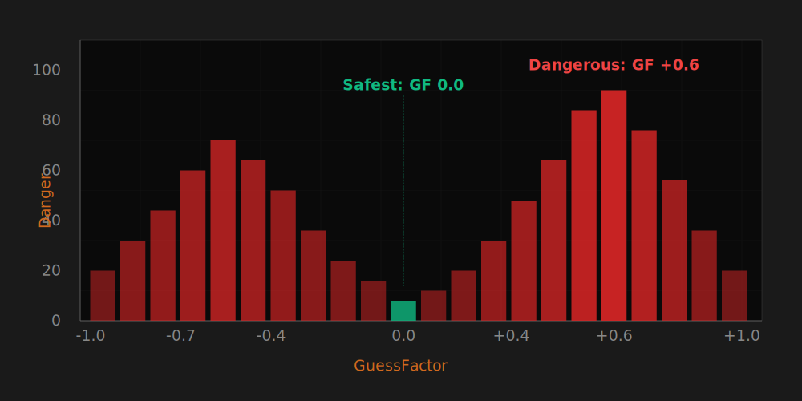

# Wave Surfing Introduction

> [!TIP] Origins
> **Wave Surfing** was pioneered by **Peter Strömberg ("PEZ")** in the early 2000s and represents one of the most 
> significant innovations in competitive Robocode. It revolutionized defensive movement by transforming bullet dodging 
> from reactive guesswork into predictive statistical analysis.

Wave Surfing is the defensive counterpart to GuessFactor Targeting. While GuessFactor guns track *where enemies dodge 
to*, Wave Surfing tracks *where enemies shoot* and move to locations they're least likely to target.

This technique enables bots to achieve hit rates below 10% against strong statistical guns—a dramatic improvement over 
traditional evasion methods like random movement or oscillators, which typically get hit 20-40% of the time.

## The Core Insight

Traditional movement asks: "Where should I go to be unpredictable?"

Wave Surfing asks: "Where will the enemy *think* I'm going, and how can I avoid being there?"

The key realization: if your enemy uses statistical targeting (GuessFactor, Dynamic Clustering, etc.), they're 
predicting your movement based on your past behavior. By tracking *their* statistics and intentionally moving to 
locations they historically *don't* shoot at, you can minimize your hit rate.

## How Wave Surfing Works

### 1. Detect Enemy Fire

When the enemy's energy drops by 0.1 to 3.0, they've fired a bullet:

```pseudocode
energyDrop = previousEnergy - currentEnergy
if 0.1 <= energyDrop <= 3.0:
  bulletPower = energyDrop
  bulletSpeed = 20 - 3 * bulletPower
  wave = createWave(enemyLocation, bulletSpeed, currentTime)
```

### 2. Create an Enemy Wave

Model the bullet as an expanding circle (wave) centered at the enemy's fire position:

```pseudocode
wave.origin = enemyLocation
wave.fireTime = currentTime
wave.bulletSpeed = 20 - 3 * bulletPower
wave.direction = angleFromEnemyToMe
```

<br>
*Enemy wave expanding from fire position toward the surfing bot*

### 3. Record Danger When Hit

When a wave hits you (or passes by), record which GuessFactor you were at when the wave was fired:

```pseudocode
lateralDirection = sign(lateralVelocity)
maxEscapeAngle = asin(8 / bulletSpeed)
myAngleOffset = angleTo(myPosition) - wave.direction
myGuessFactor = myAngleOffset / maxEscapeAngle

recordDanger(wave, myGuessFactor)
```

Over many battles, you build a danger profile showing which GuessFactors the enemy prefers.

### 4. Predict Wave Intersection

As the wave approaches, calculate where it will intersect your bot:

```pseudocode
distanceFromWaveOrigin = distance(myPosition, wave.origin)
waveFront = (currentTime - wave.fireTime) * wave.bulletSpeed
if waveFront >= distanceFromWaveOrigin - 18:
  // Wave is about to hit (bot radius = 18 units)
  waveWillHitSoon = true
```

### 5. Move to Safest GuessFactor

Before the wave hits, move perpendicular to the enemy to change your GuessFactor to the safest available location:

```pseudocode
safeGF = findSafestReachableGuessFactor(wave, myPosition, myVelocity)
destination = calculatePositionAtGuessFactor(wave, safeGF)
setMovement(destination)
```

## Two Approaches: GoTo Surfing vs. True Surfing

### GoTo Surfing

Calculate a destination point at the safest GuessFactor and move toward it using standard GoTo movement:

**Pros:**
- Simpler to implement
- Works with existing movement code

**Cons:**
- Less precise
- May not reach the intended GuessFactor in time

### True Surfing

Calculate precise movement commands (throttle, turn rate) to arrive at the exact GuessFactor at the exact moment the 
wave hits:

**Pros:**
- Maximum precision
- Can dodge multiple overlapping waves

**Cons:**
- Complex trajectory calculation
- Requires iterative simulation

Most competitive bots use True Surfing for optimal performance.

## Danger Calculation

The core of Wave Surfing is accurately modeling enemy danger. The simplest approach:

```pseudocode
for each wave:
  for each pastWave where enemy fired:
    pastGF = calculateGuessFactor(pastWave, myPastPosition)
    dangerArray[pastGF] += 1
```

Advanced implementations use **segmentation** (distance, lateral velocity, wall distance) just like GuessFactor 
Targeting but in reverse.

<!-- TODO: Illustration
**Filename:** wave-surfing-danger-profile.svg
**Caption:** "Danger profile showing enemy's firing tendencies across GuessFactors"
**Viewport:** 8000x4000
**Battlefield:** false
**Description:** A bar chart showing danger levels (0-100) across GuessFactor range from -1.0 to +1.0. Higher bars 
indicate more dangerous GuessFactors. Show peaks at GF -0.4 and +0.6, low valley at GF 0.0, demonstrating enemy 
preference for targeting clockwise movement more than counter-clockwise.
**Texts:**
  - text: "GuessFactor", position: (4000, 3500), color: chocolate
  - text: "Danger", position: (500, 2000), color: chocolate, rotate: -90
  - text: "Safest: GF 0.0", position: (4000, 1000), color: #10B981
  - text: "Dangerous: GF +0.6", position: (6000, 1000), color: #EF4444
-->

<br>
*Danger profile showing enemy's firing tendencies across GuessFactors*

## Wave Management

You'll typically track 2–4 waves simultaneously:

```pseudocode
waves = []

on enemy energy drop:
  waves.append(createWave())

on tick:
  for wave in waves:
    if wave.hasPassedMe():
      waves.remove(wave)
```

Prioritize the closest wave—it will hit first.

## Wall Smoothing Integration

Wave Surfing often conflicts with wall avoidance. Solutions:

**Approach 1:** Calculate danger for all reachable GuessFactors, including wall-smoothed paths.

**Approach 2:** Use wall smoothing only when no immediate waves threaten, prioritizing wave dodging over wall distance.

Most bots use Approach 1 for better positioning.

## Platform Notes

Wave Surfing works identically in classic Robocode and Tank Royale. The only difference is the coordinate system:

- **Classic Robocode:** heading 0° = north, angles increase clockwise
- **Tank Royale:** heading 0° = east, angles increase counter-clockwise

The underlying math and wave geometry remain the same—adjust your angle conversions accordingly.

## Learning Process

Wave Surfing requires data to work effectively:

**First few rounds:** High hit rate (30-40%) while gathering statistics.

**After 10-20 rounds:** Hit rate drops to 15-25% as danger profiles stabilize.

**After 35 rounds:** Elite surfers achieve < 10% hit rates against strong statistical guns.

Some bots use **pre-seeded data** from previous battles to improve early-round performance.

## Practical Tips

**Start with a simple danger:** Count hits per GuessFactor. Don't segment until the basics work.

**Visualize waves:** Draw waves and danger profiles in RobocodeSG/Tank Royale graphics to debug.

**Test against known guns:** Use GuessFactor sample bots to verify your surfing is detecting and dodging correctly.

**Segment cautiously:** Over-segmentation causes data sparsity. Start with distance-only segmentation.

**Handle bullet hits:** When hit, record the GuessFactor where you were struck and increase its danger rating.

## Common Mistakes

- **Not detecting all bullets:** Missing energy drops due to rounding errors or bot death events.
- **Wrong GuessFactor calculation:** Sign errors in lateral direction or angle offset.
- **Ignoring bot rotation:** Your bot's turn radius limits which GuessFactors you can reach.
- **Over-aggressive dodging:** Sometimes "surfing through" danger is better than hitting walls.
- **Forgetting data decay:** Old data from changed enemy behavior pollutes danger profiles.

## When Wave Surfing Fails

Wave Surfing struggles against:

- **Random targeting:** No pattern to learn from.
- **Pattern matchers:** They predict future movement, not past behavior.
- **Anti-surfer guns:** Specifically designed to exploit Wave Surfing assumptions.

Even against these, Wave Surfing is rarely *worse* than traditional movement—it just doesn't dominate.

## Next Steps

Once you have basic Wave Surfing working:

- **[Wave Surfing Implementations](./wave-surfing-implementations.md)** — Compare GoTo vs. True Surfing approaches
- **[Flattener](./flattener.md)** — Counter enemies who learn your surfing patterns
- **[Segmentation & Visit Count Stats](../../targeting/statistical-targeting/segmentation-visit-count-stats.md)** —
  Apply segmentation to danger calculation
  Apply segmentation to danger calculation

## Further Reading

- [Wave Surfing](https://robowiki.net/wiki/Wave_Surfing) — RoboWiki (classic Robocode)
- [Wave Surfing/GoTo Surfing](https://robowiki.net/wiki/Wave_Surfing/GoTo_Surfing) — RoboWiki (classic Robocode)
- [Wave Surfing/True Surfing](https://robowiki.net/wiki/Wave_Surfing/True_Surfing) — RoboWiki (classic Robocode)
- [Waves](https://robowiki.net/wiki/Waves) — RoboWiki (classic Robocode)
- [GuessFactor Targeting](../../targeting/statistical-targeting/guessfactor-targeting.md) — The offensive counterpart
