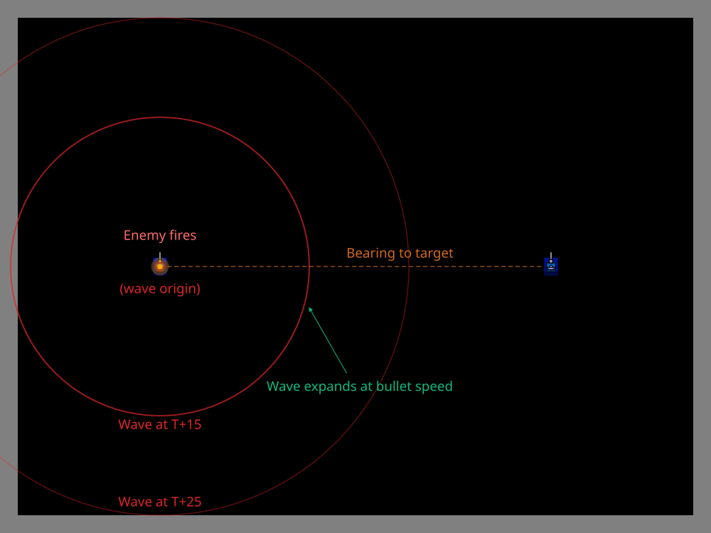
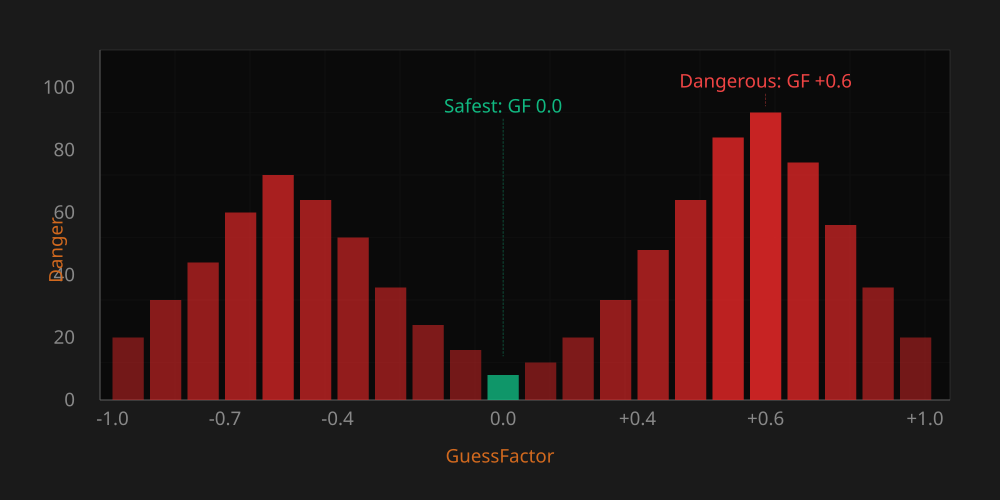

# Wave Surfing Introduction

> [!TIP] Origins
> **Wave Surfing** was invented by **ABC** (author of **Shadow**) in the early 2000s and represents one of
> the most significant innovations in competitive Robocode. Before Wave Surfing, movement strategies were mostly
> **Random** or **Oscillating**, bots would move erratically hoping to avoid bullets by chance. ABC's
> discovery changed the game from a test of luck to a test of statistical prediction, revolutionizing defensive movement
> by transforming bullet dodging from reactive guesswork into predictive statistical analysis.

Wave Surfing is more than just "dodging bullets", it's the defensive counterpart to GuessFactor Targeting. While 
GuessFactor guns track *where enemies dodge to*, Wave Surfing tracks *where enemies shoot* and move to locations 
they're least likely to target.

This technique enables bots to achieve hit rates below 10% against strong statistical guns, a dramatic improvement over 
traditional evasion methods like random movement or oscillators, which typically get hit 20-40% of the time.

## The Core Insight

Traditional movement asks: "Where should I go to be unpredictable?"

Wave Surfing asks: "Where will the enemy *think* I'm going, and how can I avoid being there?"

The key realization: if your enemy uses statistical targeting (GuessFactor, Dynamic Clustering, etc.), they're 
predicting your movement based on your past behavior. By tracking *their* statistics and intentionally moving to 
locations they historically *don't* shoot at, you can minimize your hit rate.

## How Wave Surfing Works

### 1. Detect Enemy Fire

When the enemy's energy drops by 0.1 to 3.0, they've fired a bullet:

Pass the previous and current enemy energy to `detectFire(...)`. A drop from `0.1` through `3.0` is treated as a
possible shot, so collision and melee-specific filters should be added when the surrounding bot has that information.

### 2. Create an Enemy Wave

Model the bullet as an expanding circle (wave) centered at the enemy's fire position:

Store the enemy's position at the estimated fire turn, the bullet speed `20 - 3 × bulletPower`, and the direct angle
from the enemy to the bot. The wave's radius on turn `t` is `bulletSpeed × (t - fireTime)`.

<br>
*Enemy wave expanding from fire position toward the surfing bot*

### 3. Record Danger When Hit

When a wave hits you (or passes by), record which GuessFactor you were at when the wave was fired:

Call `recordPass(...)` with the bot's position and lateral velocity. It normalizes the angle offset by the maximum
escape angle `asin(8 / bulletSpeed)`, then increments that GuessFactor's danger bin.

Over many battles, you build a danger profile showing which GuessFactors the enemy prefers.

### 4. Predict Wave Intersection

As the wave approaches, calculate where it will intersect your bot:

Call `willHitSoon(...)` when the wave front is within 18 units of the bot. The 18-unit margin approximates the bot's
radius and gives the movement controller time to choose a destination.

### 5. Move to Safest GuessFactor

Before the wave hits, move perpendicular to the enemy to change your GuessFactor to the safest available location:

Ask `safestGuessFactor()` for the least dangerous recorded bin, then call `positionAtGuessFactor(...)` to get a point on
that escape arc. A real controller must still check whether the point is reachable before sending movement commands.

The following API-neutral model implements these core calculations. It uses mathematical angles in radians; a platform
adapter converts headings and turn commands as needed.

::: code-group

```java [Classic · Java]
import java.util.HashMap;
import java.util.Map;

public final class WaveSurfingModel {
    private static final int BIN_COUNT = 31;
    private static final double MIN_POWER = 0.1;
    private static final double MAX_POWER = 3.0;
    private static final double BOT_RADIUS = 18.0;
    private final Map<String, Double> previousEnergy = new HashMap<>();
    private final int[] danger = new int[BIN_COUNT];

    public Wave detectFire(
            String enemyId, double enemyEnergy, double enemyX, double enemyY,
            double myX, double myY, double lateralVelocity, long turn) {
        Double oldEnergy = previousEnergy.put(enemyId, enemyEnergy);
        if (oldEnergy == null) {
            return null;
        }
        double power = oldEnergy - enemyEnergy;
        if (power < MIN_POWER || power > MAX_POWER) {
            return null;
        }

        double directAngle = Math.atan2(myY - enemyY, myX - enemyX);
        return new Wave(enemyX, enemyY, turn, 20 - 3 * power,
                directAngle, lateralVelocity >= 0 ? 1 : -1);
    }

    public void recordPass(Wave wave, double myX, double myY) {
        double angle = Math.atan2(myY - wave.originY, myX - wave.originX);
        double offset = normalizeRelativeAngle(angle - wave.directAngle);
        double escapeAngle = Math.asin(8.0 / wave.bulletSpeed);
        double guessFactor = clamp(offset / escapeAngle * wave.lateralDirection, -1, 1);
        danger[guessFactorToBin(guessFactor)]++;
    }

    public boolean willHitSoon(Wave wave, long turn, double myX, double myY) {
        double radius = wave.bulletSpeed * (turn - wave.fireTurn);
        return radius >= Math.hypot(myX - wave.originX, myY - wave.originY) - BOT_RADIUS;
    }

    public double safestGuessFactor() {
        int bestBin = BIN_COUNT / 2;
        int bestDanger = score(bestBin);
        for (int bin = 1; bin < BIN_COUNT - 1; bin++) {
            int score = score(bin);
            if (score < bestDanger) {
                bestDanger = score;
                bestBin = bin;
            }
        }
        return binToGuessFactor(bestBin);
    }

    public Point positionAtGuessFactor(Wave wave, double guessFactor, double distance) {
        double escapeAngle = Math.asin(8.0 / wave.bulletSpeed);
        double angle = wave.directAngle + guessFactor * escapeAngle * wave.lateralDirection;
        return new Point(wave.originX + distance * Math.cos(angle), wave.originY + distance * Math.sin(angle));
    }

    private int score(int center) {
        return danger[center - 1] + danger[center] + danger[center + 1];
    }

    private static int guessFactorToBin(double value) {
        int bin = (int) Math.round((clamp(value, -1, 1) + 1) * 0.5 * (BIN_COUNT - 1));
        return Math.max(0, Math.min(BIN_COUNT - 1, bin));
    }

    private static double binToGuessFactor(int bin) {
        return bin * 2.0 / (BIN_COUNT - 1) - 1.0;
    }

    private static double normalizeRelativeAngle(double angle) {
        while (angle <= -Math.PI) angle += 2 * Math.PI;
        while (angle > Math.PI) angle -= 2 * Math.PI;
        return angle;
    }

    private static double clamp(double value, double minimum, double maximum) {
        return Math.max(minimum, Math.min(maximum, value));
    }

    public static final class Wave {
        final double originX;
        final double originY;
        final long fireTurn;
        final double bulletSpeed;
        final double directAngle;
        final int lateralDirection;

        Wave(double originX, double originY, long fireTurn, double bulletSpeed,
                double directAngle, int lateralDirection) {
            this.originX = originX;
            this.originY = originY;
            this.fireTurn = fireTurn;
            this.bulletSpeed = bulletSpeed;
            this.directAngle = directAngle;
            this.lateralDirection = lateralDirection;
        }
    }

    public static final class Point {
        public final double x;
        public final double y;

        Point(double x, double y) {
            this.x = x;
            this.y = y;
        }
    }
}
```

```python [Tank Royale · Python]
from dataclasses import dataclass
from math import asin, atan2, cos, hypot, pi, sin


BIN_COUNT = 31
BOT_RADIUS = 18.0


@dataclass
class Wave:
    origin_x: float
    origin_y: float
    fire_turn: int
    bullet_speed: float
    direct_angle: float
    lateral_direction: int


@dataclass
class Point:
    x: float
    y: float


class WaveSurfingModel:
    def __init__(self) -> None:
        self.previous_energy: dict[str, float] = {}
        self.danger = [0] * BIN_COUNT

    def detect_fire(
        self,
        enemy_id: str,
        enemy_energy: float,
        enemy_x: float,
        enemy_y: float,
        my_x: float,
        my_y: float,
        lateral_velocity: float,
        turn: int,
    ) -> Wave | None:
        old_energy = self.previous_energy.get(enemy_id)
        self.previous_energy[enemy_id] = enemy_energy
        if old_energy is None:
            return None
        power = old_energy - enemy_energy
        if not 0.1 <= power <= 3.0:
            return None
        direct_angle = atan2(my_y - enemy_y, my_x - enemy_x)
        return Wave(enemy_x, enemy_y, turn, 20 - 3 * power, direct_angle,
                    1 if lateral_velocity >= 0 else -1)

    def record_pass(self, wave: Wave, my_x: float, my_y: float) -> None:
        angle = atan2(my_y - wave.origin_y, my_x - wave.origin_x)
        offset = normalize_relative_angle(angle - wave.direct_angle)
        escape_angle = asin(8 / wave.bullet_speed)
        guess_factor = clamp(offset / escape_angle * wave.lateral_direction, -1, 1)
        self.danger[guess_factor_to_bin(guess_factor)] += 1

    def will_hit_soon(self, wave: Wave, turn: int, my_x: float, my_y: float) -> bool:
        radius = wave.bullet_speed * (turn - wave.fire_turn)
        return radius >= hypot(my_x - wave.origin_x, my_y - wave.origin_y) - BOT_RADIUS

    def safest_guess_factor(self) -> float:
        best_bin = BIN_COUNT // 2
        best_danger = self.score(best_bin)
        for center in range(1, BIN_COUNT - 1):
            score = self.score(center)
            if score < best_danger:
                best_danger = score
                best_bin = center
        return bin_to_guess_factor(best_bin)

    def position_at_guess_factor(self, wave: Wave, guess_factor: float, distance: float) -> Point:
        escape_angle = asin(8 / wave.bullet_speed)
        angle = wave.direct_angle + guess_factor * escape_angle * wave.lateral_direction
        return Point(wave.origin_x + distance * cos(angle), wave.origin_y + distance * sin(angle))

    def score(self, center: int) -> int:
        return self.danger[center - 1] + self.danger[center] + self.danger[center + 1]


def guess_factor_to_bin(value: float) -> int:
    index = round((clamp(value, -1, 1) + 1) * 0.5 * (BIN_COUNT - 1))
    return max(0, min(BIN_COUNT - 1, index))


def bin_to_guess_factor(index: int) -> float:
    return index * 2 / (BIN_COUNT - 1) - 1


def normalize_relative_angle(angle: float) -> float:
    while angle <= -pi:
        angle += 2 * pi
    while angle > pi:
        angle -= 2 * pi
    return angle


def clamp(value: float, minimum: float, maximum: float) -> float:
    return max(minimum, min(maximum, value))
```

```java [Tank Royale · Java]
import java.util.HashMap;
import java.util.Map;

public final class WaveSurfingModel {
    private static final int BIN_COUNT = 31;
    private static final double BOT_RADIUS = 18.0;
    private final Map<String, Double> previousEnergy = new HashMap<>();
    private final int[] danger = new int[BIN_COUNT];

    public Wave detectFire(
            String enemyId, double enemyEnergy, double enemyX, double enemyY,
            double myX, double myY, double lateralVelocity, long turn) {
        Double oldEnergy = previousEnergy.put(enemyId, enemyEnergy);
        if (oldEnergy == null) {
            return null;
        }
        double power = oldEnergy - enemyEnergy;
        if (power < 0.1 || power > 3.0) {
            return null;
        }
        double directAngle = Math.atan2(myY - enemyY, myX - enemyX);
        return new Wave(enemyX, enemyY, turn, 20 - 3 * power,
                directAngle, lateralVelocity >= 0 ? 1 : -1);
    }

    public void recordPass(Wave wave, double myX, double myY) {
        double angle = Math.atan2(myY - wave.originY, myX - wave.originX);
        double offset = normalizeRelativeAngle(angle - wave.directAngle);
        double escapeAngle = Math.asin(8.0 / wave.bulletSpeed);
        double guessFactor = clamp(offset / escapeAngle * wave.lateralDirection, -1, 1);
        danger[guessFactorToBin(guessFactor)]++;
    }

    public boolean willHitSoon(Wave wave, long turn, double myX, double myY) {
        double radius = wave.bulletSpeed * (turn - wave.fireTurn);
        return radius >= Math.hypot(myX - wave.originX, myY - wave.originY) - BOT_RADIUS;
    }

    public double safestGuessFactor() {
        int bestBin = BIN_COUNT / 2;
        int bestDanger = score(bestBin);
        for (int bin = 1; bin < BIN_COUNT - 1; bin++) {
            int score = score(bin);
            if (score < bestDanger) {
                bestDanger = score;
                bestBin = bin;
            }
        }
        return binToGuessFactor(bestBin);
    }

    public Point positionAtGuessFactor(Wave wave, double guessFactor, double distance) {
        double escapeAngle = Math.asin(8.0 / wave.bulletSpeed);
        double angle = wave.directAngle + guessFactor * escapeAngle * wave.lateralDirection;
        return new Point(wave.originX + distance * Math.cos(angle), wave.originY + distance * Math.sin(angle));
    }

    private int score(int center) {
        return danger[center - 1] + danger[center] + danger[center + 1];
    }

    private static int guessFactorToBin(double value) {
        int bin = (int) Math.round((clamp(value, -1, 1) + 1) * 0.5 * (BIN_COUNT - 1));
        return Math.max(0, Math.min(BIN_COUNT - 1, bin));
    }

    private static double binToGuessFactor(int bin) {
        return bin * 2.0 / (BIN_COUNT - 1) - 1.0;
    }

    private static double normalizeRelativeAngle(double angle) {
        while (angle <= -Math.PI) angle += 2 * Math.PI;
        while (angle > Math.PI) angle -= 2 * Math.PI;
        return angle;
    }

    private static double clamp(double value, double minimum, double maximum) {
        return Math.max(minimum, Math.min(maximum, value));
    }

    public static final class Wave {
        final double originX;
        final double originY;
        final long fireTurn;
        final double bulletSpeed;
        final double directAngle;
        final int lateralDirection;

        Wave(double originX, double originY, long fireTurn, double bulletSpeed,
                double directAngle, int lateralDirection) {
            this.originX = originX;
            this.originY = originY;
            this.fireTurn = fireTurn;
            this.bulletSpeed = bulletSpeed;
            this.directAngle = directAngle;
            this.lateralDirection = lateralDirection;
        }
    }

    public static final class Point {
        public final double x;
        public final double y;

        Point(double x, double y) {
            this.x = x;
            this.y = y;
        }
    }
}
```

```csharp [Tank Royale · C#]
using System;
using System.Collections.Generic;

public sealed class WaveSurfingModel
{
    private const int BinCount = 31;
    private const double BotRadius = 18.0;
    private readonly Dictionary<string, double> previousEnergy = new();
    private readonly int[] danger = new int[BinCount];

    public Wave? DetectFire(
        string enemyId, double enemyEnergy, double enemyX, double enemyY,
        double myX, double myY, double lateralVelocity, long turn)
    {
        if (!previousEnergy.TryGetValue(enemyId, out double oldEnergy))
        {
            previousEnergy[enemyId] = enemyEnergy;
            return null;
        }
        previousEnergy[enemyId] = enemyEnergy;
        double power = oldEnergy - enemyEnergy;
        if (power < 0.1 || power > 3.0)
        {
            return null;
        }
        double directAngle = Math.Atan2(myY - enemyY, myX - enemyX);
        return new Wave(enemyX, enemyY, turn, 20 - 3 * power,
            directAngle, lateralVelocity >= 0 ? 1 : -1);
    }

    public void RecordPass(Wave wave, double myX, double myY)
    {
        double angle = Math.Atan2(myY - wave.OriginY, myX - wave.OriginX);
        double offset = NormalizeRelativeAngle(angle - wave.DirectAngle);
        double escapeAngle = Math.Asin(8.0 / wave.BulletSpeed);
        double guessFactor = Clamp(offset / escapeAngle * wave.LateralDirection, -1, 1);
        danger[GuessFactorToBin(guessFactor)]++;
    }

    public bool WillHitSoon(Wave wave, long turn, double myX, double myY)
    {
        double radius = wave.BulletSpeed * (turn - wave.FireTurn);
        return radius >= Math.Sqrt(Math.Pow(myX - wave.OriginX, 2) + Math.Pow(myY - wave.OriginY, 2)) - BotRadius;
    }

    public double SafestGuessFactor()
    {
        int bestBin = BinCount / 2;
        int bestDanger = Score(bestBin);
        for (int bin = 1; bin < BinCount - 1; bin++)
        {
            int score = Score(bin);
            if (score < bestDanger)
            {
                bestDanger = score;
                bestBin = bin;
            }
        }
        return BinToGuessFactor(bestBin);
    }

    public Point PositionAtGuessFactor(Wave wave, double guessFactor, double distance)
    {
        double escapeAngle = Math.Asin(8.0 / wave.BulletSpeed);
        double angle = wave.DirectAngle + guessFactor * escapeAngle * wave.LateralDirection;
        return new Point(wave.OriginX + distance * Math.Cos(angle), wave.OriginY + distance * Math.Sin(angle));
    }

    private int Score(int center) => danger[center - 1] + danger[center] + danger[center + 1];

    private static int GuessFactorToBin(double value)
    {
        int bin = (int)Math.Round((Clamp(value, -1, 1) + 1) * 0.5 * (BinCount - 1));
        return Math.Max(0, Math.Min(BinCount - 1, bin));
    }

    private static double BinToGuessFactor(int bin) => bin * 2.0 / (BinCount - 1) - 1.0;

    private static double NormalizeRelativeAngle(double angle)
    {
        while (angle <= -Math.PI) angle += 2 * Math.PI;
        while (angle > Math.PI) angle -= 2 * Math.PI;
        return angle;
    }

    private static double Clamp(double value, double minimum, double maximum) =>
        Math.Max(minimum, Math.Min(maximum, value));

    public sealed record Wave(
        double OriginX, double OriginY, long FireTurn,
        double BulletSpeed, double DirectAngle, int LateralDirection);

    public sealed record Point(double X, double Y);
}
```

```typescript [Tank Royale · TypeScript]
type Wave = {
    originX: number;
    originY: number;
    fireTurn: number;
    bulletSpeed: number;
    directAngle: number;
    lateralDirection: number;
};

type Point = { x: number; y: number };

class WaveSurfingModel {
    private static readonly binCount = 31;
    private readonly previousEnergy = new Map<string, number>();
    private readonly danger = new Array<number>(WaveSurfingModel.binCount).fill(0);

    detectFire(
        enemyId: string,
        enemyEnergy: number,
        enemyX: number,
        enemyY: number,
        myX: number,
        myY: number,
        lateralVelocity: number,
        turn: number,
    ): Wave | null {
        const oldEnergy = this.previousEnergy.get(enemyId);
        this.previousEnergy.set(enemyId, enemyEnergy);
        if (oldEnergy === undefined) return null;
        const power = oldEnergy - enemyEnergy;
        if (power < 0.1 || power > 3) return null;
        return {
            originX: enemyX,
            originY: enemyY,
            fireTurn: turn,
            bulletSpeed: 20 - 3 * power,
            directAngle: Math.atan2(myY - enemyY, myX - enemyX),
            lateralDirection: lateralVelocity >= 0 ? 1 : -1,
        };
    }

    recordPass(wave: Wave, myX: number, myY: number) {
        const angle = Math.atan2(myY - wave.originY, myX - wave.originX);
        const offset = normalizeRelativeAngle(angle - wave.directAngle);
        const escapeAngle = Math.asin(8 / wave.bulletSpeed);
        const guessFactor = clamp(offset / escapeAngle * wave.lateralDirection, -1, 1);
        this.danger[guessFactorToBin(guessFactor)] += 1;
    }

    willHitSoon(wave: Wave, turn: number, myX: number, myY: number) {
        const radius = wave.bulletSpeed * (turn - wave.fireTurn);
        return radius >= Math.hypot(myX - wave.originX, myY - wave.originY) - 18;
    }

    safestGuessFactor() {
        let bestBin = Math.floor(WaveSurfingModel.binCount / 2);
        let bestDanger = this.score(bestBin);
        for (let center = 1; center < WaveSurfingModel.binCount - 1; center += 1) {
            const score = this.score(center);
            if (score < bestDanger) {
                bestDanger = score;
                bestBin = center;
            }
        }
        return bestBin * 2 / (WaveSurfingModel.binCount - 1) - 1;
    }

    positionAtGuessFactor(wave: Wave, guessFactor: number, distance: number): Point {
        const escapeAngle = Math.asin(8 / wave.bulletSpeed);
        const angle = wave.directAngle + guessFactor * escapeAngle * wave.lateralDirection;
        return {
            x: wave.originX + distance * Math.cos(angle),
            y: wave.originY + distance * Math.sin(angle),
        };
    }

    private score(center: number) {
        return this.danger[center - 1] + this.danger[center] + this.danger[center + 1];
    }
}

function guessFactorToBin(value: number) {
    const index = Math.round((clamp(value, -1, 1) + 1) * 0.5 * 30);
    return Math.max(0, Math.min(30, index));
}

function normalizeRelativeAngle(angle: number) {
    while (angle <= -Math.PI) angle += 2 * Math.PI;
    while (angle > Math.PI) angle -= 2 * Math.PI;
    return angle;
}

function clamp(value: number, minimum: number, maximum: number) {
    return Math.max(minimum, Math.min(maximum, value));
}
```

:::

## Two Approaches: GoTo Surfing vs. True Surfing

### GoTo Surfing

Calculate a destination point at the safest GuessFactor and move toward it using standard GoTo movement:

**Pros:**
- Simpler to implement
- Works with existing movement code

**Cons:**
- Less precise
- May not reach the intended GuessFactor in time

### True Surfing

Calculate precise movement commands (throttle, turn rate) to arrive at the exact GuessFactor at the exact moment the 
wave hits:

**Pros:**
- Maximum precision
- Can dodge multiple overlapping waves

**Cons:**
- Complex trajectory calculation
- Requires iterative simulation

Most competitive bots use True Surfing for optimal performance.

## Danger Calculation

The core of Wave Surfing is accurately modeling enemy danger. The simplest approach:

For every wave that passes the bot, calculate the historical GuessFactor and increment its danger bin. The model above
uses a three-bin score when choosing the safest location, which makes one isolated observation less influential.

Advanced implementations use **segmentation** (distance, lateral velocity, wall distance) just like GuessFactor 
Targeting but in reverse.

<!-- TODO: Illustration
**Filename:** wave-surfing-danger-profile.svg
**Caption:** "Danger profile showing enemy's firing tendencies across GuessFactors"
**Viewport:** 8000x4000
**Battlefield:** false
**Description:** A bar chart showing danger levels (0-100) across GuessFactor range from -1.0 to +1.0. Higher bars 
indicate more dangerous GuessFactors. Show peaks at GF -0.4 and +0.6, low valley at GF 0.0, demonstrating enemy 
preference for targeting clockwise movement more than counter-clockwise.
**Texts:**
  - text: "GuessFactor", position: (4000, 3500), color: chocolate
  - text: "Danger", position: (500, 2000), color: chocolate, rotate: -90
  - text: "Safest: GF 0.0", position: (4000, 1000), color: #10B981
  - text: "Dangerous: GF +0.6", position: (6000, 1000), color: #EF4444
-->

<br>
*Danger profile showing enemy's firing tendencies across GuessFactors*

## Wave Management

You'll typically track 2–4 waves simultaneously:

Keep an active list of two to four waves. Append waves returned by `detectFire(...)`, update their radii each turn, and
remove a wave after it passes the bot or is confirmed by a bullet-hit event.

Prioritize the closest wave, it will hit first.

## Wall Smoothing Integration

Wave Surfing often conflicts with wall avoidance. Solutions:

**Approach 1:** Calculate danger for all reachable GuessFactors, including wall-smoothed paths.

**Approach 2:** Use wall smoothing only when no immediate waves threaten, prioritizing wave dodging over wall distance.

Most bots use Approach 1 for better positioning.

## Platform Notes

Wave Surfing works identically in classic Robocode and Tank Royale. The only difference is the coordinate system:

- **Classic Robocode:** heading 0° = north, angles increase clockwise
- **Tank Royale:** heading 0° = east, angles increase counter-clockwise

The underlying math and wave geometry remain the same, adjust your angle conversions accordingly.

## Learning Process

Wave Surfing requires data to work effectively:

**First few rounds:** High hit rate (30-40%) while gathering statistics.

**After 10-20 rounds:** Hit rate drops to 15-25% as danger profiles stabilize.

**After 35 rounds:** Elite surfers achieve < 10% hit rates against strong statistical guns.

Some bots use **pre-seeded data** from previous battles to improve early-round performance.

## Practical Tips

**Start with a simple danger:** Count hits per GuessFactor. Don't segment until the basics work.

**Visualize waves:** Draw waves and danger profiles in RobocodeSG/Tank Royale graphics to debug.

**Test against known guns:** Use GuessFactor sample bots to verify your surfing is detecting and dodging correctly.

**Segment cautiously:** Over-segmentation causes data sparsity. Start with distance-only segmentation.

**Handle bullet hits:** When hit, record the GuessFactor where you were struck and increase its danger rating.

## Common Mistakes

- **Not detecting all bullets:** Missing energy drops due to rounding errors or bot death events.
- **Wrong GuessFactor calculation:** Sign errors in lateral direction or angle offset.
- **Ignoring bot rotation:** Your bot's turn radius limits which GuessFactors you can reach.
- **Over-aggressive dodging:** Sometimes "surfing through" danger is better than hitting walls.
- **Forgetting data decay:** Old data from changed enemy behavior pollutes danger profiles.

## When Wave Surfing Fails

Wave Surfing struggles against:

- **Random targeting:** No pattern to learn from.
- **Pattern matchers:** They predict future movement, not past behavior.
- **Anti-surfer guns:** Specifically designed to exploit Wave Surfing assumptions.

Even against these, Wave Surfing is rarely *worse* than traditional movement, it just doesn't dominate.

## Next Steps

Once you have basic Wave Surfing working:

- **[Wave Surfing Implementations](./wave-surfing-implementations.md)**: Compare GoTo vs. True Surfing approaches
- **[Flattener](./flattener.md)**: Counter enemies who learn your surfing patterns
- **[Segmentation & Visit Count Stats](../../targeting/statistical-targeting/segmentation-visit-count-stats.md)**:
  Apply segmentation to danger calculation

## Further Reading

- [Wave Surfing](https://robowiki.net/wiki/Wave_Surfing) - RoboWiki (classic Robocode)
- [Wave Surfing/GoTo Surfing](https://robowiki.net/wiki/Wave_Surfing/GoTo_Surfing) - RoboWiki (classic Robocode)
- [Wave Surfing/True Surfing](https://robowiki.net/wiki/Wave_Surfing/True_Surfing) - RoboWiki (classic Robocode)
- [Waves](https://robowiki.net/wiki/Waves) - RoboWiki (classic Robocode)
- [GuessFactor Targeting](../../targeting/statistical-targeting/guessfactor-targeting.md) - The offensive counterpart
