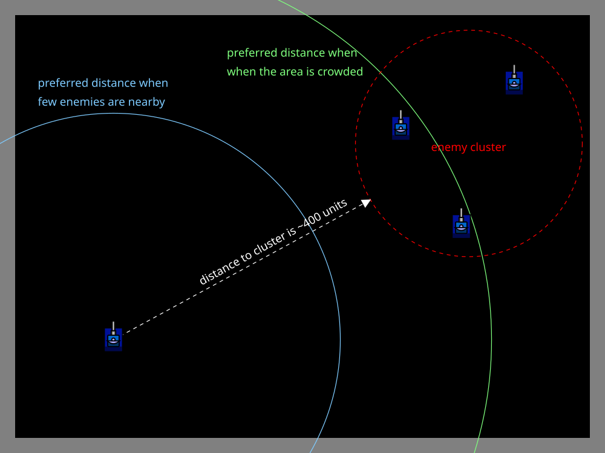

# Distancing

> [!TIP] Origins
> **Distancing** and **Dynamic Distancing** concepts were developed and documented by the RoboWiki community.

Distancing is the movement idea of deliberately choosing a range to opponents instead of letting range happen by
accident. Distance changes bullet flight time, how much room there is to maneuver, and how easy it is for either bot to
aim.

A useful default is: **more opponents usually means a larger preferred distance**. With fewer opponents (or an opponent
that rarely hits), playing closer can be reasonable.

## Why distance matters

Distance is not just a number on the screen. It changes several “physics of decision-making” effects:

- **Time to react:** bullets take longer to arrive at long range, so there is more time to change direction.
- **How crowded the fight feels:** close fights reduce escape options, especially near walls.
- **How much position changes matter:** at close range, small sideways moves change the angle to the enemy more.
- **Wall pressure:** long, sweeping movement arcs need space. Too close to a border makes many movement choices illegal
  or predictable.

Distancing is often easiest to think of as “how much space is available for the next 1–2 seconds of movement.”

## Distancing goals in different situations

### Many bots (melee)

In melee, threats arrive from multiple directions. A common distancing goal is to avoid being in the middle of a local
cluster.

Keeping more distance tends to help because:

- there is more room to route around groups,
- accidental ramming and body-blocking happens less,
- crossfire is easier to escape when bullets have more travel time.

This does not mean staying in a corner. Walls remove escape space, so “far from opponents” must be balanced with “not
pinned against a border.”

### One-on-one (or just a couple of bots)

With fewer opponents, the range can be shorter because:

- there is less risk of being surrounded,
- the movement problem is simpler (one main threat),
- moving closer can increase how much a small lateral move changes the opponent’s aiming angle.

A practical rule of thumb: keep enough distance to avoid getting stuck near walls, but not so much that movement becomes
wide and slow to adjust.

### Against a weaker opponent

If an opponent is consistently missing, reducing distance can be a reasonable choice. The goal is not “get close because
close is better,” but “reduce distance because the risk is low and the round ends sooner.”

## Dynamic distancing (the idea)

Dynamic distancing means the preferred distance is not fixed. Instead, the bot continuously adjusts the desired
distance based on context.

When the situation becomes more dangerous (for example, in a crowded melee), the usual adjustment is to **increase the
preferred distance**. In calmer situations, the preferred distance can be smaller.

Typical inputs for a dynamic distancing rule:

- **Threat level:** if hits are frequent or damage spikes, increase preferred distance.
- **Crowding (melee):** if the nearby area becomes busy, increase preferred distance from the crowd.
- **Wall pressure:** if current movement options are limited by borders, bias toward regaining space.
- **Round tempo:** if the opponent is weak or the field is quiet, the bot can accept slightly shorter distance.

The key is smoothness: dynamic distancing should gently “steer” range over time, not oscillate wildly between too close
and too far.

## A small range controller in five languages

One convenient way to implement distancing is to treat it like a feedback controller. The code below turns the numeric
rule into reusable functions. It returns a negative error when the bot is too close and a positive error when it is too
far.

The controller does not choose a particular steering style. Its returned error can be passed to circling, waypoint,
random, or other movement code.

::: code-group

```java [Classic · Java]
public class DistancingController {
    public static double targetDistance(
            boolean melee, double threatLevel, double crowding, boolean enemyIsWeak) {
        double target = melee ? 650 : 450;
        target += clamp(threatLevel * 120, 0, 200);
        target += clamp(crowding * 80, 0, 200);
        target -= clamp(enemyIsWeak ? 100 : 0, 0, 150);
        return target;
    }

    public static double rangeError(
            double distance, boolean melee, double threatLevel,
            double crowding, boolean enemyIsWeak) {
        return distance - targetDistance(melee, threatLevel, crowding, enemyIsWeak);
    }

    private static double clamp(double value, double minimum, double maximum) {
        return Math.max(minimum, Math.min(maximum, value));
    }
}
```

```python [Tank Royale · Python]
def target_distance(
    melee: bool, threat_level: float, crowding: float, enemy_is_weak: bool
) -> float:
    target = 650 if melee else 450
    target += clamp(threat_level * 120, 0, 200)
    target += clamp(crowding * 80, 0, 200)
    target -= clamp(100 if enemy_is_weak else 0, 0, 150)
    return target


def range_error(
    distance: float, melee: bool, threat_level: float,
    crowding: float, enemy_is_weak: bool
) -> float:
    return distance - target_distance(melee, threat_level, crowding, enemy_is_weak)


def clamp(value: float, minimum: float, maximum: float) -> float:
    return max(minimum, min(maximum, value))
```

```java [Tank Royale · Java]
public class DistancingController {
    public static double targetDistance(
            boolean melee, double threatLevel, double crowding, boolean enemyIsWeak) {
        double target = melee ? 650 : 450;
        target += clamp(threatLevel * 120, 0, 200);
        target += clamp(crowding * 80, 0, 200);
        target -= clamp(enemyIsWeak ? 100 : 0, 0, 150);
        return target;
    }

    public static double rangeError(
            double distance, boolean melee, double threatLevel,
            double crowding, boolean enemyIsWeak) {
        return distance - targetDistance(melee, threatLevel, crowding, enemyIsWeak);
    }

    private static double clamp(double value, double minimum, double maximum) {
        return Math.max(minimum, Math.min(maximum, value));
    }
}
```

```csharp [Tank Royale · C#]
public static class DistancingController
{
    public static double TargetDistance(
        bool melee, double threatLevel, double crowding, bool enemyIsWeak)
    {
        double target = melee ? 650 : 450;
        target += Clamp(threatLevel * 120, 0, 200);
        target += Clamp(crowding * 80, 0, 200);
        target -= Clamp(enemyIsWeak ? 100 : 0, 0, 150);
        return target;
    }

    public static double RangeError(
        double distance, bool melee, double threatLevel,
        double crowding, bool enemyIsWeak)
    {
        return distance - TargetDistance(melee, threatLevel, crowding, enemyIsWeak);
    }

    private static double Clamp(double value, double minimum, double maximum)
    {
        return Math.Max(minimum, Math.Min(maximum, value));
    }
}
```

```typescript [Tank Royale · TypeScript]
class DistancingController {
    static targetDistance(
        melee: boolean,
        threatLevel: number,
        crowding: number,
        enemyIsWeak: boolean,
    ) {
        let target = melee ? 650 : 450;
        target += this.clamp(threatLevel * 120, 0, 200);
        target += this.clamp(crowding * 80, 0, 200);
        target -= this.clamp(enemyIsWeak ? 100 : 0, 0, 150);
        return target;
    }

    static rangeError(
        distance: number,
        melee: boolean,
        threatLevel: number,
        crowding: number,
        enemyIsWeak: boolean,
    ) {
        return distance - this.targetDistance(melee, threatLevel, crowding, enemyIsWeak);
    }

    private static clamp(value: number, minimum: number, maximum: number) {
        return Math.max(minimum, Math.min(maximum, value));
    }
}
```

:::

> [!NOTE] clamp
> `clamp(x, min, max)` keeps a value inside a range. Values below `min` become `min`, and values above `max` become
> `max`.

The function `moveWithRangeBias(error)` is a conceptual placeholder: it means to move in a way that reduces the
difference between your current distance and your desired distance, while still prioritizing safety and your main
movement style. For example, if you are too close, bias your movement to increase distance; if too far, bias to decrease
distance. The actual movement method can be circling, waypoint, random, or any style, as long as it steers toward your
target distance.

This approach does not require a specific movement style, the “range bias” concept can be incorporated into random
movement, waypoint navigation, orbiting, or any advanced evasive system.

## Tips and common mistakes

- **Avoid a single magic number.** A fixed distance breaks down near walls and in crowded melees.
- **Do not chase distance at all costs.** If the safest move increases error for a moment, take the safe move.
- **Change distance smoothly.** Abrupt shifts can create predictable patterns (for example, repeated straight-line
  retreats).
- **Remember wall space is part of distance.** “Far away” is not helpful if the bot has no room to turn.

<br>
*Illustration: Dynamic distancing. The preferred distance is larger when the area is crowded.*

## Further Reading

- [Distancing](https://robowiki.net/wiki/Distancing) - RoboWiki (classic Robocode)
- [Talk:Dynamic Distancing](https://robowiki.net/wiki/Talk:Dynamic_Distancing) - RoboWiki (classic Robocode)

