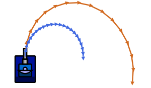

# Movement Fundamentals & GoTo

> [!TIP] Origins
> **GoTo** movement and navigation fundamentals were developed and documented by the RoboWiki community as essential
> building blocks for bot movement.

Movement is the defensive half of Robocode. Even the best gun misses if the enemy keeps changing position, speed, and
turn rate.

This page focuses on the beginner essentials: how forward/back motion and turning work, why walls are dangerous, and a
simple “GoTo” style movement for driving toward a point.

## Why movement matters

A bot that sits still is easy to hit. A bot that moves predictably (for example, always in a straight line) is also easy
to hit once the opponent starts predicting.

Good beginner movement has three goals:

- **Don’t be where bullets go.** Make your position hard to predict.
- **Don’t waste energy on walls.** Wall collisions cost energy and stop the bot.
- **Control distance.** Stay far enough to dodge or get close when an opponent is weak.

A classic “first bot” movement (like many sample bots) is to drive forward and back and turn occasionally. It works as a
starting point, but it gives up control: the bot is reacting, not navigating.

## Forward/back, acceleration, and turning

Robocode movement is updated once per turn (tick). The engine applies limits to how fast a bot can change speed and how
much it can turn.

Key idea: **speed and turning are linked**.

- At high speed, the bot can’t turn as sharply.
- If the bot needs a sharp turn, it often helps to slow down first.

This is the most important “real world” rule to remember:

> [!NOTE] Note
> **Max speed (forward and backward) restricts turning.**
> A fast-moving bot turns in a wide arc; it can’t pivot instantly.

For the exact numbers and formulas, see
[Movement Constraints & Bot Physics](../../physics/movement-constraints.md).

<br>
*Illustration: Higher speed means a wider turn radius.*

Legend:

- Orange path: High speed with wider turn radius.
- Blue path: Low speed with tighter turn radius.

## The idea of GoTo movement

“GoTo” means: pick a destination point `(xTarget, yTarget)` and drive there.

Why this helps:

- It gives **control** over where the bot goes.
- It makes it easier to implement spacing (distance control) and wall avoidance.
- It becomes a building block for more advanced movement later.

But “GoTo” has a beginner trap: if the bot is moving fast and the destination is behind it, naively turning and moving
ahead can cause a huge circle turn. A better GoTo decides whether to drive forward or backward for a shorter, quicker
turn.

## A small GoTo implementation in five languages

The GoTo problem can be split into two simple steps:

1. Compute the **bearing to the target point**.
2. Choose forward/back so the body turns by at most 90° (whenever possible).

The examples repeatedly steer toward `(400, 300)`, a point near the center of a standard battlefield. A real movement
system would choose a new waypoint before arrival. The fixed target keeps the important parts visible: calculate a
bearing, choose forward or backward, queue movement, and commit the turn.

Classic Robocode uses compass-style headings, so its trigonometry swaps the usual `atan2` arguments. Tank Royale uses
math-style headings, so the standard `atan2(dy, dx)` form works directly. A positive Tank Royale bearing turns left,
which is why its examples call `setTurnLeft`.

::: code-group

```java [Classic · Java]
import robocode.AdvancedRobot;
import robocode.util.Utils;

public class GoToBot extends AdvancedRobot {
    private static final double TARGET_X = 400;
    private static final double TARGET_Y = 300;

    @Override
    public void run() {
        while (true) {
            goTo(TARGET_X, TARGET_Y);
            execute();
        }
    }

    private void goTo(double targetX, double targetY) {
        double dx = targetX - getX();
        double dy = targetY - getY();
        double targetHeading = Math.toDegrees(Math.atan2(dx, dy));
        double turn = Utils.normalRelativeAngleDegrees(targetHeading - getHeading());
        double distance = Math.hypot(dx, dy);
        double direction = 1;

        if (Math.abs(turn) > 90) {
            turn = Utils.normalRelativeAngleDegrees(turn + 180);
            direction = -1;
        }

        setTurnRight(turn);
        setAhead(direction * distance);
    }
}
```

```python [Tank Royale · Python]
import math

from robocode_tank_royale.bot_api import Bot


class GoToBot(Bot):
    TARGET_X = 400
    TARGET_Y = 300

    def run(self) -> None:
        while self.running:
            self.go_to(self.TARGET_X, self.TARGET_Y)
            self.go()

    def go_to(self, target_x: float, target_y: float) -> None:
        dx = target_x - self.x
        dy = target_y - self.y
        target_direction = math.degrees(math.atan2(dy, dx))
        turn = normalize_relative_angle(target_direction - self.direction)
        distance = math.hypot(dx, dy)
        direction = 1

        if abs(turn) > 90:
            turn = normalize_relative_angle(turn + 180)
            direction = -1

        self.set_turn_left(turn)
        self.set_forward(direction * distance)


def normalize_relative_angle(angle: float) -> float:
    while angle <= -180:
        angle += 360
    while angle > 180:
        angle -= 360
    return angle


def main() -> None:
    GoToBot().start()


if __name__ == "__main__":
    main()
```

```java [Tank Royale · Java]
import dev.robocode.tankroyale.botapi.Bot;

public class GoToBot extends Bot {
    private static final double TARGET_X = 400;
    private static final double TARGET_Y = 300;

    public static void main(String[] args) {
        new GoToBot().start();
    }

    @Override
    public void run() {
        while (isRunning()) {
            goTo(TARGET_X, TARGET_Y);
            go();
        }
    }

    private void goTo(double targetX, double targetY) {
        double dx = targetX - getX();
        double dy = targetY - getY();
        double targetDirection = Math.toDegrees(Math.atan2(dy, dx));
        double turn = normalizeRelativeAngle(targetDirection - getDirection());
        double distance = Math.hypot(dx, dy);
        double direction = 1;

        if (Math.abs(turn) > 90) {
            turn = normalizeRelativeAngle(turn + 180);
            direction = -1;
        }

        setTurnLeft(turn);
        setForward(direction * distance);
    }

    private static double normalizeRelativeAngle(double angle) {
        while (angle <= -180) {
            angle += 360;
        }
        while (angle > 180) {
            angle -= 360;
        }
        return angle;
    }
}
```

```csharp [Tank Royale · C#]
using System;
using Robocode.TankRoyale.BotApi;

public class GoToBot : Bot
{
    private const double TargetX = 400;
    private const double TargetY = 300;

    static void Main(string[] args)
    {
        new GoToBot().Start();
    }

    public override void Run()
    {
        while (IsRunning)
        {
            GoTo(TargetX, TargetY);
            Go();
        }
    }

    private void GoTo(double targetX, double targetY)
    {
        double dx = targetX - X;
        double dy = targetY - Y;
        double targetDirection = Math.Atan2(dy, dx) * 180 / Math.PI;
        double turn = NormalizeRelativeAngle(targetDirection - Direction);
        double distance = Math.Sqrt(dx * dx + dy * dy);
        double direction = 1;

        if (Math.Abs(turn) > 90)
        {
            turn = NormalizeRelativeAngle(turn + 180);
            direction = -1;
        }

        SetTurnLeft(turn);
        SetForward(direction * distance);
    }

    private static double NormalizeRelativeAngle(double angle)
    {
        while (angle <= -180)
        {
            angle += 360;
        }
        while (angle > 180)
        {
            angle -= 360;
        }
        return angle;
    }
}
```

```typescript [Tank Royale · TypeScript]
import { Bot } from "@robocode.dev/tank-royale-bot-api";

class GoToBot extends Bot {
    private static readonly targetX = 400;
    private static readonly targetY = 300;

    static main() {
        new GoToBot().start();
    }

    override run() {
        while (this.isRunning()) {
            this.goTo(GoToBot.targetX, GoToBot.targetY);
            this.go();
        }
    }

    private goTo(targetX: number, targetY: number) {
        const dx = targetX - this.x;
        const dy = targetY - this.y;
        const targetDirection = Math.atan2(dy, dx) * 180 / Math.PI;
        let turn = GoToBot.normalizeRelativeAngle(targetDirection - this.direction);
        const distance = Math.hypot(dx, dy);
        let direction = 1;

        if (Math.abs(turn) > 90) {
            turn = GoToBot.normalizeRelativeAngle(turn + 180);
            direction = -1;
        }

        this.setTurnLeft(turn);
        this.setForward(direction * distance);
    }

    private static normalizeRelativeAngle(angle: number) {
        while (angle <= -180) {
            angle += 360;
        }
        while (angle > 180) {
            angle -= 360;
        }
        return angle;
    }
}

GoToBot.main();
```

:::

Definitions:

- `(myX, myY)`: current bot position.
- `myHeading`: current body heading.
- `normalizeRelativeAngle(a)`: maps angles into a shortest-turn range (e.g. −180°..+180°).

This version does **not** try to stop exactly on the point. In many bots, that’s fine: a new target point is chosen
before the bot arrives.

## Stopping vs. picking the next point

A GoTo can be used in two common ways:

- **Stop on the destination:** drive to a point, brake, then choose a new point.
- **Flow through waypoints:** pick the next point early so the bot stays in motion.

For beginners, “flow through waypoints” is often simpler and safer:

- Constant motion makes the bot harder to hit.
- It avoids learning braking math immediately.

If stopping is desired, it helps to remember deceleration is limited. A bot going full speed cannot stop instantly.

## Wall avoidance (beginner version)

Walls cost energy, ruin movement, and might make your bot vulnerable to becoming an easy target. A simple approach is to
prevent destinations near the borders.

A practical beginner rule:

- Clamp target points to stay at least 100–150 units away from each wall.

This doesn’t replace real wall smoothing, but it prevents many accidental wall hits.

For wall damage and why it matters, see [Wall Collisions](../../physics/wall-collisions.md).

## Platform notes (Classic vs. Tank Royale)

The movement ideas are the same on both platforms, but a few details differ:

- **Angle conventions differ** (classic uses compass-style angles; Tank Royale uses math-style angles). Always use the
  platform’s helper methods or conventions consistently.
- **Constants are exposed in Tank Royale** (like max speed and turn rate). Prefer the named constants over hard-coded
  numbers.
- **APIs differ:**
    - Classic Robocode: `setAhead`, `setBack`, `setTurnRight`, `getX`, `getY`, `getHeading`.
    - Tank Royale: similar concepts, but names and event model differ by programming language binding.

## Tips & common mistakes

- **Turning too much at full speed:** if GoTo feels like a big circle, the bot is probably trying to turn 150–180° while
  moving fast.
- **Not using backward movement:** driving backward is a simple way to reduce turn time.
- **Picking destinations on the border:** leads to wall hits or getting stuck.
- **Stopping too often:** stopping makes movement predictable; staying in motion is usually safer.

## Linking forward

- Wall Avoidance & Wall Smoothing (next page)
- Distancing (how to choose “too close” vs “too far”)
- Random Movement and Stop-and-Go (simple evasive patterns)

## Further Reading

- [GoTo](https://robowiki.net/wiki/GoTo) - RoboWiki (classic Robocode)
- [Movement](https://robowiki.net/wiki/Movement) - RoboWiki (classic Robocode)
- [Robocode Tank Royale - Physics](https://robocode.dev/articles/physics.html) - Tank Royale documentation
