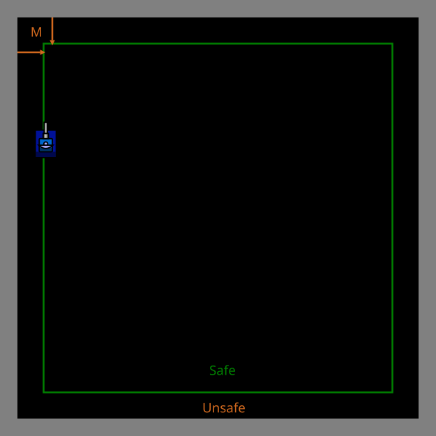
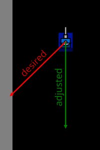
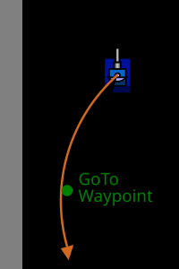

# Wall Avoidance & Wall Smoothing

> [!TIP] Origins
> **Wall Smoothing** techniques were developed and refined by the RoboWiki community, with notable implementations
> contributed by **Kyle Huntington (Kawigi)** and other early bot developers.

Walls are more dangerous than they look. A wall hit costs energy, can stop the bot or force a slow turn, and often
leaves the bot in a predictable position.

This page shows two complementary ideas:

- **Wall avoidance:** don’t choose destinations that require driving into the border.
- **Wall smoothing:** if the desired direction exits the battlefield, “smooth” it into a direction that stays inside and
  naturally follows the wall.

## Why walls are a problem

A wall collision is rarely “just a little bump”. The bot loses speed and momentum, and it usually needs extra turns to
get moving again. That’s extra time being an easy target.

Walls also reduce your options. Near the center, a bot can dodge left or right with similar freedom. Near a border,
half the escape space is gone.

<br>
*Battlefield with safe rectangle and bot near wall*

Legend:

- `M`: Margin from the wall, typically around 80–150 units

> [!TIP] Goal
> Wall handling should be part of normal movement logic, not a special case that runs only after a collision.

## Wall avoidance: don’t plan moves that crash

Wall avoidance is the “planning” layer: when picking a destination point (for GoTo / waypoint movement), keep it inside
a *safe rectangle*.

A simple rule is to keep a margin `M` from each wall:

- `M` should be at least the bot half-size (≈ 20 units), but in practice it is larger.
- Common values are around `80–150` units, depending on how aggressively the bot moves.

There are many ways to enforce this:

- **Clamp** points into the safe rectangle.
- **Re-roll** random points until they’re inside.
- **Project** a desired point back onto the safe rectangle.

This is the same beginner idea briefly mentioned in
[Movement Fundamentals & GoTo](./movement-fundamentals-goto.md), just used consistently as part of every destination
choice.

## Wall smoothing: keep moving by sliding along the wall

Wall smoothing is the “steering” layer. It assumes the bot already has some desired movement direction (often from a
GoTo), but it refuses to point the bot into a direction that would lead outside the battlefield.

Move along the walls. Do not move into the walls!

The key idea:

- Treat the battlefield (minus a margin) as the allowed area.
- If the desired heading would step outside that area, rotate the heading a little until it becomes legal.

If the bot repeats this at every turn, the result is a smooth, tangential path that naturally follows the wall instead
of slamming into it.

<br>
*Illustration: Bot with a desired heading (red) that is set to an adjusted heading (green) that is tangent to the wall*

### A “safe rectangle” test (one-step lookahead)

A practical smoothing test uses a short “lookahead” distance `L` (for example, one tick of movement) and checks whether
the next step would still be inside the safe rectangle.

Definitions:

- Battlefield bounds: `0..W` in x, `0..H` in y.
- Safe rectangle uses margin `M`: `M..(W-M)` and `M..(H-M)`.
- `L`: lookahead distance in units.

If `(x + stepX, y + stepY)` is outside, the direction is unsafe.

## Smoothing a desired heading in five languages

The helpers below use radians and a mathematical coordinate frame where `0` radians points along positive X. Convert the
platform heading once before calling `smoothHeading`, then convert the returned heading back if necessary.

::: code-group

```java [Classic · Java]
public final class WallSmoothing {
    private static final double LOOKAHEAD = 30;
    private static final double STEP = Math.toRadians(5);
    private static final int MAX_ITERATIONS = 72;

    public static double smoothHeading(
            double desiredHeading, double x, double y,
            double battlefieldWidth, double battlefieldHeight, double margin) {
        double heading = desiredHeading;
        for (int attempt = 0; attempt < MAX_ITERATIONS; attempt++) {
            double projectedX = x + LOOKAHEAD * Math.cos(heading);
            double projectedY = y + LOOKAHEAD * Math.sin(heading);
            if (isInsideSafeRect(projectedX, projectedY,
                    battlefieldWidth, battlefieldHeight, margin)) {
                return heading;
            }
            heading += STEP;
        }
        return heading;
    }

    private static boolean isInsideSafeRect(
            double x, double y, double battlefieldWidth,
            double battlefieldHeight, double margin) {
        return x >= margin && x <= battlefieldWidth - margin
                && y >= margin && y <= battlefieldHeight - margin;
    }
}
```

```python [Tank Royale · Python]
from math import cos, radians, sin


LOOKAHEAD = 30.0
STEP = radians(5)
MAX_ITERATIONS = 72


def smooth_heading(
    desired_heading: float,
    x: float,
    y: float,
    battlefield_width: float,
    battlefield_height: float,
    margin: float,
) -> float:
    heading = desired_heading
    for _ in range(MAX_ITERATIONS):
        projected_x = x + LOOKAHEAD * cos(heading)
        projected_y = y + LOOKAHEAD * sin(heading)
        if is_inside_safe_rect(
            projected_x, projected_y, battlefield_width, battlefield_height, margin
        ):
            return heading
        heading += STEP
    return heading


def is_inside_safe_rect(
    x: float, y: float, battlefield_width: float, battlefield_height: float, margin: float
) -> bool:
    return margin <= x <= battlefield_width - margin and margin <= y <= battlefield_height - margin
```

```java [Tank Royale · Java]
public final class WallSmoothing {
    private static final double LOOKAHEAD = 30;
    private static final double STEP = Math.toRadians(5);
    private static final int MAX_ITERATIONS = 72;

    public static double smoothHeading(
            double desiredHeading, double x, double y,
            double battlefieldWidth, double battlefieldHeight, double margin) {
        double heading = desiredHeading;
        for (int attempt = 0; attempt < MAX_ITERATIONS; attempt++) {
            double projectedX = x + LOOKAHEAD * Math.cos(heading);
            double projectedY = y + LOOKAHEAD * Math.sin(heading);
            if (isInsideSafeRect(projectedX, projectedY,
                    battlefieldWidth, battlefieldHeight, margin)) {
                return heading;
            }
            heading += STEP;
        }
        return heading;
    }

    private static boolean isInsideSafeRect(
            double x, double y, double battlefieldWidth,
            double battlefieldHeight, double margin) {
        return x >= margin && x <= battlefieldWidth - margin
                && y >= margin && y <= battlefieldHeight - margin;
    }
}
```

```csharp [Tank Royale · C#]
using System;

public static class WallSmoothing
{
    private const double Lookahead = 30;
    private const double Step = Math.PI / 36;
    private const int MaxIterations = 72;

    public static double SmoothHeading(
        double desiredHeading, double x, double y,
        double battlefieldWidth, double battlefieldHeight, double margin)
    {
        double heading = desiredHeading;
        for (int attempt = 0; attempt < MaxIterations; attempt++)
        {
            double projectedX = x + Lookahead * Math.Cos(heading);
            double projectedY = y + Lookahead * Math.Sin(heading);
            if (IsInsideSafeRect(projectedX, projectedY,
                    battlefieldWidth, battlefieldHeight, margin))
            {
                return heading;
            }
            heading += Step;
        }
        return heading;
    }

    private static bool IsInsideSafeRect(
        double x, double y, double battlefieldWidth,
        double battlefieldHeight, double margin)
    {
        return x >= margin && x <= battlefieldWidth - margin
            && y >= margin && y <= battlefieldHeight - margin;
    }
}
```

```typescript [Tank Royale · TypeScript]
const LOOKAHEAD = 30;
const STEP = (5 * Math.PI) / 180;
const MAX_ITERATIONS = 72;

export function smoothHeading(
    desiredHeading: number,
    x: number,
    y: number,
    battlefieldWidth: number,
    battlefieldHeight: number,
    margin: number,
): number {
    let heading = desiredHeading;
    for (let attempt = 0; attempt < MAX_ITERATIONS; attempt += 1) {
        const projectedX = x + LOOKAHEAD * Math.cos(heading);
        const projectedY = y + LOOKAHEAD * Math.sin(heading);
        if (isInsideSafeRect(projectedX, projectedY, battlefieldWidth, battlefieldHeight, margin)) {
            return heading;
        }
        heading += STEP;
    }
    return heading;
}

function isInsideSafeRect(
    x: number,
    y: number,
    battlefieldWidth: number,
    battlefieldHeight: number,
    margin: number,
): boolean {
    return x >= margin && x <= battlefieldWidth - margin
        && y >= margin && y <= battlefieldHeight - margin;
}
```

:::

Notes:

- The loop “nudges” the heading until the projected point is legal.
- Smaller `S` gives smoother motion but can require more iterations.
- The value of `L` controls how “early” the bot starts curving away from the wall.

> [!WARNING] Common corner bug
> Near a corner, the desired direction may be unsafe for many degrees. Use a small `S` and a reasonable max-iteration
> guard to avoid infinite loops if inputs are bad.

## Using smoothing with GoTo (the usual combo)

A typical flow-through movement loop looks like this:

1. Pick or update a destination point inside the safe rectangle (wall avoidance).
2. Compute the desired heading toward that point (GoTo).
3. Smooth the desired heading if it would exit the battlefield.
4. Apply turning and movement.

This keeps the bot in motion even when a target point or enemy pressure pushes it toward the border.

<br>
*Illustration: Bot following an arc that stays away from the wall using a GoTo waypoint (green) and hence moves in a
curve away from the wall*

## Platform notes (Classic vs. Tank Royale)

The concept is the same on both platforms: keep the bot’s path inside an inset rectangle and slide along edges.

The main differences are implementation details:

- **Angle conventions differ.** Classic Robocode and Robocode Tank Royale use different “zero” directions and rotation
  directions. Use the platform’s helpers (or a consistent math wrapper) and don’t mix conventions.
- **APIs differ.** Classic has `setTurnRight` / `setAhead`. Tank Royale bindings expose similar control, but naming is
  language-specific.

## Tips & common mistakes

- **Only avoiding walls during destination picking:** a bot can still drift into a wall due to turn radius and inertia.
  Smoothing handles this.
- **Margin too small:** the bot’s 36×26 unit body needs room to turn; a tiny margin makes corner behavior worse.
- **Always smoothing in the same direction:** this can create a predictable wall-following pattern. Some bots choose the
  smoothing turn direction based on current orbit direction or enemy bearing.

## Related pages

- [Movement Fundamentals & GoTo](./movement-fundamentals-goto.md)
- [Movement Constraints & Bot Physics](../../physics/movement-constraints.md)
- [Wall Collisions](../../physics/wall-collisions.md)

## Further Reading

- [Wall Avoidance](https://robowiki.net/wiki/Wall_Avoidance) - RoboWiki (classic Robocode)
- [Wall Smoothing](https://robowiki.net/wiki/Wall_Smoothing) - RoboWiki (classic Robocode)
- [Wall Smoothing/Implementations](https://robowiki.net/wiki/Wall_Smoothing/Implementations) - RoboWiki (classic
  Robocode)

