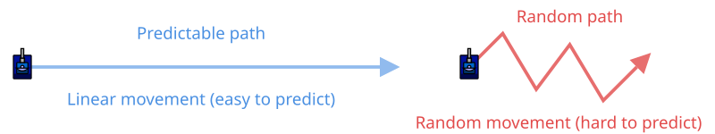

# Random Movement

> [!TIP] Origins
> **Random Movement** strategies were developed and documented by the RoboWiki community as foundational evasion
> techniques.

Random movement is an evasion strategy that uses unpredictable changes in speed and direction to make the bot harder to
target. By introducing randomness into movement decisions, the bot avoids falling into predictable patterns that simple
or statistical targeting systems can exploit.

While random movement may seem primitive compared to more sophisticated techniques like wave surfing, it remains highly
effective against many targeting strategies and serves as the foundation for more advanced movement systems.

## Why Randomness Works

Targeting systems aim to predict where a bot will be when a bullet arrives. Most targeting methods rely on
patterns, constant velocity, consistent turn rates, or predictable oscillations. Random movement breaks these patterns
by
ensuring that future positions cannot be reliably predicted from past behavior.

Against **[head-on targeting](/appendices/glossary#head-on-targeting)**, random movement provides minimal benefit
since head-on aims at the current position.
Against **[linear targeting](/appendices/glossary#linear-targeting)**, random changes in velocity and heading make
predictions fail. Against **statistical targeting** (including
[GuessFactor](/appendices/glossary#guessfactor)), randomness prevents the targeting system from finding reliable
patterns to exploit.

The effectiveness of a random movement depends on how unpredictable it truly is. Poor randomization or accidental
patterns can still be exploited by adaptive targeting systems.

## Basic Implementation Strategies

### Basic random movement in five languages

The following bots occasionally choose a new movement distance and turn angle. The commands between random choices keep
running, while the next choice breaks any easy-to-learn pattern. The 10% choices are deliberately conservative: random
movement should remain mobile without becoming completely chaotic.

::: code-group

```java [Classic · Java]
import java.util.Random;
import robocode.AdvancedRobot;

public class RandomMovementBot extends AdvancedRobot {
    private final Random random = new Random();

    @Override
    public void run() {
        setAdjustGunForRobotTurn(true);
        setAdjustRadarForGunTurn(true);

        while (true) {
            if (random.nextDouble() < 0.10) {
                setAhead((random.nextDouble() * 16 - 8) * 100);
            }
            if (random.nextDouble() < 0.10) {
                setTurnRight(random.nextDouble() * 180 - 90);
            }
            setTurnRadarRight(360);
            execute();
        }
    }
}
```

```python [Tank Royale · Python]
from random import random

from robocode_tank_royale.bot_api import Bot


class RandomMovementBot(Bot):
    def run(self) -> None:
        while self.running:
            if random() < 0.10:
                self.set_forward((random() * 16 - 8) * 100)
            if random() < 0.10:
                self.set_turn_right(random() * 180 - 90)
            self.set_turn_radar_right(360)
            self.go()


def main() -> None:
    RandomMovementBot().start()


if __name__ == "__main__":
    main()
```

```java [Tank Royale · Java]
import java.util.Random;
import dev.robocode.tankroyale.botapi.Bot;

public class RandomMovementBot extends Bot {
    private final Random random = new Random();

    public static void main(String[] args) {
        new RandomMovementBot().start();
    }

    @Override
    public void run() {
        while (isRunning()) {
            if (random.nextDouble() < 0.10) {
                setForward((random.nextDouble() * 16 - 8) * 100);
            }
            if (random.nextDouble() < 0.10) {
                setTurnRight(random.nextDouble() * 180 - 90);
            }
            setTurnRadarRight(360);
            go();
        }
    }
}
```

```csharp [Tank Royale · C#]
using System;
using Robocode.TankRoyale.BotApi;

public class RandomMovementBot : Bot
{
    private readonly Random random = new();

    static void Main(string[] args)
    {
        new RandomMovementBot().Start();
    }

    public override void Run()
    {
        while (IsRunning)
        {
            if (random.NextDouble() < 0.10)
            {
                SetForward((random.NextDouble() * 16 - 8) * 100);
            }
            if (random.NextDouble() < 0.10)
            {
                SetTurnRight(random.NextDouble() * 180 - 90);
            }
            SetTurnRadarRight(360);
            Go();
        }
    }
}
```

```typescript [Tank Royale · TypeScript]
import { Bot } from "@robocode.dev/tank-royale-bot-api";

class RandomMovementBot extends Bot {
    static main() {
        new RandomMovementBot().start();
    }

    override run() {
        while (this.isRunning()) {
            if (Math.random() < 0.10) {
                this.setForward((Math.random() * 16 - 8) * 100);
            }
            if (Math.random() < 0.10) {
                this.setTurnRight(Math.random() * 180 - 90);
            }
            this.setTurnRadarRight(360);
            this.go();
        }
    }
}

RandomMovementBot.main();
```

:::

The speed and direction changes are intentionally independent. Changing both at once creates more unpredictability than
either alone, but wall avoidance is still required for a useful bot.

### Random Wall Avoidance

Random movement must still avoid walls. A simple approach combines random decisions with boundary checking:

Before applying a random command, compare the nearest-wall distance with a threshold such as 100 units. If the bot is
too close, apply a turn that points away from the wall and postpone the random choice for that turn.

More sophisticated implementations use wall smoothing to maintain randomness while preventing collisions.

<br>
*A bot using random movement creates an unpredictable zigzag pattern compared to linear movement*

## Variations and Enhancements

### Probability-Based Randomness

Instead of completely random decisions, use weighted probabilities:

For example, a roll below `0.5` can maintain speed, a roll below `0.8` can make a small speed change, and the remaining
20% can reverse direction. This produces variation without making every turn an abrupt change.

This creates smoother movement while maintaining unpredictability.

### Contextual Randomness

Better random movement adapts to the situation:

When an enemy has probably fired, increase the size of the random turn range. When energy is low, cap the movement
speed or bias the chosen command toward safer positions.

Increasing randomness when the enemy fires helps dodge bullets. Reducing randomness when energy is low conserves
resources while maintaining some unpredictability.

### Random Orbiting

Combining random movement with orbiting (moving perpendicular to the enemy) creates effective evasion:

An orbiting command can turn toward `enemyBearing + 90°`, add a random variation of up to 30°, and move at a moderate
speed. The following policy combines these variations in one reusable decision function.

This maintains strategic positioning while being unpredictable.

### One policy for the variations

The helper accepts the nearest-wall distance and a precomputed turn away from that wall. The surrounding bot supplies
those values from its scan and battlefield geometry.

::: code-group

```java [Classic · Java]
import java.util.Random;

public final class RandomMovementPolicy {
    private static final double WALL_THRESHOLD = 100;
    private final Random random = new Random();
    private int direction = 1;
    private double speed = 8;

    public Command choose(
            double distanceToWall, double turnAwayFromWall,
            boolean enemyFiring, boolean lowEnergy,
            double enemyBearing, double heading) {
        if (distanceToWall < WALL_THRESHOLD) {
            return new Command(turnAwayFromWall, 100 * direction);
        }

        double roll = random.nextDouble();
        if (roll >= 0.5 && roll < 0.8) {
            speed = clamp(speed + random.nextDouble() * 4 - 2, 2, 8);
        } else if (roll >= 0.8) {
            direction = -direction;
        }

        double variation = enemyFiring ? 30 : 15;
        double orbitAngle = enemyBearing + 90 + random.nextDouble() * 2 * variation - variation;
        double turn = normalizeRelativeAngle(orbitAngle - heading);
        if (lowEnergy) {
            speed = Math.min(speed, 6);
        }
        return new Command(turn, direction * speed);
    }

    private static double normalizeRelativeAngle(double angle) {
        while (angle <= -180) angle += 360;
        while (angle > 180) angle -= 360;
        return angle;
    }

    private static double clamp(double value, double minimum, double maximum) {
        return Math.max(minimum, Math.min(maximum, value));
    }

    public static final class Command {
        public final double turn;
        public final double distance;

        public Command(double turn, double distance) {
            this.turn = turn;
            this.distance = distance;
        }
    }
}
```

```python [Tank Royale · Python]
import random
from dataclasses import dataclass


@dataclass
class Command:
    turn: float
    distance: float


class RandomMovementPolicy:
    WALL_THRESHOLD = 100.0

    def __init__(self) -> None:
        self.direction = 1
        self.speed = 8.0

    def choose(
        self,
        distance_to_wall: float,
        turn_away_from_wall: float,
        enemy_firing: bool,
        low_energy: bool,
        enemy_bearing: float,
        heading: float,
    ) -> Command:
        if distance_to_wall < self.WALL_THRESHOLD:
            return Command(turn_away_from_wall, 100 * self.direction)

        roll = random.random()
        if 0.5 <= roll < 0.8:
            self.speed = max(2, min(8, self.speed + random.uniform(-2, 2)))
        elif roll >= 0.8:
            self.direction *= -1

        variation = 30 if enemy_firing else 15
        orbit_angle = enemy_bearing + 90 + random.uniform(-variation, variation)
        turn = normalize_relative_angle(orbit_angle - heading)
        if low_energy:
            self.speed = min(self.speed, 6)
        return Command(turn, self.direction * self.speed)


def normalize_relative_angle(angle: float) -> float:
    while angle <= -180:
        angle += 360
    while angle > 180:
        angle -= 360
    return angle
```

```java [Tank Royale · Java]
import java.util.Random;

public final class RandomMovementPolicy {
    private static final double WALL_THRESHOLD = 100;
    private final Random random = new Random();
    private int direction = 1;
    private double speed = 8;

    public Command choose(
            double distanceToWall, double turnAwayFromWall,
            boolean enemyFiring, boolean lowEnergy,
            double enemyBearing, double heading) {
        if (distanceToWall < WALL_THRESHOLD) {
            return new Command(turnAwayFromWall, 100 * direction);
        }

        double roll = random.nextDouble();
        if (roll >= 0.5 && roll < 0.8) {
            speed = clamp(speed + random.nextDouble() * 4 - 2, 2, 8);
        } else if (roll >= 0.8) {
            direction = -direction;
        }

        double variation = enemyFiring ? 30 : 15;
        double orbitAngle = enemyBearing + 90 + random.nextDouble() * 2 * variation - variation;
        double turn = normalizeRelativeAngle(orbitAngle - heading);
        if (lowEnergy) {
            speed = Math.min(speed, 6);
        }
        return new Command(turn, direction * speed);
    }

    private static double normalizeRelativeAngle(double angle) {
        while (angle <= -180) angle += 360;
        while (angle > 180) angle -= 360;
        return angle;
    }

    private static double clamp(double value, double minimum, double maximum) {
        return Math.max(minimum, Math.min(maximum, value));
    }

    public static final class Command {
        public final double turn;
        public final double distance;

        public Command(double turn, double distance) {
            this.turn = turn;
            this.distance = distance;
        }
    }
}
```

```csharp [Tank Royale · C#]
using System;

public sealed class RandomMovementPolicy
{
    private const double WallThreshold = 100;
    private readonly Random random = new();
    private int direction = 1;
    private double speed = 8;

    public Command Choose(
        double distanceToWall, double turnAwayFromWall,
        bool enemyFiring, bool lowEnergy,
        double enemyBearing, double heading)
    {
        if (distanceToWall < WallThreshold)
        {
            return new Command(turnAwayFromWall, 100 * direction);
        }

        double roll = random.NextDouble();
        if (roll >= 0.5 && roll < 0.8)
        {
            speed = Math.Clamp(speed + random.NextDouble() * 4 - 2, 2, 8);
        }
        else if (roll >= 0.8)
        {
            direction = -direction;
        }

        double variation = enemyFiring ? 30 : 15;
        double orbitAngle = enemyBearing + 90 + random.NextDouble() * 2 * variation - variation;
        double turn = NormalizeRelativeAngle(orbitAngle - heading);
        if (lowEnergy)
        {
            speed = Math.Min(speed, 6);
        }
        return new Command(turn, direction * speed);
    }

    private static double NormalizeRelativeAngle(double angle)
    {
        while (angle <= -180) angle += 360;
        while (angle > 180) angle -= 360;
        return angle;
    }

    public sealed class Command
    {
        public Command(double turn, double distance)
        {
            Turn = turn;
            Distance = distance;
        }

        public double Turn { get; }
        public double Distance { get; }
    }
}
```

```typescript [Tank Royale · TypeScript]
type MovementCommand = {
    turn: number;
    distance: number;
};

class RandomMovementPolicy {
    private static readonly wallThreshold = 100;
    private direction = 1;
    private speed = 8;

    choose(
        distanceToWall: number,
        turnAwayFromWall: number,
        enemyFiring: boolean,
        lowEnergy: boolean,
        enemyBearing: number,
        heading: number,
    ): MovementCommand {
        if (distanceToWall < RandomMovementPolicy.wallThreshold) {
            return { turn: turnAwayFromWall, distance: 100 * this.direction };
        }

        const roll = Math.random();
        if (roll >= 0.5 && roll < 0.8) {
            this.speed = clamp(this.speed + Math.random() * 4 - 2, 2, 8);
        } else if (roll >= 0.8) {
            this.direction *= -1;
        }

        const variation = enemyFiring ? 30 : 15;
        const orbitAngle = enemyBearing + 90 + Math.random() * 2 * variation - variation;
        const turn = normalizeRelativeAngle(orbitAngle - heading);
        if (lowEnergy) {
            this.speed = Math.min(this.speed, 6);
        }
        return { turn, distance: this.direction * this.speed };
    }
}

function normalizeRelativeAngle(angle: number) {
    while (angle <= -180) angle += 360;
    while (angle > 180) angle -= 360;
    return angle;
}

function clamp(value: number, minimum: number, maximum: number) {
    return Math.max(minimum, Math.min(maximum, value));
}
```

:::

## Common Pitfalls

### Insufficient Randomness

Using predictable random number patterns or limited variation reduces effectiveness. Ensure your random number generator
produces quality randomness and uses sufficient variation ranges.

### Ignoring Walls

Random movement that doesn't account for walls leads to frequent collisions, losing energy and becoming temporarily
predictable. Always combine random movement with wall avoidance.

### Forgetting Radar and Gun

Focusing only on movement can leave radar and gun with poor tracking. Ensure movement decisions don't prevent effective
scanning and targeting.

### Too Much Randomness

Completely chaotic movement can work against you, placing you in poor positions, causing unnecessary energy loss, or
moving toward danger. Some structure improves overall performance.

## Platform Differences

Both classic Robocode and Tank Royale support random movement with similar APIs:

**Classic Robocode:**

```java
setTurnRight(Math.random() *180-90);

setAhead(Math.random() *200-100);
```

**Tank Royale (Java):**

```java
setTurnRight(Math.random() *180-90);

setForward(Math.random() *200-100);
```

The physics and movement rules are identical, so random movement strategies transfer directly between platforms.

## When to Use Random Movement

Random movement is effective against:

- **Simple targeting** (head-on, linear, circular)
- **Weak statistical targeting** without enough data
- **New opponents** where you have no information about their targeting
- **[Melee](/appendices/glossary#melee) battles** where predictability is dangerous

It's less effective against:

- **Advanced statistical targeting** with anti-random techniques
- **Pattern matchers** designed to handle randomness
- **[Precise prediction](/appendices/glossary#precise-prediction)** that reads ahead many ticks

Random movement works best as part of a larger strategy, use it as a baseline, combine it with other techniques, or
switch to it when other movements fail.

## Tips for Success

**Start simple:** Begin with basic random velocity/direction changes. Add complexity only when needed.

**Test against variety:** Random movement performs differently against different opponents. Test against both simple and
advanced bots.

**Combine with other strategies:** Use random movement as a fallback or mix it with distancing, wall smoothing, and
targeting evasion.

**Measure randomness:** Track how predictable your movement actually is. If you notice patterns forming, increase
variation.

**Watch energy:** Random movement can waste energy through unnecessary turns and reversals. Balance unpredictability
with efficiency.

Random movement proves that sometimes the best defense is simply being impossible to predict, no complex calculations
required.

## Further Reading

- [Random Movement](https://robowiki.net/wiki/Random_Movement) - RoboWiki (classic Robocode)


