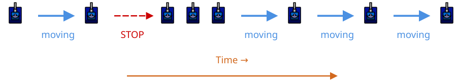

# Stop and Go

> [!TIP] Origins
> **Stop and Go** movement was developed and documented by the RoboWiki community as an effective counter to linear and
> simple statistical targeting systems.

Stop and Go is a simple yet effective evasion strategy that alternates between moving at full speed and coming to a
complete stop. By dramatically varying velocity, the bot makes linear targeting predictions fail and confuses
statistical targeting systems that expect consistent movement patterns.

This technique is particularly effective against intermediate-level opponents that use linear or simple statistical
targeting, while remaining simple enough for beginners to implement and understand.

## Why Stop and Go Works

Most targeting systems predict future bot positions based on current velocity and heading. Linear targeting assumes the
target will maintain its current velocity. Statistical targeting builds patterns from historical movement data. Stop and
Go exploit both approaches by making velocity unpredictable.

When a bot alternates between full speed and stopped, the bullet travel time varies significantly. A bullet fired when
the bot is moving at full speed will miss if the bot suddenly stops. Conversely, a bullet aimed at a stopped bot will
miss when the bot speeds up.

**Against linear targeting:** Predictions assume constant velocity, so sudden stops create large position errors by the
time the bullet arrives.

**Against statistical targeting:** The dramatic velocity changes prevent the targeting system from finding reliable
patterns in the movement data.

**Against simple targeting:** Head-on targeting remains unaffected, but most intermediate bots have moved beyond this
basic approach.

## Core Concept

The basic algorithm keeps two states, `moving` and `stopped`. A timer controls each state, and a new random duration is
chosen whenever the state changes. The complete implementation appears below.

The key variables are:

- **Stop threshold:** How many turns to move before stopping
- **Stop duration:** How many turns to remain stopped
- **Direction:** Whether moving forward or backward (can vary)

<br>
*Stop and Go creates velocity spikes that confuse targeting predictions*

## Tutorial: Building Your First Stop and Go Bot

Let's build a complete Stop and Go bot step by step. This tutorial works for both classic Robocode and Tank Royale with
minor API adjustments.

### Complete implementation in five languages

The example starts with 15–30 turns of movement, then pauses for 5–15 turns. It occasionally reverses direction when
movement resumes. The event handlers make a hit or wall collision restart the moving state immediately.

::: code-group

```java [Classic · Java]
import java.util.Random;
import robocode.AdvancedRobot;
import robocode.HitByBulletEvent;
import robocode.HitWallEvent;

public class StopAndGoBot extends AdvancedRobot {
    private final Random random = new Random();
    private boolean moving = true;
    private int moveTimer;
    private int moveDuration;
    private int stopDuration;
    private int direction = 1;

    @Override
    public void run() {
        setAdjustGunForRobotTurn(true);
        setAdjustRadarForGunTurn(true);
        moveDuration = nextMoveDuration();

        while (true) {
            performMovement();
            execute();
        }
    }

    private void performMovement() {
        if (moving) {
            setAhead(100 * direction);
            moveTimer++;
            if (moveTimer >= moveDuration) {
                moving = false;
                moveTimer = 0;
                stopDuration = 5 + random.nextInt(11);
            }
        } else {
            setAhead(0);
            moveTimer++;
            if (moveTimer >= stopDuration) {
                if (random.nextDouble() < 0.3) {
                    direction = -direction;
                }
                startMoving();
            }
        }
    }

    private void startMoving() {
        moving = true;
        moveTimer = 0;
        moveDuration = nextMoveDuration();
    }

    private int nextMoveDuration() {
        return 15 + random.nextInt(16);
    }

    @Override
    public void onHitByBullet(HitByBulletEvent event) {
        direction = -direction;
        startMoving();
    }

    @Override
    public void onHitWall(HitWallEvent event) {
        direction = -direction;
        startMoving();
    }
}
```

```python [Tank Royale · Python]
from random import random, randrange

from robocode_tank_royale.bot_api import Bot
from robocode_tank_royale.bot_api.events import HitByBulletEvent, HitWallEvent


class StopAndGoBot(Bot):
    def run(self) -> None:
        self.moving = True
        self.move_timer = 0
        self.move_duration = self.next_move_duration()
        self.stop_duration = 0
        self.direction = 1

        while self.running:
            self.perform_movement()
            self.go()

    def perform_movement(self) -> None:
        if self.moving:
            self.set_forward(100 * self.direction)
            self.move_timer += 1
            if self.move_timer >= self.move_duration:
                self.moving = False
                self.move_timer = 0
                self.stop_duration = 5 + randrange(11)
        else:
            self.set_forward(0)
            self.move_timer += 1
            if self.move_timer >= self.stop_duration:
                if random() < 0.3:
                    self.direction = -self.direction
                self.start_moving()

    def start_moving(self) -> None:
        self.moving = True
        self.move_timer = 0
        self.move_duration = self.next_move_duration()

    @staticmethod
    def next_move_duration() -> int:
        return 15 + randrange(16)

    def on_hit_by_bullet(self, event: HitByBulletEvent) -> None:
        self.direction = -self.direction
        self.start_moving()

    def on_hit_wall(self, event: HitWallEvent) -> None:
        self.direction = -self.direction
        self.start_moving()


def main() -> None:
    StopAndGoBot().start()


if __name__ == "__main__":
    main()
```

```java [Tank Royale · Java]
import java.util.Random;
import dev.robocode.tankroyale.botapi.Bot;
import dev.robocode.tankroyale.botapi.events.HitByBulletEvent;
import dev.robocode.tankroyale.botapi.events.HitWallEvent;

public class StopAndGoBot extends Bot {
    private final Random random = new Random();
    private boolean moving = true;
    private int moveTimer;
    private int moveDuration;
    private int stopDuration;
    private int direction = 1;

    public static void main(String[] args) {
        new StopAndGoBot().start();
    }

    @Override
    public void run() {
        moveDuration = nextMoveDuration();

        while (isRunning()) {
            performMovement();
            go();
        }
    }

    private void performMovement() {
        if (moving) {
            setForward(100 * direction);
            moveTimer++;
            if (moveTimer >= moveDuration) {
                moving = false;
                moveTimer = 0;
                stopDuration = 5 + random.nextInt(11);
            }
        } else {
            setForward(0);
            moveTimer++;
            if (moveTimer >= stopDuration) {
                if (random.nextDouble() < 0.3) {
                    direction = -direction;
                }
                startMoving();
            }
        }
    }

    private void startMoving() {
        moving = true;
        moveTimer = 0;
        moveDuration = nextMoveDuration();
    }

    private int nextMoveDuration() {
        return 15 + random.nextInt(16);
    }

    @Override
    public void onHitByBullet(HitByBulletEvent event) {
        direction = -direction;
        startMoving();
    }

    @Override
    public void onHitWall(HitWallEvent event) {
        direction = -direction;
        startMoving();
    }
}
```

```csharp [Tank Royale · C#]
using System;
using Robocode.TankRoyale.BotApi;
using Robocode.TankRoyale.BotApi.Events;

public class StopAndGoBot : Bot
{
    private readonly Random random = new();
    private bool moving = true;
    private int moveTimer;
    private int moveDuration;
    private int stopDuration;
    private int direction = 1;

    static void Main(string[] args)
    {
        new StopAndGoBot().Start();
    }

    public override void Run()
    {
        moveDuration = NextMoveDuration();

        while (IsRunning)
        {
            PerformMovement();
            Go();
        }
    }

    private void PerformMovement()
    {
        if (moving)
        {
            SetForward(100 * direction);
            moveTimer++;
            if (moveTimer >= moveDuration)
            {
                moving = false;
                moveTimer = 0;
                stopDuration = 5 + random.Next(11);
            }
        }
        else
        {
            SetForward(0);
            moveTimer++;
            if (moveTimer >= stopDuration)
            {
                if (random.NextDouble() < 0.3)
                {
                    direction = -direction;
                }
                StartMoving();
            }
        }
    }

    private void StartMoving()
    {
        moving = true;
        moveTimer = 0;
        moveDuration = NextMoveDuration();
    }

    private int NextMoveDuration()
    {
        return 15 + random.Next(16);
    }

    public override void OnHitByBullet(HitByBulletEvent evt)
    {
        direction = -direction;
        StartMoving();
    }

    public override void OnHitWall(HitWallEvent evt)
    {
        direction = -direction;
        StartMoving();
    }
}
```

```typescript [Tank Royale · TypeScript]
import { Bot, HitByBulletEvent, HitWallEvent } from "@robocode.dev/tank-royale-bot-api";

class StopAndGoBot extends Bot {
    private moving = true;
    private moveTimer = 0;
    private moveDuration = 0;
    private stopDuration = 0;
    private direction = 1;

    static main() {
        new StopAndGoBot().start();
    }

    override run() {
        this.moveDuration = this.nextMoveDuration();

        while (this.isRunning()) {
            this.performMovement();
            this.go();
        }
    }

    private performMovement() {
        if (this.moving) {
            this.setForward(100 * this.direction);
            this.moveTimer += 1;
            if (this.moveTimer >= this.moveDuration) {
                this.moving = false;
                this.moveTimer = 0;
                this.stopDuration = 5 + Math.floor(Math.random() * 11);
            }
        } else {
            this.setForward(0);
            this.moveTimer += 1;
            if (this.moveTimer >= this.stopDuration) {
                if (Math.random() < 0.3) {
                    this.direction = -this.direction;
                }
                this.startMoving();
            }
        }
    }

    private startMoving() {
        this.moving = true;
        this.moveTimer = 0;
        this.moveDuration = this.nextMoveDuration();
    }

    private nextMoveDuration() {
        return 15 + Math.floor(Math.random() * 16);
    }

    override onHitByBullet(event: HitByBulletEvent) {
        this.direction = -this.direction;
        this.startMoving();
    }

    override onHitWall(event: HitWallEvent) {
        this.direction = -this.direction;
        this.startMoving();
    }
}

StopAndGoBot.main();
```

:::

### Reading the implementation

The complete implementation above contains the two-state loop, randomized durations, direction changes, and event
responses. The next sections describe optional adaptations that can be added after the basic movement has been tested.
## Advanced Variations

The following variations remain conceptual because they require reliable enemy telemetry and tuning against different
targeting systems. The core implementation above is the practical starting point.

### Enemy Distance-Based Stops

Adjust stop timing based on enemy distance:

Use a shorter stop interval at close range and a longer interval at distance. For example, clamp `enemyDistance / 20`
to a practical range such as 5–30 turns.

When the enemy is close, more frequent stops make targeting harder. At longer distances, less frequent stops maintain
offensive positioning while still providing evasion.

### Gun Heat Awareness

Coordinate stops with enemy gun heat:

Allow a planned stop only while the enemy's estimated gun heat is above `0.5`; keep moving when the enemy is nearly
ready to fire.

This ensures the bot isn't stopped when the enemy's gun is ready to fire, reducing vulnerability.

### Predictive Stopping

Stop when you predict the enemy will fire:

Force the moving state when the enemy's estimated gun heat is below `0.1` and the enemy is facing the bot. These values
are tuning controls rather than universal rules.

The following small helper keeps the three adaptations together:

::: code-group

```java [Classic · Java]
public final class StopAndGoTuning {
    public static int stopDuration(double enemyDistance) {
        return clamp((int) Math.round(enemyDistance / 20), 5, 30);
    }

    public static boolean allowStop(double enemyGunHeat) {
        return enemyGunHeat > 0.5;
    }

    public static boolean forceStop(double enemyGunHeat, boolean enemyFacingUs) {
        return enemyGunHeat < 0.1 && enemyFacingUs;
    }

    private static int clamp(int value, int minimum, int maximum) {
        return Math.max(minimum, Math.min(maximum, value));
    }
}
```

```python [Tank Royale · Python]
def stop_duration(enemy_distance: float) -> int:
    return max(5, min(30, round(enemy_distance / 20)))


def allow_stop(enemy_gun_heat: float) -> bool:
    return enemy_gun_heat > 0.5


def force_stop(enemy_gun_heat: float, enemy_facing_us: bool) -> bool:
    return enemy_gun_heat < 0.1 and enemy_facing_us
```

```java [Tank Royale · Java]
public final class StopAndGoTuning {
    public static int stopDuration(double enemyDistance) {
        return clamp((int) Math.round(enemyDistance / 20), 5, 30);
    }

    public static boolean allowStop(double enemyGunHeat) {
        return enemyGunHeat > 0.5;
    }

    public static boolean forceStop(double enemyGunHeat, boolean enemyFacingUs) {
        return enemyGunHeat < 0.1 && enemyFacingUs;
    }

    private static int clamp(int value, int minimum, int maximum) {
        return Math.max(minimum, Math.min(maximum, value));
    }
}
```

```csharp [Tank Royale · C#]
using System;

public static class StopAndGoTuning
{
    public static int StopDuration(double enemyDistance) =>
        Math.Clamp((int)Math.Round(enemyDistance / 20), 5, 30);

    public static bool AllowStop(double enemyGunHeat) => enemyGunHeat > 0.5;

    public static bool ForceStop(double enemyGunHeat, bool enemyFacingUs) =>
        enemyGunHeat < 0.1 && enemyFacingUs;
}
```

```typescript [Tank Royale · TypeScript]
function stopDuration(enemyDistance: number) {
    return clampInt(Math.round(enemyDistance / 20), 5, 30);
}

function allowStop(enemyGunHeat: number) {
    return enemyGunHeat > 0.5;
}

function forceStop(enemyGunHeat: number, enemyFacingUs: boolean) {
    return enemyGunHeat < 0.1 && enemyFacingUs;
}

function clampInt(value: number, minimum: number, maximum: number) {
    return Math.max(minimum, Math.min(maximum, value));
}
```

:::

## Platform Differences

**Classic Robocode:**

- Uses `setAhead(distance)` for movement control
- Velocity changes take multiple turns due to acceleration
- `getVelocity()` returns current speed

**Robocode Tank Royale:**

- Uses `setForward(distance)` for movement control
- Similar acceleration mechanics
- `getSpeed()` returns current speed
- Methods may be in different packages based on language (Java/C#/Python)

Both platforms support the same core Stop and Go logic with minor API naming differences.

## Tips and Common Mistakes

**✅ Do:**

- Randomize stop timing to prevent pattern recognition
- Check wall distances before stopping
- Vary direction changes to add unpredictability
- Use longer movement periods than stop periods
- Test against different targeting systems

**❌ Avoid:**

- Fixed, predictable stop intervals (easily learned by statistical targeting)
- Stopping too close to walls (makes you an easy target)
- Very long stops (reduces your offensive capability)
- Stopping more than moving (decreases battlefield control)
- Ignoring enemy distance (context matters)

## When to Use Stop and Go

**Effective against:**

- Linear targeting (excellent results)
- Simple circular targeting
- Basic statistical targeting
- Pattern matchers with limited history

**Less effective against:**

- Head-on targeting (no benefit)
- Advanced wave surfing (needs better movement)
- Sophisticated statistical targeting with long memory
- Multiple simultaneous opponents (melee)

Stop and Go works best in one-on-one battles against intermediate opponents. It provides a solid foundation before
advancing to more complex movement strategies like wave surfing.

## Next Steps

After mastering Stop and Go, consider:

- **Oscillator movement:** Adds lateral movement to Stop and Go
- **Random movement:** Combines unpredictability with Stop and Go timing
- **Wave surfing:** Advanced evasion for expert-level play
- **Multiple Choice:** Combines several movement strategies with virtual guns

Stop and Go remain a valuable component even in advanced bots, often used as one option in a multiple-choice movement
system.

## Further Reading

- [Stop And Go](https://robowiki.net/wiki/Stop_And_Go) - RoboWiki (classic Robocode)
- [Stop And Go Tutorial](https://robowiki.net/wiki/Stop_And_Go_Tutorial) - RoboWiki (classic Robocode)


