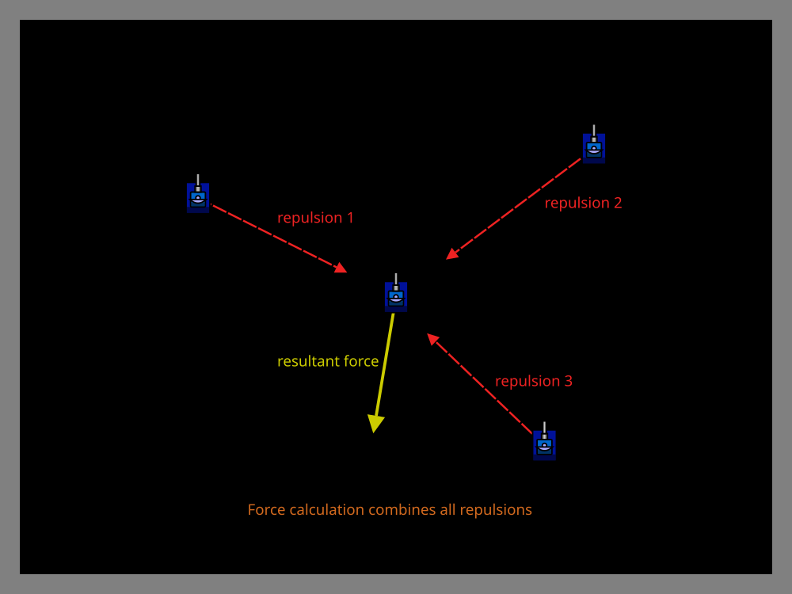
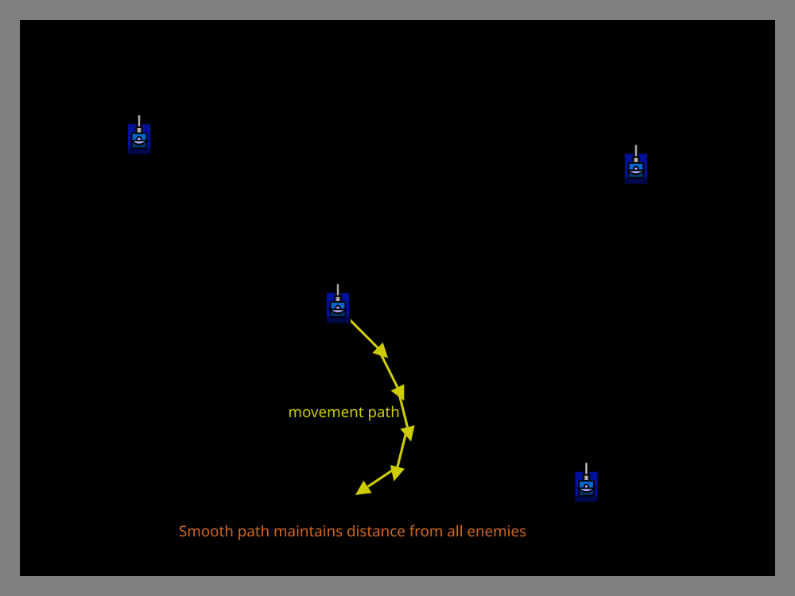

# Anti-Gravity Movement

> [!TIP] Origins
> **Anti-Gravity Movement** was one of the primary movement strategies before **Wave Surfing** was invented. Along
> with Random movement, Anti-Gravity was how bots evaded bullets, by maintaining distance and avoiding predictable
> patterns. **Minimum Risk Movement** (a related technique for [melee](/appendices/glossary#melee) combat) was
> pioneered by **Aelryen** and
**ABC**.

> [!WARNING] Historical Context
> Anti-Gravity Movement was largely **superseded by Wave Surfing for competitive
> [1v1](/appendices/glossary#_1v1-one-on-one-duel) play around 2003**. While it
> remains an excellent learning tool and performs well in melee battles, top-tier 1v1 bots use Wave Surfing because
> it directly counters statistical targeting systems. If your goal is competitive 1v1 performance, study
> [Wave Surfing Introduction](../advanced-evasion/wave-surfing-introduction.md) instead.

Antigravity movement treats battlefield entities, enemies, walls, bullets, and even teammates, as gravitational sources
that exert repulsive (or attractive) forces on the bot. By calculating the combined effect of all forces and moving in
the resultant direction, the bot achieves smooth, adaptive positioning that responds naturally to changing battlefield
conditions.

This technique excels in melee combat where maintaining optimal distance from multiple enemies is crucial. It also
provides flexible positioning in one-on-one battles and serves as a foundation for more sophisticated movement systems.

## The Core Concept

Antigravity movement models each battlefield entity as exerting a force on the bot. The size and direction of each force
depends on:

- **Distance**: Closer entities exert stronger forces (typically inverse square law: $force = strength / distance^2$)
- **Type**: Enemies repel, corners attract (for corner movement), bullets create shadows
- **Strength**: Different entity types have different force multipliers (the `strength` constant)

The bot sums all force vectors to get a resultant force, then moves in the direction that minimizes or maximizes this
force (depending on whether forces are repulsive or attractive).

<br>
*Multiple enemies exert repulsive forces on the bot, creating a resultant force vector away from crowded areas*

## Why Anti-Gravity Works

Traditional movement strategies often use discrete decisions: "move toward this point" or "orbit at this radius."

Antigravity provides several advantages:

- **Smooth adaptation**: Forces naturally blend, creating fluid movement without abrupt direction changes.

- **Multi-target awareness**: In melee, the bot automatically positions itself away from clusters of enemies without
  explicit logic for each opponent.

- **Tunable behavior**: Adjusting force strengths and distance calculations changes movement characteristics without
  rewriting algorithms.

- **Foundation for hybrid systems**: Antigravity can combine with other techniques like wave surfing or distancing by
  adding their goals as additional force sources.

Against simple targeting, antigravity provides evasion through constant motion. Against statistical targeting, the
smooth, adaptive nature makes patterns harder to predict than fixed orbits or oscillations.

## Basic Implementation

### Force Calculation

The fundamental calculation for each entity:

For an entity at `(entity.x, entity.y)`, calculate `dx = myX - entity.x` and `dy = myY - entity.y`. Let
`distance = max(sqrt(dx² + dy²), minDistance)`, then calculate `force = strength / distance²`. The repulsive vector is
`(force × dx / distance, force × dy / distance)`. A negative `strength` makes the same function attractive.

Where `strength` is a tunable constant that determines how strongly the entity repels (positive) or attracts (negative).

### Summing All Forces

Start the total at `(0, 0)`, add one force vector for every enemy, then add wall forces. Near the left wall, the wall
force points right; near the right wall, it points left. The same relationship applies to the bottom and top walls.

### Converting Force to Movement

The resultant vector points toward the next destination. A bot can add that vector to its current position and pass the
result to a GoTo or heading controller. The adapter must use the platform's angle convention when turning toward it.

## Tutorial: Building a Basic Anti-Gravity Bot

The helper below calculates enemy and wall forces and returns a destination point. It is API-neutral so the surrounding
bot can apply its own GoTo or turn-and-ahead routine.

::: code-group

```java [Classic · Java]
import java.util.List;

public final class AntiGravityController {
    private static final double MIN_DISTANCE = 1;
    private final double enemyStrength;
    private final double wallStrength;

    public AntiGravityController(double enemyStrength, double wallStrength) {
        this.enemyStrength = enemyStrength;
        this.wallStrength = wallStrength;
    }

    public Point nextDestination(
            double myX, double myY, double fieldWidth, double fieldHeight,
            List<Entity> enemies) {
        double forceX = 0;
        double forceY = 0;
        for (Entity enemy : enemies) {
            Point force = forceFrom(myX, myY, enemy.x, enemy.y, enemyStrength * enemy.strength);
            forceX += force.x;
            forceY += force.y;
        }

        double left = Math.max(myX, MIN_DISTANCE);
        double right = Math.max(fieldWidth - myX, MIN_DISTANCE);
        double bottom = Math.max(myY, MIN_DISTANCE);
        double top = Math.max(fieldHeight - myY, MIN_DISTANCE);
        forceX += wallStrength / (left * left) - wallStrength / (right * right);
        forceY += wallStrength / (bottom * bottom) - wallStrength / (top * top);
        return new Point(myX + forceX, myY + forceY);
    }

    private static Point forceFrom(
            double myX, double myY, double entityX, double entityY, double strength) {
        double dx = myX - entityX;
        double dy = myY - entityY;
        double distance = Math.max(Math.hypot(dx, dy), MIN_DISTANCE);
        double magnitude = strength / (distance * distance);
        return new Point(magnitude * dx / distance, magnitude * dy / distance);
    }

    public static final class Entity {
        public final double x;
        public final double y;
        public final double strength;

        public Entity(double x, double y, double strength) {
            this.x = x;
            this.y = y;
            this.strength = strength;
        }
    }

    public static final class Point {
        public final double x;
        public final double y;

        public Point(double x, double y) {
            this.x = x;
            this.y = y;
        }
    }
}
```

```python [Tank Royale · Python]
from dataclasses import dataclass


MIN_DISTANCE = 1.0


@dataclass
class Entity:
    x: float
    y: float
    strength: float


@dataclass
class Point:
    x: float
    y: float


class AntiGravityController:
    def __init__(self, enemy_strength: float, wall_strength: float) -> None:
        self.enemy_strength = enemy_strength
        self.wall_strength = wall_strength

    def next_destination(
        self,
        my_x: float,
        my_y: float,
        arena_width: float,
        arena_height: float,
        enemies: list[Entity],
    ) -> Point:
        force_x = 0.0
        force_y = 0.0
        for enemy in enemies:
            force = self._force_from(my_x, my_y, enemy.x, enemy.y, self.enemy_strength * enemy.strength)
            force_x += force.x
            force_y += force.y

        left = max(my_x, MIN_DISTANCE)
        right = max(arena_width - my_x, MIN_DISTANCE)
        bottom = max(my_y, MIN_DISTANCE)
        top = max(arena_height - my_y, MIN_DISTANCE)
        force_x += self.wall_strength / left**2 - self.wall_strength / right**2
        force_y += self.wall_strength / bottom**2 - self.wall_strength / top**2
        return Point(my_x + force_x, my_y + force_y)

    @staticmethod
    def _force_from(my_x: float, my_y: float, entity_x: float, entity_y: float, strength: float) -> Point:
        dx = my_x - entity_x
        dy = my_y - entity_y
        distance = max((dx * dx + dy * dy) ** 0.5, MIN_DISTANCE)
        magnitude = strength / distance**2
        return Point(magnitude * dx / distance, magnitude * dy / distance)
```

```java [Tank Royale · Java]
import java.util.List;

public final class AntiGravityController {
    private static final double MIN_DISTANCE = 1;
    private final double enemyStrength;
    private final double wallStrength;

    public AntiGravityController(double enemyStrength, double wallStrength) {
        this.enemyStrength = enemyStrength;
        this.wallStrength = wallStrength;
    }

    public Point nextDestination(
            double myX, double myY, double arenaWidth, double arenaHeight,
            List<Entity> enemies) {
        double forceX = 0;
        double forceY = 0;
        for (Entity enemy : enemies) {
            Point force = forceFrom(myX, myY, enemy.x, enemy.y, enemyStrength * enemy.strength);
            forceX += force.x;
            forceY += force.y;
        }

        double left = Math.max(myX, MIN_DISTANCE);
        double right = Math.max(arenaWidth - myX, MIN_DISTANCE);
        double bottom = Math.max(myY, MIN_DISTANCE);
        double top = Math.max(arenaHeight - myY, MIN_DISTANCE);
        forceX += wallStrength / (left * left) - wallStrength / (right * right);
        forceY += wallStrength / (bottom * bottom) - wallStrength / (top * top);
        return new Point(myX + forceX, myY + forceY);
    }

    private static Point forceFrom(
            double myX, double myY, double entityX, double entityY, double strength) {
        double dx = myX - entityX;
        double dy = myY - entityY;
        double distance = Math.max(Math.hypot(dx, dy), MIN_DISTANCE);
        double magnitude = strength / (distance * distance);
        return new Point(magnitude * dx / distance, magnitude * dy / distance);
    }

    public static final class Entity {
        public final double x;
        public final double y;
        public final double strength;

        public Entity(double x, double y, double strength) {
            this.x = x;
            this.y = y;
            this.strength = strength;
        }
    }

    public static final class Point {
        public final double x;
        public final double y;

        public Point(double x, double y) {
            this.x = x;
            this.y = y;
        }
    }
}
```

```csharp [Tank Royale · C#]
using System;
using System.Collections.Generic;

public sealed class AntiGravityController
{
    private const double MinDistance = 1;
    private readonly double enemyStrength;
    private readonly double wallStrength;

    public AntiGravityController(double enemyStrength, double wallStrength)
    {
        this.enemyStrength = enemyStrength;
        this.wallStrength = wallStrength;
    }

    public Point NextDestination(
        double myX, double myY, double arenaWidth, double arenaHeight,
        IReadOnlyList<Entity> enemies)
    {
        double forceX = 0;
        double forceY = 0;
        foreach (Entity enemy in enemies)
        {
            Point force = ForceFrom(myX, myY, enemy.X, enemy.Y, enemyStrength * enemy.Strength);
            forceX += force.X;
            forceY += force.Y;
        }

        double left = Math.Max(myX, MinDistance);
        double right = Math.Max(arenaWidth - myX, MinDistance);
        double bottom = Math.Max(myY, MinDistance);
        double top = Math.Max(arenaHeight - myY, MinDistance);
        forceX += wallStrength / (left * left) - wallStrength / (right * right);
        forceY += wallStrength / (bottom * bottom) - wallStrength / (top * top);
        return new Point(myX + forceX, myY + forceY);
    }

    private static Point ForceFrom(double myX, double myY, double entityX, double entityY, double strength)
    {
        double dx = myX - entityX;
        double dy = myY - entityY;
        double distance = Math.Max(Math.Sqrt(dx * dx + dy * dy), MinDistance);
        double magnitude = strength / (distance * distance);
        return new Point(magnitude * dx / distance, magnitude * dy / distance);
    }

    public sealed class Entity
    {
        public Entity(double x, double y, double strength)
        {
            X = x;
            Y = y;
            Strength = strength;
        }

        public double X { get; }
        public double Y { get; }
        public double Strength { get; }
    }

    public sealed class Point
    {
        public Point(double x, double y)
        {
            X = x;
            Y = y;
        }

        public double X { get; }
        public double Y { get; }
    }
}
```

```typescript [Tank Royale · TypeScript]
type Entity = {
    x: number;
    y: number;
    strength: number;
};

type Point = {
    x: number;
    y: number;
};

class AntiGravityController {
    private static readonly minDistance = 1;

    constructor(
        private readonly enemyStrength: number,
        private readonly wallStrength: number,
    ) {}

    nextDestination(
        myX: number,
        myY: number,
        arenaWidth: number,
        arenaHeight: number,
        enemies: Entity[],
    ): Point {
        let forceX = 0;
        let forceY = 0;
        for (const enemy of enemies) {
            const force = this.forceFrom(myX, myY, enemy);
            forceX += force.x;
            forceY += force.y;
        }

        const left = Math.max(myX, AntiGravityController.minDistance);
        const right = Math.max(arenaWidth - myX, AntiGravityController.minDistance);
        const bottom = Math.max(myY, AntiGravityController.minDistance);
        const top = Math.max(arenaHeight - myY, AntiGravityController.minDistance);
        forceX += this.wallStrength / left ** 2 - this.wallStrength / right ** 2;
        forceY += this.wallStrength / bottom ** 2 - this.wallStrength / top ** 2;
        return { x: myX + forceX, y: myY + forceY };
    }

    private forceFrom(myX: number, myY: number, entity: Entity): Point {
        const dx = myX - entity.x;
        const dy = myY - entity.y;
        const distance = Math.max(Math.hypot(dx, dy), AntiGravityController.minDistance);
        const magnitude = this.enemyStrength * entity.strength / distance ** 2;
        return { x: magnitude * dx / distance, y: magnitude * dy / distance };
    }
}
```

:::

### Step 1: Enemy Force Calculation

Start with enemy repulsion by passing each scanned enemy as an `Entity` with a positive strength. The helper sums those
vectors before wall forces are added.

### Step 2: Wall Avoidance

Add a wall strength such as 20,000. Each wall contributes an inverse-square force away from itself; the helper clamps
each wall distance to one unit so a nearly touching bot does not divide by zero.

### Step 3: Movement Execution

Pass the returned point to the movement routine. In a real bot, limit the destination to the safe battlefield rectangle
and translate the point into the platform's heading convention before issuing movement commands.

### Step 4: Tuning Force Strengths

The effectiveness depends heavily on tuning:

- **Enemy strength**: Higher values = stay farther from enemies
- **Wall strength**: Higher values = stay farther from walls
- **Ratio between them**: Determines priority (avoid enemies vs. avoid walls)

Start with enemy strength around 50,000 and wall strength around 20,000, then adjust based on battlefield size and
combat style.

<br>
*Antigravity movement creates smooth, adaptive paths that maintain distance from multiple threats*

## Advanced Variations

### Distance-Dependent Forces

Instead of pure inverse square, use different force laws for different ranges:

Use a stronger strength below `closeRange`, return zero beyond `farRange`, and keep the normal inverse-square strength
between those limits. This prevents distant entities from dominating the result while preserving an emergency push at
close range.

### Enemy Energy Weighting

Adjust forces based on enemy threat level:

Multiply an enemy's base strength by `enemy.energy / 100.0` before calculating its vector. This makes a high-energy
opponent a stronger source while a damaged opponent has less influence.

### Attractive Forces

Corner movement can be implemented by making corners attractive:

Choose a safe corner, calculate the vector from the bot toward it, and pass a negative strength to the same force
function. The negative sign changes repulsion into attraction.

### Bullet Shadows

Create repulsion from predicted bullet positions:

For each tracked bullet, project its position several turns forward using its velocity, then add a temporary repulsive
force from that projected point. This is a useful hybrid, but wave-based danger calculations are usually more precise.

## Tuning and Optimization

### Finding the Right Constants

Start with these baseline values:

- Enemy strength: 50,000
- Wall strength: 20,000
- Minimum distance (to prevent divide by zero): 1

Then adjust:

1. **Too close to enemies**: Increase enemy strength or change distance exponent
2. **Hitting walls**: Increase wall strength or add a minimum wall distance threshold
3. **Too passive**: Decrease forces or add attractive forces toward optimal positions
4. **Jittery movement**: Smooth force calculations over multiple turns or add momentum

### Performance Considerations

Antigravity requires calculating forces for all entities at every turn:

- **Computational cost**: $O(n)$ where $n$ is the number of entities
- **Optimization**: Only calculate forces for entities within a certain range
- **Caching**: Store battlefield boundaries once rather than recalculating
- **Update frequency**: In melee, calculate every turn; in 1v1, can update less frequently

## Platform Notes

Antigravity movement works identically in classic Robocode and Tank Royale. Both platforms provide:

- Bot position tracking via scan events
- Battlefield dimension queries
- Trigonometric functions for angle calculations

The main difference is coordinate systems: classic Robocode uses north-up (0° = north), while Tank Royale uses
east-right (0° = east). Adjust angle calculations accordingly when porting code.

## Common Mistakes

**Divide by zero errors**: Always set a minimum distance threshold when calculating forces. Even a tiny distance like
1 unit prevents infinite forces.

**Inconsistent coordinates**: Ensure all force calculations use the same coordinate system. Mixing up enemy absolute
positions with relative bearings causes erratic movement.

**Ignoring walls until too late**: Wall forces should ramp up smoothly as the bot approaches boundaries, not suddenly
activate when already too close to turn safely.

**Over-tuning for one scenario**: Constants that work perfectly on a 1000×1000 battlefield may fail on different sizes.
Scale force strengths proportionally to battlefield dimensions.

**Static force values**: Against adaptive opponents, varying force strengths or adding randomization prevents
predictable patterns.

## When to Use Anti-Gravity

**Ideal for:**

- **Melee combat**: Natural multi-target awareness and spacing: this is where Anti-Gravity still shines
- **Dynamic positioning**: Situations requiring smooth adaptation to changing conditions
- **Learning platforms**: Simple to implement, easy to visualize and tune
- **Hybrid systems**: As a base layer combined with wave surfing or statistical analysis

**Not recommended for:**

- **Competitive 1v1**: Wave Surfing provides far superior bullet evasion against statistical targeting systems
- **Precision positioning**: Fixed radius orbits or specific angles are better with geometric movement
- **Bullet dodging**: Reacting to actual wave danger calculations beats force-based approximations

Antigravity shines in melee when you need fluid, multifactor positioning without complex decision trees. For 1v1
competitive play, it has been obsolete since approximately 2003 when ABC invented Wave Surfing.

## Further Reading

- [Anti-Gravity Movement](https://robowiki.net/wiki/Anti-Gravity_Movement) - RoboWiki (classic Robocode)
- [Minimum Risk Movement](https://robowiki.net/wiki/Minimum_Risk_Movement) - RoboWiki (classic Robocode)
- [Movement](https://robowiki.net/wiki/Movement) - RoboWiki (classic Robocode)
- [Tank Royale API - Bot Interface](https://robocode.dev/api/) - Tank Royale documentation
