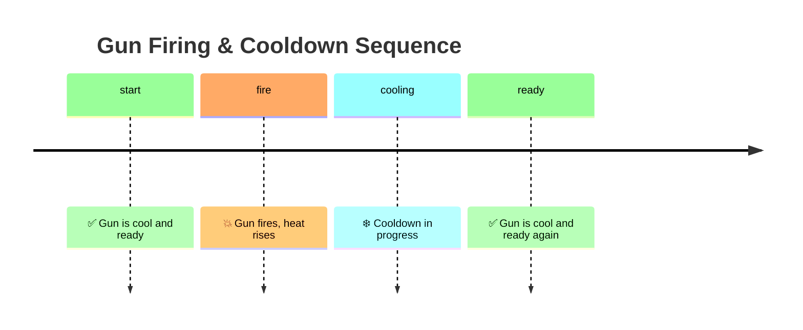
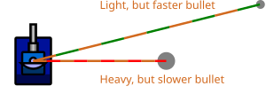
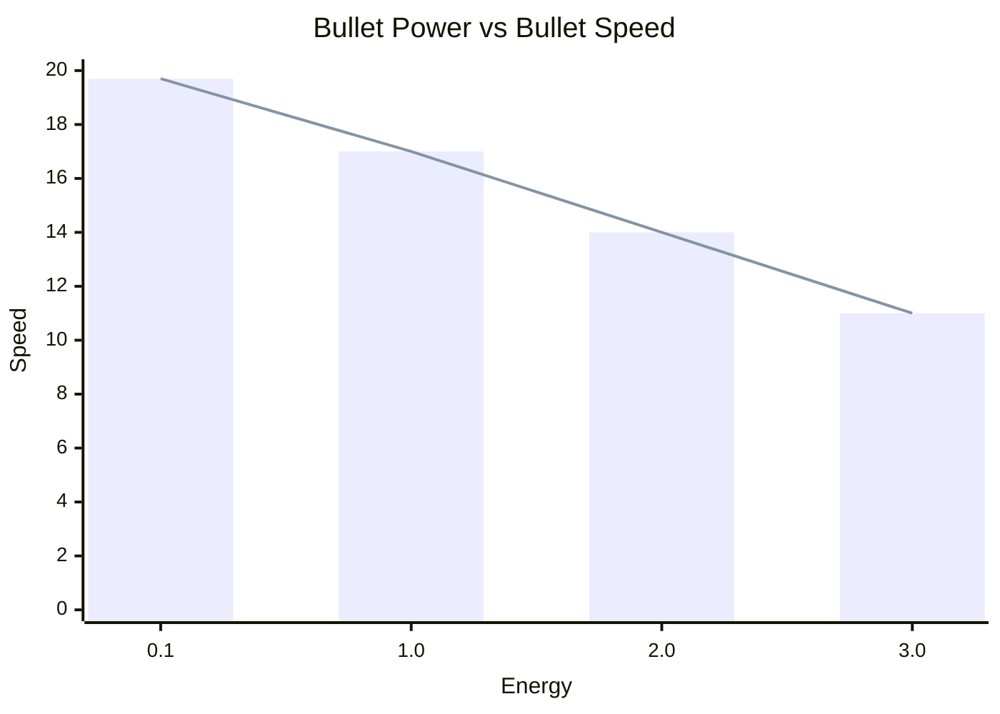
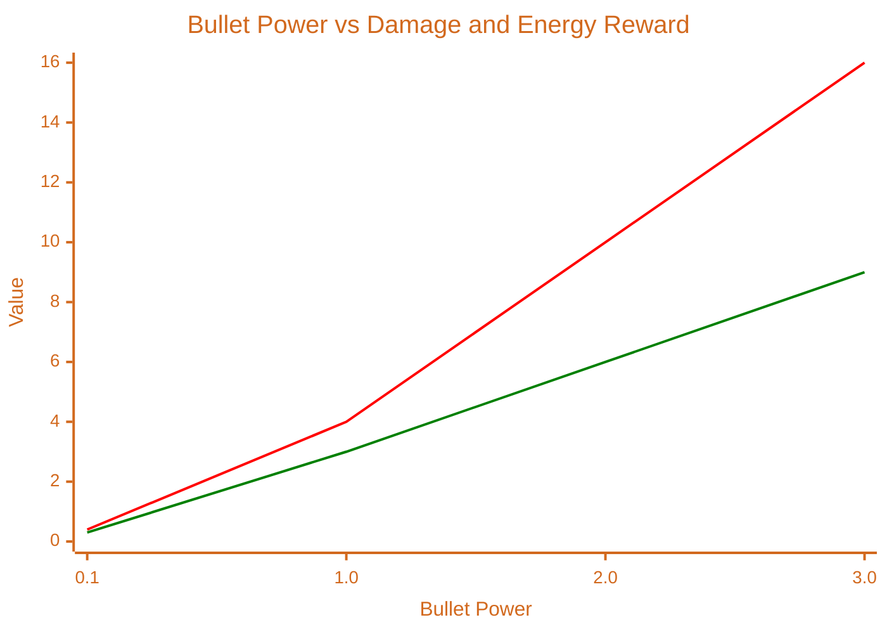
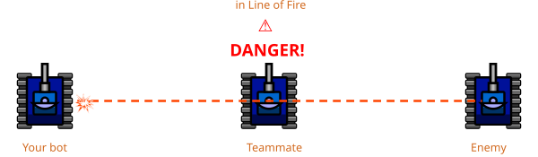

# Bullet Travel & Bullet Physics

> [!TIP] Origins
> **Bullet physics** was documented by the RoboWiki community for classic Robocode and by the official Tank Royale
> documentation for Robocode Tank Royale.

Bullets are pure energy projectiles fired by your bot's gun. Firing costs energy, your gun must cool down between shots,
and the bullet travels across the battlefield until it hits a bot or a wall (or leaves the arena). Mastering these
basics helps you choose when and how hard to fire.

## Bullet power and cost

Understanding bullet power is really about understanding **what happens to your bot’s energy when you fire** and how
close you are to being disabled or dying.

```mermaid
---
config:
  themeVariables:
    xyChart:
      plotColorPalette: grey, orange, green, yellow, red, darkred, red
---

xychart-beta
    title "Energy over time across key states (full → firing → low → disabled → dead)"
    x-axis ["1. Full 🔋", "2. 💥 Firing 🔋", "3. Low Energy🪫", "4. Disabled 🚫", "5. Dead 💀"]
    y-axis -5 --> 100
    bar [100, 97, 15, 0, -2]
    bar [100, 100, -10, -10, -10]
    bar [100, 97.2, -10, -10, -10]
    bar [-10, -10, 15, -10, -10]
    bar [-10, -10, -10, 0, -10]
    bar [-10, -10, -10, -10, -2]
    line [0, 0, 0, 0, 0]
```



*Diagram: Bot energy across important states: full → firing → low → disabled → dead*

1) You start a turn with full energy (100)
2) fire a bullet and drop a little energy (~97). The energy drop is marked as yellow
3) later might be low but still alive (~15)
4) can hit 0 and become disabled (0)
5) and finally go below 0 and die (−2)

The red horizontal line at 0 highlights the critical boundary between **alive** and **disabled/dead**. This makes it
clear why energy management and bullet power choices matter.

- Bullet power is the energy you spend for a shot.
- Typical valid range: 0.1 to 3.0 power.
- You need at least 0.1 energy to fire the gun. If you request more power than your remaining energy, the game clamps to
  your current energy (but never below 0.1 to create a shot).
- Higher power does not make the bullet faster. It makes the bullet slower but potentially more damaging.

## How bullets are fired

- You aim with the gun, not the bot body; the gun can turn independently of the bot.
- A bullet travels in a straight line along the gun’s heading at the instant you fired.
- Bullet speed is determined only by bullet power and engine rules; it does NOT inherit your bot’s current velocity.
- A shot is created only when your gun is cool, and you have enough energy. On fire(power), energy is deducted
  immediately.
- The bullet then flies until it hits a bot, a wall, leaves the arena, or even collides with another bullet.

## When can you fire? (gun cooldown)

- **At round start**: Bots begin with gun heat of **3.0**. With the default cooling rate of 0.1/turn, the first shot is
  possible on **turn 30**.
- After you fire, the gun becomes hot and must cool before the next shot.
- Conceptually: each shot adds heat; every turn, some heat is removed. You can only fire when the heat reaches zero.
- Classic Robocode specifics you will see in the docs:
    - Cooling happens at a constant rate per turn.
    - Heat added depends on bullet power, so bigger shots generally mean a longer wait.

Practical takeaway: you cannot fire every turn. Larger bullet power means a longer interval until the next legal shot.

## Timeline of firing and cooldown



*Timeline diagram: start → fire → heat rises → cooldown → ready for next shot*

## Bullet speed and travel time

### Bullet speed formula

<br>
*Illustration: Two bullets fired by a bot. A high-power bullet is slower and shown in red/orange. A low-power bullet is
faster and shown in green/orange.*

Classic Robocode bullet speed:

$\text{speed (units/turn)} = 20 - 3 × \text{bulletPower}$

The table below shows bullet speed for common power levels:

| Bullet Power | Speed (units/turn) |
|--------------|-------------------:|
| 0.1          |               19.7 |
| 1.0          |                 17 |
| 2.0          |                 14 |
| 3.0          |                 11 |



*Chart: Bullet Power vs Bullet Speed. The bars and line show decreasing speed as bullet power increases.*

### Travel time formula

$travel time (turns) ≈ distance / speed$

Example: target at 400 units with power 2.0 → $\frac{400}{14}$ ≈ 29 turns of flight

Notes:

- Slower (high-power) bullets take longer to arrive, giving moving targets more time to dodge.
- Faster (low-power) bullets arrive sooner, cost less energy, but do less damage.
- Bullet motion is straight-line at constant speed; it is independent of your bot’s movement after the shot.

### Bullet Power vs Bullet Speed

| Bullet Power | Speed (units/turn) | Example Travel Time (400 units) |
|--------------|--------------------|---------------------------------|
| 0.1          | 19.7               | 20                              |
| 1.0          | 17                 | 24                              |
| 2.0          | 14                 | 29                              |
| 3.0          | 11                 | 36                              |

*A quick visual: higher bullet power reduces speed (see the formula and the table above). Use lower power for faster
bullets when you need shorter travel time, and higher power for more damage when you can accept slower travel.*

## Bullet damage



*Chart: Bullet power vs. damage and energy reward. Damage (<span style="color: red;">red</span>) increases faster than
reward (<span style="color: green;">green</span>) as power rises.*

The table below shows how bullet power translates to damage and energy reward:

| Bullet Power | Damage Formula                      | Example Damage      | Energy Reward   |
|--------------|-------------------------------------|---------------------|-----------------|
| 0.1 - 1.0    | 4 × bulletPower                     | 0.5 → 2             | 3 × bulletPower |
| > 1.0        | 4 × bulletPower + 2 × (power − 1.0) | 2.0 → 8<br>3.0 → 12 | 3 × bulletPower |

**Formula:**

$\text{damage} = 4 × \text{bullet power} + max(0, 2 × (\text{bullet power} − 1.0))$

$\text{energy reward} = 3 × \text{bullet power}$

Notes:

- If a bullet hits a wall, it does **not** deal damage.
- When your bullet hits, you gain back energy as shown above.

### Platform note: Collision detection

The way bullets detect hits on bots differs between platforms:

- **Classic Robocode:** Uses an axis-aligned bounding box (36×36 units) that does not rotate with the bot's heading. A
  bullet hits if it passes within the square's bounds.
- **Tank Royale:** Uses a bounding circle (radius 18 units) that is independent of the bot's heading. A bullet hits if
  it comes within 18 units of the bot's center.

## Firing constraints and safety

- You cannot fire when your bot is disabled (energy = 0).
- Firing reduces your energy immediately by the bullet power.
- Be careful not to drop yourself to zero energy (= disabled): a disabled bot becomes an easy target and can be killed
  by a fast small bullet.
- In [Team](/appendices/glossary#team) battles, bullets can hit allies (friendly fire). Always consider the line of
  fire.

<br>
*Friendly fire scenario where a bot accidentally hits a teammate. Always check your line of fire in team battles.*

## How often can I fire a bullet?

- As often as the gun cooldown allows. The sequence is:

  fire → gun heats up → wait while it cools → fire again.
- Bigger shots mean longer waits. If you need a faster cadence, prefer lower-power shots.

## Radar and visibility

- Radar does not detect bullets.
- You can often infer a shot by observing a scanned enemy's energy dropping by the amount they spent to fire.

## Minimal firing example in five languages

The following bots sweep their guns while focusing on two firing rules: the gun must be cool, and the bot must have
more than 0.1 energy. The power calculation is intentionally simple. It chooses stronger shots at short range and weaker
shots at long range.

The examples do not implement targeting. They fire along the gun's current heading, leaving accurate aiming for the
[targeting pages](/targeting/simple-targeting/head-on-targeting).

::: code-group

```java [Classic · Java]
import robocode.AdvancedRobot;
import robocode.ScannedRobotEvent;

public class BulletPhysicsBot extends AdvancedRobot {
    @Override
    public void run() {
        setAdjustGunForRobotTurn(true);
        setAdjustRadarForGunTurn(true);

        while (true) {
            setTurnGunRight(360);
            setTurnRadarRight(360);
            execute();
        }
    }

    @Override
    public void onScannedRobot(ScannedRobotEvent event) {
        if (getGunHeat() == 0 && getEnergy() > 0.1) {
            setFire(powerForDistance(event.getDistance()));
        }
    }

    private double powerForDistance(double distance) {
        double power = 2.5 - 2.0 * distance / 800.0;
        return Math.max(0.1, Math.min(3.0, power));
    }
}
```

```python [Tank Royale · Python]
from robocode_tank_royale.bot_api import Bot
from robocode_tank_royale.bot_api.events import ScannedBotEvent


class BulletPhysicsBot(Bot):
    def run(self) -> None:
        while self.running:
            self.set_turn_gun_right(360)
            self.set_turn_radar_right(360)
            self.go()

    def on_scanned_bot(self, event: ScannedBotEvent) -> None:
        if self.gun_heat == 0 and self.energy > 0.1:
            distance = ((event.x - self.x) ** 2 + (event.y - self.y) ** 2) ** 0.5
            self.set_fire(self.power_for_distance(distance))

    @staticmethod
    def power_for_distance(distance: float) -> float:
        power = 2.5 - 2.0 * distance / 800.0
        return max(0.1, min(3.0, power))


def main() -> None:
    BulletPhysicsBot().start()


if __name__ == "__main__":
    main()
```

```java [Tank Royale · Java]
import dev.robocode.tankroyale.botapi.Bot;
import dev.robocode.tankroyale.botapi.events.ScannedBotEvent;

public class BulletPhysicsBot extends Bot {
    public static void main(String[] args) {
        new BulletPhysicsBot().start();
    }

    @Override
    public void run() {
        while (isRunning()) {
            setTurnGunRight(360);
            setTurnRadarRight(360);
            go();
        }
    }

    @Override
    public void onScannedBot(ScannedBotEvent event) {
        if (getGunHeat() == 0 && getEnergy() > 0.1) {
            double dx = event.getX() - getX();
            double dy = event.getY() - getY();
            double distance = Math.hypot(dx, dy);
            setFire(powerForDistance(distance));
        }
    }

    private double powerForDistance(double distance) {
        double power = 2.5 - 2.0 * distance / 800.0;
        return Math.max(0.1, Math.min(3.0, power));
    }
}
```

```csharp [Tank Royale · C#]
using System;
using Robocode.TankRoyale.BotApi;
using Robocode.TankRoyale.BotApi.Events;

public class BulletPhysicsBot : Bot
{
    static void Main(string[] args)
    {
        new BulletPhysicsBot().Start();
    }

    public override void Run()
    {
        while (IsRunning)
        {
            SetTurnGunRight(360);
            SetTurnRadarRight(360);
            Go();
        }
    }

    public override void OnScannedBot(ScannedBotEvent evt)
    {
        if (GunHeat == 0 && Energy > 0.1)
        {
            double dx = evt.X - X;
            double dy = evt.Y - Y;
            double distance = Math.Sqrt(dx * dx + dy * dy);
            SetFire(PowerForDistance(distance));
        }
    }

    private static double PowerForDistance(double distance)
    {
        double power = 2.5 - 2.0 * distance / 800.0;
        return Math.Max(0.1, Math.Min(3.0, power));
    }
}
```

```typescript [Tank Royale · TypeScript]
import { Bot, ScannedBotEvent } from "@robocode.dev/tank-royale-bot-api";

class BulletPhysicsBot extends Bot {
    static main() {
        new BulletPhysicsBot().start();
    }

    override run() {
        while (this.isRunning()) {
            this.setTurnGunRight(360);
            this.setTurnRadarRight(360);
            this.go();
        }
    }

    override onScannedBot(event: ScannedBotEvent) {
        if (this.gunHeat === 0 && this.energy > 0.1) {
            const dx = event.x - this.x;
            const dy = event.y - this.y;
            const distance = Math.hypot(dx, dy);
            this.setFire(BulletPhysicsBot.powerForDistance(distance));
        }
    }

    private static powerForDistance(distance: number) {
        const power = 2.5 - 2.0 * distance / 800.0;
        return Math.max(0.1, Math.min(3.0, power));
    }
}

BulletPhysicsBot.main();
```

:::

## Key Takeaways

- Bullet power determines energy cost, speed, and damage.
- You can only fire when your gun is cool, and you have enough energy.
- Higher bullet power means slower bullets but more damage; lower power is faster but less damaging.
- Gun cooldown depends on bullet power. Bigger shots require longer waits.
- Bullets travel in straight lines at constant speed, unaffected by your bot's movement after firing.
- Hitting an enemy with a bullet rewards you with energy; hitting a wall does not.
- Friendly fire is possible in team battles. Always check your line of fire.
- Radar does not detect bullets, but you can infer shots by watching energy drops.
- Energy management is crucial: avoid disabling yourself by firing recklessly.

## Further Reading

- [Bullet](https://robowiki.net/wiki/Bullet) - RoboWiki (classic Robocode)
- [Robocode Tank Royale - Physics](https://robocode.dev/articles/physics.html#bullets) - Tank Royale documentation
