# Gun Heat & Cooling

Firing is never “free” in Robocode. Each shot heats up the gun, and a hot gun can’t fire again until it cools back
down.

That means good bots don’t just aim well — they *time* their shots so the gun is ready when it matters.

## Why gun heat matters

Gun heat is a built-in reload mechanic.

- If the gun is too hot, `fire()` / `setFire()` won’t produce a bullet.
- Heat depends on bullet power: stronger bullets create more heat.
- Cooling is gradual and happens at every turn.

This creates a simple trade-off:

- **High power**: more damage per hit, but longer downtime between shots.
- **Low power**: faster rate of fire, but weaker bullets.

A classic “good moment” to have zero gun heat is when an enemy is in trouble — cornered, stuck on a wall, or disabled
(not moving). Being ready then is often worth more than shooting “as soon as possible.”

## The gun heat formula

In classic Robocode (and similarly in Tank Royale), firing adds heat based on bullet power.

Let:

$p$ = bullet power (typically 0.1 to 3.0)<br>
$H$ = current gun heat

Then the shot increases heat by:

$\Delta H = 1 + \frac{p}{5}$

So after firing:

$H \leftarrow H + \left(1 + \frac{p}{5}\right)$

Quick intuition:

- Power 1.0 adds: $1 + \frac{1}{5} = 1.2$ heat
- Power 3.0 adds: $1 + \frac{3}{5} = 1.6$ heat

## Cooling rate (and how long you must wait)

Each turn, gun heat is reduced by the **gun cooling rate**.

Let:

$c$ = gun cooling rate (default is 0.1 heat per turn, but game rules can change it)

Cooling per turn:

$H \leftarrow \max(0, H - c)$

If the gun heat right after firing is $H_{\text{after}}$, then the number of turns until you can fire again is roughly:

$T_{\text{cool}} = \left\lceil \frac{H_{\text{after}}}{c} \right\rceil$

Example with default cooling \(c = 0.1\):

- Fire with power $p=1$: $\Delta H = 1.2$ → about $\lceil 1.2 / 0.1 \rceil = 12$ turns
- Fire with power $p=3$: $\Delta H = 1.6$ → about $\lceil 1.6 / 0.1 \rceil = 16$ turns

That’s a big difference in how often the bot can shoot.

## Minimal shooting logic: always check heat

A common beginner bug is calling `fire()` every turn and assuming it will always shoot.

A safer pattern is:

```text
# Decide whether it is worth firing this turn
power = chooseFirePower(enemyDistance, enemyEnergy, hitChance)

# Only shoot if the gun is ready
if gunHeat == 0 and power > 0:
    fire(power)
```

Two practical upgrades:

- If `gunHeat` is close to zero, it can be worth delaying aim changes so the gun is perfectly aligned when heat hits
  zero.
- If the bot relies on radar locks, it can adjust scanning behavior based on expected fire time.

## Platform notes (Classic vs Tank Royale)

The concept is the same on both platforms: **shots add heat, and heat must cool to zero before the next shot**.

Differences to watch for:

- **Where to read the values**: APIs differ, but both provide access to current gun heat and the cooling rate/rules.
- **Configurable rules**: the default cooling rate is commonly \(0.1\), but battles can be configured with different
  rules. If a bot hard-codes \(0.1\), it may perform badly under custom settings.

## Tips and common mistakes

- **Don’t waste “ready turns”**: if the gun is at zero heat, but the bot doesn’t have a target solution ready, that’s a
  missed opportunity.
- **Avoid panic-power**: firing max power at long distance usually means low hit chance *and* long cooldown.
- **Separate “aiming” and “firing” decisions**: aim can be updated at every turn, but firing should be gated by heat.
- **Remember the goal**: the best shot is often the one fired at the best *moment*, not the earliest moment.

```mermaid
---
config:
    xyChart:
        showDataLabel: true
---
xychart-beta
    title "Gun heat after a shot (cooling c = 0.1 per turn)"
    x-axis "Turn" 0 --> 16
    y-axis "Gun heat" 0 --> 1.6
    bar "p=3.0 (ΔH=1.6)" [1.6, 1.5, 1.4, 1.3, 1.2, 1.1, 1.0, 0.9, 0.8, 0.7, 0.6, 0.5, 0.4, 0.3, 0.2, 0.1, 0.0]
    bar "p=1.0 (ΔH=1.2)" [1.2, 1.1, 1.0, 0.9, 0.8, 0.7, 0.6, 0.5, 0.4, 0.3, 0.2, 0.1, 0.0, 0.0, 0.0, 0.0, 0.0]
```



*Gun heat after firing and then cooling linearly each turn (c = 0.1). Higher bullet power starts hotter and takes longer
to cool: p=1 (ΔH=1.2) reaches 0 after ~12 turns, while p=3 (ΔH=1.6) reaches 0 after ~16 turns.*

Legend:

* Green: p=1.0 (ΔH=1.2)
* Blue: p=3.0 (ΔH=1.6)