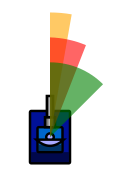
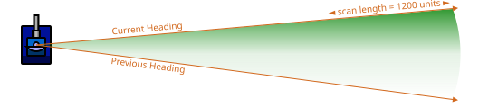

# Movement Constraints & Bot Physics

> [!TIP] Origins
> **Movement physics** were codified in classic Robocode and later mirrored in Robocode Tank Royale, with both platforms
> documenting the same core limits on speed, turning, and radar.

This page summarizes the movement and turning rules that define how a bot can move, turn, and scan in both classic
Robocode and Robocode Tank Royale. It is meant as a compact reference you can keep open while coding.

It assumes you have already read:

- `Bot Anatomy` (for bot parts, chaining vs. independent movement)
- `The Bot API` (for scanning concepts, turns, and events)
- `Coordinate Systems & Angles` (for coordinate system, angle conventions, and basic terminology)

Where numbers differ between classic Robocode and Tank Royale, both are listed explicitly.

> [!INFO] Info
> Numbers and rules on this page are based on:
> - Classic Robocode: [Game Physics](https://robowiki.net/wiki/Robocode/Game_Physics),
    > [Rules](https://robocode.sourceforge.io/docs/robocode/robocode/Rules.html)
> - Robocode Tank Royale: [Physics](https://robocode.dev/articles/physics.html),
    > [Constants](https://robocode.dev/api/java/dev/robocode/tankroyale/botapi/Constants.html)

## Bot size and basic model

This section is a light reminder, not a full re-explanation. For details and diagrams, see:

- `Bot Anatomy` (bot shape, hitbox, collisions, and chained vs. independent parts)
- `Coordinate Systems & Angles` (battlefield coordinates)

Key points:

- Classic Robocode bot hitbox: **36×36 units** (axis-aligned square), centered on the bot position.
- Tank Royale bot hitbox: **circle with radius 18 units**.
- Battlefield coordinates on both platforms:
    - Origin `(0, 0)` at bottom-left; `x` to the right, `y` up.
- See `Coordinate Systems & Angles` for:
    - Classic Robocode angle convention (clockwise from North).
    - Tank Royale angle convention (counterclockwise from East).

This page reuses those angle systems in its formulas but does not redefine them; refer back if you need a refresher.

## Linear movement: velocity, acceleration, deceleration

Movement is updated **once per turn** (a "tick"). Velocity can be **positive** (forwards) or **negative** (backwards).
You give a distance or velocity target; the engine applies acceleration and deceleration within limits.

### Classic Robocode

- Max forward speed: **+8 units/turn**
- Max backward speed: **−8 units/turn**
- Max acceleration (speeding up in the current direction): **+1 unit/turn²**
- Max deceleration (slowing down / reversing): **−2 units/turn²**

If `v` is the current velocity and `t` is the requested target velocity, the engine moves `v` toward `t` by at most
1 unit/turn while the signs agree. When the bot must brake or reverse, the maximum change is 2 units/turn. The result
is always clamped to the range −8 to +8 units/turn.

Position is then updated using the bot heading and the chosen coordinate/angle convention from
`Coordinate Systems & Angles`. For example, in Tank Royale (math-style angles, 0° = East, CCW positive):

The position update is `x' = x + v' × cos(heading)` and `y' = y + v' × sin(heading)`.

Where:

- `heading` is in radians in the formula (convert from degrees first).
- `(x, y)` is the bot position in units.

### Robocode Tank Royale

Tank Royale uses the same style of physics, but the concrete values are exposed as constants in the Bot API, so you do
not need to remember them or hard-code numbers in your own bot:

- Max speed: `MAX_SPEED`
- Acceleration: `ACCELERATION`
- Deceleration: `DECELERATION`

Always prefer using these constants from the API over literal numbers in your code; they document the rules and keep
your bot compatible if the game engine is ever tuned.

## Body turning and speed–turn tradeoff

Classic Robocode and Tank Royale both limit how much the bot body can turn each tick, and this limit shrinks as speed
increases.

### Classic Robocode body turn rate

- Max body turn rate when standing still: **10°/turn**.
- The faster you move, the less you can turn: `maxTurnRate(speed) = 10° − 0.75° × |speed|`.

    - At speed 0: 10°
    - At speed 4: 10 − 0.75 × 4 = 7°
    - At speed 8: 10 − 0.75 × 8 = 4°

- The requested turn is normalized to the shortest direction, then clamped to this limit. If `r` is that normalized
  request and `v` is the current velocity, the applied body turn is
  `clamp(r, −maxTurnRate(v), +maxTurnRate(v))`.

This speed–turn tradeoff is a core part of movement design in classic Robocode: going faster makes it harder to turn
sharply.

### Tank Royale body turn rate

Tank Royale exposes `MAX_TURN_RATE` in its API and uses the same speed penalty. The effective maximum per turn is
`MAX_TURN_RATE − 0.75° × |speed|`, where `MAX_TURN_RATE` is 10°/turn. Use the API’s `calcMaxTurnRate(speed)` helper
when available instead of duplicating the formula.

## Gun and radar turning (constraints only)

The structure and roles of body, gun, and radar are already covered in `Bot Anatomy`, including diagrams
and chained vs independent movement. This section only focuses on **numeric limits and clamping rules**.

### Classic Robocode

Per-turn angular limits:

- Gun: **20°/turn**
- Radar: **45°/turn**

By default, turning the body also rotates the gun and radar, and turning the gun also rotates the radar. The
`setAdjust*`
methods in the classic API control whether those automatic rotations are applied. For a full conceptual explanation and
examples, see `Bot Anatomy`.

From a physics perspective, each requested turn is clamped independently: the gun to the range −20° to +20° and the
radar to −45° to +45°. Chained body, gun, and radar rotations are then added according to the selected `setAdjust*`
settings.

### Tank Royale

Tank Royale uses separate headings for the body, gun, and radar. Angular turn limits are exposed as named constants in
the Bot API. You typically send separate turn commands per turn, and the game engine clamps each heading change to its
maximum. Prefer the named constants and API properties over hard-coded degree values in bot code.

<br>
*Max turn rates for each bot part.*

Legend:

- The <span style="color: orange;">orange</span> arc shows the maximum turn rate for the body, i.e., 10°/turn at zero
  speed.
- The <span style="color: red;">red</span> arc shows the maximum turn rate for the turret/gun, i.e., 20°/turn
- The <span style="color: green;">green</span> scan arc shows the maximum turn rate for the radar, i.e., 45°/turn

**Rotation facts:**

- At zero speed, it takes <span style="color: orange;">36 turns</span> for the body to rotate 360° (360 / 10).
- It takes <span style="color: red;">19 turns</span> for the turret/gun to rotate 360° (360 / 20).
- It takes <span style="color: green;">8 turns</span> for the radar to sweep 360° (360 / 45).
- When bot parts are chained (body, gun, radar), the scanner can move up to <span style="color: green;">75°</span> in
  one turn (10 + 20 + 45).

## Scanning physics: arc and distance (reference view)

The idea of a **scan arc** and the 1200-unit scan range have already been introduced in `The Bot API`.
That page also explains beginner-friendly strategies like wide sweeps and radar locks. Here, the focus is on the
underlying rules the engine uses each tick.

### Classic Robocode

- Radar turn per tick defines the **scan arc width** that turn:
    - Max radar turn: **45°/turn**.
    - If the radar turns by `Δθ` degrees in one tick (after clamping), the engine considers a sector covering all angles
      between the previous and current radar headings.
- Scan range:
    - Up to **1200 units** from your bot center.
    - Walls and bots do not block radar; it is not ray-cast.

Conceptually, per tick the engine:

1. Starts from the previous radar heading.
2. Applies the clamped radar turn to get the new heading.
3. Forms a sector between those two headings out to 1200 units.
4. Reports a scan event for each enemy whose position lies within that sector.

If the radar does not turn, the sector collapses into a thin beam along a single heading.

### Robocode Tank Royale

Tank Royale uses the same radar sweep/scan arc logic as classic Robocode. The game engine checks for bots within the
angular sector swept by the radar each turn, using the same mechanism for both platforms. Only constants, such as the
scan distance (`SCAN_RADIUS`), maximum radar turn rate (`MAX_RADAR_TURN_RATE`), and angle conventions, may differ.

- The radar has a **heading** and an associated **scan arc** around that heading.
- The game engine uses:
    - A **maximum radar turn rate per turn** (`MAX_RADAR_TURN_RATE`).
    - A **maximum scan distance** constant, `SCAN_RADIUS`, measured in units.

    - An angular window around the radar heading to decide which bots are inside the scan arc.

The scan arc logic is the same for both classic Robocode and Tank Royale. Only constants (such as scan range, hitbox
shape, and angle conventions) may differ between platforms. There are no differences in the underlying scan arc
mechanism or how the game engine processes radar sweeps. Platform-specific technical details (e.g., server-side,
protocol, engine differences) are not relevant to radar sweep logic.

For details, refer to the physics documentation and Bot API reference for each platform.

<br>
*The illustration is not to scale – the scan arc is actually longer than shown. The illustration shows the radar scan
arc with previous and current heading and the maximum scan length*

## Summary of key numeric rules (classic Robocode)

Classic Robocode movement and turning constants you will most often use:

- Max velocity: **8 units/turn**
- Max acceleration: **+1 unit/turn²**
- Max deceleration: **−2 units/turn²**
- Max body turn (at speed 0): **10°/turn**
- Body turn penalty: **0.75° per unit of speed**
- Max gun turn: **20°/turn**
- Max radar turn: **45°/turn**
- Bot size: **36×36 units**

For Robocode Tank Royale, refer to `dev.robocode.tankroyale.botapi.Constants` for the corresponding numbers, and prefer
those constants over hard-coded literals in your own code.

## Simple movement loop example

The following bots send movement and rotation requests in parallel. The requested body turn is larger than one turn can
apply, while the gun and radar requests match their documented limits. The engine applies acceleration, braking, and
turn-rate limits when `execute()` or `go()` commits the turn.

::: code-group

```java [Classic · Java]
import robocode.AdvancedRobot;

public class ConstraintsDemoBot extends AdvancedRobot {
    @Override
    public void run() {
        setAdjustGunForRobotTurn(true);
        setAdjustRadarForGunTurn(true);

        while (true) {
            setTurnRight(90);
            setTurnGunRight(20);
            setTurnRadarRight(45);
            setAhead(400);
            execute();
        }
    }
}
```

```python [Tank Royale · Python]
from robocode_tank_royale.bot_api import Bot


class ConstraintsDemoBot(Bot):
    def run(self) -> None:
        while self.running:
            self.set_turn_right(90)
            self.set_turn_gun_right(20)
            self.set_turn_radar_right(45)
            self.set_forward(400)
            self.go()


def main() -> None:
    ConstraintsDemoBot().start()


if __name__ == "__main__":
    main()
```

```java [Tank Royale · Java]
import dev.robocode.tankroyale.botapi.Bot;

public class ConstraintsDemoBot extends Bot {
    public static void main(String[] args) {
        new ConstraintsDemoBot().start();
    }

    @Override
    public void run() {
        while (isRunning()) {
            setTurnRight(90);
            setTurnGunRight(20);
            setTurnRadarRight(45);
            setForward(400);
            go();
        }
    }
}
```

```csharp [Tank Royale · C#]
using Robocode.TankRoyale.BotApi;

public class ConstraintsDemoBot : Bot
{
    static void Main(string[] args)
    {
        new ConstraintsDemoBot().Start();
    }

    public override void Run()
    {
        while (IsRunning)
        {
            SetTurnRight(90);
            SetTurnGunRight(20);
            SetTurnRadarRight(45);
            SetForward(400);
            Go();
        }
    }
}
```

```typescript [Tank Royale · TypeScript]
import { Bot } from "@robocode.dev/tank-royale-bot-api";

class ConstraintsDemoBot extends Bot {
    static main() {
        new ConstraintsDemoBot().start();
    }

    override run() {
        while (this.isRunning()) {
            this.setTurnRight(90);
            this.setTurnGunRight(20);
            this.setTurnRadarRight(45);
            this.setForward(400);
            this.go();
        }
    }
}

ConstraintsDemoBot.main();
```

:::

The loop is intentionally simple. It demonstrates that a command expresses a desired movement or turn, not an
instantaneous teleport. A bot that changes direction should leave room for braking, and a bot that turns at speed
should expect a wider arc than it would get while stationary.

---

This page focuses on bot movement, turning, and radar physics. For bullet speed, bullet travel time, and collision
rules, see the **Bullet Physics** page in this section.

## Further Reading

- [Robocode Game Physics](https://robowiki.net/wiki/Robocode/Game_Physics) - RoboWiki (classic Robocode)
- [Robocode Tank Royale - Physics](https://robocode.dev/articles/physics.html) - Tank Royale documentation
