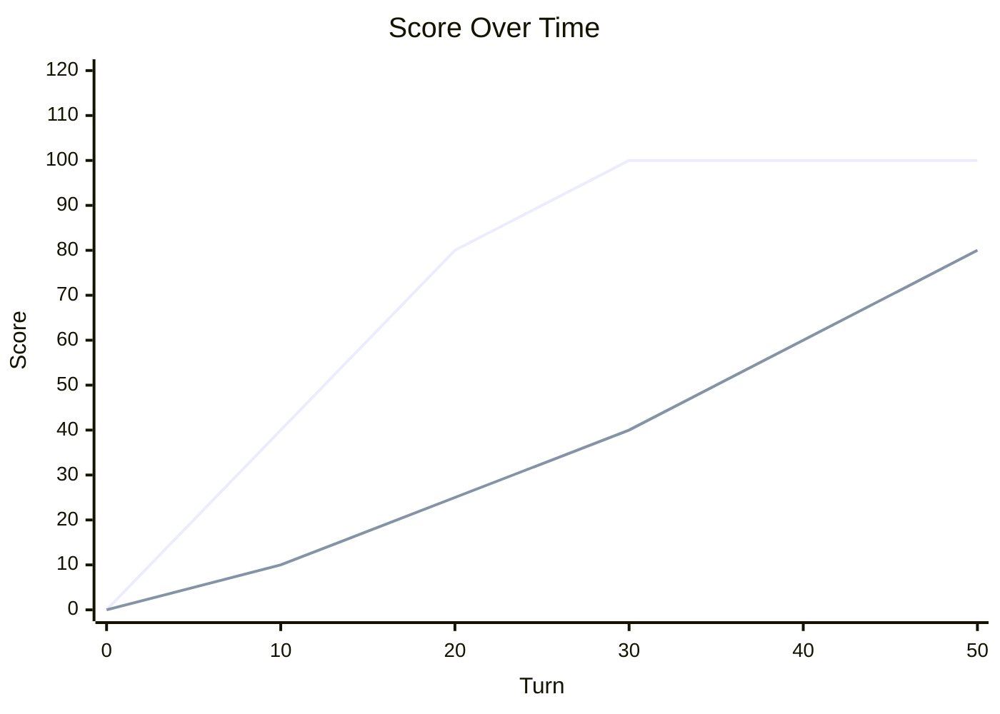

# Scoring Basics

Scoring decides who *wins the battle*, and it is a different thing as "who stayed alive the longest".
In both classic Robocode and Robocode Tank Royale, the biggest points usually come from **dealing damage**
(consistently hitting with bullets) and finishing opponents.

A common surprise is that another bot can score higher even if it dies before you do. That usually means it
landed more (or better) hits earlier, earned more damage points, and possibly got kill bonuses.

## What a participant is (bot vs team)

Robocode talks about the **participant** that receives points.

- In a 1v1 or melee free-for-all, a participant is usually a single bot.
- In a team battle, the participant is the **team**. Points are credited to the team total.

Practical takeaway: if the goal is to win, the bot logic should optimize the participant's score (often team score),
not just personal survival.

## The core idea: damage is the main currency

Most scoring systems in Robocode are built around a simple idea:

- When a bullet hits, it causes **damage**.
- That damage is converted into **score**.
- Finishing opponents (being the last hit that kills them) adds an extra score.

So, two bots can have very different end-results:

- **Accurate attacker**: dies earlier, but hits many bullets — earns high damage points.
- **Passive survivor**: stays alive by avoiding fights — earns few damage points — often loses on score.

> **Tip:**
> If the bot fires a lot but doesn't hit, it's paying energy for shots (see bullet physics) but not earning damage
> points.
>
> "Make every shot count" is not just strategy advice — it's a scoring rule in disguise.

*Chart: Bot A scores quickly and dies at turn 30 with a higher score. Bot B survives to turn 50 but ends with a lower
score.*

Legend:

- **Bot A (dies at 30)**: High-scoring bot that dies early but has a higher total score.
- **Bot B (survives)**: Lower-scoring bot that survives longer but ends with a lower total score.

## Where points come from (high-level)

The exact formulas differ by platform and ruleset, but the categories are similar:

- **Bullet damage points**: gained when bullets hit and deal damage.
- **Kill / last-hit bonus**: gained when a bot delivers the final damage that kills an opponent.
- **Survival / placement points**: gained for being alive longer or placing higher (especially in melee).
- **Bonus points** (ruleset-dependent): e.g., behavior-based bonuses, team-related scoring, etc.

In practice, damage and kill bonuses tend to dominate in duels, while survival/placement matters more in melees.

## Accuracy beats spam: why hits matter more than shots

Scoring rewards results, not intent. A shot only becomes valuable when it connects.

A useful mental model is to think in terms of *expected score*:

> expectedScorePerShot = hitChance × pointsIfHit
>
> - If hitChance is low, max power can be a trap:
> - it creates a long gun cooldown and still scores 0 if it misses.

This is why another bot might outscore you even if it gets eliminated sooner:

- It consistently landed shots (high `hitChance`).
- It chose situations where shots had high value (short range, cornered target, disabled target).
- It collected kill bonuses by finishing opponents.

## Bullet power affects scoring (indirectly, but strongly)

Bullet power doesn't just change damage — it changes *how easy it is to score damage*.

- Higher power — higher damage per hit — more points when it connects.
- But higher power is also **slower bullets** and **more gun heat**, which often reduces hit rate and rate of fire.

So the best scoring choice is rarely 'always fire max power'. It usually is:

- Use enough power to make hits meaningful.
- Keep hit chance high by preferring closer shots and good aim.
- Avoid long-cooldown misses.

(See `Bullet Travel & Bullet Physics` and `Gun Heat and Cooling` for the underlying mechanics.)

## Platform notes (Classic vs Tank Royale)

This page focuses on *how to think about scoring* rather than memorizing every constant.

- **Classic Robocode**: scoring is traditionally described in terms of damage points plus bonuses (e.g., for kills and
  survival). The RoboWiki page breaks down the classic categories and formulas.
- **Robocode Tank Royale**: scoring is documented explicitly in the Tank Royale scoring page. The categories are
  similar,
  but details and naming may differ.

If a bot's goal is "win more rounds," it should be written to maximize score under the platform's rules:

- Prefer behavior that *converts energy into hits* (good targeting and selection of when to fire).
- Prefer behavior that *avoids giving opponents easy damage* (movement and positioning).

## Tips and common mistakes

- **Don't confuse surviving with winning**: in many battles, survival points are not enough to beat strong damage
  output.
- **Avoid passive play**: running away can keep the bot alive, but it may lose on score if it does not deal damage.
- **Don't fire when you have no solution**: low-probability shots reduce accuracy and waste valuable 'gun ready' turns.
- **Finish fights when possible**: securing the last hit often matters.
- **Watch melee interactions**: in melees, third-party bots can steal kills and damage points; choosing *when* to engage
  can be as important as aiming.
