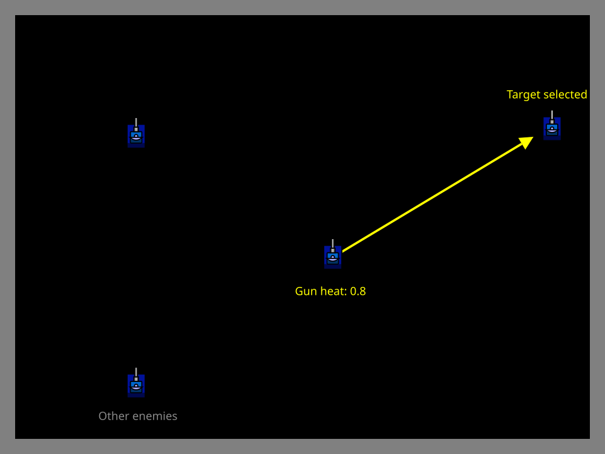

# Gun Heat Lock

> [!TIP] Origins
> **Gun Heat Lock** was developed and documented by the RoboWiki community as an optimization strategy that coordinates
> radar and gun systems in melee battles.

In melee combat, radar time is precious, you need to track multiple opponents while your targeting system requires fresh
data to aim accurately. **Gun heat lock** solves this coordination problem by using **gun heat** as a timing signal to
focus the radar on whichever enemy the gun is about to fire at.

This technique ensures that the most critical scan, the one your targeting system needs right before firing, happens at
exactly the right moment, maximizing the accuracy of each shot.

## The Coordination Problem

Most melee radar strategies treat scanning and targeting as separate concerns:

- **Spinning radar:** Scans all enemies equally, but targeting data may be stale when firing.
- **Oldest scanned:** Prioritizes stale data but might scan low-priority targets when the gun is ready.
- **Random melee guns:** Select targets independently of which enemies were recently scanned.

This creates a mismatch: the radar might scan a distant, low-threat enemy while the targeting system needs fresh data
on a nearby target the gun is about to fire at. The result is reduced accuracy and wasted opportunities.

Gun heat lock bridges this gap by coordinating the two systems: when the gun is about to fire, lock the radar onto the
enemy the targeting system has selected.

## How Gun Heat Lock Works

The strategy uses **gun heat** as a trigger to switch radar behavior:

1. **When gun heat is high:** Use a standard melee radar pattern (spinning, oldest scanned, etc.) to maintain general
   awareness of all enemies.
2. **When gun heat is low:** Lock the radar onto whichever enemy the targeting system has chosen as the next target.
3. **Scan right before firing:** Keep the radar pointed at the target until a fresh scan is obtained, then fire
   immediately.

This ensures that the targeting system receives the freshest possible data about the enemy's position and velocity at
the moment of firing, improving hit rates without sacrificing situational awareness.


<br>
*Gun heat lock focuses radar on the firing target when gun heat is low*

## Implementation Strategy

The example below keeps a small target table, selects the closest high-energy target, and switches from a broad radar
spin to a target lock when gun heat drops below 1.0. A scan of the selected target triggers a shot only when the gun is
ready, so stale coordinates are not treated as a firing confirmation.

::: code-group

```java [Classic · Java]
import java.util.HashMap;
import java.util.Map;

import robocode.AdvancedRobot;
import robocode.RobotDeathEvent;
import robocode.ScannedRobotEvent;
import robocode.util.Utils;

public class GunHeatLockBot extends AdvancedRobot {
    private static final double HEAT_THRESHOLD = 1.0;
    private static final double FIRE_POWER = 1.0;
    private static final double SCAN_BUFFER = 10;
    private final Map<String, EnemyState> enemies = new HashMap<>();

    @Override
    public void run() {
        setAdjustGunForRobotTurn(true);
        setAdjustRadarForGunTurn(true);

        while (true) {
            EnemyState target = selectBestTarget();
            if (getGunHeat() <= HEAT_THRESHOLD && target != null) {
                lockRadarOn(target);
            } else {
                setTurnRadarRight(Double.POSITIVE_INFINITY);
            }
            execute();
        }
    }

    @Override
    public void onScannedRobot(ScannedRobotEvent event) {
        double absoluteBearing = Math.toRadians(getHeading() + event.getBearing());
        double x = getX() + Math.sin(absoluteBearing) * event.getDistance();
        double y = getY() + Math.cos(absoluteBearing) * event.getDistance();
        enemies.put(event.getName(), new EnemyState(x, y, event.getDistance(), event.getEnergy()));

        EnemyState target = selectBestTarget();
        if (target != null && enemies.get(event.getName()) == target
                && getGunHeat() <= 0.0 && getEnergy() > FIRE_POWER) {
            setFire(FIRE_POWER);
        }
    }

    @Override
    public void onRobotDeath(RobotDeathEvent event) {
        enemies.remove(event.getName());
    }

    private EnemyState selectBestTarget() {
        EnemyState best = null;
        double bestScore = Double.NEGATIVE_INFINITY;
        for (EnemyState enemy : enemies.values()) {
            double score = 1000.0 / Math.max(enemy.distance, 1.0) + enemy.energy / 10.0;
            if (score > bestScore) {
                bestScore = score;
                best = enemy;
            }
        }
        return best;
    }

    private void lockRadarOn(EnemyState target) {
        double dx = target.x - getX();
        double dy = target.y - getY();
        double targetHeading = Math.toDegrees(Math.atan2(dx, dy));
        double turn = Utils.normalRelativeAngleDegrees(targetHeading - getRadarHeading());
        setTurnRadarRight(turn + (turn >= 0 ? SCAN_BUFFER : -SCAN_BUFFER));
    }

    private static class EnemyState {
        final double x;
        final double y;
        final double distance;
        final double energy;

        EnemyState(double x, double y, double distance, double energy) {
            this.x = x;
            this.y = y;
            this.distance = distance;
            this.energy = energy;
        }
    }
}
```

```python [Tank Royale · Python]
import math
from dataclasses import dataclass

from robocode_tank_royale.bot_api import Bot
from robocode_tank_royale.bot_api.events import BotDeathEvent, ScannedBotEvent


@dataclass
class EnemyState:
    bot_id: int
    x: float
    y: float
    distance: float
    energy: float


class GunHeatLockBot(Bot):
    HEAT_THRESHOLD = 1.0
    FIRE_POWER = 1.0
    SCAN_BUFFER = 10.0

    def __init__(self) -> None:
        super().__init__()
        self.enemies: dict[int, EnemyState] = {}

    def run(self) -> None:
        while self.running:
            target = self.select_best_target()
            if self.gun_heat <= self.HEAT_THRESHOLD and target is not None:
                self.lock_radar_on(target)
            else:
                self.set_turn_radar_right(float("inf"))
            self.go()

    def on_scanned_bot(self, event: ScannedBotEvent) -> None:
        distance = math.hypot(event.x - self.x, event.y - self.y)
        self.enemies[event.scanned_bot_id] = EnemyState(
            event.scanned_bot_id, event.x, event.y, distance, event.energy)

        target = self.select_best_target()
        if (target is not None and target.bot_id == event.scanned_bot_id
                and self.gun_heat <= 0.0 and self.energy > self.FIRE_POWER):
            self.set_fire(self.FIRE_POWER)

    def on_bot_death(self, event: BotDeathEvent) -> None:
        self.enemies.pop(event.victim_id, None)

    def select_best_target(self) -> EnemyState | None:
        return max(self.enemies.values(), key=self.target_score, default=None)

    @staticmethod
    def target_score(enemy: EnemyState) -> float:
        return 1000.0 / max(enemy.distance, 1.0) + enemy.energy / 10.0

    def lock_radar_on(self, target: EnemyState) -> None:
        target_direction = math.degrees(math.atan2(target.y - self.y, target.x - self.x))
        turn = normalize_relative_angle(target_direction - self.radar_direction)
        turn += self.SCAN_BUFFER if turn >= 0 else -self.SCAN_BUFFER
        self.set_turn_radar_right(turn)


def normalize_relative_angle(angle: float) -> float:
    while angle <= -180:
        angle += 360
    while angle > 180:
        angle -= 360
    return angle


def main() -> None:
    GunHeatLockBot().start()


if __name__ == "__main__":
    main()
```

```java [Tank Royale · Java]
import java.util.HashMap;
import java.util.Map;

import dev.robocode.tankroyale.botapi.Bot;
import dev.robocode.tankroyale.botapi.events.BotDeathEvent;
import dev.robocode.tankroyale.botapi.events.ScannedBotEvent;

public class GunHeatLockBot extends Bot {
    private static final double HEAT_THRESHOLD = 1.0;
    private static final double FIRE_POWER = 1.0;
    private static final double SCAN_BUFFER = 10;
    private final Map<Integer, EnemyState> enemies = new HashMap<>();

    public static void main(String[] args) {
        new GunHeatLockBot().start();
    }

    @Override
    public void run() {
        while (isRunning()) {
            EnemyState target = selectBestTarget();
            if (getGunHeat() <= HEAT_THRESHOLD && target != null) {
                lockRadarOn(target);
            } else {
                setTurnRadarRight(Double.POSITIVE_INFINITY);
            }
            go();
        }
    }

    @Override
    public void onScannedBot(ScannedBotEvent event) {
        double distance = Math.hypot(event.getX() - getX(), event.getY() - getY());
        enemies.put(event.getScannedBotId(), new EnemyState(
                event.getScannedBotId(), event.getX(), event.getY(), distance, event.getEnergy()));

        EnemyState target = selectBestTarget();
        if (target != null && target.id == event.getScannedBotId()
                && getGunHeat() <= 0.0 && getEnergy() > FIRE_POWER) {
            setFire(FIRE_POWER);
        }
    }

    @Override
    public void onBotDeath(BotDeathEvent event) {
        enemies.remove(event.getVictimId());
    }

    private EnemyState selectBestTarget() {
        EnemyState best = null;
        double bestScore = Double.NEGATIVE_INFINITY;
        for (EnemyState enemy : enemies.values()) {
            double score = 1000.0 / Math.max(enemy.distance, 1.0) + enemy.energy / 10.0;
            if (score > bestScore) {
                bestScore = score;
                best = enemy;
            }
        }
        return best;
    }

    private void lockRadarOn(EnemyState target) {
        double targetDirection = Math.toDegrees(Math.atan2(
                target.y - getY(), target.x - getX()));
        double turn = normalizeRelativeAngle(targetDirection - getRadarDirection());
        setTurnRadarRight(turn + (turn >= 0 ? SCAN_BUFFER : -SCAN_BUFFER));
    }

    private static double normalizeRelativeAngle(double angle) {
        while (angle <= -180) {
            angle += 360;
        }
        while (angle > 180) {
            angle -= 360;
        }
        return angle;
    }

    private static class EnemyState {
        final int id;
        final double x;
        final double y;
        final double distance;
        final double energy;

        EnemyState(int id, double x, double y, double distance, double energy) {
            this.id = id;
            this.x = x;
            this.y = y;
            this.distance = distance;
            this.energy = energy;
        }
    }
}
```

```csharp [Tank Royale · C#]
using System;
using System.Collections.Generic;
using Robocode.TankRoyale.BotApi;
using Robocode.TankRoyale.BotApi.Events;

public class GunHeatLockBot : Bot
{
    private const double HeatThreshold = 1.0;
    private const double FirePower = 1.0;
    private const double ScanBuffer = 10;
    private readonly Dictionary<int, EnemyState> enemies = new();

    static void Main(string[] args)
    {
        new GunHeatLockBot().Start();
    }

    public override void Run()
    {
        while (IsRunning)
        {
            EnemyState target = SelectBestTarget();
            if (GunHeat <= HeatThreshold && target != null)
            {
                LockRadarOn(target);
            }
            else
            {
                SetTurnRadarRight(double.PositiveInfinity);
            }
            Go();
        }
    }

    public override void OnScannedBot(ScannedBotEvent evt)
    {
        double distance = Math.Sqrt(Math.Pow(evt.X - X, 2) + Math.Pow(evt.Y - Y, 2));
        enemies[evt.ScannedBotId] = new EnemyState(
            evt.ScannedBotId, evt.X, evt.Y, distance, evt.Energy);

        EnemyState target = SelectBestTarget();
        if (target != null && target.Id == evt.ScannedBotId
                && GunHeat <= 0.0 && Energy > FirePower)
        {
            SetFire(FirePower);
        }
    }

    public override void OnBotDeath(BotDeathEvent evt)
    {
        enemies.Remove(evt.VictimId);
    }

    private EnemyState SelectBestTarget()
    {
        EnemyState best = null;
        double bestScore = double.NegativeInfinity;
        foreach (EnemyState enemy in enemies.Values)
        {
            double score = 1000.0 / Math.Max(enemy.Distance, 1.0) + enemy.Energy / 10.0;
            if (score > bestScore)
            {
                bestScore = score;
                best = enemy;
            }
        }
        return best;
    }

    private void LockRadarOn(EnemyState target)
    {
        double targetDirection = Math.Atan2(target.Y - Y, target.X - X) * 180 / Math.PI;
        double turn = NormalizeRelativeAngle(targetDirection - RadarDirection);
        SetTurnRadarRight(turn + (turn >= 0 ? ScanBuffer : -ScanBuffer));
    }

    private static double NormalizeRelativeAngle(double angle)
    {
        while (angle <= -180)
        {
            angle += 360;
        }
        while (angle > 180)
        {
            angle -= 360;
        }
        return angle;
    }

    private sealed class EnemyState
    {
        public EnemyState(int id, double x, double y, double distance, double energy)
        {
            Id = id;
            X = x;
            Y = y;
            Distance = distance;
            Energy = energy;
        }

        public int Id { get; }
        public double X { get; }
        public double Y { get; }
        public double Distance { get; }
        public double Energy { get; }
    }
}
```

```typescript [Tank Royale · TypeScript]
import { Bot, BotDeathEvent, ScannedBotEvent } from "@robocode.dev/tank-royale-bot-api";

type EnemyState = {
    id: number;
    x: number;
    y: number;
    distance: number;
    energy: number;
};

class GunHeatLockBot extends Bot {
    private static readonly heatThreshold = 1.0;
    private static readonly firePower = 1.0;
    private static readonly scanBuffer = 10;
    private readonly enemies = new Map<number, EnemyState>();

    static main() {
        new GunHeatLockBot().start();
    }

    override run() {
        while (this.isRunning()) {
            const target = this.selectBestTarget();
            if (this.gunHeat <= GunHeatLockBot.heatThreshold && target !== undefined) {
                this.lockRadarOn(target);
            } else {
                this.setTurnRadarRight(Number.POSITIVE_INFINITY);
            }
            this.go();
        }
    }

    override onScannedBot(event: ScannedBotEvent) {
        const distance = Math.hypot(event.x - this.x, event.y - this.y);
        this.enemies.set(event.scannedBotId, {
            id: event.scannedBotId,
            x: event.x,
            y: event.y,
            distance,
            energy: event.energy,
        });

        const target = this.selectBestTarget();
        if (target !== undefined && target.id === event.scannedBotId
                && this.gunHeat <= 0.0 && this.energy > GunHeatLockBot.firePower) {
            this.setFire(GunHeatLockBot.firePower);
        }
    }

    override onBotDeath(event: BotDeathEvent) {
        this.enemies.delete(event.victimId);
    }

    private selectBestTarget(): EnemyState | undefined {
        let best: EnemyState | undefined;
        let bestScore = Number.NEGATIVE_INFINITY;
        for (const enemy of this.enemies.values()) {
            const score = 1000 / Math.max(enemy.distance, 1) + enemy.energy / 10;
            if (score > bestScore) {
                bestScore = score;
                best = enemy;
            }
        }
        return best;
    }

    private lockRadarOn(target: EnemyState) {
        const targetDirection = Math.atan2(target.y - this.y, target.x - this.x) * 180 / Math.PI;
        const turn = GunHeatLockBot.normalizeRelativeAngle(
            targetDirection - this.radarDirection);
        this.setTurnRadarRight(GunHeatLockBot.bufferedTurn(turn));
    }

    private static bufferedTurn(turn: number) {
        return turn + (turn >= 0 ? this.scanBuffer : -this.scanBuffer);
    }

    private static normalizeRelativeAngle(angle: number) {
        while (angle <= -180) {
            angle += 360;
        }
        while (angle > 180) {
            angle -= 360;
        }
        return angle;
    }
}

GunHeatLockBot.main();
```

:::

## Choosing the Gun Heat Threshold

The threshold value trades off between scan freshness and situational awareness:

**Lower threshold (0.5-1.0 heat):**
- **Pros:** Maintains broad radar coverage longer; better melee awareness.
- **Cons:** Less time to lock on target; may miss scans if target moves unpredictably.
- **Best for:** Chaotic battles with many close-range threats.

**Higher threshold (1.5-2.5 heat):**
- **Pros:** More time to acquire and maintain lock; higher hit rates.
- **Cons:** Reduces radar time spent on other enemies; creates blind spots.
- **Best for:** Battles with fewer remaining enemies or when targeting accuracy is critical.

Adaptive bots adjust this threshold dynamically based on how many enemies remain: use higher thresholds in late-game
1v1 or 2v2 scenarios, lower thresholds in crowded early-game melees.

## Integration with Targeting Systems

Gun heat lock works best with targeting systems that:

1. **Select targets deterministically:** The same enemy should be the target for multiple turns while gun cools.
2. **Prioritize threats:** Target selection considers distance, energy, and danger level.
3. **Use fresh scan data:** The targeting algorithm benefits from up-to-date position and velocity.

**Example target selection criteria:** the code assigns each tracked enemy a score of
`1000 / max(distance, 1) + energy / 10`. This is only a teaching heuristic. A stronger bot can add recent damage,
team status, bullet danger, or a targeting model without changing the radar coordination.

## Advantages and Trade-offs

**Advantages:**
- **Improved accuracy:** Fresh scan data at the moment of firing increases hit rates.
- **Efficient coordination:** Radar focuses on high-priority targets when it matters most.
- **Adaptive coverage:** General scanning continues during gun cool-down periods.

**Trade-offs:**
- **Complexity:** Requires coordination between radar, targeting, and gun systems.
- **Blind spots:** While locked on one enemy, others may move without being scanned.
- **Implementation overhead:** More sophisticated than simple spinning or oldest scanned patterns.

Gun heat lock is most effective when facing 3-5 remaining enemies. In larger melees (8+ bots), the blind spots created
by locking become more dangerous. In late-game 1v1 scenarios, it converges toward standard 1v1 radar locks.

## Tips & Common Mistakes

**Do:**
- Implement fallback to standard melee radar when gun heat is high.
- Track enemy death events to avoid locking onto destroyed enemies.
- Test different gun heat threshold values against various melee opponents.
- Ensure target selection happens before radar decision each turn.

**Don't:**
- Lock on stale enemies, verify the target was scanned recently before firing.
- Use gun heat lock in 1v1 battles, standard 1v1 radar locks are simpler and more effective.
- Handle the case where no target is available (all enemies destroyed or none selected).
- Lock too early (high threshold) in crowded melees, situational awareness suffers.

> [!WARNING] Death Event Handling
> Always remove destroyed enemies from target selection immediately. A gun heat lock on a dead enemy wastes precious
> radar time pointing at empty space while live threats go unscanned.

## When to Use Gun Heat Lock

**Ideal situations:**
- Mid-game melee battles with 3-6 remaining enemies.
- Bots with sophisticated threat assessment and target prioritization.
- When targeting accuracy is more valuable than broad situational awareness.

**Better alternatives:**
- **Early game (8+ enemies):** Use spinning or oldest scanned for broader coverage.
- **Late game (2 enemies):** Transition to standard 1v1 radar locks.
- **Simple bots:** Start with spinning or oldest scanned before adding gun heat lock complexity.

Gun heat lock represents the intersection of radar, targeting, and game timing. When implemented well, it squeezes extra
accuracy out of every shot by ensuring the targeting system always has the freshest possible data.

## Further Reading

- **[Radar Basics](../radar-basics.md)**: Fundamental radar mechanics and scanning patterns.
- **[Oldest Scanned](./oldest-scanned.md)**: Alternative melee radar strategy without gun coordination.
- **[Spinning & Corner Arc](./spinning-and-corner-arc.md)**: Simpler melee radar patterns.
- **[Gun Heat and Cooling](../../physics/gun-heat-and-cooling.md)**: Understanding gun heat mechanics and timing.
