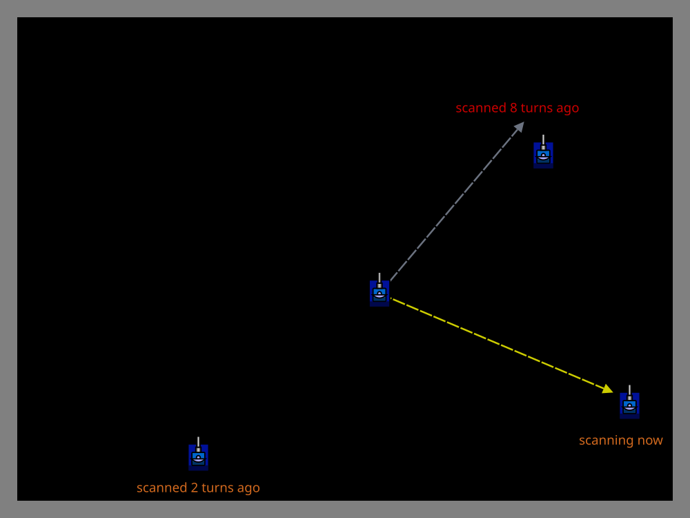

# Oldest Scanned

> [!TIP] Origins
> **Oldest Scanned** was developed and documented by the RoboWiki community as an intelligent melee radar strategy
> that improves upon simple spinning patterns.

In melee battles with multiple opponents, maintaining up-to-date information on all enemies is critical for accurate
targeting and threat assessment. The **oldest scanned** strategy solves this by tracking when each enemy was last seen
and prioritizing radar time toward the most stale data.

This approach ensures all enemies receive relatively equal attention while naturally spending more time on threats that
have been missed during recent scans. The result is more balanced situational awareness than simple spinning radar
provides.

## The Problem with Spinning Radar

A continuously spinning radar sweeps the battlefield at a constant rate, but this has limitations in melee:

- **Uneven coverage:** Enemies close together get scanned in quick succession; distant enemies wait longer.
- **Wasted effort:** The radar spends time sweeping empty space between widely-separated opponents.
- **No prioritization:** Fast-moving or dangerous enemies receive no special attention.

As battles progress and bots are eliminated, these inefficiencies grow. A spinning radar continues its full 360° sweep
even when only 2-3 opponents remain, scanning empty space where destroyed bots used to be.

## How Oldest Scanned Works

The oldest scanned strategy maintains a **timestamp** for each enemy indicating when it was last detected. On each
turn, the radar identifies which enemy has the oldest timestamp and turns toward it.

The algorithm follows this pattern:

1. **Store scan data:** When a bot is scanned, record the current turn number as its last-seen timestamp.
2. **Remove dead enemies:** When a bot dies, remove it from the tracking data immediately.
3. **Find oldest enemy:** Each turn, iterate through all known enemies and find the one with the oldest timestamp.
4. **Point radar:** Calculate the bearing to the oldest enemy and turn the radar toward it.
5. **Scan width buffer:** Add extra radar turn to account for enemy movement and ensure a hit.

This creates an adaptive scanning pattern that focuses attention where information is most stale, naturally balancing
coverage across all active threats.


<br>
*Oldest scanned radar prioritizes the enemy with the most stale scan data*

## Implementation Strategy

The implementation stores the last known position and scan turn for each enemy. The radar then turns toward the
oldest entry, with a small buffer to account for movement between scans. The examples use a 15-degree buffer, which is
a starting point rather than a universal best value.

::: code-group

```java [Classic · Java]
import java.util.HashMap;
import java.util.Map;

import robocode.AdvancedRobot;
import robocode.RobotDeathEvent;
import robocode.ScannedRobotEvent;
import robocode.util.Utils;

public class OldestScannedBot extends AdvancedRobot {
    private static final double SCAN_BUFFER = 15;
    private final Map<String, EnemyState> enemies = new HashMap<>();

    @Override
    public void run() {
        while (true) {
            EnemyState target = oldestEnemy();
            if (target == null) {
                setTurnRadarRight(Double.POSITIVE_INFINITY);
            } else {
                double dx = target.x - getX();
                double dy = target.y - getY();
                double targetHeading = Math.toDegrees(Math.atan2(dx, dy));
                double turn = Utils.normalRelativeAngleDegrees(
                        targetHeading - getRadarHeading());
                setTurnRadarRight(bufferedTurn(turn));
            }
            execute();
        }
    }

    @Override
    public void onScannedRobot(ScannedRobotEvent event) {
        double absoluteBearing = Math.toRadians(getHeading() + event.getBearing());
        double x = getX() + Math.sin(absoluteBearing) * event.getDistance();
        double y = getY() + Math.cos(absoluteBearing) * event.getDistance();
        enemies.put(event.getName(), new EnemyState(x, y, getTime()));
    }

    @Override
    public void onRobotDeath(RobotDeathEvent event) {
        enemies.remove(event.getName());
    }

    private EnemyState oldestEnemy() {
        EnemyState oldest = null;
        for (EnemyState enemy : enemies.values()) {
            if (oldest == null || enemy.lastScanTurn < oldest.lastScanTurn) {
                oldest = enemy;
            }
        }
        return oldest;
    }

    private static double bufferedTurn(double turn) {
        return turn == 0 ? SCAN_BUFFER : turn + Math.copySign(SCAN_BUFFER, turn);
    }

    private static class EnemyState {
        final double x;
        final double y;
        final long lastScanTurn;

        EnemyState(double x, double y, long lastScanTurn) {
            this.x = x;
            this.y = y;
            this.lastScanTurn = lastScanTurn;
        }
    }
}
```

```python [Tank Royale · Python]
import math
from dataclasses import dataclass

from robocode_tank_royale.bot_api import Bot
from robocode_tank_royale.bot_api.events import BotDeathEvent, ScannedBotEvent


@dataclass
class EnemyState:
    x: float
    y: float
    last_scan_turn: int


class OldestScannedBot(Bot):
    SCAN_BUFFER = 15.0

    def __init__(self) -> None:
        super().__init__()
        self.enemies: dict[int, EnemyState] = {}

    def run(self) -> None:
        while self.running:
            target = self.oldest_enemy()
            if target is None:
                self.set_turn_radar_right(float("inf"))
            else:
                target_direction = math.degrees(math.atan2(
                    target.y - self.y, target.x - self.x))
                turn = normalize_relative_angle(target_direction - self.radar_direction)
                self.set_turn_radar_right(self.buffered_turn(turn))
            self.go()

    def on_scanned_bot(self, event: ScannedBotEvent) -> None:
        self.enemies[event.scanned_bot_id] = EnemyState(
            event.x, event.y, event.turn_number)

    def on_bot_death(self, event: BotDeathEvent) -> None:
        self.enemies.pop(event.victim_id, None)

    def oldest_enemy(self) -> EnemyState | None:
        return min(
            self.enemies.values(),
            key=lambda enemy: enemy.last_scan_turn,
            default=None,
        )

    @classmethod
    def buffered_turn(cls, turn: float) -> float:
        return turn + (cls.SCAN_BUFFER if turn >= 0 else -cls.SCAN_BUFFER)


def normalize_relative_angle(angle: float) -> float:
    while angle <= -180:
        angle += 360
    while angle > 180:
        angle -= 360
    return angle


def main() -> None:
    OldestScannedBot().start()


if __name__ == "__main__":
    main()
```

```java [Tank Royale · Java]
import java.util.HashMap;
import java.util.Map;

import dev.robocode.tankroyale.botapi.Bot;
import dev.robocode.tankroyale.botapi.events.BotDeathEvent;
import dev.robocode.tankroyale.botapi.events.ScannedBotEvent;

public class OldestScannedBot extends Bot {
    private static final double SCAN_BUFFER = 15;
    private final Map<Integer, EnemyState> enemies = new HashMap<>();

    public static void main(String[] args) {
        new OldestScannedBot().start();
    }

    @Override
    public void run() {
        while (isRunning()) {
            EnemyState target = oldestEnemy();
            if (target == null) {
                setTurnRadarRight(Double.POSITIVE_INFINITY);
            } else {
                double targetDirection = Math.toDegrees(Math.atan2(
                        target.y - getY(), target.x - getX()));
                double turn = normalizeRelativeAngle(
                        targetDirection - getRadarDirection());
                setTurnRadarRight(bufferedTurn(turn));
            }
            go();
        }
    }

    @Override
    public void onScannedBot(ScannedBotEvent event) {
        enemies.put(event.getScannedBotId(), new EnemyState(
                event.getX(), event.getY(), event.getTurnNumber()));
    }

    @Override
    public void onBotDeath(BotDeathEvent event) {
        enemies.remove(event.getVictimId());
    }

    private EnemyState oldestEnemy() {
        EnemyState oldest = null;
        for (EnemyState enemy : enemies.values()) {
            if (oldest == null || enemy.lastScanTurn < oldest.lastScanTurn) {
                oldest = enemy;
            }
        }
        return oldest;
    }

    private static double bufferedTurn(double turn) {
        return turn + (turn >= 0 ? SCAN_BUFFER : -SCAN_BUFFER);
    }

    private static double normalizeRelativeAngle(double angle) {
        while (angle <= -180) {
            angle += 360;
        }
        while (angle > 180) {
            angle -= 360;
        }
        return angle;
    }

    private static class EnemyState {
        final double x;
        final double y;
        final int lastScanTurn;

        EnemyState(double x, double y, int lastScanTurn) {
            this.x = x;
            this.y = y;
            this.lastScanTurn = lastScanTurn;
        }
    }
}
```

```csharp [Tank Royale · C#]
using System;
using System.Collections.Generic;
using Robocode.TankRoyale.BotApi;
using Robocode.TankRoyale.BotApi.Events;

public class OldestScannedBot : Bot
{
    private const double ScanBuffer = 15;
    private readonly Dictionary<int, EnemyState> enemies = new();

    static void Main(string[] args)
    {
        new OldestScannedBot().Start();
    }

    public override void Run()
    {
        while (IsRunning)
        {
            EnemyState target = OldestEnemy();
            if (target == null)
            {
                SetTurnRadarRight(double.PositiveInfinity);
            }
            else
            {
                double targetDirection = Math.Atan2(target.Y - Y, target.X - X) * 180 / Math.PI;
                double turn = NormalizeRelativeAngle(targetDirection - RadarDirection);
                SetTurnRadarRight(BufferedTurn(turn));
            }
            Go();
        }
    }

    public override void OnScannedBot(ScannedBotEvent evt)
    {
        enemies[evt.ScannedBotId] = new EnemyState(evt.X, evt.Y, evt.TurnNumber);
    }

    public override void OnBotDeath(BotDeathEvent evt)
    {
        enemies.Remove(evt.VictimId);
    }

    private EnemyState OldestEnemy()
    {
        EnemyState oldest = null;
        foreach (EnemyState enemy in enemies.Values)
        {
            if (oldest == null || enemy.LastScanTurn < oldest.LastScanTurn)
            {
                oldest = enemy;
            }
        }
        return oldest;
    }

    private static double BufferedTurn(double turn)
    {
        return turn + (turn >= 0 ? ScanBuffer : -ScanBuffer);
    }

    private static double NormalizeRelativeAngle(double angle)
    {
        while (angle <= -180)
        {
            angle += 360;
        }
        while (angle > 180)
        {
            angle -= 360;
        }
        return angle;
    }

    private sealed class EnemyState
    {
        public EnemyState(double x, double y, int lastScanTurn)
        {
            X = x;
            Y = y;
            LastScanTurn = lastScanTurn;
        }

        public double X { get; }
        public double Y { get; }
        public int LastScanTurn { get; }
    }
}
```

```typescript [Tank Royale · TypeScript]
import { Bot, BotDeathEvent, ScannedBotEvent } from "@robocode.dev/tank-royale-bot-api";

type EnemyState = {
    x: number;
    y: number;
    lastScanTurn: number;
};

class OldestScannedBot extends Bot {
    private static readonly scanBuffer = 15;
    private readonly enemies = new Map<number, EnemyState>();

    static main() {
        new OldestScannedBot().start();
    }

    override run() {
        while (this.isRunning()) {
            const target = this.oldestEnemy();
            if (target === undefined) {
                this.setTurnRadarRight(Number.POSITIVE_INFINITY);
            } else {
                const targetDirection = Math.atan2(target.y - this.y, target.x - this.x) * 180 / Math.PI;
                const turn = OldestScannedBot.normalizeRelativeAngle(
                    targetDirection - this.radarDirection);
                this.setTurnRadarRight(OldestScannedBot.bufferedTurn(turn));
            }
            this.go();
        }
    }

    override onScannedBot(event: ScannedBotEvent) {
        this.enemies.set(event.scannedBotId, {
            x: event.x,
            y: event.y,
            lastScanTurn: event.turnNumber,
        });
    }

    override onBotDeath(event: BotDeathEvent) {
        this.enemies.delete(event.victimId);
    }

    private oldestEnemy(): EnemyState | undefined {
        let oldest: EnemyState | undefined;
        for (const enemy of this.enemies.values()) {
            if (oldest === undefined || enemy.lastScanTurn < oldest.lastScanTurn) {
                oldest = enemy;
            }
        }
        return oldest;
    }

    private static bufferedTurn(turn: number) {
        return turn + (turn >= 0 ? this.scanBuffer : -this.scanBuffer);
    }

    private static normalizeRelativeAngle(angle: number) {
        while (angle <= -180) {
            angle += 360;
        }
        while (angle > 180) {
            angle -= 360;
        }
        return angle;
    }
}

OldestScannedBot.main();
```

:::

## Cleaning Up Dead Enemies

A critical implementation detail is removing destroyed enemies from the tracking data. If dead bots remain in the
tracking map, they will have progressively older timestamps and monopolize radar attention, causing the radar
to waste time trying to scan ghosts.

**Use death event cleanup** as the primary approach:

This immediately removes destroyed enemies from tracking, preventing the radar from targeting them. Both classic
Robocode and Tank Royale provide death event notifications, making this the reliable and recommended solution.

An optional timeout can be added as a defensive measure when a bot’s event handling is more complex, but it should not
replace death-event cleanup. A living enemy can legitimately remain unscanned for many turns in a crowded battle.

## Advantages Over Spinning Radar

Oldest scanned provides several benefits:

- **Adaptive coverage:** Naturally focuses on enemies that have been missed, balancing information freshness.
- **Efficient late-game:** As bots are eliminated, radar time concentrates on remaining threats instead of empty space.
- **Target prioritization foundation:** The tracking infrastructure can be extended to prioritize dangerous enemies.
- **Predictable scan frequency:** Each enemy gets scanned at roughly equal intervals, improving targeting consistency.

The strategy is most effective in larger melees (5+ bots) where spinning radar spends significant time on empty space.

## When to Use It

**Use oldest scanned when:**

- The bot needs balanced awareness of multiple threats.
- Melee battles regularly have 5+ participants.
- The bot has reliable enemy tracking data structures.
- Development has progressed beyond basic spinning radar.

**Stick with spinning radar when:**

- The bot is still in early development and simple patterns work.
- Memory and computation are extremely limited.
- The bot uses corner positioning (corner arc is more efficient).
- Scan frequency is less critical than simplicity.

Many competitive melee bots use oldest scanned as their baseline radar, adding additional logic for threat assessment
or gun heat locking later.

> [!WARNING] Stale Data Risk
> If the radar fails to scan an enemy for many turns (e.g., due to a bug), that enemy's old timestamp will monopolize
> radar attention. Always implement timeout cleanup to handle edge cases.

## Platform Notes

Both classic Robocode and Tank Royale support the oldest scanned strategy identically. The main implementation
difference is event handling syntax:

- **Classic Robocode:** Override `onScannedRobot()` and `onRobotDeath()` methods.
- **Tank Royale:** Register event handlers for `ScannedBotEvent` and `BotDeathEvent`.

The core algorithm, tracking timestamps and calculating radar turns, is identical across platforms.

## Tips & Common Mistakes

**Timestamp management:**

- Use turn numbers (integers) as timestamps for simplicity.
- Store timestamps in the same data structure as enemy bearing/distance.
- Always implement `onRobotDeath()` to remove dead enemies immediately.
- Optionally add timeout cleanup as a backup safety measure.

**Radar turn calculation:**

- Always normalize angles to the range [-180°, 180°] before turning.
- Add a scan buffer (10-30°) in the direction of turn to ensure enemy is hit.
- Test buffer values empirically, too small misses enemies, too large wastes time.

**Initial discovery:**

- On the first turn, no enemies have been scanned yet.
- Start with a full spin until at least one enemy is detected.
- Handle the case where the tracking map is empty gracefully.

**Integration with targeting:**

- The same enemy tracking data can be used for targeting systems.
- Ensure targeting code uses the most recent scan data, not oldest.
- Consider separate data structures if targeting needs differ from radar needs.

## Further Reading

- [Melee Radar](https://robowiki.net/wiki/Melee_Radar) - RoboWiki (classic Robocode)
- [Radar](https://robowiki.net/wiki/Radar) - RoboWiki (classic Robocode)
- [Robocode Tank Royale - Anatomy](https://robocode.dev/articles/anatomy.html) - Tank Royale documentation
