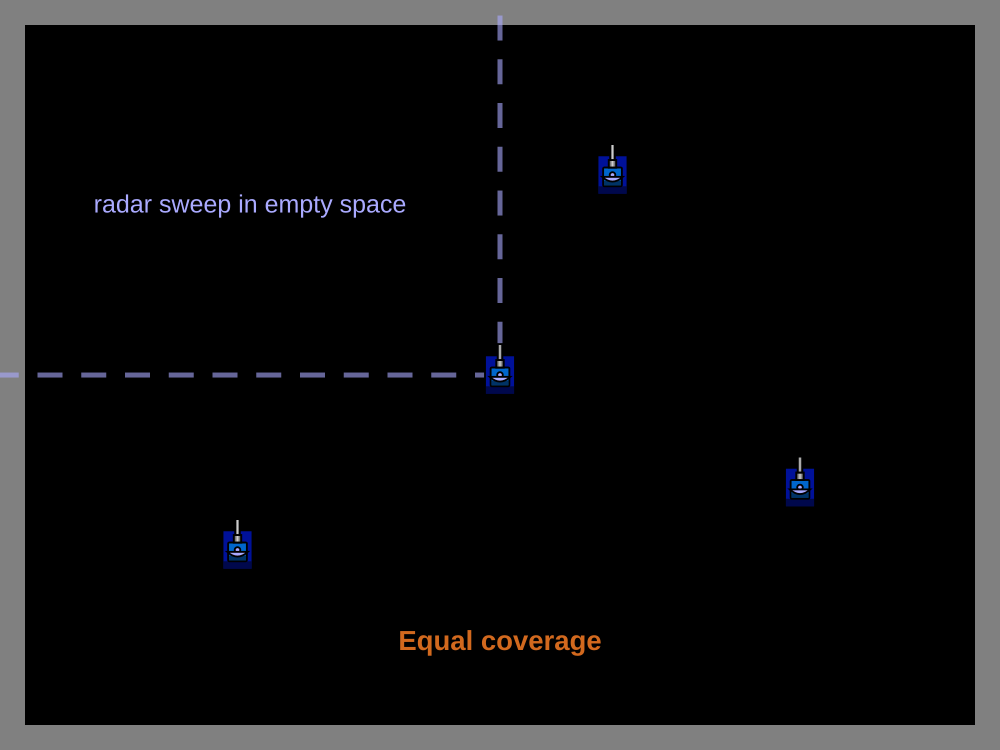
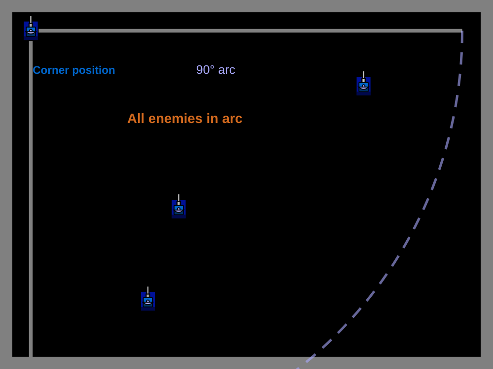

# Spinning & Corner Arc

> [!TIP] Origins
> **Spinning Radar** and **Corner Arc** patterns were developed and documented by the RoboWiki community as 
> foundational melee radar strategies.

In melee battles with multiple opponents, radar management becomes critical. Two simple but effective strategies form 
the foundation of melee radar: continuous spinning for broad awareness and corner arc for tactical positioning.

These patterns solve different problems: spinning radar provides even coverage of all enemies, while corner arc 
optimizes radar time when positioned strategically in a corner.

## Spinning Radar for Melee

The simplest melee radar strategy is identical to the basic spinning pattern used in
[1v1](/appendices/glossary#_1v1-one-on-one-duel): keep the radar turning 
continuously to sweep the entire battlefield.

In melee, this approach has distinct advantages:

- **Democratic coverage:** Every bot gets scanned with roughly equal frequency.
- **No blind spots:** The radar never stops moving, ensuring no region goes unwatched for long.
- **Simple implementation:** No complex tracking logic or state management required.
- **Reliable discovery:** New threats are detected quickly as they enter radar range.

The downside is efficiency: in a 10-bot melee, the radar spends most of its time sweeping empty space between distant 
opponents. More sophisticated strategies like **oldest scanned** or **gun heat lock** can improve scan frequency on 
high-priority targets.

<br>
*Spinning radar in melee provides even coverage but sweeps through empty space*

### Implementation Pattern

The spinning radar pattern uses the same technique as in 1v1. The basic search mode is straightforward to implement in
each supported API:

::: code-group

```java [Classic · Java]
import robocode.AdvancedRobot;

public class MeleeSpinningRadarBot extends AdvancedRobot {
    @Override
    public void run() {
        setTurnRadarLeft(Double.POSITIVE_INFINITY);

        while (true) {
            execute();
        }
    }
}
```

```python [Tank Royale · Python]
from robocode_tank_royale.bot_api import Bot


class MeleeSpinningRadarBot(Bot):
    def run(self) -> None:
        self.set_turn_radar_left(float("inf"))

        while self.running:
            self.go()


def main() -> None:
    MeleeSpinningRadarBot().start()


if __name__ == "__main__":
    main()
```

```java [Tank Royale · Java]
import dev.robocode.tankroyale.botapi.Bot;

public class MeleeSpinningRadarBot extends Bot {
    public static void main(String[] args) {
        new MeleeSpinningRadarBot().start();
    }

    @Override
    public void run() {
        setTurnRadarLeft(Double.POSITIVE_INFINITY);

        while (isRunning()) {
            go();
        }
    }
}
```

```csharp [Tank Royale · C#]
using Robocode.TankRoyale.BotApi;

public class MeleeSpinningRadarBot : Bot
{
    static void Main(string[] args)
    {
        new MeleeSpinningRadarBot().Start();
    }

    public override void Run()
    {
        SetTurnRadarLeft(double.PositiveInfinity);

        while (IsRunning)
        {
            Go();
        }
    }
}
```

```typescript [Tank Royale · TypeScript]
import { Bot } from "@robocode.dev/tank-royale-bot-api";

class MeleeSpinningRadarBot extends Bot {
    static main() {
        new MeleeSpinningRadarBot().start();
    }

    override run() {
        this.setTurnRadarLeft(Number.POSITIVE_INFINITY);

        while (this.isRunning()) {
            this.go();
        }
    }
}

MeleeSpinningRadarBot.main();
```

:::

This pattern works well for beginner and intermediate melee bots. It provides adequate situational awareness without 
complex logic.

## Corner Arc Strategy

**Corner arc** is a specialized radar pattern designed for bots that position themselves in battlefield corners. When 
in a corner, all enemies must be located within a 90-degree arc in front of the bot.

This geometric constraint allows the radar to scan more efficiently:

- **Reduced sweep angle:** Only 90° needs coverage instead of 360°.
- **Higher scan frequency:** Each enemy is scanned roughly 4× more often than with full spinning.
- **Predictable coverage:** The limited arc is easy to optimize and reason about.

Corner arc is most effective when combined with **corner movement** strategies that keep the bot positioned against 
walls. If the bot moves away from corners frequently, the reduced arc becomes a liability, creating large blind spots.

The corner-specific implementation remains conceptual here: its arc boundaries depend on the bot's current corner and
the platform's angle convention. Verify those calculations carefully before turning this pattern into reusable code.

<br>
*Corner arc radar covers only the 90° quadrant in front of a corner-positioned bot*

### Implementation Pattern

Corner arc requires knowing the battlefield dimensions and current bot position to determine the appropriate sweep
range. The examples below use a 100-unit corner threshold and fall back to a full spin whenever the bot leaves a corner.

::: code-group

```java [Classic · Java]
import robocode.AdvancedRobot;

public class MeleeCornerArcRadarBot extends AdvancedRobot {
    private static final double THRESHOLD = 100;
    private static final double TWO_PI = 2 * Math.PI;
    private boolean sweepRight = true;

    @Override
    public void run() {
        while (true) {
            controlRadar();
            execute();
        }
    }

    private void controlRadar() {
        Arc arc = cornerArc();
        if (arc == null) {
            setTurnRadarRightRadians(Double.POSITIVE_INFINITY);
            return;
        }

        double heading = positiveAngle(getRadarHeadingRadians());
        if (arc.end == TWO_PI && heading < 1e-9) {
            heading = TWO_PI;
        }
        if (heading <= arc.start) {
            sweepRight = true;
        } else if (heading >= arc.end) {
            sweepRight = false;
        }

        if (sweepRight) {
            setTurnRadarRightRadians(arc.end - arc.start);
        } else {
            setTurnRadarLeftRadians(arc.end - arc.start);
        }
    }

    private Arc cornerArc() {
        boolean left = getX() < THRESHOLD;
        boolean right = getX() > getBattleFieldWidth() - THRESHOLD;
        boolean bottom = getY() < THRESHOLD;
        boolean top = getY() > getBattleFieldHeight() - THRESHOLD;

        if (left && bottom) return new Arc(0, Math.PI / 2);
        if (left && top) return new Arc(Math.PI / 2, Math.PI);
        if (right && top) return new Arc(Math.PI, 3 * Math.PI / 2);
        if (right && bottom) return new Arc(3 * Math.PI / 2, TWO_PI);
        return null;
    }

    private static double positiveAngle(double angle) {
        double result = angle % TWO_PI;
        return result < 0 ? result + TWO_PI : result;
    }

    private static final class Arc {
        final double start;
        final double end;

        Arc(double start, double end) {
            this.start = start;
            this.end = end;
        }
    }
}
```

```python [Tank Royale · Python]
from robocode_tank_royale.bot_api import Bot


class MeleeCornerArcRadarBot(Bot):
    THRESHOLD = 100.0

    def __init__(self) -> None:
        super().__init__()
        self.sweep_right = True

    def run(self) -> None:
        while self.running:
            self.control_radar()
            self.go()

    def control_radar(self) -> None:
        arc = self.corner_arc()
        if arc is None:
            self.set_turn_radar_right(float("inf"))
            return

        start, end = arc
        heading = self.radar_direction % 360
        if end == 360 and heading < 1e-9:
            heading = 360
        if heading <= start:
            self.sweep_right = True
        elif heading >= end:
            self.sweep_right = False

        turn = end - start
        if self.sweep_right:
            self.set_turn_radar_right(turn)
        else:
            self.set_turn_radar_left(turn)

    def corner_arc(self) -> tuple[float, float] | None:
        left = self.x < self.THRESHOLD
        right = self.x > self.arena_width - self.THRESHOLD
        bottom = self.y < self.THRESHOLD
        top = self.y > self.arena_height - self.THRESHOLD

        if left and bottom:
            return 0, 90
        if right and bottom:
            return 90, 180
        if right and top:
            return 180, 270
        if left and top:
            return 270, 360
        return None


def main() -> None:
    MeleeCornerArcRadarBot().start()


if __name__ == "__main__":
    main()
```

```java [Tank Royale · Java]
import dev.robocode.tankroyale.botapi.Bot;

public class MeleeCornerArcRadarBot extends Bot {
    private static final double THRESHOLD = 100;
    private boolean sweepRight = true;

    public static void main(String[] args) {
        new MeleeCornerArcRadarBot().start();
    }

    @Override
    public void run() {
        while (isRunning()) {
            controlRadar();
            go();
        }
    }

    private void controlRadar() {
        Arc arc = cornerArc();
        if (arc == null) {
            setTurnRadarRight(Double.POSITIVE_INFINITY);
            return;
        }

        double heading = getRadarDirection();
        if (arc.end == 360 && heading < 1e-9) {
            heading = 360;
        }
        if (heading <= arc.start) {
            sweepRight = true;
        } else if (heading >= arc.end) {
            sweepRight = false;
        }

        double turn = arc.end - arc.start;
        if (sweepRight) {
            setTurnRadarRight(turn);
        } else {
            setTurnRadarLeft(turn);
        }
    }

    private Arc cornerArc() {
        boolean left = getX() < THRESHOLD;
        boolean right = getX() > getArenaWidth() - THRESHOLD;
        boolean bottom = getY() < THRESHOLD;
        boolean top = getY() > getArenaHeight() - THRESHOLD;

        if (left && bottom) return new Arc(0, 90);
        if (right && bottom) return new Arc(90, 180);
        if (right && top) return new Arc(180, 270);
        if (left && top) return new Arc(270, 360);
        return null;
    }

    private static final class Arc {
        final double start;
        final double end;

        Arc(double start, double end) {
            this.start = start;
            this.end = end;
        }
    }
}
```

```csharp [Tank Royale · C#]
using Robocode.TankRoyale.BotApi;

public class MeleeCornerArcRadarBot : Bot
{
    private const double Threshold = 100;
    private bool sweepRight = true;

    static void Main(string[] args)
    {
        new MeleeCornerArcRadarBot().Start();
    }

    public override void Run()
    {
        while (IsRunning)
        {
            ControlRadar();
            Go();
        }
    }

    private void ControlRadar()
    {
        Arc? arc = CornerArc();
        if (arc is null)
        {
            SetTurnRadarRight(double.PositiveInfinity);
            return;
        }

        double heading = RadarDirection;
        if (arc.End == 360 && heading < 1e-9)
        {
            heading = 360;
        }
        if (heading <= arc.Start)
        {
            sweepRight = true;
        }
        else if (heading >= arc.End)
        {
            sweepRight = false;
        }

        double turn = arc.End - arc.Start;
        if (sweepRight)
        {
            SetTurnRadarRight(turn);
        }
        else
        {
            SetTurnRadarLeft(turn);
        }
    }

    private Arc? CornerArc()
    {
        bool left = X < Threshold;
        bool right = X > ArenaWidth - Threshold;
        bool bottom = Y < Threshold;
        bool top = Y > ArenaHeight - Threshold;

        if (left && bottom) return new Arc(0, 90);
        if (right && bottom) return new Arc(90, 180);
        if (right && top) return new Arc(180, 270);
        if (left && top) return new Arc(270, 360);
        return null;
    }

    private sealed class Arc
    {
        public Arc(double start, double end)
        {
            Start = start;
            End = end;
        }

        public double Start { get; }
        public double End { get; }
    }
}
```

```typescript [Tank Royale · TypeScript]
import { Bot } from "@robocode.dev/tank-royale-bot-api";

class MeleeCornerArcRadarBot extends Bot {
    private static readonly threshold = 100;
    private sweepRight = true;

    static main() {
        new MeleeCornerArcRadarBot().start();
    }

    override run() {
        while (this.isRunning()) {
            this.controlRadar();
            this.go();
        }
    }

    private controlRadar() {
        const arc = this.cornerArc();
        if (!arc) {
            this.setTurnRadarRight(Number.POSITIVE_INFINITY);
            return;
        }

        let heading = this.radarDirection;
        if (arc.end === 360 && heading < 1e-9) {
            heading = 360;
        }
        if (heading <= arc.start) {
            this.sweepRight = true;
        } else if (heading >= arc.end) {
            this.sweepRight = false;
        }

        const turn = arc.end - arc.start;
        if (this.sweepRight) {
            this.setTurnRadarRight(turn);
        } else {
            this.setTurnRadarLeft(turn);
        }
    }

    private cornerArc(): { start: number; end: number } | null {
        const left = this.x < MeleeCornerArcRadarBot.threshold;
        const right = this.x > this.arenaWidth - MeleeCornerArcRadarBot.threshold;
        const bottom = this.y < MeleeCornerArcRadarBot.threshold;
        const top = this.y > this.arenaHeight - MeleeCornerArcRadarBot.threshold;

        if (left && bottom) return { start: 0, end: 90 };
        if (right && bottom) return { start: 90, end: 180 };
        if (right && top) return { start: 180, end: 270 };
        if (left && top) return { start: 270, end: 360 };
        return null;
    }
}

MeleeCornerArcRadarBot.main();
```

:::

The exact angle calculations depend on the coordinate system convention (classic Robocode vs Tank Royale) and which 
corner the bot occupies.

## Choosing Between Strategies

**Use spinning radar when:**
- The bot moves freely around the battlefield.
- Simplicity and reliability are priorities.
- The bot is still in early development.

**Use corner arc when:**
- The movement strategy keeps the bot in corners consistently.
- Scan frequency on nearby threats is critical.
- The bot has logic to fall back to spinning when leaving corners.

Many successful melee bots start with spinning radar and only adopt corner arc after implementing dedicated corner 
movement patterns. The two strategies work best when matched to the bot's overall tactical approach.

> [!WARNING] Blind Spot Risk
> Corner arc creates large blind spots if the bot is *not* actually in a corner. Always include fallback logic to 
> switch to spinning radar when corner positioning is lost.

## Platform Notes

Both strategies work identically in classic Robocode and Tank Royale. The main difference is angle conventions:
- **Classic Robocode:** 0° is north (up), angles increase clockwise.
- **Tank Royale:** 0° is east (right), angles increase counterclockwise.

Corner arc implementations must account for these when calculating arc boundaries.

## Tips & Common Mistakes

**Spinning radar:**
- Set infinite turn once before the main loop, not every turn.
- Use large numbers (1e9) or language-specific infinity constants.

**Corner arc:**
- Define corner threshold (e.g., within 100 units of walls).
- Test corner detection thoroughly, wrong boundaries create blind spots.
- Always implement fallback to spinning when not cornered.

**General melee radar:**
- Track when each enemy was last scanned to identify stale data.
- Consider **oldest scanned** once spinning radar works reliably.
- Remember scan data is slightly old, enemies move between scan and reaction.

## Further Reading

- [Melee Radar](https://robowiki.net/wiki/Melee_Radar) - RoboWiki (classic Robocode)
- [Radar](https://robowiki.net/wiki/Radar) - RoboWiki (classic Robocode)
- [Corner Movement](https://robowiki.net/wiki/Corner_Movement) - RoboWiki (classic Robocode)
- [Robocode Tank Royale - Anatomy](https://robocode.dev/articles/anatomy.html) - Tank Royale documentation
