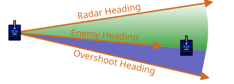

# Perfect Locks

> [!TIP] Origins
> **Perfect Lock** patterns (Turn Multiplier Lock and Width Lock) were developed and documented by the RoboWiki
> community for optimal 1v1 radar tracking.

A radar *lock* tries to re-scan the same enemy at every turn. A **perfect lock** goes one step further: it turns the
radar so the enemy is guaranteed to be inside the radar beam again next tick, even while both bots are turning.

Perfect locks matter most in **one-on-one (1v1)** fights, where scanning anything other than the opponent is wasted
information or when there is only one enemy left.

## Why perfect locks matter

Frequent scans make everything else easier:

- Targeting works with fresher position/velocity data.
- Movement can react to the enemy’s current heading, not a guess from several turns ago.
- Losing contact becomes rare, so less time is spent in “reacquire” mode.

The radar is the sensor. A perfect lock is how to keep that sensor “glued” to the opponent.

<br>
*Illustration: The radar beam overshooting an enemy*

Legend:

- Green color: The scan arc from the current radar heading to the enemy
- Blue color: The overshoot arc past the enemy

## Core idea: turn *past* the enemy on purpose

If the radar turns to point exactly at the enemy’s last known bearing, it can miss on the next tick:

- The enemy can turn.
- The scanning bot can turn its body and/or gun (even if the radar is mostly decoupled).

A perfect lock intentionally **overshoots** the enemy angle so the radar beam *crosses* the enemy again next tick,
rather than stopping right on top of it.

Two classic “perfect lock” recipes are:

- **Turn Multiplier Lock**: “overshoot by multiplying the needed turn.”
- **Width Lock**: “overshoot by (about) half the radar beam width, based on distance.”

## Turn Multiplier Lock

Turn Multiplier Lock is the simplest perfect lock.

1. Compute how far the enemy is from the current radar heading.
2. Turn the radar *more than that* by multiplying the angle by a constant > 1.

The examples below implement this first lock recipe. They keep the body still so the radar math is easy to isolate. A
combat bot can add independent movement and gun control after this pattern is working.

::: code-group

```java [Classic · Java]
import robocode.AdvancedRobot;
import robocode.ScannedRobotEvent;
import robocode.util.Utils;

public class TurnMultiplierLockBot extends AdvancedRobot {
    private static final double MULTIPLIER = 2.0;

    @Override
    public void run() {
        setTurnRadarRightRadians(Double.POSITIVE_INFINITY);

        while (true) {
            execute();
        }
    }

    @Override
    public void onScannedRobot(ScannedRobotEvent event) {
        double absoluteBearing = getHeadingRadians() + event.getBearingRadians();
        double neededTurn = Utils.normalRelativeAngle(
                absoluteBearing - getRadarHeadingRadians());
        setTurnRadarRightRadians(neededTurn * MULTIPLIER);
    }
}
```

```python [Tank Royale · Python]
import math

from robocode_tank_royale.bot_api import Bot
from robocode_tank_royale.bot_api.events import ScannedBotEvent


class TurnMultiplierLockBot(Bot):
    MULTIPLIER = 2.0

    def run(self) -> None:
        self.set_turn_radar_left(float("inf"))

        while self.running:
            self.go()

    def on_scanned_bot(self, event: ScannedBotEvent) -> None:
        dx = event.x - self.x
        dy = event.y - self.y
        target_direction = math.degrees(math.atan2(dy, dx))
        needed_turn = normalize_relative_angle(target_direction - self.radar_direction)
        self.set_turn_radar_left(needed_turn * self.MULTIPLIER)


def normalize_relative_angle(angle: float) -> float:
    while angle <= -180:
        angle += 360
    while angle > 180:
        angle -= 360
    return angle


def main() -> None:
    TurnMultiplierLockBot().start()


if __name__ == "__main__":
    main()
```

```java [Tank Royale · Java]
import dev.robocode.tankroyale.botapi.Bot;
import dev.robocode.tankroyale.botapi.events.ScannedBotEvent;

public class TurnMultiplierLockBot extends Bot {
    private static final double MULTIPLIER = 2.0;

    public static void main(String[] args) {
        new TurnMultiplierLockBot().start();
    }

    @Override
    public void run() {
        setTurnRadarLeft(Double.POSITIVE_INFINITY);

        while (isRunning()) {
            go();
        }
    }

    @Override
    public void onScannedBot(ScannedBotEvent event) {
        double dx = event.getX() - getX();
        double dy = event.getY() - getY();
        double targetDirection = Math.toDegrees(Math.atan2(dy, dx));
        double neededTurn = normalizeRelativeAngle(targetDirection - getRadarDirection());
        setTurnRadarLeft(neededTurn * MULTIPLIER);
    }

    private static double normalizeRelativeAngle(double angle) {
        while (angle <= -180) {
            angle += 360;
        }
        while (angle > 180) {
            angle -= 360;
        }
        return angle;
    }
}
```

```csharp [Tank Royale · C#]
using System;
using Robocode.TankRoyale.BotApi;
using Robocode.TankRoyale.BotApi.Events;

public class TurnMultiplierLockBot : Bot
{
    private const double Multiplier = 2.0;

    static void Main(string[] args)
    {
        new TurnMultiplierLockBot().Start();
    }

    public override void Run()
    {
        SetTurnRadarLeft(double.PositiveInfinity);

        while (IsRunning)
        {
            Go();
        }
    }

    public override void OnScannedBot(ScannedBotEvent evt)
    {
        double dx = evt.X - X;
        double dy = evt.Y - Y;
        double targetDirection = Math.Atan2(dy, dx) * 180 / Math.PI;
        double neededTurn = NormalizeRelativeAngle(targetDirection - RadarDirection);
        SetTurnRadarLeft(neededTurn * Multiplier);
    }

    private static double NormalizeRelativeAngle(double angle)
    {
        while (angle <= -180)
        {
            angle += 360;
        }
        while (angle > 180)
        {
            angle -= 360;
        }
        return angle;
    }
}
```

```typescript [Tank Royale · TypeScript]
import { Bot, ScannedBotEvent } from "@robocode.dev/tank-royale-bot-api";

class TurnMultiplierLockBot extends Bot {
    private static readonly multiplier = 2;

    static main() {
        new TurnMultiplierLockBot().start();
    }

    override run() {
        this.setTurnRadarLeft(Number.POSITIVE_INFINITY);

        while (this.isRunning()) {
            this.go();
        }
    }

    override onScannedBot(event: ScannedBotEvent) {
        const dx = event.x - this.x;
        const dy = event.y - this.y;
        const targetDirection = Math.atan2(dy, dx) * 180 / Math.PI;
        const neededTurn = TurnMultiplierLockBot.normalizeRelativeAngle(
            targetDirection - this.radarDirection,
        );
        this.setTurnRadarLeft(neededTurn * TurnMultiplierLockBot.multiplier);
    }

    private static normalizeRelativeAngle(angle: number) {
        while (angle <= -180) {
            angle += 360;
        }
        while (angle > 180) {
            angle -= 360;
        }
        return angle;
    }
}

TurnMultiplierLockBot.main();
```

:::

Definitions:

- `absBearing`: the enemy direction in the arena coordinate system.
- `radarHeading`: the direction the radar is pointing.
- `normalizeRelativeAngle(x)`: wraps an angle into the range `(-180°, +180°]` (or the equivalent in radians).
- `setTurnRadar(angle)`: a generic “turn radar by angle” setter.

Why it works: if the radar turns *past* the enemy, any small change in either bot’s headings is less likely to move the
enemy outside the beam before the next tick.

Limitations:

- It overshoots by a fixed factor, not by what the geometry actually needs.
- If the enemy is far away (small angular width), a fixed multiplier might still be too small.
- If the enemy is very close (large angular width), a big multiplier can waste radar time sweeping empty space.

## Width Lock

Width Lock uses a more “geometry-aware” overshoot.

The enemy bot has a physical width (about 36 units depending on platform and hitbox rules), so from a distance it
occupies some **angular width**. If the radar overshoots by roughly half that angular width, the beam is much more
likely to cross the enemy again next tick.

A common approximation is:

- Treat the enemy as a 36-unit wide target.
- Convert that width into an angle using distance.

Approximate formula (small-angle approximation):

$\text{enemyAngularWidth} \approx 2 \cdot \arctan\left(\frac{\text{enemyWidth}/2}{\text{distance}}\right)$

Then overshoot by about half of that:

$\text{overshoot} \approx \frac{\text{enemyAngularWidth}}{2}$

Conceptual pseudocode:

```text
// On scan:
absBearing = angleToEnemyFromArenaAxes()
radarHeading = currentRadarHeading()
distance = distanceToEnemy()

neededTurn = normalizeRelativeAngle(absBearing - radarHeading)

enemyWidth = 36.0  // units (approx)
enemyAngularWidth = 2 * atan((enemyWidth / 2) / distance)
overshoot = enemyAngularWidth / 2

// Overshoot in the same direction as the needed turn:
setTurnRadar(neededTurn + sign(neededTurn) * overshoot)
```

Notes:

- A farther enemy has a smaller `enemyAngularWidth`, so the overshoot becomes smaller.
- A closer enemy has a larger `enemyAngularWidth`, so the overshoot grows automatically.

> [!TIP] Tip
> If the lock becomes unstable when both bots turn hard, increase the overshoot slightly (for example, by multiplying by
> `1.1`), but keep it small to avoid wasting turns.

## Platform notes (Classic vs Tank Royale)

These patterns are conceptually the same on both platforms:

- It does not matter whether the radar turns left or right; what matters is the *relative* radar turn toward the enemy
  plus an overshoot.
- Both platforms benefit from decoupling the radar so body/gun turns don’t “drag” it away.

Differences to watch for:

- **Angle conventions** differ between classic Robocode and Tank Royale. Keep all angles consistent inside the bot and
  normalize when taking differences.
- **Scan event fields** differ:
    - Classic Robocode often provides a *relative bearing* and distance, so `absBearing` is computed.
    - Tank Royale typically provides enemy coordinates directly, so `absBearing` comes from `atan2(enemy - me)`.

If angle math feels confusing, cross-check with [Coordinate Systems & Angles](../../physics/coordinates-and-angles.md)
and the scan geometry in [Radar Basics](../radar-basics).

## Tips and common mistakes

- **Not committing the turn:** setter-based radar control requires `execute()` / `go()` every tick.
- **Calling multiple radar setters per tick without thinking:** remember “last command wins.”
- **No reacquire plan:** if scans stop arriving, fall back to a wide sweep (like [Spinning Radar](./spinning-radar)).
- **Overshooting too much:** a radar that spends most of its time scanning empty space is not a lock.

## Related pages

- [Radar Basics](../radar-basics) - radar geometry, scan events, and the lock vs sweep mindset
- [Spinning Radar](./spinning-radar) - fast discovery and a simple reacquire fallback

## Further Reading

- [One on One Radar](https://robowiki.net/wiki/One_on_One_Radar) - RoboWiki (classic Robocode)
- [Radar](https://robowiki.net/wiki/Radar) - RoboWiki (classic Robocode)

