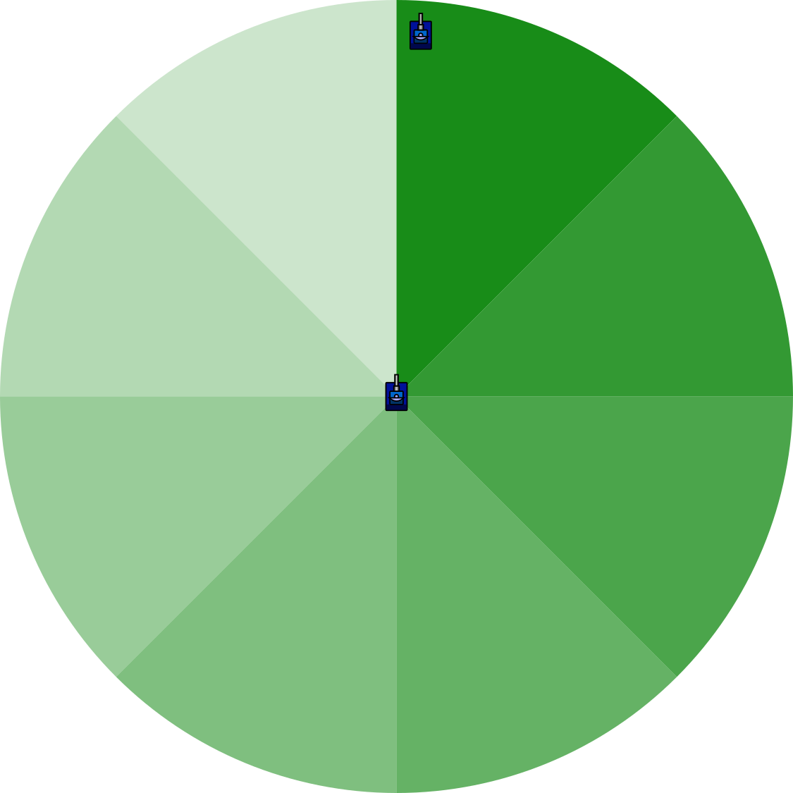

# Spinning Radar

> [!TIP] Origins
> **Spinning Radar** and **Infinite Lock** patterns were developed and documented by the RoboWiki community as
> foundational radar strategies.

A spinning radar is the simplest radar strategy: keep the radar turning all the time so it eventually sweeps over every
enemy bot.

It is especially useful at the start of a round (or after losing contact) because it is a reliable way to *discover*
opponents.

## Why spin the radar?

A stationary radar goes blind quickly. A spinning radar fixes that by ensuring the radar beam keeps covering the whole
battlefield.

Spinning radar is most valuable for:

- **Discovery:** getting the first scan as fast as possible.
- **Reacquire:** finding an enemy again after it has not been scanned for a while.
- **Simple melee awareness:** steadily collecting scan data on multiple enemies.

In 1v1, spinning forever is usually not optimal once the enemy is found; you typically switch to a lock pattern like
**Infinite Lock** (covered below) to get more frequent re-scans of *that one bot*.

<br>
*Top-down arena view: a bot with a radar beam spinning 360°, sweeping the battlefield and intersecting an enemy.*

## Basic spinning radar in five languages

Most APIs offer a setter-style radar turn method. The classic spinning radar pattern is set up once, before the main
loop. The examples below cover this basic search mode. The Infinite Lock section later on remains conceptual because it
needs target tracking and radar-specific overshoot.

The important detail is the placement of the infinite turn: set it once, then commit a turn every cycle. Repeating the
infinite command inside the loop would keep replacing the radar's current intent.

::: code-group

```java [Classic · Java]
import robocode.AdvancedRobot;

public class SpinningRadarBot extends AdvancedRobot {
    @Override
    public void run() {
        setTurnRadarLeft(Double.POSITIVE_INFINITY);

        while (true) {
            execute();
        }
    }
}
```

```python [Tank Royale · Python]
from robocode_tank_royale.bot_api import Bot


class SpinningRadarBot(Bot):
    def run(self) -> None:
        self.set_turn_radar_left(float("inf"))

        while self.running:
            self.go()


def main() -> None:
    SpinningRadarBot().start()


if __name__ == "__main__":
    main()
```

```java [Tank Royale · Java]
import dev.robocode.tankroyale.botapi.Bot;

public class SpinningRadarBot extends Bot {
    public static void main(String[] args) {
        new SpinningRadarBot().start();
    }

    @Override
    public void run() {
        setTurnRadarLeft(Double.POSITIVE_INFINITY);

        while (isRunning()) {
            go();
        }
    }
}
```

```csharp [Tank Royale · C#]
using Robocode.TankRoyale.BotApi;

public class SpinningRadarBot : Bot
{
    static void Main(string[] args)
    {
        new SpinningRadarBot().Start();
    }

    public override void Run()
    {
        SetTurnRadarLeft(double.PositiveInfinity);

        while (IsRunning)
        {
            Go();
        }
    }
}
```

```typescript [Tank Royale · TypeScript]
import { Bot } from "@robocode.dev/tank-royale-bot-api";

class SpinningRadarBot extends Bot {
    static main() {
        new SpinningRadarBot().start();
    }

    override run() {
        this.setTurnRadarLeft(Number.POSITIVE_INFINITY);

        while (this.isRunning()) {
            this.go();
        }
    }
}

SpinningRadarBot.main();
```

:::

Notes:

- It does not matter if you turn left or right for the initial spin.
- What “INFINITY” means depends on language:
    - a huge number (e.g., 1e9 degrees), or
    - a symbolic constant (like positive infinity) if the language supports it.
- The key is to set the infinite spin only once, not every turn.

## Infinite Lock (recommended for 1v1)

Once you have a target in a 1v1 battle, you usually want the radar to **stay on that opponent** instead of sweeping
empty
space.

The classic pattern from RoboWiki is called **Infinite Lock**:

- While you keep getting scans, you continuously turn your radar toward the enemy.
- You typically **overshoot a little** so the radar beam crosses the enemy even if one (or both) bots turn between
  ticks.
- If scans stop arriving (lost contact), fall back to a wide spin to reacquire.

Conceptual pseudocode:

```text
// State:
turnsSinceLastScan = BIG_NUMBER

// Before the main loop:
setTurnRadarLeft(INFINITY)  // start in search mode

// onScannedBot/onScannedRobot:
turnsSinceLastScan = 0

// Each turn (main loop):
while (true) {
    turnsSinceLastScan++

    if (turnsSinceLastScan == 0) {
        // We scanned the enemy this tick:
        // Turn radar toward the enemy bearing, plus a small overshoot.
        // (This is where you use setTurnRadarRight/Left based on your relative angles.)
        setTurnRadarRight(enemyBearingFromRadar + overshoot)
    } else if (turnsSinceLastScan > LOST_CONTACT_TURNS) {
        // Lost contact: spin again to find the enemy
        setTurnRadarLeft(INFINITY)
    }

    commitTurn()
}
```

Notes:

- The *exact* math varies by API, but the intent is always:
    1) compute the enemy angle relative to the **current radar heading**, then
    2) add a small overshoot in the direction you want the radar to continue.
- This section is where `setTurnRadarRight(targetBearing - currentRadarHeading)`-style code belongs: it’s a **tracking**
  behavior that you do *after* you’ve scanned an enemy, not part of the basic spinning radar itself.

## Setters overwrite: last command wins

Setter-style calls update intent for the current turn. If the same setter is called multiple times in a single turn, the
**last call wins**.

That can be handy when radar logic is refined step-by-step:

- start with `setTurnRadarLeft(INFINITY)` while searching,
- later in the same turn, once an enemy is found, update the intent to a tighter tracking turn,
- then commit the turn.

This “overwrite” behavior also makes recursion or multi-pass calculations practical: the final decision is simply the
last intent set before `execute()` / `go()`.

## Platform notes (Classic vs Tank Royale)

The idea is the same on both platforms: keep the radar moving so scans keep happening.

The main practical difference is how turns are “committed” when using setters:

- **Classic Robocode:** setters queue intent, and `execute()` ends the turn.
- **Robocode Tank Royale:** setters queue intent, and `go()` ends the turn.

If a bot only calls setters but never commits the turn, it will look stuck because the engine is never asked to advance.

## Tips and common mistakes

- **Forgetting to commit the turn:** setter-only bots must call `execute()` / `go()` every turn.
- **Spinning forever in 1v1:** it works, but Infinite Lock usually gives more frequent scans.
- **Coupled radar:** if the radar is dragged around by body/gun turns, the “spin” might not behave as expected.
  (See [Radar Basics](../radar-basics).)

## Related pages

- [Radar Basics](../radar-basics) - scan geometry, events, and lock vs sweep
- One-on-One Radar: spinning radar, infinity lock, and "perfect lock" patterns (planned)

## Further Reading

- [One on One Radar](https://robowiki.net/wiki/One_on_One_Radar) - RoboWiki (classic Robocode)
- [Radar](https://robowiki.net/wiki/Radar) - RoboWiki (classic Robocode)
