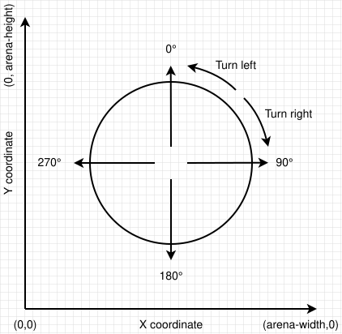
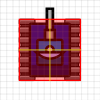
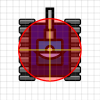

# Physics Differences

> [!TIP] Origins
> **Classic Robocode physics** was defined by **Mathew A. Nelson (Mat Nelson)**. **Flemming Nørnberg Larsen (fnl)**
> kept the same rules for **Robocode Tank Royale** and switched the angles to ordinary math conventions.

A classic bot ported line by line to Tank Royale can compile, run, and still drive straight into a wall. The speeds,
bullets, and gun heat are the same. The compass is not. This page lists what carries over unchanged and the few rules
that quietly flip.

## The numbers that do not change

The Tank Royale docs say the game "is following the same basic rules as the original game". Every core formula checks
out as identical on both platforms:

| Rule                     | Value on both platforms                            |
|--------------------------|----------------------------------------------------|
| Acceleration             | 1 unit/turn per turn                               |
| Deceleration             | 2 units/turn per turn                              |
| Maximum speed            | 8 units/turn                                       |
| Body turn rate           | $10 - 0.75 \cdot \lvert v \rvert$ degrees per turn |
| Gun / radar turn rate    | 20° / 45° per turn                                 |
| Firepower                | 0.1 – 3                                            |
| Bullet speed             | $20 - 3 \cdot p$ units/turn                        |
| Bullet damage            | $4p$, plus $2(p - 1)$ when $p > 1$                 |
| Energy returned on a hit | $3p$                                               |
| Gun heat per shot        | $1 + p / 5$                                        |
| Bot vs bot collision     | 0.6 damage to each bot                             |
| Wall damage              | $\lvert v \rvert / 2 - 1$, never below 0           |

Here $v$ is the bot's speed and $p$ is the firepower. Guns start hot at the beginning of every round on both
platforms. So any physics math from the [Battlefield Physics](../physics/movement-constraints.md) chapter, escape
angles, and bullet flight times can be reused as they are.

## The compass flips

Both platforms put $(0, 0)$ at the bottom-left corner of the battlefield. The difference is where 0° points and which
way angles grow.

- **Classic Robocode:** 0° is north, 90° is east, and angles grow **clockwise**.
- **Tank Royale:** 0° is east, 90° is north, and angles grow **counterclockwise**, like a math textbook.

<br>
*Classic Robocode: 0° points north and angles grow clockwise.*

<br>
*Tank Royale: 0° points east and angles grow counterclockwise.*

Converting a heading is one subtraction, and it works in both directions:

$h_{TR} = (90 - h_{C}) \bmod 360$

Here $h_C$ is a classic heading and $h_{TR}$ is the same direction as a Tank Royale heading. North is 0° in classic and
90° in Tank Royale. East is 90° in classic and 0° in Tank Royale.

The payoff is in the trigonometry. Classic code projects a point with `x + sin(a) * d` and `y + cos(a) * d`, which
surprises most newcomers. In Tank Royale, the textbook form works:

```txt
// Tank Royale: project a point at distance d along heading a (degrees)
x2 = x + cos(toRadians(a)) * d
y2 = y + sin(toRadians(a)) * d
```

## Turning left is now positive

A flipped compass also flips the sign of a turn. In classic Robocode, turning right increases the heading. In Tank
Royale, turning right moves the heading clockwise, which *decreases* it, and turning left increases it.

This is the bug that survives porting most often. A wave surfer or wall smoother that computes "turn by +30°" will
steer the wrong way unless the sign flips too. When porting, convert every angle once at the edge of the code, and keep
the internal math in a single convention.

> [!WARNING] Platform Difference
> Classic Robocode also offers radian methods such as `getHeadingRadians()`. Tank Royale works in degrees only, so
> convert explicitly before calling `sin()` or `cos()`.

## Hitboxes: square versus circle

Bullets hit a different shape on each platform.

- **Classic Robocode:** a 36×36 unit square that stays axis-aligned even when the bot turns.
- **Tank Royale:** a circle with radius 18 units around the bot's center.

<br>
*Classic Robocode: an axis-aligned 36×36 square.*

<br>
*Tank Royale: a circle with radius 18 units.*

The square reaches about 25 units from the center along its diagonals, and the circle only reaches 18. A bullet that
clips a classic bot's corner can miss the same bot in Tank Royale. This matters most for precise targeting and
[bullet shadows](../movement/advanced-evasion/gun-heat-waves-bullet-shadows.md), where a bot computes exactly which
angles a bullet covers.

## One more difference: the turn itself

Classic Robocode runs every bot in its own thread inside the game engine. Tank Royale bots run as separate programs
and send an intent to the server each turn, and the docs call each turn "deterministic" as a result. The physics does
not change, but a slow bot skips turns when it misses the configured turn time limit.

Classic Robocode gives a bot no way to see that deadline coming. Tank Royale exposes it directly: `getTurnTimeout()`
returns the turn budget in microseconds, and `getTimeLeft()` returns how much of it remains before `go()` must be
called. A bot with a heavy per-turn computation, such as a k-d tree rebuild or a wide GuessFactor scan, can check
`getTimeLeft()` and cut the work short instead of losing the whole turn to a timeout.

The mechanics are close enough that most strategy knowledge carries over. The API is another story, and the next page,
API Changes, covers the method names and events that did move.

## Further Reading

- [Robocode/Game Physics](https://robowiki.net/wiki/Robocode/Game_Physics) - RoboWiki (classic Robocode)
- [Physics](https://robocode.dev/articles/physics.html) - Tank Royale documentation
- [Coordinates and Angles](https://robocode.dev/articles/coordinates-and-angles.html) - Tank Royale documentation
- [Tank Royale](https://robocode.dev/articles/tank-royale.html) - Tank Royale documentation
- [Coordinate Systems & Angles](../physics/coordinates-and-angles.md) - earlier chapter of this book
