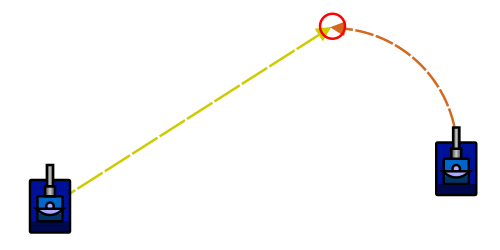

# Circular Targeting (with Walkthrough)

> [!TIP] Origins
> **Circular Targeting** is a foundational technique documented by the RoboWiki community as the next step after linear
> targeting.

Circular targeting predicts where to aim by assuming the enemy keeps moving with **constant speed** and a **constant
turn rate**.
That means the enemy follows an arc (part of a circle), not a straight line.

Compared to [Linear Targeting](./linear-targeting.md), this tends to hit better against bots that keep turning while
they
strafe (a very common movement style).

## When does circular targeting work well?

Circular targeting is a good fit when the enemy:

- turns smoothly for many turns (constant-ish angular velocity),
- changes speed less often than it changes heading,
- is a "circle-strafer" or otherwise keeps curving around the bot.

It still struggles when the enemy:

- frequently switches direction, stops, or jitters its heading,
- deliberately *breaks* prediction by varying turn rate,
- is very far away (small prediction errors become large misses).

> [!TIP] Baseline mindset
> Circular targeting is still **simple targeting**: it assumes a clean pattern.
> It's a great stepping stone toward wave-based and statistical guns.

## The model: constant turn rate

At fire time, a circular gun typically keeps this state from the last scan:

- Enemy position: `(enemyX, enemyY)`
- Enemy heading: `enemyHeading`
- Enemy speed: `enemySpeed`
- Enemy turn rate: `enemyTurnRate` (how much the enemy heading changes per turn)

Then it simulates forward, one tick at a time:

1. Increase the enemy heading by `enemyTurnRate`.
2. Move the enemy forward by `enemySpeed` in the new heading.
3. Stop when bullet travel time "catches up" to the predicted distance.

This "play it forward" loop avoids hard math and stays readable.

<br>
*Diagram: Circular targeting predicts the enemy's curved path and aims at the intercept point where the bullet meets the
enemy.*

## Minimal implementation in five languages

Definitions:

- `bulletSpeed`: bullet speed for the chosen firepower.
- `distance(a, b)`: Euclidean distance in units.
- `stepForward(x, y, heading, speed)`: moves one turn forward.
- `headingTo(myX, myY, x, y)`: angle from shooter to point.

The helpers below use radians and a mathematical coordinate frame where `0` radians points along positive X. Convert the
platform's heading once before calling `predict`, then use the returned point with its heading and fire helpers.

::: code-group

```java [Classic · Java]
import java.awt.geom.Point2D;

public final class CircularTargeting {
    public static Point2D.Double predict(
            double myX, double myY,
            double enemyX, double enemyY,
            double enemyHeadingRadians,
            double enemySpeed,
            double enemyTurnRateRadians,
            double bulletSpeed) {
        double predictedX = enemyX;
        double predictedY = enemyY;
        double predictedHeading = enemyHeadingRadians;
        int turnsAhead = 0;

        while (bulletSpeed * turnsAhead < distance(myX, myY, predictedX, predictedY)) {
            predictedHeading += enemyTurnRateRadians;
            predictedX += Math.cos(predictedHeading) * enemySpeed;
            predictedY += Math.sin(predictedHeading) * enemySpeed;
            turnsAhead++;
        }
        return new Point2D.Double(predictedX, predictedY);
    }

    private static double distance(double x1, double y1, double x2, double y2) {
        return Math.hypot(x2 - x1, y2 - y1);
    }
}
```

```python [Tank Royale · Python]
from math import cos, hypot, sin


def predict(
    my_x: float,
    my_y: float,
    enemy_x: float,
    enemy_y: float,
    enemy_heading_radians: float,
    enemy_speed: float,
    enemy_turn_rate_radians: float,
    bullet_speed: float,
) -> tuple[float, float]:
    predicted_x = enemy_x
    predicted_y = enemy_y
    predicted_heading = enemy_heading_radians
    turns_ahead = 0

    while bullet_speed * turns_ahead < hypot(predicted_x - my_x, predicted_y - my_y):
        predicted_heading += enemy_turn_rate_radians
        predicted_x += cos(predicted_heading) * enemy_speed
        predicted_y += sin(predicted_heading) * enemy_speed
        turns_ahead += 1
    return predicted_x, predicted_y
```

```java [Tank Royale · Java]
public final class CircularTargeting {
    public record Point(double x, double y) {}

    public static Point predict(
            double myX, double myY,
            double enemyX, double enemyY,
            double enemyHeadingRadians,
            double enemySpeed,
            double enemyTurnRateRadians,
            double bulletSpeed) {
        double predictedX = enemyX;
        double predictedY = enemyY;
        double predictedHeading = enemyHeadingRadians;
        int turnsAhead = 0;

        while (bulletSpeed * turnsAhead < distance(myX, myY, predictedX, predictedY)) {
            predictedHeading += enemyTurnRateRadians;
            predictedX += Math.cos(predictedHeading) * enemySpeed;
            predictedY += Math.sin(predictedHeading) * enemySpeed;
            turnsAhead++;
        }
        return new Point(predictedX, predictedY);
    }

    private static double distance(double x1, double y1, double x2, double y2) {
        return Math.hypot(x2 - x1, y2 - y1);
    }
}
```

```csharp [Tank Royale · C#]
using System;

public static class CircularTargeting
{
    public static (double X, double Y) Predict(
        double myX, double myY,
        double enemyX, double enemyY,
        double enemyHeadingRadians,
        double enemySpeed,
        double enemyTurnRateRadians,
        double bulletSpeed)
    {
        double predictedX = enemyX;
        double predictedY = enemyY;
        double predictedHeading = enemyHeadingRadians;
        int turnsAhead = 0;

        while (bulletSpeed * turnsAhead < Distance(myX, myY, predictedX, predictedY))
        {
            predictedHeading += enemyTurnRateRadians;
            predictedX += Math.Cos(predictedHeading) * enemySpeed;
            predictedY += Math.Sin(predictedHeading) * enemySpeed;
            turnsAhead++;
        }
        return (predictedX, predictedY);
    }

    private static double Distance(double x1, double y1, double x2, double y2)
    {
        return Math.Sqrt((x2 - x1) * (x2 - x1) + (y2 - y1) * (y2 - y1));
    }
}
```

```typescript [Tank Royale · TypeScript]
type Point = { x: number; y: number };

export function predict(
    myX: number,
    myY: number,
    enemyX: number,
    enemyY: number,
    enemyHeadingRadians: number,
    enemySpeed: number,
    enemyTurnRateRadians: number,
    bulletSpeed: number,
): Point {
    let predictedX = enemyX;
    let predictedY = enemyY;
    let predictedHeading = enemyHeadingRadians;
    let turnsAhead = 0;

    while (bulletSpeed * turnsAhead < distance(myX, myY, predictedX, predictedY)) {
        predictedHeading += enemyTurnRateRadians;
        predictedX += Math.cos(predictedHeading) * enemySpeed;
        predictedY += Math.sin(predictedHeading) * enemySpeed;
        turnsAhead += 1;
    }
    return { x: predictedX, y: predictedY };
}

function distance(x1: number, y1: number, x2: number, y2: number): number {
    return Math.hypot(x2 - x1, y2 - y1);
}
```

:::

This is intentionally the **simple** version.
More robust circular guns clamp the predicted point inside a safe rectangle or stop if the point exits the battlefield.

## Walkthrough: building a simple circular gun

This walkthrough focuses on *what to compute and store* each time a scan happens.
It does not depend on a specific language.

### Step 1: Track the enemy's absolute heading

Circular targeting needs the enemy headings from consecutive scans.
That means the scan must be frequent enough that the heading difference is meaningful.

- In **classic Robocode**, the scan event provides enemy heading directly (`e.getHeading()` in degrees).
- In **Tank Royale**, the scan provides direction as well (names vary by SDK), but the angle convention differs.

### Step 2: Compute turn rate from two scans

The enemy turn rate (per turn) can be estimated as:

- `enemyTurnRate = normalizeAngle(enemyHeadingNow - enemyHeadingPrev) / deltaTime`

Where:

- `deltaTime` is how many turns passed since the last scan of that enemy.
- `normalizeAngle(...)` wraps to a **short** signed angle (e.g. in `(-180°, +180°]` or `(-π, +π]`).

> [!NOTE] Sign matters
> A positive turn rate means the enemy keeps turning in the same direction.
> If turn rate flips sign often, circular targeting won't predict well.

### Step 3: Store speed (and optionally smooth it)

Most simple implementations use the latest reported `enemySpeed` directly.
To reduce noise, a bot can also keep a small moving average, but that is optional.

### Step 4: Predict and aim

At fire time:

1. Start at the latest known enemy position.
2. Simulate forward with the constant `(speed, turnRate)` model.
3. Aim at the final predicted `(predX, predY)`.

A common loop condition is:

- "simulate while bullet travel distance < current predicted distance".

This works because bullet travel distance grows linearly with prediction time.

## Platform notes (classic vs. Tank Royale)

The *idea* is the same across platforms, but be careful with two details:

- **Angle conventions differ** (where 0° points and which direction is positive).
  Always use the platform's standard helpers and normalize relative angles.
  See [Coordinate Systems & Angles](../../physics/coordinates-and-angles.md).

- **Asynchronous scans:** depending on radar strategy, scans might not happen every turn.
  Always divide heading change by `deltaTime` when estimating turn rate.

## Tips & common mistakes

- **Forgetting angle normalization:** heading differences must be normalized before dividing by `deltaTime`.

- **Assuming constant turn rate during sharp cornering:** many bots vary turn rate when near walls.
  If prediction goes outside the battlefield, clamp or fall back to head-on.

- **Not handling missing scans:** if the enemy hasn't been scanned for a while, prediction becomes guesswork.
  Consider falling back to [Head-On Targeting](./head-on-targeting.md) for stale data.

- **Firing too early (gun not aligned):** prediction doesn't help if the gun isn't turned.
  Many bots wait until gun error is below a small threshold.

## Further Reading

- [Circular Targeting](https://robowiki.net/wiki/Circular_Targeting) - RoboWiki (classic Robocode)
- [Circular Targeting/Walkthrough](https://robowiki.net/wiki/Circular_Targeting/Walkthrough) - RoboWiki (classic
  Robocode)
