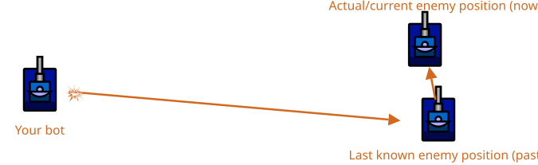

# Head-On Targeting

> [!TIP] Origins
> **Head-On Targeting** is the simplest targeting method, documented by the RoboWiki community as the baseline all other
> targeting systems aim to beat.

Head-on targeting means aiming directly at where the enemy was when it was last scanned.
It does **not** try to predict where the enemy will be when the bullet arrives.

This makes it easy to implement and great for learning, but it becomes less accurate as distance increases or when the
enemy moves sideways.

## When does it work well?

Head-on targeting tends to do okay when:

- The enemy is **close** (bullets arrive quickly).
- The enemy is moving **straight toward or away** from the bot.
- The enemy often pauses (common in sample / beginner bots).
- There are **multiple enemies close to or behind the target enemy**, the probability of hitting an enemy increases. If
  the bullet misses the target, another enemy behind or near the target might get hit instead.

It tends to miss when:

- The enemy is far away.
- The enemy moves mostly sideways relative to the bot.
- The enemy frequently changes its direction.
- A smart enemy predicts where the bullet will go and dodges accordingly.

A useful mindset: head-on targeting is the “baseline” that more advanced targeting (linear, circular, GuessFactor, …)
tries to beat.

## What information is needed?

To aim at a point, two things are needed:

1. The enemy’s position `(enemyX, enemyY)`.
2. The direction from the bot to that position (an angle / heading for the gun).

Getting `(enemyX, enemyY)` differs by platform:

- **Classic Robocode:** a scan provides **bearing + distance**, so the enemy coordinates must be computed.
- **Robocode Tank Royale:** a scan event (`ScannedBotEvent`) provides the enemy coordinates directly (`x`, `y`).

## From scan to enemy position (classic Robocode)

Classic Robocode scan events provide a **relative bearing**: the angle from the bot’s heading to the enemy.
Combine that with the bot’s heading to get an **absolute bearing**.

The Classic tab in the example below performs this conversion before calculating the gun heading.

Definitions:

- `myX`, `myY`: the bot's position.
- `myHeading`: the bot's heading (in degrees here).
- `relativeBearing`: from `ScannedRobotEvent` (in degrees).
- `distance`: from `ScannedRobotEvent`.

> [!Note] Note
> `sin` is used for X and `cos` for Y in classic Robocode because 0° points up (North) and angles increase
> clockwise. The trig functions need radians, so convert degrees using `toRadians()`.
> See [Coordinate Systems & Angles](../../physics/coordinates-and-angles.md).

## Aiming the gun at that point

Once a last-known enemy position is available, the gun should be turned to point at it.

Aiming is basically "what is the angle from `(myX, myY)` to `(enemyX, enemyY)`?"

- In **classic Robocode**, typical code computes a gun turn angle and uses `setTurnGunRight(...)`.
- In **Tank Royale**, the API offers helpers like `calcHeadingTo(x, y)` that returns the heading to a point.

<br>
**Illustration:** The bot aims its gun directly at the enemy's last scanned position. However, the enemy bot has already
moved to a new position*

## Minimal head-on aiming in five languages

> [!NOTE] Keep it small
> Each helper returns the target heading in degrees. Apply the heading with the platform's gun-turn
> helper, then fire when the gun is aligned. More advanced bots usually also decouple radar from gun/body and choose
> firepower based on distance and energy.

::: code-group

```java [Classic · Java]
public final class HeadOnTargeting {
    public static double targetHeading(
            double myX, double myY, double myHeadingDegrees,
            double relativeBearingDegrees, double distance) {
        double absoluteBearing = Math.toRadians(myHeadingDegrees + relativeBearingDegrees);
        double enemyX = myX + Math.sin(absoluteBearing) * distance;
        double enemyY = myY + Math.cos(absoluteBearing) * distance;
        return Math.toDegrees(Math.atan2(enemyX - myX, enemyY - myY));
    }
}
```

```python [Tank Royale · Python]
from math import atan2, degrees


def target_heading(my_x: float, my_y: float, enemy_x: float, enemy_y: float) -> float:
    return degrees(atan2(enemy_y - my_y, enemy_x - my_x))
```

```java [Tank Royale · Java]
public final class HeadOnTargeting {
    public static double targetHeading(
            double myX, double myY, double enemyX, double enemyY) {
        return Math.toDegrees(Math.atan2(enemyY - myY, enemyX - myX));
    }
}
```

```csharp [Tank Royale · C#]
using System;

public static class HeadOnTargeting
{
    public static double TargetHeading(double myX, double myY, double enemyX, double enemyY)
    {
        return Math.Atan2(enemyY - myY, enemyX - myX) * 180 / Math.PI;
    }
}
```

```typescript [Tank Royale · TypeScript]
export function targetHeading(
    myX: number,
    myY: number,
    enemyX: number,
    enemyY: number,
): number {
    return (Math.atan2(enemyY - myY, enemyX - myX) * 180) / Math.PI;
}
```

:::

## Platform notes (classic vs. Tank Royale)

- **Scan data is history on both platforms.** Even “instant” head-on targeting aims at slightly old information.
- **Angles differ:**
    - Classic Robocode: angles increase clockwise from North, degrees or radians.
    - Tank Royale: angles increase counterclockwise from East, degrees only.
- **Enemy coordinates:**
    - Classic Robocode: compute `enemyX`, `enemyY` from bearing + distance.
    - Tank Royale: use `e.getX()`, `e.getY()` from the scan event.

## Tips & common mistakes

- **Forgetting shortest-turn normalization:** Without it, the gun might rotate almost a full circle instead of a few
  degrees.
- **Forgetting to convert for trig functions (classic Robocode):** `getHeading()` and `getBearing()` return degrees, but
  `Math.sin()` and `Math.cos()` need radians, use `Math.toRadians()` to convert.
- **Assuming head-on will work at long range:** bullets take time to travel; prediction methods exist for a reason.
- **Not scanning often enough:** head-on targeting gets worse quickly if the last scan is several turns old. Radar
  strategy matters.

## Further Reading

- [Head-On Targeting](https://robowiki.net/wiki/Head-On_Targeting) - RoboWiki (classic Robocode)

