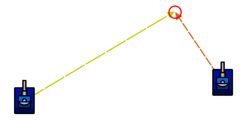

# Linear Targeting

> [!TIP] Origins
> **Linear Targeting** is a foundational technique documented by the RoboWiki community as the classic first step beyond
> head-on targeting.

Linear targeting is the classic “next step” after head-on targeting.
Instead of firing at the enemy’s last scanned position, it predicts an intercept point by assuming the enemy keeps
moving in a straight line at constant velocity.

This assumption is often wrong (bots turn and change speed), but even an imperfect prediction can greatly improve hit
rate against bots that strafe steadily.

## Key idea: meet the enemy where the bullet will be

A fired bullet travels at (roughly) constant speed.
If the enemy also keeps a constant velocity vector, the problem becomes:

- A bullet starts at the bot’s position now.
- The enemy starts at the last scanned position now.
- Find the time `t` where bullet distance traveled equals enemy distance moved.

Then aim the gun at the predicted enemy position at time `t`.

> [!TIP] When to use it
> Linear targeting typically performs well against “circle strafers” and other bots that keep a steady heading for many
> turns.

## What information is needed?

At fire time, these values are needed:

- The bot’s position: `(myX, myY)`.
- The enemy’s current estimate: `(enemyX, enemyY)`.
- The enemy’s velocity components: `(enemyVx, enemyVy)`.
- Bullet speed `bulletSpeed` based on chosen firepower.

Enemy velocity is normally derived from the scan event:

- **Classic Robocode:** scans provide enemy heading + speed, so velocity components can be computed.
- **Robocode Tank Royale:** scans provide enemy `speed` and `direction` as well, but angle conventions differ.

## Intercept math (constant-velocity prediction)

Let:

- `dx = enemyX - myX`, `dy = enemyY - myY` (relative position).
- `vx = enemyVx`, `vy = enemyVy` (enemy velocity).
- `s = bulletSpeed`.
- `t` = time until impact (in turns).

At time `t`, the enemy would be at:

- `predX = enemyX + vx * t`
- `predY = enemyY + vy * t`

The bullet must travel the distance from the bot to `(predX, predY)` in the same time `t`:

- `distance(my, pred) = s * t`

Square both sides (to avoid square roots) and substitute:

$(dx + v_x t)^2 + (dy + v_y t)^2 = (s \times t)^2$

This is a quadratic equation $a \times t^2 + b \times t + c = 0$ with:

$a = vx^2 + vy^2 - s^2$
$b = 2 \times (dx \times vx + dy \times vy)$
$c = dx^2 + dy^2$

Solve for `t` and pick the **smallest positive** solution.
If there is no positive solution, it means “with this bullet speed, a straight-line intercept is not possible” (the
enemy is effectively moving away too fast in the assumed direction).

> [!NOTE] Bullet speed
> In classic Robocode, bullet speed is `20 - 3×power`.
> (See [Bullet Travel & Bullet Physics](../../physics/bullet-physics.md).)

<br>
*Diagram: Linear targeting predicts the enemy's straight path and aims at the intercept point where the bullet meets the
enemy.*

## Minimal implementation in five languages

The solver below returns the predicted intercept point. The caller can use that point with the platform's heading
helper, turn the gun toward it, and fire. A head-on point is used when the bullet cannot catch the predicted path.

::: code-group

```java [Classic · Java]
import java.awt.geom.Point2D;

public final class LinearTargeting {
    private static final double EPSILON = 1e-9;

    public static Point2D.Double predict(
            double myX, double myY,
            double enemyX, double enemyY,
            double enemyVx, double enemyVy,
            double bulletSpeed) {
        double dx = enemyX - myX;
        double dy = enemyY - myY;
        double a = enemyVx * enemyVx + enemyVy * enemyVy - bulletSpeed * bulletSpeed;
        double b = 2 * (dx * enemyVx + dy * enemyVy);
        double c = dx * dx + dy * dy;
        double time = interceptTime(a, b, c);

        if (time < 0) {
            return new Point2D.Double(enemyX, enemyY);
        }
        return new Point2D.Double(enemyX + enemyVx * time, enemyY + enemyVy * time);
    }

    private static double interceptTime(double a, double b, double c) {
        if (Math.abs(a) < EPSILON) {
            if (Math.abs(b) < EPSILON) {
                return -1;
            }
            double time = -c / b;
            return time > 0 ? time : -1;
        }

        double discriminant = b * b - 4 * a * c;
        if (discriminant < 0) {
            return -1;
        }
        double t1 = (-b - Math.sqrt(discriminant)) / (2 * a);
        double t2 = (-b + Math.sqrt(discriminant)) / (2 * a);
        return smallestPositive(t1, t2);
    }

    private static double smallestPositive(double first, double second) {
        if (first > 0 && second > 0) {
            return Math.min(first, second);
        }
        return first > 0 ? first : (second > 0 ? second : -1);
    }
}
```

```python [Tank Royale · Python]
from math import inf, sqrt

Point = tuple[float, float]
EPSILON = 1e-9


def predict(
    my_x: float,
    my_y: float,
    enemy_x: float,
    enemy_y: float,
    enemy_vx: float,
    enemy_vy: float,
    bullet_speed: float,
) -> Point:
    dx = enemy_x - my_x
    dy = enemy_y - my_y
    a = enemy_vx * enemy_vx + enemy_vy * enemy_vy - bullet_speed * bullet_speed
    b = 2 * (dx * enemy_vx + dy * enemy_vy)
    c = dx * dx + dy * dy
    time = intercept_time(a, b, c)

    if time is None:
        return enemy_x, enemy_y
    return enemy_x + enemy_vx * time, enemy_y + enemy_vy * time


def intercept_time(a: float, b: float, c: float) -> float | None:
    if abs(a) < EPSILON:
        if abs(b) < EPSILON:
            return None
        time = -c / b
        return time if time > 0 else None

    discriminant = b * b - 4 * a * c
    if discriminant < 0:
        return None
    roots = ((-b - sqrt(discriminant)) / (2 * a), (-b + sqrt(discriminant)) / (2 * a))
    positive = [root for root in roots if root > 0]
    return min(positive) if positive else None
```

```java [Tank Royale · Java]
public final class LinearTargeting {
    private static final double EPSILON = 1e-9;

    public record Point(double x, double y) {}

    public static Point predict(
            double myX, double myY,
            double enemyX, double enemyY,
            double enemyVx, double enemyVy,
            double bulletSpeed) {
        double dx = enemyX - myX;
        double dy = enemyY - myY;
        double a = enemyVx * enemyVx + enemyVy * enemyVy - bulletSpeed * bulletSpeed;
        double b = 2 * (dx * enemyVx + dy * enemyVy);
        double c = dx * dx + dy * dy;
        double time = interceptTime(a, b, c);

        if (time < 0) {
            return new Point(enemyX, enemyY);
        }
        return new Point(enemyX + enemyVx * time, enemyY + enemyVy * time);
    }

    private static double interceptTime(double a, double b, double c) {
        if (Math.abs(a) < EPSILON) {
            if (Math.abs(b) < EPSILON) {
                return -1;
            }
            double time = -c / b;
            return time > 0 ? time : -1;
        }

        double discriminant = b * b - 4 * a * c;
        if (discriminant < 0) {
            return -1;
        }
        double t1 = (-b - Math.sqrt(discriminant)) / (2 * a);
        double t2 = (-b + Math.sqrt(discriminant)) / (2 * a);
        return smallestPositive(t1, t2);
    }

    private static double smallestPositive(double first, double second) {
        if (first > 0 && second > 0) {
            return Math.min(first, second);
        }
        return first > 0 ? first : (second > 0 ? second : -1);
    }
}
```

```csharp [Tank Royale · C#]
public static class LinearTargeting
{
    private const double Epsilon = 1e-9;

    public record struct Point(double X, double Y);

    public static Point Predict(
        double myX, double myY,
        double enemyX, double enemyY,
        double enemyVx, double enemyVy,
        double bulletSpeed)
    {
        double dx = enemyX - myX;
        double dy = enemyY - myY;
        double a = enemyVx * enemyVx + enemyVy * enemyVy - bulletSpeed * bulletSpeed;
        double b = 2 * (dx * enemyVx + dy * enemyVy);
        double c = dx * dx + dy * dy;
        double time = InterceptTime(a, b, c);

        return time < 0
            ? new Point(enemyX, enemyY)
            : new Point(enemyX + enemyVx * time, enemyY + enemyVy * time);
    }

    private static double InterceptTime(double a, double b, double c)
    {
        if (Math.Abs(a) < Epsilon)
        {
            if (Math.Abs(b) < Epsilon)
            {
                return -1;
            }
            double time = -c / b;
            return time > 0 ? time : -1;
        }

        double discriminant = b * b - 4 * a * c;
        if (discriminant < 0)
        {
            return -1;
        }
        double t1 = (-b - Math.Sqrt(discriminant)) / (2 * a);
        double t2 = (-b + Math.Sqrt(discriminant)) / (2 * a);
        return SmallestPositive(t1, t2);
    }

    private static double SmallestPositive(double first, double second)
    {
        if (first > 0 && second > 0)
        {
            return Math.Min(first, second);
        }
        return first > 0 ? first : (second > 0 ? second : -1);
    }
}
```

```typescript [Tank Royale · TypeScript]
type Point = { x: number; y: number };

const EPSILON = 1e-9;

export function predict(
    myX: number,
    myY: number,
    enemyX: number,
    enemyY: number,
    enemyVx: number,
    enemyVy: number,
    bulletSpeed: number,
): Point {
    const dx = enemyX - myX;
    const dy = enemyY - myY;
    const a = enemyVx * enemyVx + enemyVy * enemyVy - bulletSpeed * bulletSpeed;
    const b = 2 * (dx * enemyVx + dy * enemyVy);
    const c = dx * dx + dy * dy;
    const time = interceptTime(a, b, c);

    return time === null
        ? { x: enemyX, y: enemyY }
        : { x: enemyX + enemyVx * time, y: enemyY + enemyVy * time };
}

function interceptTime(a: number, b: number, c: number): number | null {
    if (Math.abs(a) < EPSILON) {
        if (Math.abs(b) < EPSILON) {
            return null;
        }
        const time = -c / b;
        return time > 0 ? time : null;
    }

    const discriminant = b * b - 4 * a * c;
    if (discriminant < 0) {
        return null;
    }
    const t1 = (-b - Math.sqrt(discriminant)) / (2 * a);
    const t2 = (-b + Math.sqrt(discriminant)) / (2 * a);
    const positive = [t1, t2].filter((time) => time > 0);
    return positive.length > 0 ? Math.min(...positive) : null;
}
```

:::

## Platform notes (classic vs. Tank Royale)

The math above is the same, but *inputs* differ.

- **Angles and trig:**
    - Classic Robocode uses 0° = North and angles increase clockwise.
    - Tank Royale uses 0° = East and angles increase counterclockwise.
      Use the correct conversion helpers for the platform.
      See [Coordinate Systems & Angles](../../physics/coordinates-and-angles.md).

- **Deriving `(enemyVx, enemyVy)`:**
    - Classic Robocode: `enemyVx = sin(enemyHeading) * enemySpeed`, `enemyVy = cos(enemyHeading) * enemySpeed` using the
      same “sin is X / cos is Y” convention as other classic Robocode coordinate math.
    - Tank Royale: velocity components are usually `enemyVx = cos(dir) * speed`, `enemyVy = sin(dir) * speed` because
      the
      axis/angle conventions are different.

- **Prediction outside the battlefield:** linear prediction can point outside the walls.
  Many bots clamp the aim point to a “safe rectangle” or fall back to head-on when the predicted point is invalid.

## Tips & common mistakes

- **Using stale scans:** prediction amplifies scan error.
  A radar that keeps the enemy continuously scanned gives much better results.

- **Picking the wrong quadratic root:** use the smallest positive `t`.
  A negative `t` means “the intercept would have happened in the past”.

- **Not handling the `a ≈ 0` case:** when enemy speed is close to bullet speed, floating point issues can explode.
  Special-case it as a linear equation.

- **Assuming linear targeting is “smart”:** good bots change heading and speed on purpose.
  Linear targeting still matters as a baseline, and it is often used as a virtual gun.

- **Forgetting unit limits:** enemy speed is capped (e.g., 8 units/turn in classic), but can still be large enough to
  make some intercept solutions impossible with low bullet speed.

## Further Reading

- [Linear Targeting](https://robowiki.net/wiki/Linear_Targeting) - RoboWiki (classic Robocode)
- [Linear Targeting/Buggy Implementations](https://robowiki.net/wiki/Linear_Targeting/Buggy_Implementations) -
  RoboWiki (classic Robocode)
