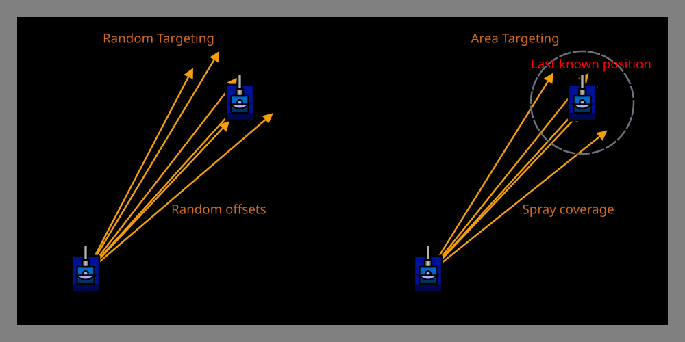

# Random & Area Targeting

> [!TIP] Origins
> **Random Targeting** and **Area Targeting** were developed and documented by the RoboWiki community as fallback
> strategies for unpredictable opponents.

**Random Targeting** and **Area Targeting** are two simple strategies for firing when an enemy is unpredictable or when
more advanced targeting methods fail.
Neither assumes the enemy moves in a predictable straight line, instead, they cover a zone or scatter shots
probabilistically.

These approaches are sometimes overlooked as "too simple," but they serve important roles: as defensive mechanisms
against adaptive enemies, as fallback aiming when no clear pattern exists, and as baseline comparisons for evaluating
smarter guns.

## Random Targeting: The Scatter Gun Approach

**Random Targeting** fires bullets in random directions within a spread cone or angular range.
The idea is simple: if the enemy is unpredictable, spread bullets across possible positions.

### When does it work?

Random targeting tends to help when:

- The enemy **dodges unpredictably** (or uses random movement itself).
- The bot **lacks radar lock** on the enemy or loses track frequently.
- The bot is **in melee** and needs to throw multiple shots to hit someone among many bots.
- The bot is a **learning or testing bot** that doesn't yet have targeting logic.

It tends to fail when:

- The enemy moves in a **clear, predictable pattern** (linear, circular, or wave surfing).
- The bot has **limited firepower** and wastes shots.
- The gun **overheats** from rapid, inefficient firing.

### How it works

At fire time, pick a random angle offset from a reference direction (e.g., the enemy's last bearing or gun's current
heading) and fire.

The examples below return aiming angles in radians. Convert the angles to the platform's heading convention, turn the
gun, and fire with the platform API.

::: code-group

```java [Classic · Java]
import java.util.ArrayList;
import java.util.List;
import java.util.concurrent.ThreadLocalRandom;

public final class RandomAreaTargeting {
    public static double randomTargetAngle(double referenceAngle, double spread) {
        double offset = ThreadLocalRandom.current().nextDouble(-spread, spread);
        return referenceAngle + offset;
    }

    public static List<Double> areaTargetAngles(
            double myX, double myY,
            double enemyX, double enemyY,
            double lastKnownEnemySpeed,
            int turnsSinceLastScan,
            double safetyBuffer,
            int shotCount) {
        double maxMovement = lastKnownEnemySpeed * turnsSinceLastScan + safetyBuffer;
        List<Double> angles = new ArrayList<>();
        ThreadLocalRandom random = ThreadLocalRandom.current();

        for (int shot = 0; shot < shotCount; shot++) {
            double pointX = random.nextDouble(enemyX - maxMovement, enemyX + maxMovement);
            double pointY = random.nextDouble(enemyY - maxMovement, enemyY + maxMovement);
            angles.add(Math.atan2(pointY - myY, pointX - myX));
        }
        return angles;
    }
}
```

```python [Tank Royale · Python]
from math import atan2
from random import uniform


def random_target_angle(reference_angle: float, spread: float) -> float:
    return reference_angle + uniform(-spread, spread)


def area_target_angles(
    my_x: float,
    my_y: float,
    enemy_x: float,
    enemy_y: float,
    last_known_enemy_speed: float,
    turns_since_last_scan: int,
    safety_buffer: float,
    shot_count: int,
) -> list[float]:
    max_movement = last_known_enemy_speed * turns_since_last_scan + safety_buffer
    angles = []

    for _ in range(shot_count):
        point_x = uniform(enemy_x - max_movement, enemy_x + max_movement)
        point_y = uniform(enemy_y - max_movement, enemy_y + max_movement)
        angles.append(atan2(point_y - my_y, point_x - my_x))
    return angles
```

```java [Tank Royale · Java]
import java.util.ArrayList;
import java.util.List;
import java.util.concurrent.ThreadLocalRandom;

public final class RandomAreaTargeting {
    public static double randomTargetAngle(double referenceAngle, double spread) {
        double offset = ThreadLocalRandom.current().nextDouble(-spread, spread);
        return referenceAngle + offset;
    }

    public static List<Double> areaTargetAngles(
            double myX, double myY,
            double enemyX, double enemyY,
            double lastKnownEnemySpeed,
            int turnsSinceLastScan,
            double safetyBuffer,
            int shotCount) {
        double maxMovement = lastKnownEnemySpeed * turnsSinceLastScan + safetyBuffer;
        List<Double> angles = new ArrayList<>();
        ThreadLocalRandom random = ThreadLocalRandom.current();

        for (int shot = 0; shot < shotCount; shot++) {
            double pointX = random.nextDouble(enemyX - maxMovement, enemyX + maxMovement);
            double pointY = random.nextDouble(enemyY - maxMovement, enemyY + maxMovement);
            angles.add(Math.atan2(pointY - myY, pointX - myX));
        }
        return angles;
    }
}
```

```csharp [Tank Royale · C#]
using System;
using System.Collections.Generic;

public static class RandomAreaTargeting
{
    private static readonly Random Random = new();

    public static double RandomTargetAngle(double referenceAngle, double spread)
    {
        return referenceAngle + (Random.NextDouble() * 2 - 1) * spread;
    }

    public static List<double> AreaTargetAngles(
        double myX, double myY,
        double enemyX, double enemyY,
        double lastKnownEnemySpeed,
        int turnsSinceLastScan,
        double safetyBuffer,
        int shotCount)
    {
        double maxMovement = lastKnownEnemySpeed * turnsSinceLastScan + safetyBuffer;
        var angles = new List<double>();

        for (int shot = 0; shot < shotCount; shot++)
        {
            double pointX = Range(enemyX - maxMovement, enemyX + maxMovement);
            double pointY = Range(enemyY - maxMovement, enemyY + maxMovement);
            angles.Add(Math.Atan2(pointY - myY, pointX - myX));
        }
        return angles;
    }

    private static double Range(double minimum, double maximum)
    {
        return minimum + Random.NextDouble() * (maximum - minimum);
    }
}
```

```typescript [Tank Royale · TypeScript]
export function randomTargetAngle(referenceAngle: number, spread: number): number {
    return referenceAngle + (Math.random() * 2 - 1) * spread;
}

export function areaTargetAngles(
    myX: number,
    myY: number,
    enemyX: number,
    enemyY: number,
    lastKnownEnemySpeed: number,
    turnsSinceLastScan: number,
    safetyBuffer: number,
    shotCount: number,
): number[] {
    const maxMovement = lastKnownEnemySpeed * turnsSinceLastScan + safetyBuffer;
    const angles: number[] = [];

    for (let shot = 0; shot < shotCount; shot += 1) {
        const pointX = randomBetween(enemyX - maxMovement, enemyX + maxMovement);
        const pointY = randomBetween(enemyY - maxMovement, enemyY + maxMovement);
        angles.push(Math.atan2(pointY - myY, pointX - myX));
    }
    return angles;
}

function randomBetween(minimum: number, maximum: number): number {
    return minimum + Math.random() * (maximum - minimum);
}
```

:::

For tighter spreads, confine offsets to a narrow range (e.g., ±10°).
For wider spreads, allow offsets up to ±30° or more.

### Key tuning parameter: spread angle

The **spread angle** controls how wide the scatter is:

- **±5°:** Tight cluster; assumes the enemy is roughly in one direction but slightly dodging.
- **±15°:** Moderate spread; covers movement to left/right within a sector.
- **±45°:** Very wide scatter; covers most directions and relies on hitting by chance.

## Area Targeting: The Zone Spray

**Area Targeting** fires at a **predicted region** where the enemy might be, based on its last known position and
assumed movement range.
Instead of firing at a single intercept point (as in Linear or Circular targeting), the bot fires multiple shots or a
spray pattern to cover an area.

### When does it work?

Area targeting helps when:

- The enemy's **next position is uncertain** but confined to a zone (e.g., the enemy will move within 150 units of its
  last position).
- The bot **expects perpendicular movement** but doesn't know the exact speed or direction.
- Multiple shots are fired; at least one is likely to hit a region.

### How it works

Define a bounding box or circular zone around the enemy's predicted position, then fire shots scattered across that
zone:

Each returned angle represents one point in a square centered on the enemy's last known position. The square grows with
the scan age and the assumed enemy speed, while `shotCount` controls the energy cost of the spray.

### Parameters: zone size and shot count

Two parameters control effectiveness:

1. **Zone size:** How far the enemy might have moved since the last scan.
    - Smaller zones assume the enemy hasn't moved far (recent scan, slow enemy).
    - Larger zones hedge against long delays or fast enemies.
    - Formula: `maxDistance = lastKnownEnemySpeed * turnsSinceLastScan + safetyBuffer`

2. **Number of shots:** More shots increase hit probability but consume energy.
    - Single shot at the enemy's last position (inefficient).
    - 2–5 shots in a burst (moderate cost, reasonable hit rate).
    - 10+ shots (heavy spray; rarely practical due to cooling delays).

## Comparison: Random vs. Area Targeting

| Aspect                 | Random Targeting                        | Area Targeting                     |
|------------------------|-----------------------------------------|------------------------------------|
| **Aiming basis**       | Any reference direction + random offset | Predicted movement zone            |
| **Information needed** | Gun heading or enemy bearing            | Enemy position, speed, scan age    |
| **Shot pattern**       | Scattered around a direction            | Clustered around a zone            |
| **Best for**           | Melee chaos, quick fallback             | Direct engagement with uncertainty |
| **Energy cost**        | Low (few shots)                         | Higher (spray pattern)             |
| **Hit probability**    | Low unless enemy is close               | Moderate if zone estimate is good  |

## Platform notes

Both strategies are platform-agnostic and rely only on basic trigonometry (headings and angles).

- **Classic Robocode:** Convert enemy bearing + distance into coordinates, then use heading-to-point helpers.
- **Robocode Tank Royale:** Scans provide coordinates directly; use `calcHeadingTo(x, y)` for angle calculations.

See [Coordinates and Angles](../../physics/coordinates-and-angles.md) for platform-specific conventions.

## Tips & Common Mistakes

> [!TIP] Combine with radar
> If the radar loses the enemy, Random Targeting lets the gun still fire defensively.
> Pair it with a spinning radar to keep the gun cool while maintaining some offense.

> [!WARNING] Don't waste energy
> Random and Area Targeting consume bullets inefficiently. Use them as **fallbacks**, not primary tactics.
> A bot with Head-On or Linear Targeting as the default and Random Targeting only when targeting fails performs better
> than a bot that always uses Random.

> [!WARNING] Melee chaos
> In melee battles, Area Targeting around the enemy's zone can be effective, but prioritize enemies within a close
> distance to avoid spraying wildly.

> [!TIP] Hybrid approach
> A practical bot might:
> 1. Try Linear or Circular Targeting if the enemy seems to have a steady heading.
> 2. Fall back to Random Targeting if the enemy is erratic or radar lock is lost.
> 3. Use Area Targeting if multiple enemies are clustered in a zone.

## Illustration placeholder

<br>
*Random and Area Targeting patterns compared: Random fires scattered shots around a reference direction, while Area
Targeting fires a spray across a predicted movement zone.*

---

## Summary

- **Random Targeting** is a fallback when the enemy is unpredictable; scatter shots around a reference direction.
- **Area Targeting** fires at a zone where the enemy might be based on movement estimates.
- Both are simple to implement and useful in specific scenarios (chaos, lost locks, unpredictable foes).
- Use them as supplements to smarter tactics, not replacements.
- Combine with good radar and energy management for best results.

## Further Reading

- [Area Targeting](https://robowiki.net/wiki/Area_Targeting) - RoboWiki (classic Robocode)
- [Random Targeting](https://robowiki.net/wiki/Random_Targeting) - RoboWiki (classic Robocode)

