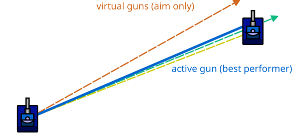

# Virtual Guns & Mean Targeting

> [!TIP] Origins
> **Virtual Guns** and **Mean Targeting** were developed and refined by the RoboWiki community as adaptive targeting
> strategies that run multiple guns in parallel.

Virtual guns let a bot run multiple targeting strategies at the same time and dynamically choose the one performing best
against each opponent.
Instead of committing to a single algorithm, the bot "fires" imaginary bullets from each strategy and tracks which one
would have hit most often.

This adaptive approach is especially powerful in competitive play, where enemy movement patterns vary widely.

## Key idea: measure, then choose

A virtual gun system maintains:

- **Multiple targeting algorithms** (e.g., head-on, linear, circular, random offset).
- **Hit statistics** for each algorithm per enemy.
- **A selection policy** that picks which gun to fire with based on recent performance.

At fire time:

1. Each virtual gun computes its aim angle (but doesn't actually fire).
2. The bot fires with the gun that has the best hit rate so far.
3. All guns record their predictions as "virtual bullets" moving across the battlefield.
4. When a real bullet hits or misses, all virtual bullets near the impact are scored.

Over time, the system learns which strategy works best against each opponent's movement style.

<br>
*Multiple virtual guns aim at different predicted positions; the bot fires using the one with the best track record*

## How virtual guns work

### Step 1: Track virtual bullets

Each gun stores:

- **Aim angle** computed at fire time.
- **Fire position** (where the real bot was).
- **Travel time** remaining (decreases each turn).
- **Predicted impact point** (optional, for visualization).

Every turn, each virtual bullet's travel time is decremented.
When it reaches zero, it's compared against the enemy's actual position at that time.

### Step 2: Score hits and misses

When a virtual bullet "arrives":

- If the enemy is within a hitbox radius (18 units) of the predicted point, record a **hit**.
- Otherwise, record a **miss**.

Some implementations also score "partial hits" based on proximity, giving credit for near-misses.

### Step 3: Select the best gun

Before firing, compute a **success rate** for each gun:

$\text{success rate} = \frac{\text{hits}}{\text{hits} + \text{misses}}$

Fire with the gun that has the highest success rate.

> [!TIP] Handling ties
> If multiple guns have the same rate, many bots prefer the more sophisticated algorithm (e.g., circular over head-on)
> as a tiebreaker, or simply stick with the last active gun.

### Step 4: Decay old data (optional)

Against adaptive opponents, recent performance matters more than ancient history.
Many implementations use a **decay factor** or a **rolling window** to forget old data gradually.

## Mean targeting: the original virtual gun

Mean targeting is a classic early implementation of virtual guns. It typically runs three simple strategies:

1. **Head-on**: aim at the enemy's current position.
2. **Linear**: predict straight-line movement.
3. **Circular**: predict constant turn rate.

The bot picks whichever has the best success rate so far.
Despite being "simple targeting," mean targeting can be surprisingly effective because it adapts to the opponent's
movement style without manual tuning.

## Minimal virtual-gun core in five languages

The code below keeps the statistics and the scoring rule together. Each platform's existing head-on, linear, or circular
targeting function can be supplied as an `aim` callback that returns a predicted point.

::: code-group

```java [Classic · Java]
import java.util.List;
import java.util.function.Function;

public final class VirtualGunSelector {
    public record Point(double x, double y) {}
    public record ScanData(double x, double y, double heading, double speed) {}
    public record VirtualBullet(VirtualGun gun, Point predictedPosition) {}

    @FunctionalInterface
    public interface AimFunction extends Function<ScanData, Point> {}

    public static final class VirtualGun {
        public final String name;
        public final AimFunction aim;
        public int hits;
        public int misses;

        public VirtualGun(String name, AimFunction aim) {
            this.name = name;
            this.aim = aim;
        }

        public double successRate() {
            return hits / (double) (hits + misses + 1);
        }
    }

    public static VirtualGun selectBest(List<VirtualGun> guns) {
        VirtualGun best = guns.get(0);
        for (VirtualGun gun : guns) {
            if (gun.successRate() > best.successRate()) {
                best = gun;
            }
        }
        return best;
    }

    public static void score(VirtualBullet bullet, Point actualPosition, double hitboxRadius) {
        double dx = bullet.predictedPosition.x() - actualPosition.x();
        double dy = bullet.predictedPosition.y() - actualPosition.y();
        boolean hit = Math.hypot(dx, dy) < hitboxRadius;
        if (hit) {
            bullet.gun.hits++;
        } else {
            bullet.gun.misses++;
        }
    }
}
```

```python [Tank Royale · Python]
from dataclasses import dataclass
from math import hypot
from typing import Callable


@dataclass(frozen=True)
class Point:
    x: float
    y: float


@dataclass(frozen=True)
class ScanData:
    x: float
    y: float
    heading: float
    speed: float


AimFunction = Callable[[ScanData], Point]


@dataclass
class VirtualGun:
    name: str
    aim: AimFunction
    hits: int = 0
    misses: int = 0

    @property
    def success_rate(self) -> float:
        return self.hits / (self.hits + self.misses + 1)


@dataclass(frozen=True)
class VirtualBullet:
    gun: VirtualGun
    predicted_position: Point


def select_best(guns: list[VirtualGun]) -> VirtualGun:
    return max(guns, key=lambda gun: gun.success_rate)


def score(bullet: VirtualBullet, actual_position: Point, hitbox_radius: float) -> None:
    distance = hypot(
        bullet.predicted_position.x - actual_position.x,
        bullet.predicted_position.y - actual_position.y,
    )
    if distance < hitbox_radius:
        bullet.gun.hits += 1
    else:
        bullet.gun.misses += 1
```

```java [Tank Royale · Java]
import java.util.List;
import java.util.function.Function;

public final class VirtualGunSelector {
    public record Point(double x, double y) {}
    public record ScanData(double x, double y, double heading, double speed) {}
    public record VirtualBullet(VirtualGun gun, Point predictedPosition) {}

    @FunctionalInterface
    public interface AimFunction extends Function<ScanData, Point> {}

    public static final class VirtualGun {
        public final String name;
        public final AimFunction aim;
        public int hits;
        public int misses;

        public VirtualGun(String name, AimFunction aim) {
            this.name = name;
            this.aim = aim;
        }

        public double successRate() {
            return hits / (double) (hits + misses + 1);
        }
    }

    public static VirtualGun selectBest(List<VirtualGun> guns) {
        VirtualGun best = guns.get(0);
        for (VirtualGun gun : guns) {
            if (gun.successRate() > best.successRate()) {
                best = gun;
            }
        }
        return best;
    }

    public static void score(VirtualBullet bullet, Point actualPosition, double hitboxRadius) {
        double dx = bullet.predictedPosition.x() - actualPosition.x();
        double dy = bullet.predictedPosition.y() - actualPosition.y();
        boolean hit = Math.hypot(dx, dy) < hitboxRadius;
        if (hit) {
            bullet.gun.hits++;
        } else {
            bullet.gun.misses++;
        }
    }
}
```

```csharp [Tank Royale · C#]
using System;
using System.Collections.Generic;

public static class VirtualGunSelector
{
    public record Point(double X, double Y);
    public record ScanData(double X, double Y, double Heading, double Speed);
    public delegate Point AimFunction(ScanData scan);
    public record VirtualBullet(VirtualGun Gun, Point PredictedPosition);

    public sealed class VirtualGun
    {
        public string Name { get; }
        public AimFunction Aim { get; }
        public int Hits { get; set; }
        public int Misses { get; set; }
        public double SuccessRate => Hits / (double)(Hits + Misses + 1);

        public VirtualGun(string name, AimFunction aim)
        {
            Name = name;
            Aim = aim;
        }
    }

    public static VirtualGun SelectBest(IReadOnlyList<VirtualGun> guns)
    {
        VirtualGun best = guns[0];
        foreach (VirtualGun gun in guns)
        {
            if (gun.SuccessRate > best.SuccessRate)
            {
                best = gun;
            }
        }
        return best;
    }

    public static void Score(VirtualBullet bullet, Point actualPosition, double hitboxRadius)
    {
        double dx = bullet.PredictedPosition.X - actualPosition.X;
        double dy = bullet.PredictedPosition.Y - actualPosition.Y;
        bool hit = Math.Sqrt(dx * dx + dy * dy) < hitboxRadius;
        if (hit)
        {
            bullet.Gun.Hits++;
        }
        else
        {
            bullet.Gun.Misses++;
        }
    }
}
```

```typescript [Tank Royale · TypeScript]
export type Point = { x: number; y: number };
export type ScanData = { x: number; y: number; heading: number; speed: number };
export type AimFunction = (scan: ScanData) => Point;

export class VirtualGun {
    hits = 0;
    misses = 0;

    constructor(
        readonly name: string,
        readonly aim: AimFunction,
    ) {}

    get successRate(): number {
        return this.hits / (this.hits + this.misses + 1);
    }
}

export type VirtualBullet = {
    gun: VirtualGun;
    predictedPosition: Point;
};

export function selectBest(guns: VirtualGun[]): VirtualGun {
    return guns.reduce((best, gun) => (gun.successRate > best.successRate ? gun : best));
}

export function score(bullet: VirtualBullet, actualPosition: Point, hitboxRadius: number): void {
    const dx = bullet.predictedPosition.x - actualPosition.x;
    const dy = bullet.predictedPosition.y - actualPosition.y;
    const hit = Math.hypot(dx, dy) < hitboxRadius;
    if (hit) {
        bullet.gun.hits += 1;
    } else {
        bullet.gun.misses += 1;
    }
}
```

:::

## Platform notes (classic vs. Tank Royale)

The virtual gun concept is platform-independent, but:

- **Angle conventions differ:** always normalize angles using the platform's helpers.
  See [Coordinate Systems & Angles](../../physics/coordinates-and-angles.md).

- **Bullet speed:** in classic Robocode, `bulletSpeed = 20 - 3 × power`.
  Tank Royale uses similar formulas, but check the official docs.

- **Collision detection:**
    - **Classic Robocode** uses an axis-aligned bounding box (36×36 units) that does *not* rotate with the bot's
      heading.
    - **Tank Royale** uses a bounding circle (radius 18 units) that is independent of the bot's actual heading.

  This difference affects how you calculate virtual bullet impacts. See
  the [Tank Royale anatomy documentation](https://robocode.dev/articles/anatomy.html#collision-detection) for details.

## Tips & common mistakes

- **Firing before gathering data:** virtual guns need time to accumulate statistics.
  Against a new enemy, start with a reasonable default (e.g., linear) until enough data exists.

- **Not cleaning up old bullets:** virtual bullets that leave the battlefield or expire should be removed to avoid
  eating up memory and waste of CPU cycles.

- **Ignoring bullet power differences:** if the real gun fires with varying power, virtual bullets should match that
  power (or at least track performance per power level).

- **Overcounting hits:** ensure each virtual bullet is scored exactly once when it expires, not every turn.

- **Forgetting per-enemy stats:** in melee or teams, track statistics separately for each opponent.

- **Not testing gun performance:** log success rates during development to verify that the selection logic is working.

## When to use virtual guns

Virtual guns shine when:

- **Enemy movement styles vary** across opponents (e.g., tournaments with diverse bots).
- **A single targeting algorithm isn't enough** (one strategy can't handle both stationary and surfing bots).
- **Development time is limited** (combine multiple simple guns instead of tuning one complex gun).

They're less useful when:

- The bot only faces one opponent repeatedly (offline tuning can beat adaptive selection).
- All guns perform similarly (no statistical difference to exploit).
- Memory or CPU is very constrained (tracking many virtual bullets has overhead).

## Beyond mean targeting

Advanced bots extend the virtual gun idea with:

- **More sophisticated guns** ([GuessFactor](/appendices/glossary#guessfactor),
  [pattern matching](/appendices/glossary#pattern-matching), neural nets).
- **Per-situation selection** (different gun per range, velocity, or wall proximity).
- **Confidence intervals** (prefer guns with more data when rates are close).
- **Hybrid aiming** (average multiple gun angles weighted by success rate).

But the core principle remains: measure performance, then adapt.

## Further Reading

- [Virtual Guns](https://robowiki.net/wiki/Virtual_Guns) - RoboWiki (classic Robocode)
- [Mean Targeting](https://robowiki.net/wiki/Mean_Targeting) - RoboWiki (classic Robocode)


