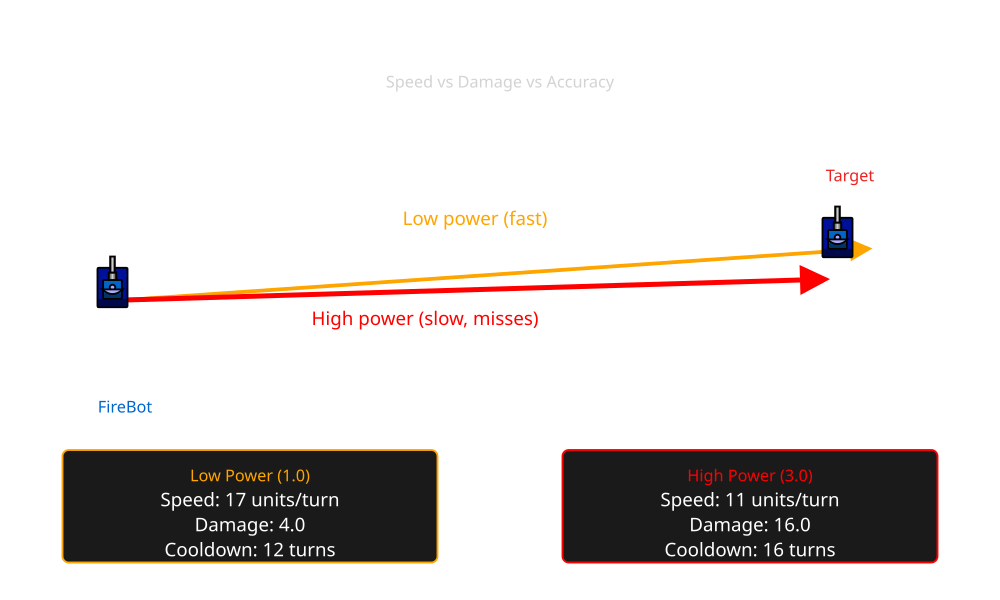

# Fire Power & Timing Decisions

> [!TIP] Origins
> Fire power and timing strategies were developed and documented by the RoboWiki community through extensive competitive
> testing.

Choosing when to fire and how much power to use is a strategic balancing act. Fire is too weak, and you waste shots;
fire is too strong, and you miss more often while draining your energy. This page explores the factors that influence
bullet power selection and timing decisions in competitive play.

<br>
*Comparing low-power (fast, weak) vs. high power (slow, strong) bullets traveling toward a moving target*

## Why bullet power matters

Bullet power affects three critical aspects of combat:

1. **Damage dealt**: Higher power means more damage per hit (4× power, plus bonus above 1.0).
2. **Bullet speed**: Lower power bullets travel faster (20 - 3× power units/turn), reaching the target sooner.
3. **[Gun heat](/appendices/glossary#gun-heat) generated**: Higher power adds more heat (1 + power/5), delaying
   your next shot.
4. **Energy cost**: Firing consumes energy equal to the bullet power, risking disablement if you run low.

These tradeoffs mean there's rarely a "best" power for all situations. the right choice depends on range, enemy
behavior, your energy level, and your targeting confidence.

## The core tradeoffs

### Speed vs. damage

Lower power bullets are faster and harder to dodge but deal less damage. Against agile opponents with unpredictable
movement, a faster bullet that hits is better than a slow, powerful bullet that misses.

**Rule of thumb:**

- **Power 0.1 to 1.5**: Fast bullets for distant or erratic targets.
- **Power 1.5 to 3.0**: Strong bullets for close range or predictable movement.

### Accuracy vs power

High-power bullets travel slower, giving the enemy more time to move out of the predicted impact zone. This amplifies
any error in your targeting algorithm.

For many aiming strategies, time-to-impact (bullet travel time) is the dominant factor that controls hit probability:
shorter travel times reduce the window during which the enemy can deviate from the predicted position, so prediction
error (and therefore miss chance) typically grows with travel time. Bullet travel time is distance / bullet_speed, where
bullet_speed = 20 - 3×power. Example: at 400 units, a 0.1-power bullet has speed 19.7 → time ≈ 20.3 turns, while a
3.0-power bullet has speed 11 → time ≈ 36.4 turns. With the same aiming strategy, the faster (lower-power) bullet
usually has a higher chance to hit, especially against agile opponents. because there's less time for the opponent to
move away from the predicted intercept point.

For statistical or adaptive targeting systems, accuracy often matters more than raw power:

- If your hit rate drops significantly with high power, you'll score more total damage with moderate power at higher
  accuracy.

### Energy management

Every shot costs energy. Firing a 3.0 power bullet drains 3.0 energy immediately, but you only gain back energy (3×
power) if it hits.

**Dangerous scenario:**

- Your energy is low (< 10).
- Enemy fires back with high power.
- You fire a 3.0 bullet and miss → you're now at 7 energy and vulnerable.
- Enemy hits you → you drop below 0 and die.

**Safer strategy:** Use lower power when your energy is critical, preserving enough buffers to survive a hit.

## Common firepower strategies

### Fixed power

The simplest approach: always fire the same power (e.g., 2.0 or 1.9). This works well for bots that prioritize
consistent gun heat cycles and predictable energy drain.

**Pros:**

- Predictable cooldown timing.
- Simpler code and debugging.

**Cons:**

- Ignores situational advantages (close range, high confidence, energy imbalances).

### A hybrid selector in five languages

The selector below combines distance, targeting confidence, and the energy balance. It expects `hitRate` as a value
between 0 and 1. If no history exists yet, a neutral value such as `0.5` avoids pretending that the gun is accurate.

::: code-group

```java [Classic · Java]
static double chooseFirePower(
        double distance, double myEnergy, double enemyEnergy, double hitRate) {
    double power = 2.0;
    if (myEnergy > enemyEnergy + 20) {
        power = 3.0;
    }
    if (distance > 400) {
        power = Math.min(power, 1.5);
    }
    if (myEnergy < 15) {
        power = Math.min(power, 1.0);
    }
    if (distance < 150 && hitRate > 0.6 && myEnergy >= 15) {
        power = 3.0;
    }
    return Math.max(0.1, Math.min(3.0, power));
}
```

```python [Tank Royale · Python]
def choose_fire_power(
    distance: float, my_energy: float, enemy_energy: float, hit_rate: float
) -> float:
    power = 2.0
    if my_energy > enemy_energy + 20:
        power = 3.0
    if distance > 400:
        power = min(power, 1.5)
    if my_energy < 15:
        power = min(power, 1.0)
    if distance < 150 and hit_rate > 0.6 and my_energy >= 15:
        power = 3.0
    return max(0.1, min(3.0, power))
```

```java [Tank Royale · Java]
static double chooseFirePower(
        double distance, double myEnergy, double enemyEnergy, double hitRate) {
    double power = 2.0;
    if (myEnergy > enemyEnergy + 20) {
        power = 3.0;
    }
    if (distance > 400) {
        power = Math.min(power, 1.5);
    }
    if (myEnergy < 15) {
        power = Math.min(power, 1.0);
    }
    if (distance < 150 && hitRate > 0.6 && myEnergy >= 15) {
        power = 3.0;
    }
    return Math.max(0.1, Math.min(3.0, power));
}
```

```csharp [Tank Royale · C#]
using System;

static double ChooseFirePower(
    double distance, double myEnergy, double enemyEnergy, double hitRate)
{
    double power = 2.0;
    if (myEnergy > enemyEnergy + 20)
    {
        power = 3.0;
    }
    if (distance > 400)
    {
        power = Math.Min(power, 1.5);
    }
    if (myEnergy < 15)
    {
        power = Math.Min(power, 1.0);
    }
    if (distance < 150 && hitRate > 0.6 && myEnergy >= 15)
    {
        power = 3.0;
    }
    return Math.Max(0.1, Math.Min(3.0, power));
}
```

```typescript [Tank Royale · TypeScript]
function chooseFirePower(
    distance: number,
    myEnergy: number,
    enemyEnergy: number,
    hitRate: number,
): number {
    let power = 2.0;
    if (myEnergy > enemyEnergy + 20) {
        power = 3.0;
    }
    if (distance > 400) {
        power = Math.min(power, 1.5);
    }
    if (myEnergy < 15) {
        power = Math.min(power, 1.0);
    }
    if (distance < 150 && hitRate > 0.6 && myEnergy >= 15) {
        power = 3.0;
    }
    return Math.max(0.1, Math.min(3.0, power));
}
```

:::

Close, confident shots can justify heavy bullets. Distance caps power when travel time is long, and low energy caps it
again so the bot does not risk disablement for a speculative hit.

## Timing decisions: when to fire

### Fire at every turn?

You **cannot** fire at every turn due to gun heat. After firing, your gun must cool down (typically 0.1 heat/turn)
before the next shot.

Attempting to fire while the gun heats > 0 results in no shot.

### Predictive firing

For advanced bots using wave-based targeting, fire when:

- A bullet wave reaches the enemy's predicted position.
- Your gun is aimed at the highest-probability angle.
- Gun heat is 0 (gun is cool).

This often means firing every *N* turns (depending on bullet power and cooling rate), not every single turn.

### Opportunistic firing

Some situations favor delaying a shot:

- **Wait for a better angle:** If the enemy is about to move into a more predictable position (e.g., heading toward a
  wall), delay firing.
- **Conserve energy:** If you're low on energy and the shot isn't critical, skip it.
- **Gun heat alignment:** If your gun is cool in 1 turn and the enemy will be in a better position, wait.

> [!TIP] Fire when ready
> Most competitive bots fire whenever gun heat is 0 and the gun is aimed. Delaying too much can mean missed
> opportunities, especially in fast-paced [1v1](/appendices/glossary#_1v1-one-on-one-duel) battles.

## Bullet power and cooldown timing

Gun heat added per shot:

$h = 1 + \frac{p}{5}$

Where $p$ is bullet power.

**Cooldown time** (turns to fire again):

$t = \frac{h}{c} = \frac{1 + p/5}{0.1} = 10 + 2p$

For power 3.0:
$t = 10 + 2(3.0) = 16 \text{ turns}$

For power 1.0:
$t = 10 + 2(1.0) = 12 \text{ turns}$

**Implication:** Higher power means fewer shots per round. If you fire 3.0 power every time, you might only get 5–10
shots in a 100-turn match. Lighter bullets mean more shots and more chances to hit.

## Platform notes

### Classic Robocode

- Gun heat formula: $h = 1 + p/5$
- Cooling rate: 0.1 per turn (standard)
- Bullet speed: $20 - 3p$

### Tank Royale

- Gun heat formula: $h = 1 + p/5$ (same)
- Cooling rate: 0.1 per turn (standard)
- Bullet speed: $20 - 3p$ (same)

The mechanics are consistent across both platforms, so strategies developed for classic Robocode apply directly to Tank
Royale.

## Tips and common mistakes

### ✅ Good practices

- **Scale power with confidence:** Fire strong when you're landing hits, light when you're missing.
- **Watch your energy:** Always keep a buffer (10–15 energy) to survive return fire.
- **Adjust for distance:** Distant targets need speed more than power.
- **Consider enemy energy:** If they're low, even weak shots can finish them off.

### ❌ Common mistakes

- **Always firing max power:** Wastes energy, slows bullets, and reduces hit rate against nimble enemies.
- **Always firing min power:** Deals chip damage and prolongs battles, giving enemies time to adapt.
- **Ignoring gun heat:** Trying to fire before cooldown completes results in wasted turns.
- **Firing when critically low on energy:** Risking disablement (0 energy) or death (< 0 energy) for a single shot.

## Summary

Firepower and timing decisions are strategic choices that balance speed, damage, energy, and gun heat. The best
approach depends on:

- **Range to target**: Closer = stronger, farther = faster.
- **Your targeting accuracy**: High confidence = more power, low confidence = lighter shots.
- **Energy levels**: Yours and the enemy's.
- **Gun heat cycle**: You can fire when cool, not before.

Experiment with different strategies, track your hit rates, and adapt to each opponent's movement style. Mastering
firepower selection is a key step from intermediate to advanced play.

## Further Reading

- [Selecting Fire Power](https://robowiki.net/wiki/Selecting_Fire_Power) - RoboWiki (classic Robocode)
- [When To Fire](https://robowiki.net/wiki/When_To_Fire) - RoboWiki (classic Robocode)
- [Bullet](https://robowiki.net/wiki/Bullet) - RoboWiki (classic Robocode)
