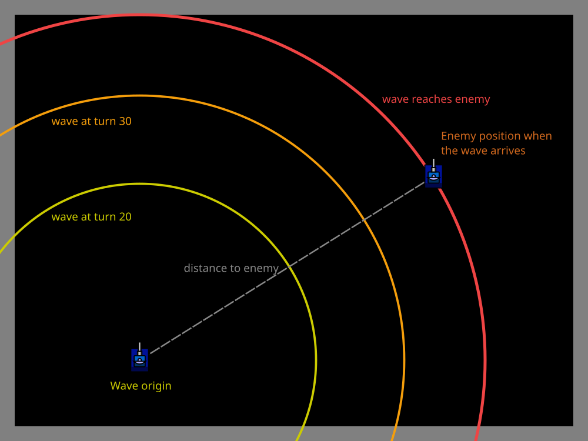
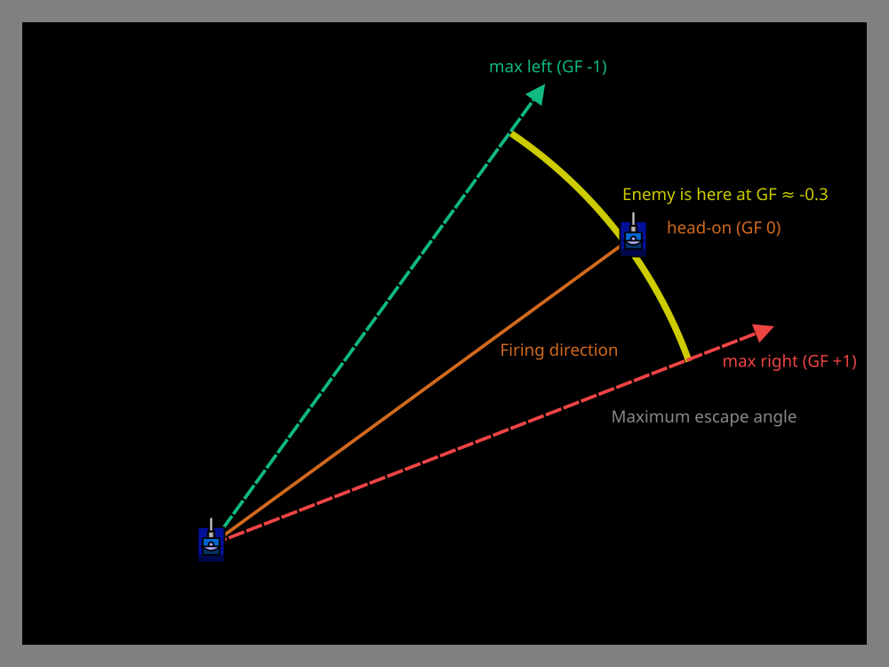

# Introducing Waves

> [!TIP] Origins
> **Iiley** introduced the Wave concept with his bot Cigaret in December 2002. Since bullets travel at a constant
> speed, a bot can track an abstract "circle" expanding from the shooter, and when that circle reaches the target, it
> knows exactly what the [GuessFactor](/appendices/glossary#guessfactor) was. Several bots used the idea under other
> names before, and PEZ noted that the
> descriptive name "Wave" was a real contribution in itself. Waves now underpin both **GuessFactor Targeting**
> (introduced by **Paul Evans**) and **Wave Surfing** (invented by **ABC**).

> [!NOTE] Implementation Guide
> This page explains the **concepts** behind waves and GuessFactors. For a **step-by-step tutorial** with complete
> code to build a working GuessFactor gun, see
> [GuessFactor Targeting](../statistical-targeting/guessfactor-targeting.md).

In the [Understanding the Challenge](understanding-the-challenge.md), we saw that effective targeting requires tracking
**where the enemy is when a bullet arrives**, not just where they are when fired. **Waves** are the tool that makes this
possible.

A wave is an imaginary circle that expands outward from the firing position at bullet speed. When the wave reaches the
enemy, that's the exact moment a bullet would have hit them, allowing the bot to record their angle relative to the
firing direction.

Over many battles, these recorded angles form a statistical profile of enemy movement, enabling probabilistic targeting
systems like GuessFactor Targeting and [Dynamic Clustering](/appendices/glossary#dynamic-clustering).

## What is a wave?

A **wave** represents the expanding wavefront of a bullet's potential reach. Think of it like ripples spreading across
water when a stone is dropped:

- **Origin:** The bot's position when the bullet was fired (or would have been fired).
- **Expansion:** The wave grows outward at bullet speed: `20 - 3 × firepower` units per turn.
- **Purpose:** When the wave reaches the enemy's position, record their angle relative to the firing direction.

Waves are **imaginary**, they don't exist in the game engine. The bot calculates and tracks them to measure timing and
angles accurately.

<br>
*A wave expands from the firing position at bullet speed, tracking when a bullet would reach each point*

## Why waves matter for targeting

Simple targeting methods (head-on, linear, circular) aim at a **single predicted position**. But enemies with
unpredictable movement can end up anywhere within a wide arc.

Waves solve this by:

1. **Measuring actual outcomes:** Record where the enemy *actually was* when a bullet could have hit them.
2. **Building statistical profiles:** Track which angles the enemy favors over many shots.
3. **Predicting probabilities:** Aim at the angle with the highest hit probability based on past data.

This shifts targeting from "predict where they'll be" to "aim where they're most likely to be."

## Wave mechanics: the math

Each wave needs three pieces of information:

| Property         | Description                                     | Example                   |
|------------------|-------------------------------------------------|---------------------------|
| **Origin**       | Bot's (x, y) position when the wave was created | `(1900, 4900)`            |
| **Fire time**    | The turn number when the wave was created       | `Turn 50`                 |
| **Bullet speed** | Speed the wave expands at: `20 - 3 × firepower` | `14 units/turn` (power 2) |

On each turn, the wave's radius is `bulletSpeed × (currentTurn − fireTime)`, where `fireTime` is the turn on which
the wave was created.

**When the wave reaches the enemy:**

Compare the distance from the wave origin to the enemy with the current radius. When
`distance(waveOrigin, enemy) ≤ waveRadius`, the wave has reached or passed the enemy and the bot can record the
enemy's angle relative to the firing direction.

## Measuring angles: GuessFactor

The key insight of wave-based targeting is recording the **angle** where the enemy is when the wave arrives. This angle
is often normalized to a value called a **GuessFactor** (GF):

- **GF 0.0:** The enemy is exactly where a head-on shot would have aimed.
- **GF +1.0:** The enemy moved as far as possible in one direction (maximum escape angle).
- **GF -1.0:** The enemy moved as far as possible in the opposite direction.

The GuessFactor normalizes different bullet speeds and distances into a consistent scale from -1 to +1.

**Basic calculation:** `bearingOffset` is the normalized angle from the firing direction to the enemy when the wave
arrives. The maximum escape angle is `asin(8 / bulletSpeed)`, because 8 units/turn is the maximum bot speed. The
GuessFactor is `clamp(bearingOffset / maxEscapeAngle, −1, +1)`.

Over many shots, the bot accumulates GuessFactor data and aims at the GF with the highest hit count.

<br>
*GuessFactor measures where the enemy is within the maximum escape angle range*

## Wave creation and tracking

Create a wave immediately after firing, then update active waves once per turn with the enemy's latest position. The
compact tracker below uses a 31-bin histogram, records a GuessFactor when a wave reaches the enemy, and exposes the
most frequent bin for the next aiming decision. Angles are radians inside the helper, with the platform-specific angle
calculation shown in each tab.

::: code-group

```java [Classic · Java]
import java.util.ArrayList;
import java.util.List;

public class WaveTracker {
    private static final int BIN_COUNT = 31;
    private final List<Wave> waves = new ArrayList<>();
    private final int[] guessFactorHits = new int[BIN_COUNT];

    public void addWave(
            double originX, double originY, long fireTurn,
            double firepower, double firingAngle) {
        waves.add(new Wave(
                originX, originY, fireTurn,
                20 - 3 * firepower, firingAngle));
    }

    public void update(long currentTurn, double enemyX, double enemyY) {
        for (int i = waves.size() - 1; i >= 0; i--) {
            Wave wave = waves.get(i);
            double radius = wave.bulletSpeed * (currentTurn - wave.fireTurn);
            double distance = Math.hypot(enemyX - wave.originX, enemyY - wave.originY);
            if (radius >= distance) {
                recordGuessFactor(wave, enemyX, enemyY);
                waves.remove(i);
            }
        }
    }

    public double bestGuessFactor() {
        int bestBin = BIN_COUNT / 2;
        for (int i = 1; i < guessFactorHits.length; i++) {
            if (guessFactorHits[i] > guessFactorHits[bestBin]) {
                bestBin = i;
            }
        }
        return bestBin * 2.0 / (BIN_COUNT - 1) - 1.0;
    }

    private void recordGuessFactor(Wave wave, double enemyX, double enemyY) {
        double enemyAngle = Math.atan2(enemyX - wave.originX, enemyY - wave.originY);
        double bearingOffset = normalizeRelativeAngle(enemyAngle - wave.firingAngle);
        double escapeAngle = Math.asin(8.0 / wave.bulletSpeed);
        double guessFactor = clamp(bearingOffset / escapeAngle, -1.0, 1.0);
        int bin = (int) Math.round((guessFactor + 1.0) * 0.5 * (BIN_COUNT - 1));
        guessFactorHits[bin]++;
    }

    private static double normalizeRelativeAngle(double angle) {
        while (angle <= -Math.PI) {
            angle += 2 * Math.PI;
        }
        while (angle > Math.PI) {
            angle -= 2 * Math.PI;
        }
        return angle;
    }

    private static double clamp(double value, double minimum, double maximum) {
        return Math.max(minimum, Math.min(maximum, value));
    }

    private static class Wave {
        final double originX;
        final double originY;
        final long fireTurn;
        final double bulletSpeed;
        final double firingAngle;

        Wave(double originX, double originY, long fireTurn,
                double bulletSpeed, double firingAngle) {
            this.originX = originX;
            this.originY = originY;
            this.fireTurn = fireTurn;
            this.bulletSpeed = bulletSpeed;
            this.firingAngle = firingAngle;
        }
    }
}
```

```python [Tank Royale · Python]
import math
from dataclasses import dataclass


@dataclass
class Wave:
    origin_x: float
    origin_y: float
    fire_turn: int
    bullet_speed: float
    firing_angle: float


class WaveTracker:
    BIN_COUNT = 31

    def __init__(self) -> None:
        self.waves: list[Wave] = []
        self.guess_factor_hits = [0] * self.BIN_COUNT

    def add_wave(
        self,
        origin_x: float,
        origin_y: float,
        fire_turn: int,
        firepower: float,
        firing_angle: float,
    ) -> None:
        self.waves.append(Wave(
            origin_x,
            origin_y,
            fire_turn,
            20 - 3 * firepower,
            firing_angle,
        ))

    def update(self, current_turn: int, enemy_x: float, enemy_y: float) -> None:
        remaining: list[Wave] = []
        for wave in self.waves:
            radius = wave.bullet_speed * (current_turn - wave.fire_turn)
            distance = math.hypot(enemy_x - wave.origin_x, enemy_y - wave.origin_y)
            if radius >= distance:
                self._record_guess_factor(wave, enemy_x, enemy_y)
            else:
                remaining.append(wave)
        self.waves = remaining

    def best_guess_factor(self) -> float:
        best_bin = self.BIN_COUNT // 2
        for index, hits in enumerate(self.guess_factor_hits):
            if hits > self.guess_factor_hits[best_bin]:
                best_bin = index
        return best_bin * 2 / (self.BIN_COUNT - 1) - 1

    def _record_guess_factor(self, wave: Wave, enemy_x: float, enemy_y: float) -> None:
        enemy_angle = math.atan2(enemy_x - wave.origin_x, enemy_y - wave.origin_y)
        bearing_offset = normalize_relative_angle(enemy_angle - wave.firing_angle)
        escape_angle = math.asin(8 / wave.bullet_speed)
        guess_factor = clamp(bearing_offset / escape_angle, -1, 1)
        bin_index = round((guess_factor + 1) * 0.5 * (self.BIN_COUNT - 1))
        self.guess_factor_hits[bin_index] += 1


def normalize_relative_angle(angle: float) -> float:
    while angle <= -math.pi:
        angle += 2 * math.pi
    while angle > math.pi:
        angle -= 2 * math.pi
    return angle


def clamp(value: float, minimum: float, maximum: float) -> float:
    return max(minimum, min(maximum, value))
```

```java [Tank Royale · Java]
import java.util.ArrayList;
import java.util.List;

public class WaveTracker {
    private static final int BIN_COUNT = 31;
    private final List<Wave> waves = new ArrayList<>();
    private final int[] guessFactorHits = new int[BIN_COUNT];

    public void addWave(
            double originX, double originY, long fireTurn,
            double firepower, double firingAngle) {
        waves.add(new Wave(
                originX, originY, fireTurn,
                20 - 3 * firepower, firingAngle));
    }

    public void update(long currentTurn, double enemyX, double enemyY) {
        for (int i = waves.size() - 1; i >= 0; i--) {
            Wave wave = waves.get(i);
            double radius = wave.bulletSpeed * (currentTurn - wave.fireTurn);
            double distance = Math.hypot(enemyX - wave.originX, enemyY - wave.originY);
            if (radius >= distance) {
                recordGuessFactor(wave, enemyX, enemyY);
                waves.remove(i);
            }
        }
    }

    public double bestGuessFactor() {
        int bestBin = BIN_COUNT / 2;
        for (int i = 1; i < guessFactorHits.length; i++) {
            if (guessFactorHits[i] > guessFactorHits[bestBin]) {
                bestBin = i;
            }
        }
        return bestBin * 2.0 / (BIN_COUNT - 1) - 1.0;
    }

    private void recordGuessFactor(Wave wave, double enemyX, double enemyY) {
        double enemyAngle = Math.atan2(enemyY - wave.originY, enemyX - wave.originX);
        double bearingOffset = normalizeRelativeAngle(enemyAngle - wave.firingAngle);
        double escapeAngle = Math.asin(8.0 / wave.bulletSpeed);
        double guessFactor = clamp(bearingOffset / escapeAngle, -1.0, 1.0);
        int bin = (int) Math.round((guessFactor + 1.0) * 0.5 * (BIN_COUNT - 1));
        guessFactorHits[bin]++;
    }

    private static double normalizeRelativeAngle(double angle) {
        while (angle <= -Math.PI) {
            angle += 2 * Math.PI;
        }
        while (angle > Math.PI) {
            angle -= 2 * Math.PI;
        }
        return angle;
    }

    private static double clamp(double value, double minimum, double maximum) {
        return Math.max(minimum, Math.min(maximum, value));
    }

    private static class Wave {
        final double originX;
        final double originY;
        final long fireTurn;
        final double bulletSpeed;
        final double firingAngle;

        Wave(double originX, double originY, long fireTurn,
                double bulletSpeed, double firingAngle) {
            this.originX = originX;
            this.originY = originY;
            this.fireTurn = fireTurn;
            this.bulletSpeed = bulletSpeed;
            this.firingAngle = firingAngle;
        }
    }
}
```

```csharp [Tank Royale · C#]
using System;
using System.Collections.Generic;

public class WaveTracker
{
    private const int BinCount = 31;
    private readonly List<Wave> waves = new();
    private readonly int[] guessFactorHits = new int[BinCount];

    public void AddWave(
        double originX, double originY, long fireTurn,
        double firePower, double firingAngle)
    {
        waves.Add(new Wave(
            originX, originY, fireTurn,
            20 - 3 * firePower, firingAngle));
    }

    public void Update(long currentTurn, double enemyX, double enemyY)
    {
        for (int i = waves.Count - 1; i >= 0; i--)
        {
            Wave wave = waves[i];
            double radius = wave.BulletSpeed * (currentTurn - wave.FireTurn);
            double distance = Math.Sqrt(
                Math.Pow(enemyX - wave.OriginX, 2) + Math.Pow(enemyY - wave.OriginY, 2));
            if (radius >= distance)
            {
                RecordGuessFactor(wave, enemyX, enemyY);
                waves.RemoveAt(i);
            }
        }
    }

    public double BestGuessFactor()
    {
        int bestBin = BinCount / 2;
        for (int i = 1; i < guessFactorHits.Length; i++)
        {
            if (guessFactorHits[i] > guessFactorHits[bestBin])
            {
                bestBin = i;
            }
        }
        return bestBin * 2.0 / (BinCount - 1) - 1.0;
    }

    private void RecordGuessFactor(Wave wave, double enemyX, double enemyY)
    {
        double enemyAngle = Math.Atan2(enemyY - wave.OriginY, enemyX - wave.OriginX);
        double bearingOffset = NormalizeRelativeAngle(enemyAngle - wave.FiringAngle);
        double escapeAngle = Math.Asin(8.0 / wave.BulletSpeed);
        double guessFactor = Clamp(bearingOffset / escapeAngle, -1.0, 1.0);
        int bin = (int)Math.Round((guessFactor + 1.0) * 0.5 * (BinCount - 1));
        guessFactorHits[bin]++;
    }

    private static double NormalizeRelativeAngle(double angle)
    {
        while (angle <= -Math.PI)
        {
            angle += 2 * Math.PI;
        }
        while (angle > Math.PI)
        {
            angle -= 2 * Math.PI;
        }
        return angle;
    }

    private static double Clamp(double value, double minimum, double maximum)
    {
        return Math.Max(minimum, Math.Min(maximum, value));
    }

    private sealed class Wave
    {
        public Wave(double originX, double originY, long fireTurn,
            double bulletSpeed, double firingAngle)
        {
            OriginX = originX;
            OriginY = originY;
            FireTurn = fireTurn;
            BulletSpeed = bulletSpeed;
            FiringAngle = firingAngle;
        }

        public double OriginX { get; }
        public double OriginY { get; }
        public long FireTurn { get; }
        public double BulletSpeed { get; }
        public double FiringAngle { get; }
    }
}
```

```typescript [Tank Royale · TypeScript]
type Wave = {
    originX: number;
    originY: number;
    fireTurn: number;
    bulletSpeed: number;
    firingAngle: number;
};

class WaveTracker {
    private static readonly binCount = 31;
    private readonly waves: Wave[] = [];
    private readonly guessFactorHits = new Array<number>(WaveTracker.binCount).fill(0);

    addWave(
        originX: number,
        originY: number,
        fireTurn: number,
        firePower: number,
        firingAngle: number,
    ) {
        this.waves.push({
            originX,
            originY,
            fireTurn,
            bulletSpeed: 20 - 3 * firePower,
            firingAngle,
        });
    }

    update(currentTurn: number, enemyX: number, enemyY: number) {
        for (let i = this.waves.length - 1; i >= 0; i -= 1) {
            const wave = this.waves[i];
            const radius = wave.bulletSpeed * (currentTurn - wave.fireTurn);
            const distance = Math.hypot(enemyX - wave.originX, enemyY - wave.originY);
            if (radius >= distance) {
                this.recordGuessFactor(wave, enemyX, enemyY);
                this.waves.splice(i, 1);
            }
        }
    }

    bestGuessFactor() {
        let bestBin = Math.floor(WaveTracker.binCount / 2);
        for (let i = 1; i < WaveTracker.binCount; i += 1) {
            if (this.guessFactorHits[i] > this.guessFactorHits[bestBin]) {
                bestBin = i;
            }
        }
        return bestBin * 2 / (WaveTracker.binCount - 1) - 1;
    }

    private recordGuessFactor(wave: Wave, enemyX: number, enemyY: number) {
        const enemyAngle = Math.atan2(enemyY - wave.originY, enemyX - wave.originX);
        const bearingOffset = normalizeRelativeAngle(enemyAngle - wave.firingAngle);
        const escapeAngle = Math.asin(8 / wave.bulletSpeed);
        const guessFactor = clamp(bearingOffset / escapeAngle, -1, 1);
        const bin = Math.round((guessFactor + 1) * 0.5 * (WaveTracker.binCount - 1));
        this.guessFactorHits[bin] += 1;
    }
}

function normalizeRelativeAngle(angle: number) {
    while (angle <= -Math.PI) {
        angle += 2 * Math.PI;
    }
    while (angle > Math.PI) {
        angle -= 2 * Math.PI;
    }
    return angle;
}

function clamp(value: number, minimum: number, maximum: number) {
    return Math.max(minimum, Math.min(maximum, value));
}
```

:::

Call `addWave(...)` immediately after firing, passing the firing position, current turn, firepower, and gun angle. Call
`update(...)` once per turn with the newest enemy position. The classic tab uses compass-style angles, while the Tank
Royale tabs use ordinary mathematical angles.

### Example: Accumulating GuessFactor hits

Here's a concrete example showing how GuessFactor data accumulates over several shots:

After 8 waves hit an enemy, the bot records these GuessFactor values:

| Wave | GuessFactor | Meaning                            |
|------|-------------|------------------------------------|
| 1    | +0.45       | Enemy moved right (45% max escape) |
| 2    | -0.12       | Enemy moved slightly left          |
| 3    | +0.78       | Enemy moved far right              |
| 4    | +0.45       | Enemy moved right again            |
| 5    | +0.02       | Enemy stayed nearly head-on        |
| 6    | +0.45       | Enemy moved right again            |
| 7    | +0.89       | Enemy moved very far right         |
| 8    | -0.34       | Enemy moved left                   |

The accumulated histogram looks like:

| GuessFactor | Hits |
|-------------|------|
| −0.34       | 1    |
| −0.12       | 1    |
| +0.02       | 1    |
| +0.45       | 3 (most common) |
| +0.78       | 1    |
| +0.89       | 1    |

The best GuessFactor is **+0.45**, the bin with three hits.

The pattern shows this enemy **favors moving right**. When the bot fires next time, it will aim at GF +0.45 because
that's
where the enemy has been most likely to be. This is much smarter than aiming head-on (GF 0.0) or picking a random angle.

Over more battles, the histogram becomes richer:

| GuessFactor range | Hits |
|-------------------|------|
| −0.8 to −0.6     | 3    |
| −0.4 to −0.2     | 8    |
| +0.0 to +0.2     | 6    |
| +0.4 to +0.6     | 12 (peak) |
| +0.6 to +0.8     | 6    |
| +0.8 to +1.0     | 4    |

This fuller profile reveals the enemy's true movement tendencies, allowing for increasingly accurate predictions.

## Virtual waves vs real bullets

There are two ways to use waves, and they serve different purposes because enemies react differently to each:

**Real bullet waves:**

- Created only when the bot actually fires.
- **Enemies react:** When an enemy determines that a real bullet has been fired due to the energy drop, they dodge,
  speed up, or change a direction to avoid it.
- Tracks actual outcomes where your firing influences enemy movement.
- Data is limited to situations where the gun was ready to fire.
- **Best for:** Learning how enemies dodge *your* attacks in real combat situations.

**Virtual waves (also called shadow waves):**

- Created every turn, regardless of whether the bot fires.
- **Enemies don't react:** Virtual bullets never threaten the enemy, so they don't influence movement decisions.
- Tracks where enemies go naturally, without the pressure of incoming fire.
- Gathers much more data because it's not limited to actual firing moments.
- **Best for:** Measuring underlying movement patterns without the noise of evasive behavior.

### Why use both?

**Virtual waves** provide the bulk of statistical data: they capture enemy movement patterns over many turns without
interference. However, these patterns are measured under "peaceful" conditions, when the enemy has no reason to dodge.

**Real bullet waves** capture the truth of actual combat: how enemies really move when threatened. An enemy's dodging
behavior under fire may differ significantly from their casual movement pattern.

Advanced bots use **both strategically:**

1. **Virtual waves** accumulate baseline statistics on enemy movement tendencies.
2. **Real bullet waves** refine predictions based on how enemies actually dodge.
3. The bot may weight real bullet data more heavily than virtual data, since real combat situations matter more.

Most bots start with **virtual waves for speed** (more data = faster learning), then incorporate **real wave data for
accuracy** (better predictions when it actually matters). The balance between quantity and realism varies by bot design.

## Waves in movement: wave surfing

The wave concept isn't just for targeting, it's also the foundation of advanced movement strategies.

**[Wave surfing](/appendices/glossary#wave-surfing)** reverses the wave concept: the bot tracks *enemy* waves
(bullets the enemy has fired or might fire)
and moves to positions with the lowest danger based on where the enemy's gun has hit before.

This creates an ongoing tactical battle:

- The enemy's gun learns which angles you favor.
- Your movement tries to flatten your statistical profile.
- Both systems continuously adapt to each other.

Wave surfing is covered in detail in the *Movement & Evasion* section.

## Implementation tips

**Starting simple:**

- Begin with real bullet waves only, create a wave when firing, track it until it hits.
- Use a simple array or histogram to count hits at different GuessFactor values.
- Don't worry about segmentation initially, just track all data together.

**Common challenges:**

- **Wave cleanup:** Remove waves that pass the enemy or go off-screen.
- **Angle normalization:** Ensure angles wrap correctly at 0°/360° boundaries.
- **Distance calculation:** Use efficient distance formulas (avoid square root if comparing distances).

**Performance considerations:**

- Limit the number of active waves like ~10-20.
- Update only waves that haven't reached enemies yet.
- Precompute bullet speed to avoid repeated calculations.

## Platform notes

Wave mechanics work identically in classic Robocode and Tank Royale, but coordinate systems differ:

| Aspect               | Classic Robocode          | Tank Royale                  |
|----------------------|---------------------------|------------------------------|
| Angle convention     | 0° = North, clockwise     | 0° = East, counter-clockwise |
| Bullet speed formula | `20 - 3 × firepower`      | Same                         |
| Max bot speed        | 8 units/turn              | Same                         |
| Timing precision     | Turn-based, deterministic | Turn-based, deterministic    |

The GuessFactor calculation and wave expansion logic are identical, only angle conversions need adjustment.

## Advantages of wave-based targeting

**Compared to simple targeting:**

- **Adapts to enemy behavior:** Learns which directions enemies favor.
- **Works against unpredictable movement:** Builds probability distributions instead of single predictions.
- **Handles multiple strategies:** Can segment data by situation (distance, velocity, etc.).

**Compared to pattern matching:**

- **Less data needed:** Doesn't require long sequences of enemy positions.
- **Faster real-time updates:** Statistical profiles update immediately.
- **More forgiving of noise:** Random jitter doesn't ruin predictions.

## When waves aren't enough

Waves excel at measuring outcomes, but they don't solve every targeting problem:

- **Cold start:** Need several hits to build useful statistics.
- **Adaptive enemies:** Bots that change behavior mid-battle can invalidate old data.
- **Rare situations:** Unusual scenarios (corners, walls, low energy) may have insufficient data.

Advanced bots address these with:

- **Segmentation:** Split data by situation (distance, wall proximity, velocity).
- **[Virtual guns](/appendices/glossary#virtual-guns):** Run multiple targeting methods in parallel and use the best
  performer.
- **Data decay:** Weight recent data more heavily than old data.

## Further Reading

Now that you understand waves, explore how they're used in practice:

- **[GuessFactor Targeting](../statistical-targeting/guessfactor-targeting.md)**: The classic statistical targeting
  method built on waves.
- **[Segmentation & Visit Count Stats](../statistical-targeting/segmentation-visit-count-stats.md)**: Splitting wave
  data by situation for more accurate predictions.
- **[Wave Surfing Introduction](../../movement/advanced-evasion/wave-surfing-introduction.md)**: Using waves for
  advanced movement.
- **[Gun Heat Waves](../../movement/advanced-evasion/gun-heat-waves-bullet-shadows.md)**: Tracking enemy firing
  patterns for movement decisions.

**Next in this section:**

- **[GuessFactor Targeting](../statistical-targeting/guessfactor-targeting.md)**: Build your first wave-based gun.
