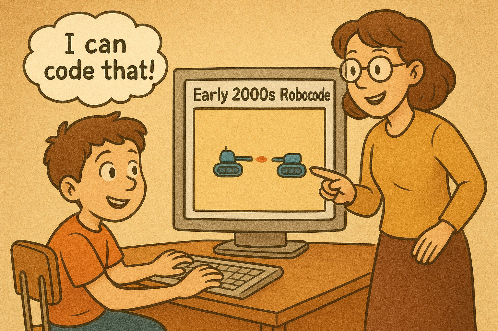

# A Short History of Robocode

Robocode began in the early 2000s as a side project by Mathew A. Nelson. The idea was simple: learn programming by
coding a robot tank that fights in a 2D arena. The mix of learning and competition made it popular with students,
hobbyists, and teachers.

## The Classic Robocode Era

The first public versions were released as a Java application. Robots extended base classes and reacted to events like
`onScannedRobot` and `onHitByBullet`.

Highlights:

- A vibrant community formed around the game.
- Players created hundreds of robots, from simple examples to world-class competitive bots.
- The community started [RoboWiki](https://robowiki.net) (classic Robocode only), collecting strategies, formulas, and
  tutorials.

RoboWiki became the reference for advanced topics such as wave surfing, GuessFactor targeting, detailed battlefield
physics, and much more.

<!-- TODO illustration: Show the classic community sharing robots and ideas. -->
<!-- - Draw a circular group of kids at computers, each with a different bot on their screen. -->
<!-- - Connect the computers with dotted lines or arrows to suggest sharing and competition. -->
<!-- - Include a small open book or browser window labeled RoboWiki in the center. -->
<!-- - Add a few sticky note icons labeled "Strategies" and "Formulas" near the book. -->
<!-- - Keep character designs simple and diverse to feel welcoming. -->

## Handover and Community Maintenance

Robocode was open-sourced and community maintenance grew. Flemming N. Larsen became a key maintainer and continued to
develop and support classic Robocode. The project evolved to newer Java versions while keeping its core API and spirit.
Many courses and clubs adopted it for teaching.

## The Need for a Modern Platform

As tools and languages evolved, the community wanted:

- Multi-language support (not just Java)
- Easier integration with modern editors and CI
- Headless servers and automated tournaments

These needs led to a modern platform: Robocode Tank Royale.

## Robocode Tank Royale: The New Generation

Robocode Tank Royale, created by Flemming N. Larsen, keeps the core idea but updates the architecture.

Key features:

- Server-based engine; bots connect over a network protocol
- Support for multiple languages (Java, C#, Python, Kotlin, Scala, and others)
- Cleaner separation of engine and bots, making automation and deployment easier
- Open documentation and starter kits
  at [robocode-dev.github.io/tank-royale](https://robocode-dev.github.io/tank-royale)

<!-- TODO illustration: Compare classic Robocode to Tank Royale as two friendly arenas. -->
<!-- - On the left, draw a classic desktop window with bots fighting inside. -->
<!-- - On the right, show a server icon connected to several smaller screens with bots. -->
<!-- - Use arrows or lines to show bots connecting to the Tank Royale server. -->
<!-- - Label each side: Classic Robocode and Robocode Tank Royale. -->
<!-- - Add a subtle "New Generation" banner over the Tank Royale side. -->
