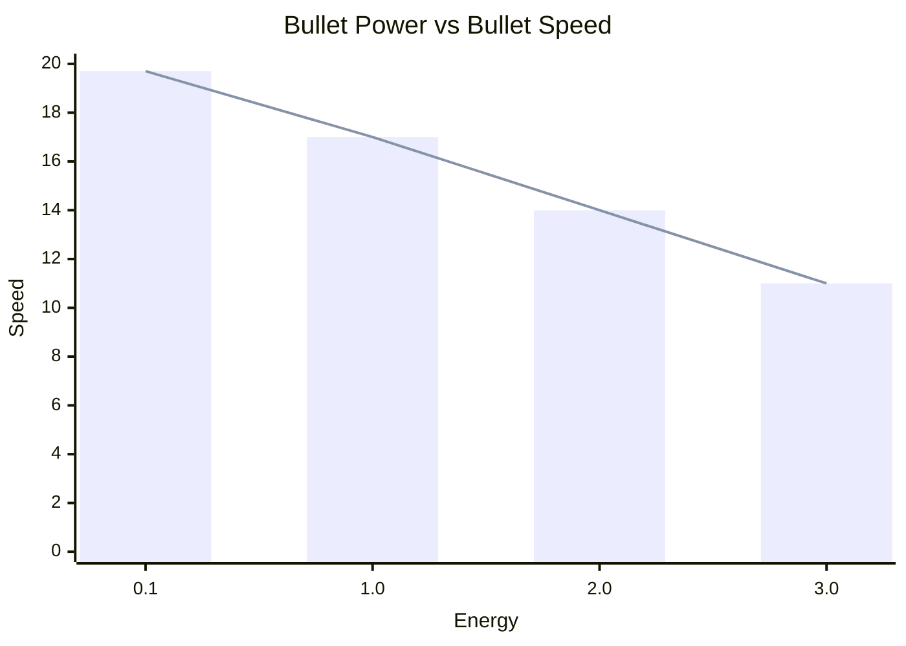
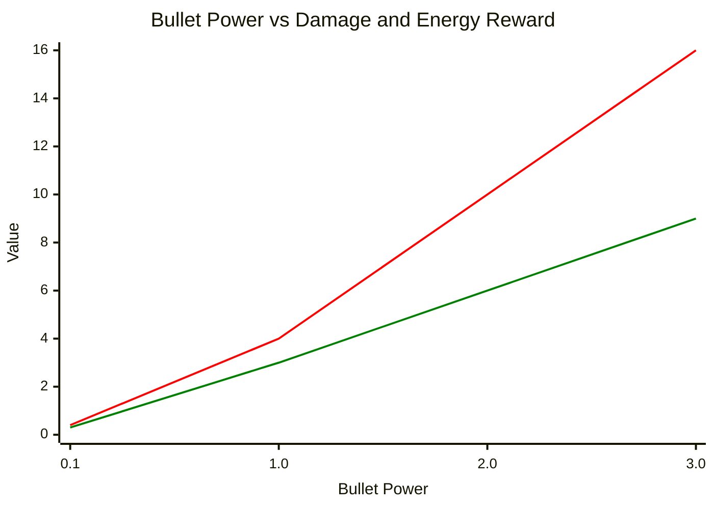

# Bullet Travel & Bullet Physics

Bullets are pure energy projectiles fired by your bot's gun. Firing costs energy, your gun must cool down between shots,
and the bullet travels across the battlefield until it hits a bot or a wall (or leaves the arena). Mastering these
basics helps you choose when and how hard to fire.

## Bullet power and cost

Understanding bullet power is really about understanding **what happens to your bot’s energy when you fire** and how
close you are to being disabled or dying.

```mermaid
---
config:
  themeVariables:
    xyChart:
      plotColorPalette: grey, orange, green, yellow, red, darkred, red
---

xychart-beta
    title "Energy over time across key states (full → firing → low → disabled → dead)"
    x-axis ["1. Full 🔋", "2. 💥 Firing 🔋", "3. Low Energy🪫", "4. Disabled 🚫", "5. Dead 💀"]
    y-axis -5 --> 100

%% number labels (grey, on top)


%% full energy background (blue-ish)
%% number labels (grey, on top)

%% safe firing range (green)
bar [100, 97, 15, 0, -2]

%% low but alive (yellow)


%% disabled (0 energy, red)
%% full energy background (blue-ish)

%% dead (< 0 energy, dark red)
bar [100, 100, -10, -10, -10]

%% zero-energy line (red)

%% safe firing range (green)
bar [100, 97.2, -10, -10, -10]

%% low but alive (yellow)
bar [-10, -10, 15, -10, -10]

%% disabled (0 energy, red)
bar [-10, -10, -10, 0, -10]

%% dead (< 0 energy, dark red)
bar [-10, -10, -10, -10, -2]

%% zero-energy line (red)
line [0, 0, 0, 0, 0]
```



*Diagram: Bot energy across important states: full → firing → low → disabled → dead*

1) You start a turn with full energy (100)
2) fire a bullet and drop a little energy (~97). The energy drop is marked as yellow
3) later might be low but still alive (~15)
4) can hit 0 and become disabled (0)
5) and finally go below 0 and die (−2)

The red horizontal line at 0 highlights the critical boundary between **alive** and **disabled/dead**. This makes it
clear why energy management and bullet power choices matter.

- Bullet power is the energy you spend for a shot.
- Typical valid range: 0.1 to 3.0 power.
- You need at least 0.1 energy to fire the gun. If you request more power than your remaining energy, the game clamps to
  your current energy (but never below 0.1 to create a shot).
- Higher power does not make the bullet faster—it makes it slower but potentially more damaging (see bullet damage
  below).

## How bullets are fired

- You aim with the gun, not the bot body; the gun can turn independently of the bot.
- A bullet travels in a straight line along the gun’s heading at the instant you fired.
- Bullet speed is determined only by bullet power and engine rules; it does NOT inherit your bot’s current velocity.
- A shot is created only when your gun is cool, and you have enough energy. On fire(power), energy is deducted
  immediately.
- The bullet then flies until it hits a bot, a wall, leaves the arena, or even collides with another bullet.

## When can you fire? (gun cooldown)

- After you fire, the gun becomes hot and must cool before the next shot.
- Conceptually: each shot adds heat; every turn, some heat is removed. You can only fire when the heat reaches zero.
- Classic Robocode specifics you will see in the docs:
    - Cooling happens at a constant rate per turn.
    - Heat added depends on bullet power, so bigger shots generally mean a longer wait.

Practical takeaway: you cannot fire every turn. Larger bullet power means a longer interval until the next legal shot.

## Timeline of firing and cooldown

```mermaid
---
config:
  themeVariables:
    cScale0: '#9f9'
    cScaleLabel0: black
    cScale1: '#fa6'
    cScaleLabel1: black
    cScale2: '#9ff'
    cScaleLabel2: black
    cScale3: '#9f9'
    cScaleLabel3: black
---
timeline
    title Gun Firing & Cooldown Sequence
    start: ✅ Gun is cool and ready
    fire: 💥 Gun fires, heat rises
    cooling: ❄️ Cooldown in progress
    ready: ✅ Gun is cool and ready again
```



*Timeline diagram: start → fire → heat rises → cooldown → ready for next shot*

## Bullet speed and travel time

### Bullet speed formula

<!-- ILLUSTRATION: Bullet Trajectory & Speed Comparison -->
> **Illustration marker:** Visualize bullet paths for different powers. Show a bot firing two bullets: one high-power (
> slow, short arrow) and one low-power (fast, long arrow) reaching targets at different times. Use arrows of varying
> lengths and colors to represent speed and travel time. This helps clarify the tradeoff between power and speed.

Classic Robocode bullet speed:

$\text{speed (units/turn)} = 20 - 3 × \text{bulletPower}$

The table below shows bullet speed for common power levels:

| Bullet Power | Speed (units/turn) |
|--------------|-------------------:|
| 0.1          |               19.7 |
| 1.0          |                 17 |
| 2.0          |                 14 |
| 3.0          |                 11 |



*Chart: Bullet Power vs Bullet Speed. The bars and line show decreasing speed as bullet power increases.*

### Travel time formula

$travel time (turns) ≈ distance / speed$

Example: target at 400 units with power 2.0 → $\frac{400}{14}$ ≈ 29 turns of flight

Notes:

- Slower (high-power) bullets take longer to arrive, giving moving targets more time to dodge.
- Faster (low-power) bullets arrive sooner, cost less energy, but do less damage.
- Bullet motion is straight-line at constant speed; it is independent of your bot’s movement after the shot.

### Bullet Power vs Bullet Speed

| Bullet Power | Speed (units/turn) | Example Travel Time (400 units) |
|--------------|--------------------|---------------------------------|
| 0.1          | 19.7               | 20                              |
| 1.0          | 17                 | 24                              |
| 2.0          | 14                 | 29                              |
| 3.0          | 11                 | 36                              |

*A quick visual: higher bullet power reduces speed (see the formula and the table above). Use lower power for faster
bullets when you need shorter travel time, and higher power for more damage when you can accept slower travel.*

## Bullet damage



*Chart: Bullet power vs. damage and energy reward. Damage (<span style="color: red;">red</span>) increases faster than
reward (<span style="color: green;">green</span>) as power rises.*

The table below shows how bullet power translates to damage and energy reward:

| Bullet Power | Damage Formula                      | Example Damage      | Energy Reward   |
|--------------|-------------------------------------|---------------------|-----------------|
| 0.1 - 1.0    | 4 × bulletPower                     | 0.5 → 2             | 3 × bulletPower |
| > 1.0        | 4 × bulletPower + 2 × (power − 1.0) | 2.0 → 8<br>3.0 → 12 | 3 × bulletPower |

**Formula:**

$\text{damage} = 4 × \text{bullet power} + max(0, 2 × (\text{bullet power} − 1.0))$

$\text{energy reward} = 3 × \text{bullet power}$

Notes:

- If a bullet hits a wall, it does **not** deal damage.
- When your bullet hits, you gain back energy as shown above.

## Firing constraints and safety

<!-- ILLUSTRATION: Friendly Fire Vignette -->
> **Illustration marker:** Diagram with two allied bots and a bullet path crossing one, showing the danger of friendly
> fire in team battles. Use a warning icon or color overlay to emphasize unsafe lines of fire. This helps new players
> visualize why line of fire matters in team play.

- You cannot fire when your bot is disabled (energy = 0).
- Firing reduces your energy immediately by the bullet power.
- Be careful not to drop yourself to zero energy (= disabled): a disabled bot becomes an easy target and can be killed
  by a fast small bullet.
- In team battles, bullets can hit allies (friendly fire). Always consider the line of fire.

## How often can I fire a bullet?

- As often as the gun cooldown allows. The sequence is:

  fire → gun heats up → wait while it cools → fire again.
- Bigger shots mean longer waits. If you need a faster cadence, prefer lower-power shots.

## Radar and visibility

- Radar does not detect bullets.
- You can often infer a shot by observing a scanned enemy's energy dropping by the amount they spent to fire.

## Minimal example (pseudocode)

```text
if (gunIsCool() and myEnergy > 0.1) {
  distance = distanceTo(target)
  // Simple distance-based power choice: closer → higher power, farther → lower power
  power = clamp(map(distance, 0..800, 2.5..0.5), 0.1, 3.0)
  turnGunTo(bearingTo(target))
  fire(power)
}
```
